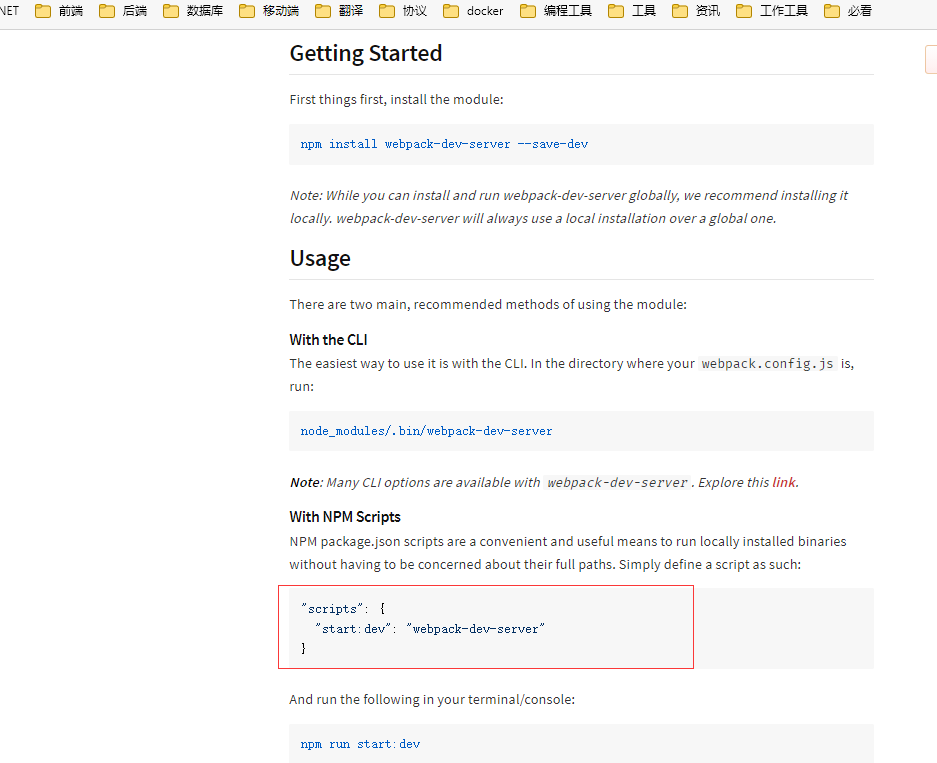
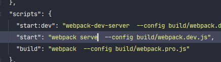
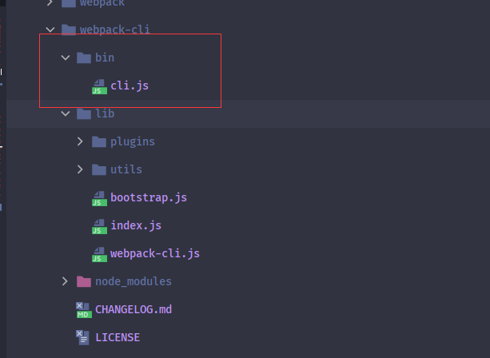
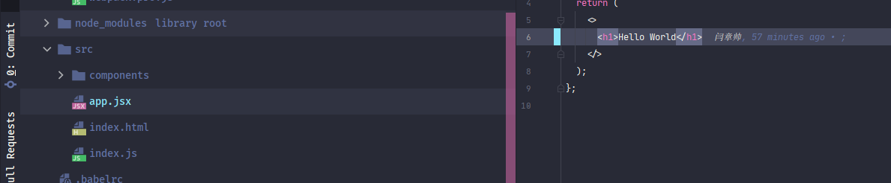

### webpack-dev-server使用

#### 什么是webpack-dev-server

诸君在使用**vue-cli**或者**react-cli**这类脚手架时，`yarn start`命令会开启一个本地服务器，浏览器访问这个服务器端口就可以浏览代码，并且更新代码后页面会自动刷新页面，让开发者能够更好的专注于开发。这个就是**dev-server**。 

 按照寻常打包流程：更改代码，手动执行打包代码，手动刷新浏览器， 一套操作下来就真的是编码30秒，运行2分钟了。**dev-server**是为了让开发者能够专注于编码。而忽略各种关于其他操作。

**dev-server** 就是运行一个服务器，与浏览器进行长链接。然后代码代码或者文件更新时，刷新浏览器这一套操作。

**webpack**中这个库就叫做webpack-dev-server，使用这个库便可以完成以上操作。

> :whale2: webpack配置本身就支持监听文件变化，webpack-dev-server只是默认开启webpack的监听属性。这个在之后详细说。

webpack-dev-server这个库在下想比较深入的讲解下，所以分成两篇来进行：第一篇只说webpack-dev-server的使用配置，第二篇稍微讲解一些流程与其原理。

诸君请拭目以待

#### webpack-dev-server 安装

##### webpack-cli/bin/config-yargs 的问题

截至到目前为止，webpack-dev-server 目前**最新版本**为 `@3.11.2`，

有用过的诸君会知道在使用此版本与**webpack@5.X**使用时会有一个问题:`Cannot find module 'webpack-cli/bin/config-yargs'`

这个我个人感觉是官方有些坑了。

先来安装这个版本的webpack-dev-server

> yarn add -D webpack-dev-server@3.11.2

了解过webpack-dev-server的诸君会知道，执行webpack-dev-server的命令为`webpack-dev-server`

官方NPM介绍文档也是`webpack-dev-server`命令

所以一般都会将`yarn start`命令设置为`webpack-dev-server`，

在这里使用`yarn start:dev` 命令设置为`webpack-dev-server`，

按照正常来说，此时执行`yarn start:dev`便可以执行webpack-dev-server。

但实际上，此时执行`yarn start:dev`会直接报错。

提示找不到webpack-cli库中的**config.yargs**模块。我感觉很多刚学习**webpack**并且搜索能力稍微弱一些的新人会卡很久。

> :whale2:  配置使用的webpack-cli@4.4.0和webpack@4.14.0

这个问题其实很简单，直接在[github](https://github.com/webpack/webpack-dev-server/issues?q=yargs+)就能搜到答案

可以看到答案，使用另一条命令就可以：`webpack serve`

此时使用`yarn start`就可以执行成功。默认启动的是**8080端口**号

那么这到底怎么回事呢？通过查看源码和测试webpack-dev-server@4.0.0beta.0在下略有猜测。

先看一下webpack-dev-server@3.11.2的一段代码

这是**webpack-dev-server/bin/webpack-dev-server.js**中的一段代码。使用`webpack-dev-server`命令执行时便会执行此模块。

在这个模块中加载了**webpack-cli/bin/** *config/* **config-yargs**和**webpack-cli/bin/** *utils/* **convert-argv**。

但是在webpack-cli@4.X版本代码结构已经改变，并没有这两个模块

可以看到，在webpack-cli@4.4.0中*bin目录*只有一个**cli模块**，所以可想而知就找不到了。

在使用webpack@4.X版本时，使用的webpack-cli@3.X，webpack-dev-server@3.X

后来更新到webpack@5.X时，webpack-cli也进行了大版本的更新，变成了webpack-cli@4.X，并且加入了`webpack serve`命令执行**webpack-dev-server**

但是webpack-dev-server并没有跟着更新大版本，依然是webpack-dev-server@3.X。并且也没有去更新这段代码，也就造成了使用`webpack-dev-server`命令报错的问题。

这个问题在webpack-dev-server@4.X进行了修复。不过webpack-dev-server@4.X目前只有一个webpack-dev-server@4.0.0beta.0版本。

在webpack-dev-server@4.0.0beta.0的[github](https://github.com/webpack/webpack-dev-server/blob/v4.0.0-beta.0/bin/webpack-dev-server.js)可以看到**/bin/webpack-dev-server.js**模块中没有了上面两段代码。

并且在webpack-dev-server@4.0.0beta.0文档中的命令是`webpack serve`

也就是其实这个问题是这样的：

:whale2::whale2:  webpack-cli@4.X版本开始，**webpack**团队将**dev-server**的命令改为了`webpack serve` 。webpack与webpack-cli都进行了大版本的更新。而webpack-dev-server并没有进行大版本更新，所以会导致老命令`webpack-dev-server`的错误。

> :whale2: 这个问题也是暂时性的，

`webpack serve`命令在 webpack-cli@4.0.0版本文档中有提到。

##### webpack serve

`webpack serve`命令的执行，入口是跟`webpack`命令一样，都是webpack库。在webpack库中调用webpack-cli库模块。然后在webpack-cli库根据其命令调用@webpack-cli库中的**serve模块**，开启webpack-dev-server中的服务器模块。这些代码都是webpack-cli@4.X新加的，所以并不会报错。详细内容在下一篇介绍。

> :whale2::whale2: webpack、webpack-cli、webpack-dev-server这三个跨库调用模块都是根据模块路径调用的。所以只要某个库文件结构稍微改动，就会像`webpack-dev-server`命令这样直接报错。 不过在新版本代码进行了优化，通过像`serve`这样的约定名称进行跨库调用。尽可能降低了耦合度。
>
> 
>
> :whale2:@webpack-cli是webpack-cli4.X依赖的一个库。

#####  webpack-dev-server@3.X 与webpack@5.X 关于HOT的问题。

在安装完webpack-dev-server之后，便可以直接使用命令去运行，并且开启了一个**8080端口**的服务器，这是使用的默认配置。

在上面说过  webpack-dev-server库的一个功能就是在代码更新后，会通过**WebScoket**推送浏览器进行更新。但是以目前使用的webpack-dev-server@3.11.2和webpack@5.14.0  **HOT**会有问题。

下面先来做一个测试

运行`yarn start`后就可以使用浏览器进行查看

此时将代码进行更新，会发现浏览器并没有更新，并且可以看到，浏览器网络中***WS***没有推送数据

> :whale2: **WS**“：WebSocket推送数据显示的窗口

在下对这个问题调试了下代码，发现WS根本就没有连接上，后来在[github](https://github.com/webpack/webpack-dev-server/issues/2980)中找到了答案。

原因是因为**package.json**文件中的***browserslist***，将此属性去掉就可以进行**HOT**。

这是一个BUG，但是按照官方给的解释好像只会在webpack@4.X修复这个问题。我使用webpack@4.0.0beta.0测试就没有这个问题

#### webpack-dev-server配置

webpack-dev-server使用的配置是配置在webpack中的，在webpack配置项中具有一个`devServer`配置，这个就是设置webpack-dev-server的。

##### 版本选择

目前webpack@5.X稳定版才4个月，并且webpack-dev-server还没有新版本的稳定版。所以webpack@5.X一般还是只是学习使用。

webpack-dev-server@4.0.0beta.0又更改了很多属性。

在此想将webpack-dev-server@4.0.0beta.0和webpack-dev-server@3.X两个版本的配置都讲解一下。

所以在此进行配置两套环境，分别在不同代码分支

1. webpack@4.X、webpack-cli@3.X、webpack-dev-server@3.X
2. webpack@5.X、webpack-cli@4.X、webpack-dev-server@4.X

#### webpack-dev-server配置

##### @3.11.2

> :whale2:  webpack@4.X 分支

> yarn add -D webpack@4.46.0 webpack-cli@3.3.12 webpack-dev-server@3.11.2 terser-webpack-plugin@4.2.3

> :whale2::whale2: terser-webpack-plugin包需要降到`@4.X`。 

