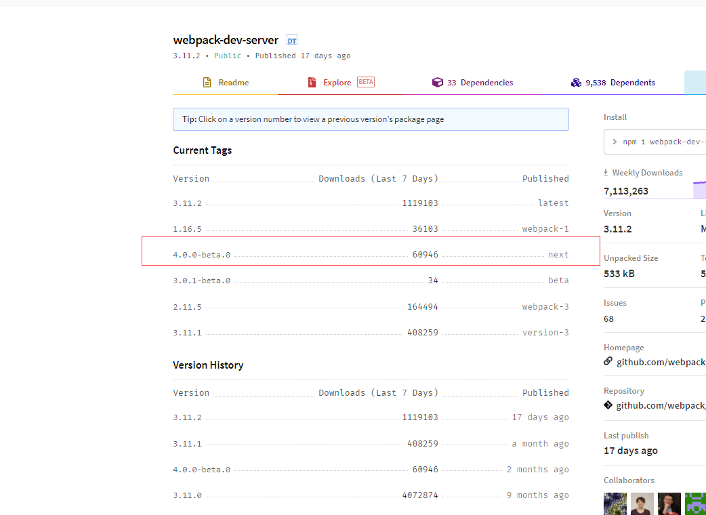

### webpack-dev-server使用


#### 什么是webpack-dev-server


诸君在使用**vue-cli**或者**react-cli**这类脚手架时，`yarn start`命令会开启一个本地服务器，浏览器访问这个服务器端口就可以浏览代码，并且更新代码后页面会自动刷新页面，让开发者能够更好的专注于开发。这个就是**dev-server**。 

 按照寻常打包流程：更改代码，手动执行打包代码，手动刷新浏览器， 一套操作下来就真的是编码30秒，运行2分钟了。**dev-server**是为了让开发者能够专注于编码。而忽略各种关于其他操作。

**dev-server** 就是运行一个服务器，与浏览器进行长链接。然后代码代码或者文件更新时，刷新浏览器这一套操作。

**webpack**中这个库就叫做<font style="color:#f03d3d">webpack-dev-server</font>，使用这个库便可以完成以上操作。

> :whale2: <font style="color:#f03d3d">webpack</font>配置本身就支持监听文件变化，<font style="color:#f03d3d">webpack-dev-server</font>只是默认开启<font style="color:#f03d3d">webpack</font>的监听属性。这个在之后详细说。


<font style="color:#f03d3d">webpack-dev-server</font>这个库在下想比较深入的讲解下，所以分成两篇来进行：第一篇只说<font style="color:#f03d3d">webpack-dev-server</font>的使用配置，第二篇稍微讲解一些流程与其原理。


诸君请拭目以待


#### webpack-dev-server 安装


<font style="color:#f03d3d">webpack-dev-server</font>在安装上面有一些小坑。


截止到目前 - **2021-01-29**。 <font style="color:#f03d3d">webpack-dev-server</font>这个库的**最新版本**还是让人头疼。

在**NPM**上，<font style="color:#f03d3d">webpack-dev-server</font> **最新版本**为**wepack-dev-server**

> :whale2::whale2: **最新版本** 是指不指定版本号下包获取。


但是，如果以目前的配置直接使用这个包会有问题，这个问题让在下想爆粗。


先按照这个版本的包走下去


> yarn add -D webpack-dev-server@3.11.2


将`yarn start` 命令改为 `webpack-dev-server`

> :whale2: `webpack-dev-server` 是执行<font style="color:#f03d3d">webpack-dev-server</font>库的命令，就像`webpack` 命令是执行<font style="color:#f03d3d">webpack</font>库一样。


正常情况下，此时执行`yarn start` 就会运行<font style="color:#f03d3d">webpack-dev-server</font>

但是直接报错了，提示找不到<font style="color:#f03d3d">webpack-cli</font>库中的**config.yargs**模块


这个问题其实很简单，是由于使用的 <font style="color:#f03d3d">webpack-cli</font>版本 与<font style="color:#f03d3d">webpack-dev-server</font>版本不兼容问题。


<font style="color:#f03d3d">webpack-cli</font>库使用的是**最新版本 - @4.4.0**。


原因是<font style="color:#f03d3d">webpack-cli@4.X</font>中，代码结构进行大变更了，在**bin**目录下只有一个**cli**模块。而没有<font style="color:#f03d3d">webpack-dev-server</font>所需要的**config.yargs**模块， 所以就出问题了。


**config.yargs** 模块是在<font style="color:#f03d3d">webpack-cli@3.X</font>才有的。所以<font style="color:#f03d3d">webpack-dev-server@3.X</font>应该要对应使用<font style="color:#f03d3d">webpack-cli@3.X</font>


在这里具有两个解决方案**。**


##### 1. 降低webpack-cli版本

将<font style="color:#f03d3d">webpack-cli</font>版本降到**@3.X**，最新的<font style="color:#f03d3d">webpack-cli@3.X</font>为**@3.3.12**


> yarn add -D webpack-cli@3.3.12
>
> yarn add -D webpack-dev-server@3.11.2


可以看到此时在<font style="color:#f03d3d">webpack-cli</font>库中具有了**config.yargs**模块，此时执行命令就可以成功运行


##### 2. 升级webpack-dev-server版本

<font style="color:#f03d3d">webpack-dev-server</font>这个库提供了一个**@4.X-beta**版，使用这个版本的<font style="color:#f03d3d">webpack-dev-server</font>也可以成功。


> yarn add -D webpack-cli@4.4.0
>
> yarn add -D webpack-dev-server@4.0.0-beta.0





所以在下对<font style="color:#f03d3d">webpack-dev-server</font>和<font style="color:#f03d3d">webpack-cli</font>**最新版本**  感觉很恶心。很多人下载时都会使用默认最版本库。尤其是对于刚学习webpack的新人。


升级迭代有先有后这是正常的，这样非正规操作对于熟练的开发者来说能轻易看出，但是对于学习的新手真的很痛苦。很多人就会在这一步停留好久，到处询问，

哪怕在醒目的地方 备注 版本差异也可以啊。


#### webpack-dev-server@4.X命令

在<font style="color:#f03d3d">webpack-dev-server@4.0.0-beta.0</font>文档中提到了一个全新的执行命令:`webpack serve`，目前预览版还支持`webpack-dev-server`命令


##### 选择webpack-dev-server版本

目前<font style="color:#f03d3d">webpack-dev-server@4.X</font>还只是一个***beta***版本，所以真实项目还是安稳的用**@3.X**比较妥当，但是对于个人学习，使用***beta***版本也无伤大雅。

在此就直接使用<font style="color:#f03d3d">webpack-dev-server@4.0.0-beta.0</font>了


#####   运行默认配置

在安装完<font style="color:#f03d3d">webpack-dev-server</font>之后，直接`yarn start`运行就可以运行，只不过使用的是默认配置罢了，


此时使用浏览器访问端口就可以看到编写的代码效果


并且只要代码有更新无需任何操作浏览器就会重新加载新代码


<font style="color:#f03d3d">webpack-dev-server</font>对于代码更新使用**热更新（HMR）**提高速度，所以一般刷新页面的速度都会很快

>  :whale2: 热更新（HMR） 只加载更新的模块代码。


#### webpack-dev-server配置

<font style="color:#f03d3d">webpack-dev-server</font>使用的配置是配置在<font style="color:#f03d3d">webpack</font>中的，在<font style="color:#f03d3d">webpack</font>配置项中具有一个`devServer`配置，这个就是设置<font style="color:#f03d3d">webpack-dev-server</font>的。

> :whale2: 
>
> 1. 因为<font style="color:#f03d3d">webpack-dev-server</font>是只有在开发使用的，所以`devServer`配置在**webpack.dev.js**中
> 2. <font style="color:#f03d3d">webpack-dev-server</font>执行时直接拿到**compiler**对象，然后获取`devServer`属性。   **compiler**为webpack编译对象。


```js
module.exports = merge([
  common(true),
  {
    mode: 'development',
    
    devServer: {
      
    }
  }
])

```

