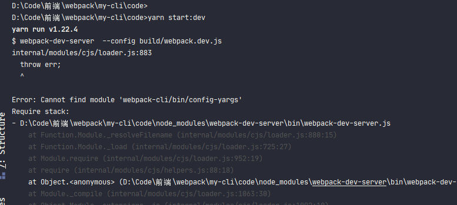
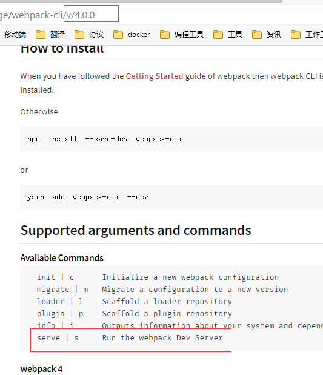
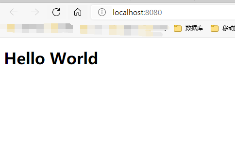

### webpack-dev-server使用


#### 什么是webpack-dev-server


诸君在使用**vue-cli**或者**react-cli**这类脚手架时，`yarn start`命令会开启一个本地服务器，浏览器访问这个服务器端口就可以浏览代码，并且更新代码后页面会自动刷新页面，让开发者能够更好的专注于开发。这个就是**dev-server**。 

 按照寻常打包流程：更改代码，手动执行打包代码，手动刷新浏览器， 一套操作下来就真的是编码30秒，运行2分钟了。**dev-server**是为了让开发者能够专注于编码。而忽略各种关于其他操作。

**dev-server** 就是运行一个服务器，与浏览器进行长链接。然后代码代码或者文件更新时，刷新浏览器这一套操作。

**webpack**中这个库就叫做<font style="color:#f03d3d">webpack-dev-server</font>，使用这个库便可以完成以上操作。

> :whale2: <font style="color:#f03d3d">webpack</font>配置本身就支持监听文件变化，<font style="color:#f03d3d">webpack-dev-server</font>只是默认开启<font style="color:#f03d3d">webpack</font>的监听属性。这个在之后详细说。


<font style="color:#f03d3d">webpack-dev-server</font>这个库在下想比较深入的讲解下，所以分成两篇来进行：第一篇只说<font style="color:#f03d3d">webpack-dev-server</font>的使用配置，第二篇稍微讲解一些流程与其原理。


诸君请拭目以待


#### webpack-dev-server 安装


##### webpack-cli/bin/config-yargs 的问题


截至到目前为止，<font style="color:#f03d3d">webpack-dev-server</font> 目前**最新版本**为 `@3.11.2`，


有用过的诸君会知道在使用此版本与**webpack@5.X**使用时会有一个问题:`Cannot find module 'webpack-cli/bin/config-yargs'`

这个我个人感觉是官方有些坑了。

先来安装这个版本的<font style="color:#f03d3d">webpack-dev-server</font>

> yarn add -D webpack-dev-server@3.11.2


了解过<font style="color:#f03d3d">webpack-dev-server</font>的诸君会知道，执行<font style="color:#f03d3d">webpack-dev-server</font>的命令为`webpack-dev-server`


官方NPM介绍文档也是`webpack-dev-server`命令


所以一般都会将`yarn start`命令设置为`webpack-dev-server`，

在这里使用`yarn start:dev` 命令设置为`webpack-dev-server`，


按照正常来说，此时执行`yarn start:dev`便可以执行<font style="color:#f03d3d">webpack-dev-server</font>。

但实际上，此时执行`yarn start:dev`会直接报错。




提示找不到<font style="color:#f03d3d">webpack-cli</font>库中的**config.yargs**模块。我感觉很多刚学习**webpack**并且搜索能力稍微弱一些的新人会卡很久。

> :whale2:  配置使用的<font style="color:#f03d3d">webpack-cli@4.4.0</font>和<font style="color:#f03d3d">webpack@4.14.0</font>


这个问题其实很简单，直接在[github](https://github.com/webpack/webpack-dev-server/issues?q=yargs+)就能搜到答案


可以看到答案，使用另一条命令就可以：`webpack serve`


此时使用`yarn start`就可以执行成功。默认启动的是**8080端口**号


那么这到底怎么回事呢？通过查看源码和测试<font style="color:#f03d3d">webpack-dev-server@4.0.0beta.0</font>在下略有猜测。

先看一下<font style="color:#f03d3d">webpack-dev-server@3.11.2</font>的一段代码


这是**webpack-dev-server/bin/webpack-dev-server.js**中的一段代码。使用`webpack-dev-server`命令执行时便会执行此模块。

在这个模块中加载了**webpack-cli/bin/** *config/* **config-yargs**和**webpack-cli/bin/** *utils/* **convert-argv**。


但是在<font style="color:#f03d3d">webpack-cli@4.X</font>版本代码结构已经改变，并没有这两个模块


可以看到，在<font style="color:#f03d3d">webpack-cli@4.4.0</font>中*bin目录*只有一个**cli模块**，所以可想而知就找不到了。


在使用<font style="color:#f03d3d">webpack@4.X</font>版本时，使用的<font style="color:#f03d3d">webpack-cli@3.X</font>，<font style="color:#f03d3d">webpack-dev-server@3.X</font>

后来更新到<font style="color:#f03d3d">webpack@5.X</font>时，<font style="color:#f03d3d">webpack-cli</font>也进行了大版本的更新，变成了<font style="color:#f03d3d">webpack-cli@4.X</font>，并且加入了`webpack serve`命令执行**webpack-dev-server**


但是<font style="color:#f03d3d">webpack-dev-server</font>并没有跟着更新大版本，依然是<font style="color:#f03d3d">webpack-dev-server@3.X</font>。并且也没有去更新这段代码，也就造成了使用`webpack-dev-server`命令报错的问题。


这个问题在<font style="color:#f03d3d">webpack-dev-server@4.X</font>进行了修复。不过<font style="color:#f03d3d">webpack-dev-server@4.X</font>目前只有一个<font style="color:#f03d3d">webpack-dev-server@4.0.0beta.0</font>版本。


在<font style="color:#f03d3d">webpack-dev-server@4.0.0beta.0</font>的[github](https://github.com/webpack/webpack-dev-server/blob/v4.0.0-beta.0/bin/webpack-dev-server.js)可以看到**/bin/webpack-dev-server.js**模块中没有了上面两段代码。


并且在<font style="color:#f03d3d">webpack-dev-server@4.0.0beta.0</font>文档中的命令是`webpack serve`


也就是其实这个问题是这样的：

:whale2::whale2:  <font style="color:#f03d3d">webpack-cli@4.X</font>版本开始，**webpack**团队将**dev-server**的命令改为了`webpack serve` 。<font style="color:#f03d3d">webpack</font>与<font style="color:#f03d3d">webpack-cli</font>都进行了大版本的更新。而<font style="color:#f03d3d">webpack-dev-server</font>并没有进行大版本更新，所以会导致老命令`webpack-dev-server`的错误。

> :whale2: 这个问题也是暂时性的，

`webpack serve`命令在 <font style="color:#f03d3d">webpack-cli@4.0.0</font>版本文档中有提到。




##### webpack serve

`webpack serve`命令的执行，入口是跟`webpack`命令一样，都是<font style="color:#f03d3d">webpack</font>库。在<font style="color:#f03d3d">webpack</font>库中调用<font style="color:#f03d3d">webpack-cli</font>库模块。然后在<font style="color:#f03d3d">webpack-cli</font>库根据其命令调用<font style="color:#f03d3d">@webpack-cli</font>库中的**serve模块**，开启<font style="color:#f03d3d">webpack-dev-server</font>中的服务器模块。这些代码都是<font style="color:#f03d3d">webpack-cli@4.X</font>新加的，所以并不会报错。详细内容在下一篇介绍。


> :whale2::whale2: <font style="color:#f03d3d">webpack</font>、<font style="color:#f03d3d">webpack-cli</font>、<font style="color:#f03d3d">webpack-dev-server</font>这三个跨库调用模块都是根据模块路径调用的。所以只要某个库文件结构稍微改动，就会像`webpack-dev-server`命令这样直接报错。 不过在新版本代码进行了优化，通过像`serve`这样的约定名称进行跨库调用。尽可能降低了耦合度。
>
> 
>
> :whale2:<font style="color:#f03d3d">@webpack-cli</font>是<font style="color:#f03d3d">webpack-cli4.X</font>依赖的一个库。


#####  webpack-dev-server@3.X 与webpack@5.X 关于HOT的问题。


在安装完<font style="color:#f03d3d">webpack-dev-server</font>之后，便可以直接使用命令去运行，并且开启了一个**8080端口**的服务器，这是使用的默认配置。

在上面说过  <font style="color:#f03d3d">webpack-dev-server</font>库的一个功能就是在代码更新后，会通过**WebScoket**推送浏览器进行更新。但是以目前使用的<font style="color:#f03d3d">webpack-dev-server@3.11.2</font>和<font style="color:#f03d3d">webpack@5.14.0</font>  **HOT**会有问题。


下面先来做一个测试


运行`yarn start`后就可以使用浏览器进行查看




此时将代码进行更新，会发现浏览器并没有更新，并且可以看到，浏览器网络中***WS***没有推送数据

> :whale2: **WS**“：WebSocket推送数据显示的窗口


在下对这个问题调试了下代码，发现WS根本就没有连接上，后来在[github](https://github.com/webpack/webpack-dev-server/issues/2980)中找到了答案。

原因是因为**package.json**文件中的***browserslist***，将此属性去掉就可以进行**HOT**。


这是一个BUG，但是按照官方给的解释好像只会在<font style="color:#f03d3d">webpack@4.X</font>修复这个问题。我使用<font style="color:#f03d3d">webpack@4.0.0beta.0</font>测试就没有这个问题


#### webpack-dev-server配置

<font style="color:#f03d3d">webpack-dev-server</font>使用的配置是配置在<font style="color:#f03d3d">webpack</font>中的，在<font style="color:#f03d3d">webpack</font>配置项中具有一个`devServer`配置，这个就是设置<font style="color:#f03d3d">webpack-dev-server</font>的。


##### 版本选择

目前<font style="color:#f03d3d">webpack@5.X</font>稳定版才4个月，并且<font style="color:#f03d3d">webpack-dev-server</font>还没有新版本的稳定版。所以<font style="color:#f03d3d">webpack@5.X</font>一般还是只是学习使用。

在此直接使用<font style="color:#f03d3d">webpack-dev-server@4.0.0beta.0</font>版进行学习，

在<font style="color:#f03d3d">webpack-dev-server@4.0.0beta.0</font> 属性配置稍微有些变动，所以也会稍微讲一下与<font style="color:#f03d3d">webpack-dev-server@3.X</font>的差异


<font style="color:#f03d3d">webpack-dev-server@4.0.0beta.0</font>还加入了比较完善的属性错误提示，如果设置没有的属性或者属性值类型不对会直接提示出来。

在<font style="color:#f03d3d">webpack-dev-server@3.X</font>只会提示属性设置失败。这一点真的挺好的。

> yarn add -D webpack-dev-server@4.0.0beta.0


#### webpack-dev-server配置


<font style="color:#f03d3d">webpack-dev-server</font>的配置项是写在**webpack**配置文件中的`devServer`属性。<font style="color:#f03d3d">webpack-dev-server</font>执行时会读取这个属性。

先来看一下`devServer`属性设置

```js
const path = require('path');
const { merge } = require('webpack-merge');
const { config } = require('./config');
const common = require('./webpack.common');
//  使用node。js的导出，将配置进行导出
module.exports = merge([
  common(true),
  {
    mode: 'development',
      
      
    devServer:{

      //  服务器host，默认为localhost，
      host: '127.0.0.1',

      //  开启服务器端口号，
      //  默认为8080
      port: 7777,

      //  string | boolean
      //  是否打开浏览器
      //  默认为false，如果设置为true， 启动时会自动打开浏览器
      //  当为字符串时，打开指定浏览器
      open: true, // 'chrome'

      // 打开浏览器后默认打开的页面
      //  string | Array<string>
      //  当设置为Array时，会打开多个页面
      openPage: '', // ['', 'index.html'], //'index.html',

      //  是否启用gzip压缩,
      //  默认为false
      compress: true,

      //  是否启动热更新（HMR）
      //  默认为false，
      //  热更新使用的是webpack中HotModuleReplacementPlugin
      hot: true,

      // 设置允许访问的IP地址，设置为true，则不允许任何IP访问，
      //  也可以设置为数组，与webpack-devser@3.X 的allowedHosts一样
      //  相当于webpack-devser@3.X 的allowedHosts属性
      firewall: true,

      //  是否设置HTTP/2服务器。
      //  对于nodeV10以上的版本  由于spdy有问题
      //  所以如果将此属性设置为true，则默认使用https作为服务
      http2: false,

      //  boolean 或者 object
      //  默认情况下， dev-server使用HTTPS为HTTP/2提供服务
      https: {
         //  证书，证书属性也可以设置在devServer下，当https设置为boolean时， 与https同级设置
         key: '',//fs.readFileSync('/path/to/server.key'),
         cert: '',//fs.readFileSync('/path/to/server.crt'),
         ca: '',//fs.readFileSync('/path/to/ca.pem'),
       },


      //  服务器代理配置，当前后端分离开发时，前端请求API需要指定地址
      //  此属性可以设置代理的IP地址
      //  例如如下，当api请求  /api/user真实地址为http://localhost:3000/user
      //  详情使用请参考官网https://webpack.js.org/configuration/dev-server/#devserverproxy
      proxy: {
        '/api':{
          target: 'http://localhost:3000',
          //  pathRewrite属性可以设置前缀，如果不设置pathRewrite： /api/user真实地址为http://localhost:3000/api/user
          pathRewrite: {'^/api' : ''},
          //  HTTPS设置为无效证书
          // secure: false
        }
      },

      //  加入到response头部自定义内容
      headers: {
        'X-Custom-Foo': 'bar'
      },

      //  静态文件属性
      static: {
         //  提供静态文件的地址。 string    设置为false则代表关闭
        //  默认为为当前工作目录
        //  建议使用绝对地址
        //  例如设置为 dist后， dev时寻找文件会在/dist目录下寻找静态文件
        //   相当于webpack-dev-server@3.X的 contentBase属性
        directory: path.join(config.root),

        //  这个属性是提供directory设置目录的别名，
        //  假如directory 设置了一个很深的目录：path.join(config.root,'assets/a/v')，并且此属性设置为/assets，那么使用/assets可以直接访问文件
        //   相当于webpack-dev-server@3.X的 contentBasePublicPath属性
        publicPath: '/',

        // 设置express.static的参数
        //   相当于webpack-dev-server@3.X的 staticOptions属性
        staticOptions: undefined,

        //  是否加入serve-index中间件，默认为true
        //   相当于webpack-dev-server@3.X的 serveIndex属性
        serveIndex: true,

        //  是否使用chokidar库进行监听文件变化。
        //  webpack使用的是文件系统的的变化通知，但是有时候可能会不管用，例如使用网络文件系统
        //  所以可以设置属性使用chokidar库进行轮询检测文件变化。
        //  此属性可以设置为boolean类型也可以设置为对象类型指定轮询时间(毫秒数）
        //   相当于webpack-dev-server@3.X的 watchOptions属性
        watch: {
          poll: 3000
        },
      },

      //  设置WS客户端的一些属性
      client: {
        //  推送客户端日志级别，
        //  属性具有 "none" | "error" | "warn" | "info" | "log" | "verbose"
        //  例如设置error ，WS并不是推送打包警告和消息， WS客户端会将日志打印在控制台上
        //  如果设置为none， 就算打包失败也不会有消息
        //   相当于webpack-dev-server@3.X的 clientLogLevel属性
        logging: 'verbose',
        //  是否发送发包进度，
        //   相当于webpack-dev-server@3.X的 progress属性
        progress: true,

        //  相当于webpack-dev-server@3.X的 sockPath属性
        // path: '',
        //  相当于webpack-dev-server@3.X的 sockHost属性
        // host: '',
        //  相当于webpack-dev-server@3.X的 sockPort属性
        // port: '',
      },


       public: undefined,


      //  dev打包时所使用的一些属性
      dev:{

        headers:{
          //  响应头添加数据
          'X-Dev-Header': 'X-Dev-Header',
          serverSideRender: false,
        },

        //   相当于webpack-dev-server@3.X的 mimeTypes属性
        mimeTypes:{

        },

        //  当前生成的打包结果是否写入到磁盘之中
        //  默认为false
        //   相当于webpack-dev-server@3.X的 writeToDisk属性
        writeToDisk: true,

        //  设置路径的前缀路径
        //  例如，如果设置为/assets
        //  那么服务器启动后，访问所有数据都需要加入/assets/前缀
        //  localhost:7777/assets
        //   相当于webpack-dev-server@3.X的 publicPath属性
        publicPath: '/',

        //  根目录所指向的页面。
        //  因为HtmlWebpackPlugin设置的 html名称为index.html
        //  所以在此设置为index.html
        //  默认值也是index.html
        //  当前打包状态
        //   相当于webpack-dev-server@3.X的 index属性
        index: 'index.html',

        //  none" | "summary" | "errors-only" | "errors-warnings" | "minimal" | "normal" | "detailed" | "verbose" | boolean | object { … }
        //  控制打包时控制台的输出结果等级，
        //   相当于webpack-dev-server@3.X的 stats属性
        stats: 'minimal',

        //  自定义dev-server打包文件的输出流
        //  默认情况下，输入流为memory
        outputFileSystem: undefined,


        methods: undefined,

        serverSideRender: undefined

      },


      //  当编译错误后，页面是否显示错误信息， boolean | {}
      //  默认为false，当编译失败后会显示空白页
      //  设置为true后，编译失败会显示错误的覆盖层,也可以设置为object，显示多种类型信息
      overlay: {
        warning:true,
        errors: true
      },

      // 是否注入webpack客户端
      // boolean | function (compilerConfig) => boolean
      // 这个注入客户端意思是：是否要将webpack库注入进去
      // dev-server中好多功能是由webpack提供实现的。将webpack注入到dev-server中进行通讯，
      //  将此属性设置为false，那么hot、overlay等功能都会失效
      //  默认为true，  有兴趣的诸君可以设置为false测试一下
      injectClient: true,

      //  是否注入HOT， 这个属性可以算是injectClient的子集。只影响HOT
      injectHot: true,

      //  此属性表示是否每次文件更新时进行重新加载所有模块
      //  HOT是只加载更新的代码
      //  此属性设置为true，也就是放弃HOT，每次文件更新都会重新加载所有模块
      //  这个可以在 浏览器控制台中WS选项查看，
      //  默认值为false
      liveReload: false,

      //  是否开启ZeroConf网络
      bonjour: false,

      //  自定义中间件钩子属性
      //    优先于server内部中间件执行
      //  相当于webpack-devser@3.X 的before函数
      onBeforeSetupMiddleware: (app, server, compiler) =>{
        //console.log('我是before', compiler.options)
      },

      //  server内部执行完所有中间件后执行当前中间件
      //  相当于webpack-devser@3.X 的after函数
      onAfterSetupMiddleware: (app, server, compiler) =>{
      },

      //  dev-server提供的当服务器启动后执行的钩子函数
      onListening: (server) => {
        // const port = server.listeningApp.address().port;
        // console.log('Listening on port:', port);
      },

      //  boolean | object
      //  当此属性设置为true或为object时，如果使用的HTML5 API 所有404页面会跳转到index.html
      //  使用的connect-history-api-fallback库 设置为对象，则会将此对象传参给connect-history-api-fallback库
      historyApiFallback: false,

      //  是否监听node中stdin.end事件， 关闭服务器
      stdin: false,

      //  是否使用局域网IP打开页面
      useLocalIp: false,

      //  终止信号，设置为true时 监听['SIGINT', 'SIGTERM'];事件，事件触发后结束进程
      //  目前dev-server强制将此属性设置为true了，所以改为false不管用。
      setupExitSignals: true,

      transportMode:{
        //  长链接服务类型， 值为 sockjs或者ws
        //  sockjs 使用的sockjs库
        //  ws 使用的ws库
        //  webpack-dev-server@4.X使用的是WS  webpack-dev-server@3.X 使用的是sockjs
        //  目前在webpack-dev-server@4.X使用sockjs会出错， webpack-dev-server@3.X使用WS也会报错
         server: 'ws'
      }
    },

  }
])
```

> * **host**：Server启动时使用的IP地址，默认为**localhost**。
>
>   
>
> * **port**：Server启动时使用的端口号，默认为**8080**
>
>   
>
> * **open**：启动服务器后是否自动打开浏览器，默认值为false，可以设置为true（打开默认浏览器）。也可以设置为指定浏览器。例如：**chrome**，便可以打开谷歌浏览器
>
>   
>
> * **openPage**：自动打开浏览器的默认启动页面。默认打开网站根目录，可以设置打开指定html（index.html）。也可以设置数组，打开多个页面，每个页面打开指定项
>
>   
>
> * **compress**：是否启动gzip压缩。默认为false，
>
>   
>
> * **hot**：是否启动热更新（HMR）。热更新就是只加载更新的数据，默认为false，这个一般都是启用。 热更新使用的是webpack中的**HotModuleReplacementPlugin**
>
>   
>
> * **firewall**？：设置防火墙，也就是可以设置可访问的IP地址，默认为true，不允许所有连接，可以设置为false，也可以设置数组，指定可连接的IP地址。此属性就是<font style="color:#f03d3d">webpack-dev-server@3.X</font> 的`allowedHosts`属性
>
>   
>
> * **https**：是否启动HTTPS安全链接方式。默认为false，此值还可以设置为一个对象，对象中设置HTTPS证书
>
>   
>
> * **http2**：是否启用HTTP/2，默认为false， 如果使用HTTP/2方式，默认为开启HTTPS传输方式，也就是，将https设置为**true**
>
>   
>
> * **proxy**：设置服务器代理配置。前后端分离时，前端请求API需要指定地址，此属性可以配置IP地址，当访问指定请求时就请求配置的IP地址。例如上面在请求**/api**的接口时会访问http://localhost:3000。还可以在请求时不增加**/api**。等等，具体可参考官网：[devserverproxy](https://webpack.js.org/configuration/dev-server/#devserverproxy)。当然也可以不使用此属性，直接使用一个静态字符串或者配置文件。都是选择方式
>
>   
>
> * **headers**：可以设置服务器Response时的头部。在服务器返回数据时会携带自定义头部
>
>   
>
> * **static**：设置静态文件属性， 属性值为一个**对象或者数组**。 在<font style="color:#f03d3d">webpack-dev-server@3.X</font>是没有这个属性的，而这个属性只不过是一个包装，将同一类别的属性封装
>
>   * **directory**：提供静态文件的目录地址。属性值为一个字符串。默认为当前项目根目录，也就是**package.json**文件所在目录。例如如果将此属性设置为***assets***，在访问静态文件时会在此目录下寻找。此属性就是<font style="color:#f03d3d">webpack-dev-server@3.X</font> 的`contentBase`属性
>
>     
>
>   * **publicPath**：这个属性是`directory`的别名。例如将此属性设置为***images***，那么使用静态文件时必须以**/images**目录起始。此属性就是<font style="color:#f03d3d">webpack-dev-server@3.X</font> 的`contentBasePublicPath`属性
>
>     
>
>   * **staticOptions**：此属性是设置express.static【express.static(directory,staticOptions)】时的参数。具体可参考[express框架](http://expressjs.com/en/4x/api.html#express.static)
>
>   * **serveIndex**： 是否可以在浏览器中显示目录文件列表。默认为true，在浏览器显示文件列表是使用的**serve-index**中间件  具体可参考[NPM](https://www.npmjs.com/package/serve-index)。此属性就是<font style="color:#f03d3d">webpack-dev-server@3.X</font> 的`serveIndex`属性
>
>     
>
>   * **watch**：是否使用轮询方式检查文件变化。**webpack**使用过的是文件系统的变化通知，但是在某些时候（例如网络文件系统）时，会不管用，所以可以使用轮询方式进行检查文件变化。此属性可以设置为boolean类型或者对象类型，对象类型时可以设置轮询时间。 使用的chokidar库进行轮询处理。  此属性就是<font style="color:#f03d3d">webpack-dev-server@3.X</font> 的`watchOptions`属性 
>
>     
>
>   


以上便是<font style="color:#f03d3d">webpack-dev-server@4.0.0beta.0</font>


