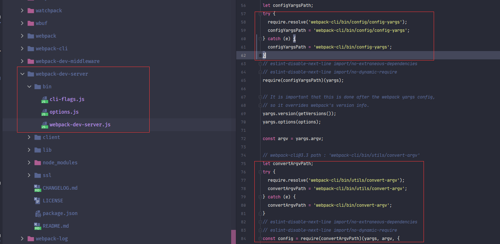
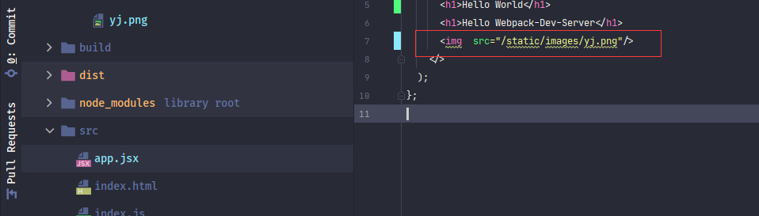

### webpack-dev-server使用


#### 什么是webpack-dev-server


诸君使用**vue-cli**或者**react-cli**这类脚手架时，执行`yarn start`命令会启动一个本地服务器，浏览器访问就可以看到实际代码，并且代码更新页面会自动刷新，非常方便，这样的功能就是**dev-server**。

**dev-server** 就是运行一个服务器，服务器使用**WebSocket**与浏览器进行长链接。服务器检测到代码文件更新后，进行重新编译，然后向客户端发送对应类型的数据,  客户端根据服务器推送的数据执行相应的操作。如刷新浏览器。


**webpack**中这个库就叫做<font style="color:#f03d3d">webpack-dev-server</font>，使用这个库便可以完成以上操作。

> :whale2: <font style="color:#f03d3d">webpack</font>本身就支持监听文件变化，<font style="color:#f03d3d">webpack-dev-server</font>只是默认开启<font style="color:#f03d3d">webpack</font>的监听属性。


<font style="color:#f03d3d">webpack-dev-server</font>这个想深入的说一下，所以会分成两篇来进行：

1. <font style="color:#f03d3d">webpack-dev-server</font>的使用配置
2. 稍微讲解一些<font style="color:#f03d3d">webpack-dev-server</font>流程和原理。


诸君请拭目以待


#### webpack-dev-server 安装


##### webpack-cli/bin/config-yargs 的问题


截至到目前为止，<font style="color:#f03d3d">webpack-dev-server</font> 目前**最新版本**是 `@3.11.2`，


有用过的诸君会知道在使用此版本与**webpack@5.X**使用时会具有一个错误：<font style="color:red">**Cannot find module 'webpack-cli/bin/config-yargs**</font>


这个我个人感觉是官方有些坑了。


先来安装这个版本的<font style="color:#f03d3d">webpack-dev-server</font>

> yarn add -D webpack-dev-server@3.11.2


使用过<font style="color:#f03d3d">webpack-dev-server</font>的诸君都会知道，执行<font style="color:#f03d3d">webpack-dev-server</font>的命令为`webpack-dev-server`

官方NPM介绍文档也是`webpack-dev-server`命令


所以都会将`yarn start`命令设置为`webpack-dev-server`，

> :whale:在这里使用`yarn start:dev` 命令设置为`webpack-dev-server`。


现在，应该执行`yarn start:dev`就可以执行<font style="color:#f03d3d">webpack-dev-server</font>。

但是，执行就会碰到错误：


错误提示是找不到<font style="color:#f03d3d">webpack-cli</font>库中的**config.yargs**模块。个人感觉很多刚学习**webpack**并且搜索能力稍微弱一些的新人就会卡在这。

> :whale2:  配置使用的<font style="color:#f03d3d">webpack-cli@4.4.0</font>和<font style="color:#f03d3d">webpack@4.14.0</font>


这个问题其实很简单，直接在[github的issues](https://github.com/webpack/webpack-dev-server/issues?q=yargs+)就能搜到答案


原来是换执行命令了：`webpack serve`


此时使用`yarn start`就可以执行成功。默认启动的是**8080端口**


那么这到底怎么回事呢？通过查看源码和测试<font style="color:#f03d3d">webpack-dev-server@4.0.0beta.0</font>个人略有些猜测。

先看一下<font style="color:#f03d3d">webpack-dev-server@3.11.2</font>的一段代码



这是<font style="color:#f03d3d">webpack-dev-server@3.11.2</font>库**/bin/webpack-dev-server.js**中的一段代码。使用`webpack-dev-server`命令执行时便会执行此模块。

在这个模块中加载了**webpack-cli/bin/** *config/* **config-yargs**和**webpack-cli/bin/** *utils/* **convert-argv**。


但是在<font style="color:#f03d3d">webpack-cli@4.X</font>版本代码结构已经改变，并没有这两个模块


这个原因个人猜测就是目前属于大版本迭代期。

在之前使用**webpack@4.X**版本时，使用的**webpack-cli@3.X**，**webpack-dev-server@3.X**

后来更新到**webpack@5.X**，<font style="color:#f03d3d">webpack-cli</font>也随之进行了大版本的更新，变成了**webpack-cli@4.X**，并且加入了`webpack serve`命令


但是<font style="color:#f03d3d">webpack-dev-server</font>到目前新版本并没有开发完成，所以NPM中**最新版本**依然是**webpack-dev-server@3.X**。并且在**webpack-dev-server@3.X**也没有修复这个问题。


这个问题在**webpack-dev-server@4.X**就进行了修复。不过目录**webpack-dev-server@4.X**只有一个<font style="color:#f03d3d">webpack-dev-server@4.0.0beta.0</font>版本，还没有稳定版本


在<font style="color:#f03d3d">webpack-dev-server@4.0.0beta.0</font>的[代码](https://github.com/webpack/webpack-dev-server/blob/v4.0.0-beta.0/bin/webpack-dev-server.js)可以看到**/bin/webpack-dev-server.js**模块中没有了上面两段代码。


并且在<font style="color:#f03d3d">webpack-dev-server@4.0.0beta.0</font>文档中的命令也是`webpack serve`


> :whale2::whale2::whale2:  **webpack-cli@4.X**版本开始，**webpack**团队将**dev-server**的命令改为了`webpack serve` 。<font style="color:#f03d3d">webpack</font>与<font style="color:#f03d3d">webpack-cli</font>都进行了大版本的更新。<font style="color:#f03d3d">webpack-dev-server</font>到目前新版本还没开发完成。所以暂时就出了这么一个问题


> :whale2:因为<font style="color:#f03d3d">webpack-dev-server@4.0.0beta.0</font>修复了这个问题，所以使用`webpack-dev-server`也可以执行


`webpack serve`命令在 <font style="color:#f03d3d">webpack-cli@4.0.0</font>版本文档中有提到。


##### webpack serve

`webpack serve`命令的执行，执行入口是跟`webpack`命令一样，都是<font style="color:#f03d3d">webpack</font>库。在<font style="color:#f03d3d">webpack</font>库中调用了<font style="color:#f03d3d">webpack-cli</font>库模块。然后在<font style="color:#f03d3d">webpack-cli</font>库根据其命令调用<font style="color:#f03d3d">@webpack-cli</font>库中的**serve模块**，开启<font style="color:#f03d3d">webpack-dev-server</font>中的服务器模块。这些代码都是<font style="color:#f03d3d">webpack-cli@4.X</font>新加的，所以并不会报错。详细内容在下一篇介绍。


> :whale2::whale2: <font style="color:#f03d3d">webpack</font>、<font style="color:#f03d3d">webpack-cli</font>、<font style="color:#f03d3d">webpack-dev-server</font>跨库调用都是根据模块路径调用。所以只要某个库文件结构稍微改动，就会像`webpack-dev-server`命令这样直接报错。 不过在新版本代码进行了优化，通过像`serve`这样的约定名称进行跨库调用。尽可能降低了耦合度。
>
> 
>
> :whale2:<font style="color:#f03d3d">@webpack-cli</font>是<font style="color:#f03d3d">webpack-cli4.X</font>依赖的一个库。


#####  webpack-dev-server@3.X 与webpack@5.X 关于HOT的问题。


在安装完<font style="color:#f03d3d">webpack-dev-server</font>之后，便可以直接使用命令执行，执行成功会开启了一个**8080端口**的服务器。

在上面说过  <font style="color:#f03d3d">webpack-dev-server</font>库的一个功能就是在代码更新后，会通过**WebScoket**推送浏览器进行更新。但是<font style="color:#f03d3d">webpack-dev-server@3.11.2</font>和<font style="color:#f03d3d">webpack@5.14.0</font>  中**HOT**也有一些问题。


下面先来做一个测试，运行`yarn start`后就可以使用浏览器进行查看


此时将代码进行更新，但是浏览器并没有更新，并且可以看到，浏览器网络中***WS***没有推送数据

> :whale2: **WS**“：WebSocket推送数据显示的窗口


对这个问题我调试了下源码，发现WS根本就没有连接上，后来在[github](https://github.com/webpack/webpack-dev-server/issues/2980)中找到了答案。

原因是因为**package.json**文件中的***browserslist***，将此属性去掉就可以进行**HOT**。


这是一个BUG，但是按照官方给的解释好像只会在**webpack@4.X**修复这个问题。我使用<font style="color:#f03d3d">webpack@4.0.0beta.0</font>测试就没有这个问题了


##### 版本选择

目前**webpack@5.X**稳定版才4个月，并且<font style="color:#f03d3d">webpack-dev-server</font>还没有新版的稳定版。所以<font style="color:#f03d3d">webpack@5.X</font>还只能供学习使用。


在此就直接使用<font style="color:#f03d3d">webpack-dev-server@4.0.0beta.0</font>版进行学习，

在<font style="color:#f03d3d">webpack-dev-server@4.0.0beta.0</font> 属性配置稍微有些变动，所以也会稍微讲一下与**webpack-dev-server@3.X**的差异


<font style="color:#f03d3d">webpack-dev-server@4.0.0beta.0</font>还加入完善的错误提示，设置了不具有的属性或属性值类型不一致时都会给出详细提示。

而在**webpack-dev-server@3.X**只会提示属性设置失败。

> yarn add -D webpack-dev-server@4.0.0beta.0


#### webpack-dev-server配置


<font style="color:#f03d3d">webpack-dev-server</font>的配置项是写在**webpack**配置文件中的`devServer`属性。<font style="color:#f03d3d">webpack-dev-server</font>执行时会读取这个属性。

```js
const path = require('path');
const { merge } = require('webpack-merge');
const { config } = require('./config');
const common = require('./webpack.common');
//  使用node。js的导出，将配置进行导出
module.exports = merge([
  common(true),
  {
    mode: 'development',
      
      
    devServer:{

      //  服务器host，默认为localhost，
      host: '127.0.0.1',

      //  开启服务器端口号，
      //  默认为8080
      port: 7777,

      //  string | boolean
      //  是否打开浏览器
      //  默认为false，如果设置为true， 启动时会自动打开浏览器
      //  当为字符串时，打开指定浏览器
      open: true, // 'chrome'

      // 打开浏览器后默认打开的页面
      //  string | Array<string>
      //  当设置为Array时，会打开多个页面
      openPage: '', // ['', 'index.html'], //'index.html',

      //  是否启用gzip压缩,
      //  默认为false
      compress: true,

      //  是否启动热更新（HMR）
      //  默认为false，
      //  热更新使用的是webpack中HotModuleReplacementPlugin
      hot: true,

      // 设置允许访问的IP地址，设置为true，则不允许任何IP访问，
      //  也可以设置为数组，与webpack-devser@3.X 的allowedHosts一样
      //  相当于webpack-devser@3.X 的allowedHosts属性
      firewall: true,

      //  是否设置HTTP/2服务器。
      //  对于nodeV10以上的版本  由于spdy有问题
      //  所以如果将此属性设置为true，则默认使用https作为服务
      http2: false,

      //  boolean 或者 object
      //  默认情况下， dev-server使用HTTPS为HTTP/2提供服务
      https: {
         //  证书，证书属性也可以设置在devServer下，当https设置为boolean时， 与https同级设置
         key: '',//fs.readFileSync('/path/to/server.key'),
         cert: '',//fs.readFileSync('/path/to/server.crt'),
         ca: '',//fs.readFileSync('/path/to/ca.pem'),
       },


      //  服务器代理配置，当前后端分离开发时，前端请求API需要指定地址
      //  此属性可以设置代理的IP地址
      //  例如如下，当api请求  /api/user真实地址为http://localhost:3000/user
      //  详情使用请参考官网https://webpack.js.org/configuration/dev-server/#devserverproxy
      proxy: {
        '/api':{
          target: 'http://localhost:3000',
          //  pathRewrite属性可以设置前缀，如果不设置pathRewrite： /api/user真实地址为http://localhost:3000/api/user
          pathRewrite: {'^/api' : ''},
          //  HTTPS设置为无效证书
          // secure: false
        }
      },

      //  加入到response头部自定义内容
      headers: {
        'X-Custom-Foo': 'bar'
      },

      //  静态文件属性
      static: {
         //  提供静态文件的地址。 string    设置为false则代表关闭
        //  默认为为当前工作目录
        //  建议使用绝对地址
        //  例如设置为 dist后， dev时寻找文件会在/dist目录下寻找静态文件
        //   相当于webpack-dev-server@3.X的 contentBase属性
        directory: path.join(config.root),

        //  这个属性是提供directory设置目录的别名，
        //  假如directory 设置了一个很深的目录：path.join(config.root,'assets/a/v')，并且此属性设置为/assets，那么使用/assets可以直接访问文件
        //   相当于webpack-dev-server@3.X的 contentBasePublicPath属性
        publicPath: '/',

        // 设置express.static的参数
        //   相当于webpack-dev-server@3.X的 staticOptions属性
        staticOptions: undefined,

        //  是否加入serve-index中间件，默认为true
        //   相当于webpack-dev-server@3.X的 serveIndex属性
        serveIndex: true,

        //  是否使用chokidar库进行监听文件变化。
        //  webpack使用的是文件系统的的变化通知，但是有时候可能会不管用，例如使用网络文件系统
        //  所以可以设置属性使用chokidar库进行轮询检测文件变化。
        //  此属性可以设置为boolean类型也可以设置为对象类型指定轮询时间(毫秒数）
        //   相当于webpack-dev-server@3.X的 watchOptions属性
        watch: {
          poll: 3000
        },
      },

      //  设置WS客户端的一些属性
      client: {
        //  推送客户端日志级别，
        //  属性具有 "none" | "error" | "warn" | "info" | "log" | "verbose"
        //  例如设置error ，WS并不是推送打包警告和消息， WS客户端会将日志打印在控制台上
        //  如果设置为none， 就算打包失败也不会有消息
        //   相当于webpack-dev-server@3.X的 clientLogLevel属性
        logging: 'verbose',
        //  是否发送发包进度，
        //   相当于webpack-dev-server@3.X的 progress属性
        progress: true,

        //  相当于webpack-dev-server@3.X的 sockPath属性
        // path: '',
        //  相当于webpack-dev-server@3.X的 sockHost属性
        // host: '',
        //  相当于webpack-dev-server@3.X的 sockPort属性
        // port: '',
      },


       public: undefined,


      //  dev打包时所使用的一些属性
      dev:{

        headers:{
          //  响应头添加数据
          'X-Dev-Header': 'X-Dev-Header',
          serverSideRender: false,
        },

        //   相当于webpack-dev-server@3.X的 mimeTypes属性
        mimeTypes:{

        },

        //  当前生成的打包结果是否写入到磁盘之中
        //  默认为false
        //   相当于webpack-dev-server@3.X的 writeToDisk属性
        writeToDisk: true,

        //  设置路径的前缀路径
        //  例如，如果设置为/assets
        //  那么服务器启动后，访问所有数据都需要加入/assets/前缀
        //  localhost:7777/assets
        //   相当于webpack-dev-server@3.X的 publicPath属性
        publicPath: '/',

        //  根目录所指向的页面。
        //  因为HtmlWebpackPlugin设置的 html名称为index.html
        //  所以在此设置为index.html
        //  默认值也是index.html
        //  当前打包状态
        //   相当于webpack-dev-server@3.X的 index属性
        index: 'index.html',

        //  none" | "summary" | "errors-only" | "errors-warnings" | "minimal" | "normal" | "detailed" | "verbose" | boolean | object { … }
        //  控制打包时控制台的文件打包统计，
        //   相当于webpack-dev-server@3.X的 stats属性
        stats: 'minimal',

        //  自定义dev-server打包文件的输出流
        //  默认情况下，输入流为memory
        outputFileSystem: undefined,


        methods: undefined,

        serverSideRender: undefined

      },


      //  当编译错误后，页面是否显示错误信息， boolean | {}
      //  默认为false，当编译失败后会显示空白页
      //  设置为true后，编译失败会显示错误的覆盖层,也可以设置为object，显示多种类型信息
      overlay: {
        warning:true,
        errors: true
      },

      // 是否注入webpack客户端
      // boolean | function (compilerConfig) => boolean
      // 这个注入客户端意思是：是否要将webpack库注入进去
      // dev-server中好多功能是由webpack提供实现的。将webpack注入到dev-server中进行通讯，
      //  将此属性设置为false，那么hot、overlay等功能都会失效
      //  默认为true，  有兴趣的诸君可以设置为false测试一下
      injectClient: true,

      //  是否注入HOT， 这个属性可以算是injectClient的子集。只影响HOT
      injectHot: true,

      //  此属性表示是否每次文件更新时进行重新加载所有模块
      //  HOT是只加载更新的代码
      //  此属性设置为true，也就是放弃HOT，每次文件更新都会重新加载所有模块
      //  这个可以在 浏览器控制台中WS选项查看，
      //  默认值为false
      liveReload: false,

      //  是否开启ZeroConf网络
      bonjour: false,

      //  自定义中间件钩子属性
      //    优先于server内部中间件执行
      //  相当于webpack-devser@3.X 的before函数
      onBeforeSetupMiddleware: (app, server, compiler) =>{
        //console.log('我是before', compiler.options)
      },

      //  server内部执行完所有中间件后执行当前中间件
      //  相当于webpack-devser@3.X 的after函数
      onAfterSetupMiddleware: (app, server, compiler) =>{
      },

      //  dev-server提供的当服务器启动后执行的钩子函数
      onListening: (server) => {
        // const port = server.listeningApp.address().port;
        // console.log('Listening on port:', port);
      },

      //  boolean | object
      //  当此属性设置为true或为object时，如果使用的HTML5 API 所有404页面会跳转到index.html
      //  使用的connect-history-api-fallback库 设置为对象，则会将此对象传参给connect-history-api-fallback库
      historyApiFallback: false,

      //  是否监听node中stdin.end事件， 关闭服务器
      stdin: false,

      //  是否使用局域网IP打开页面
      useLocalIp: false,

      //  终止信号，设置为true时 监听['SIGINT', 'SIGTERM'];事件，事件触发后结束进程
      //  目前dev-server强制将此属性设置为true了，所以改为false不管用。
      setupExitSignals: true,

      transportMode:{
        //  长链接服务类型， 值为 sockjs或者ws
        //  sockjs 使用的sockjs库
        //  ws 使用的ws库
        //  webpack-dev-server@4.X使用的是WS  webpack-dev-server@3.X 使用的是sockjs
        //  目前在webpack-dev-server@4.X使用sockjs会出错， webpack-dev-server@3.X使用WS也会报错
         server: 'ws'
      }
    },

  }
])
```

> * **host**：服务器启动使用的IP地址，默认为**localhost**。
>
> 
>
> * **port**：服务器启动使用的端口号，默认为**8080**
>
> 
>
> * **open**：启动服务器后是否自动打开浏览器，默认值为false。也可以设置为指定浏览器字符串。例如：**chrome**，便可以打开谷歌浏览器
>
> 
>
> * **openPage**：自动打开浏览器时打开的路由。默认打开网站根路由，可以设置打开任意路由。也可以设置数组，打开多个页面，每个页面打开指定项
>
> 
>
> * **compress**：是否启动gzip压缩数据。默认为false。使用的<font style="color:#f03d3d">compression</font>中间件进行压缩
>
> 
>
> * **hot**：是否启动热更新（HMR）。热更新是只加载更新的数据，默认为false，这个几乎都会使用。 热更新使用的是webpack中的<font style="color:#f03d3d">HotModuleReplacementPlugin</font>
>
> 
>
> * **firewall**：可访问服务器的IP地址，默认为true，不允许所有其它主机连接。也可以设置数组，指定可连接的IP地址。
>
>   > :whale2:此属性就是**webpack-dev-server@3.X** 的**`allowedHosts`**属性
>
> 
>
> * **https**：是否启动HTTPS安全链接方式。默认为false，此属性值还可以设置为对象形式，对象设置HTTPS证书信息
>
> 
>
> * **http2**：是否启用HTTP/2，默认为false， 如果使用HTTP/2方式，会开启HTTPS传输方式，也就是，将`https`设置为***true***
>
> 
>
> * **proxy**：服务器代理配置。前后端分离时，前端请求API需要指定地址，此属性可以配置IP地址，当访问指定请求时就请求配置的IP地址。例如上面在请求**/api**的接口时会访问http://localhost:3000。具体可参考官网：[devserverproxy](https://webpack.js.org/configuration/dev-server/#devserverproxy)。当然也可以不使用此属性，直接使用一个静态字符串或者配置文件。看个人编码习惯
>
> 
>
> * **headers**：自定义服务器Response时添加的header信息。
>
> 
>
> * **static**：访问静态文件配置， 属性值为一个**对象或数组**。 **webpack-dev-server@3.X**没有此属性，**webpack-dev-server@4.X**只是将关于静态文件配置属性进行汇总封装
>
>   - **directory**：服务器设置静态文件的本地目录。属性值为一个字符串。默认为当前项目根目录，也就是**package.json**文件所在目录。
>
>     > :whale2:此属性就是**webpack-dev-server@3.X** 的**`contentBase`**属性
>
>   - **publicPath**：静态文件挂载服务器的目录地址，例如将此属性设置为***images***，那么使用静态文件时必须以**/images**目录起始。
>
>     > :whale2: 此属性就是**webpack-dev-server@3.X** 的**`contentBasePublicPath`**属性
>
>   - **staticOptions**：服务器挂载静态文件时使用的参数：  express.static【express.static(directory,staticOptions)】时的参数。具体可参考[express框架](http://expressjs.com/en/4x/api.html#express.static)
>
>   - **serveIndex**： 是否可以在浏览器访问静态文件列表。默认为true，使用的是<font style="color:#f03d3d">serve-index</font> 中间件  具体可参考[NPM](https://www.npmjs.com/package/serve-index)。
>
>     > :whale2:此属性就是**webpack-dev-server@3.X** 的**`serveIndex`**属性
>
>   - **watch**：是否使用轮询方式检查文件变化。**webpack**使用过的是文件系统的变化通知，但是在某些时候（例如网络文件系统）时，会失效，所以可以使用轮询方式进行检查文件变化。此属性就是控制是否使用轮询方式检测文件。  属性可以设置boolean | object， object时可提供轮询时间。 使用的是<font style="color:#f03d3d">chokidar</font> 中间件  
>
>     > :whale2:使用的chokidar库进行轮询处理。  此属性就是**webpack-dev-server@3.X** 的**`watchOptions`**属性   
>
> 
>
>   * **client**：devServer客户端（WS客户端）配置。属性值为一个对象。 **webpack-dev-server@3.X**没有此属性，**webpack-dev-server@4.X**只是将关于客户端属性进行汇总封装
>
>     - **logging**：向*devServer客户端（WebSocket客户端）*推送日志级别（浏览器控制台输出日志级别）。属性值具有***"none" | "error" | "warn" | "info" | "log" | "verbose"***。例如***verbose***便会将所有日志输出在浏览器控制台，而***none***则不会输出任何日志。
>
>       > :whale2:此属性就是**webpack-dev-server@3.X** 的**`clientLogLevel`**属性 
>
>     - **progress**：是否向*devServer客户端（WebScoket客户端）*推送打包进度（浏览器控制台是否显示打包进度），默认为false。
>
>       > :whale2:此属性就是**webpack-dev-server@3.X** 的**`progress`**属性 
>
>     - **path**？：
>
>     - **host**？：
>
>     - **port**？：
>
> 
>
>   * **dev**：<font style="color:#f03d3d">webpack-dev-middleware</font> 中间件打包时使用的属性。属性值为一个对象。**webpack-dev-server@3.X**没有此属性，**webpack-dev-server@4.X**只是将<font style="color:#f03d3d">webpack-dev-middleware</font> 使用的属性进行汇总封装
>
>       - **headers**：向服务器Response添加自定义header。
>
>         > :whale2: **webpack-dev-server@3.X**   `devServer.headers`在<font style="color:#f03d3d">webpack-dev-server</font>和<font style="color:#f03d3d">webpack-dev-middleware</font>库中都使用到了。在**webpack-dev-server@4.X**  进行了拆分。 `devServer.headers`只负责<font style="color:#f03d3d">webpack-dev-server</font>。而`devServer.dev.headers`则负责<font style="color:#f03d3d">webpack-dev-middleware</font>。不过最后都是向添加自定义header，结果都一致
>
>     - **mimeTypes**：<font style="color:#f03d3d">webpack-dev-middleware</font>的mimeTypes属性，具体请参考[webpack-dev-middleware文档](https://github.com/webpack/webpack-dev-middleware#mimetypes) 。
>
>       > :whale2:此属性就是**webpack-dev-server@3.X**的 **`mimeTypes`**属性 
>
>     - **writeToDisk**：是否将打包文件写入磁盘，默认为false。 <font style="color:#f03d3d">webpack-dev-server</font>默认会将打包文件写入到内存之中，这样访问会更快。 
>
>       > :whale2:此属性就是**webpack-dev-server@3.X** 的**`writeToDisk`**属性 
>
>     - **publicPath**：打包文件存放的目录路径,默认为根目录。如果设置其它目录，那么浏览器访问时就需要加上目录路由。
>     
>       > :whale2:此属性就是**webpack-dev-server@3.X** 的**`publicPath`**属性 
>     
>       > :whale2: :whale2:  `static`中的`publicPath`与`dev`中的`publicPath`区别。  
>   >
>       > `static`的`publicPath`代表其静态文件中间件的存放目录地址。 代码引用文件时需要添加此目录前缀
>   >                
>       > `dev`的`publickPath`代表将整个项目打包存放的目录地址。浏览器访问时需要添加此目录前缀
>
>     - **index**：根目录所指向的文件。这个属性就是能够在浏览器访问根目录可以指向**index.html**的原因。 此属性可以设置为boolean或者字符串。 默认为***index.html***。
>                
>       > :whale2:此属性就是**webpack-dev-server@3.X** 的**`index`**属性
>                
>     - **stats**：控制打包文件日志输出级别。启动devServer有时候在控制台看到好多输出，什么文件大小等信息，就是通过此属性控制输出。属性值具有 ***“none" | "summary" | "errors-only" | "errors-warnings" | "minimal" | "normal" | "detailed" | "verbose" | boolean | object { … }***。 
>                
>       >  此属性就是**webpack-dev-server@3.X** 的**`stats`**属性 
>                     
>     - **outputFileSystem**：控制打包文件的输出流。默认的输出流是内存流，只输出到内存中。此属性可以更改输出流。 
>                     
>     - **methods**？：
>                     
>     - **serverSideRender**？：
>                     
>     - **public**？
>
> 
>
>  * **overlay**：编译错误后，页面是否显示错误信息。默认为false。属性值可以为object，设置警告和错误。      这个属性在<font style="color:#f03d3d">webpack-dev-server@4.0.0beta.0</font>有bug。估计在稳定版就会修复。
>
> 
>
>  * **injectClient**：是否要注入WebSocket客户端。也就是是否要进行长链接通讯。类型为：boolean | function (compilerConfig) => boolean。默认为true。如果设置false，那么所有主动刷新都会关闭。
>
> 
>
>  * **injectHot**：是否要注入hot-devServer。此属性是`injectClient`属性的一个子集。不过只作用于Hot推送  。类型为：boolean | function (compilerConfig) => boolean。默认为true。 
>
>    > :whale2::whale2:`injectHot`这个属性在<font style="color:#f03d3d">webpack-dev-server@4.0.0beta.0</font>源码中还具有一个***only***属性值，这个属性值是注入only-hot-devServer。也就是**webpack-dev-server@3.X** 中的**`hotOnly`**属性。但是属性校验中不能设置字符串。估计会在稳定版修复。
>
> 
>
> * **liveReload**？：
>
> 
>
> * **bonjour**：是否开启Zeroconf网络
>
> 
>
> * **historyApiFallback**：当时用HTML5 API时，是否将404页面转到index.html。默认为false。 
>
> 
>
> * **useLocalIp**：是否使用本地局域网IP打开页面
>
> 
>
> * **stdin**：是否监听node中stdin.end事件关闭服务器
>
> 
>
> * **setupExitSignals**：是否监听node中的['SIGINT', 'SIGTERM']事件。关闭服务器，此属性为<font style="color:#f03d3d">webpack-dev-server@4.0.0beta.0</font>新增加，我测试这个属性内置了true，就是哪怕设置了false也不管用。
>
> 
>
> * **transportMode**：设置使用的WebScoket长链接库，内置了两个WebSocket库。并且还可以自定义设置。具体参考[官网](https://webpack.js.org/configuration/dev-server/#devservertransportmode)
>
>     -  [ws](https://www.npmjs.com/package/ws)：<font style="color:#f03d3d">webpack-dev-server@4.0.0beta.0</font>默认使用
>
>     - [sockjs](https://www.npmjs.com/package/sockjs)：**webpack-dev-server@3X**默认使用
>
>       
>
>   * **onBeforeSetupMiddleware**：自定义钩子中间件函数，此中间件优先其它中间件执行。
>
>     > :whale2:此属性就是**webpack-dev-server@3.X** 的**`before`**属性 
>
> 
>
>   * **onAfterSetupMiddleware**：自定义钩子中间件函数，此中间件最后执行。
>
>     > :whale2:此属性就是**webpack-dev-server@3.X** 的**`after`**属性 
>
> 
>
>   * **onListening**：<font style="color:#f03d3d">webpack-dev-server</font>服务器启动后执行的钩子函数。、


以上便是<font style="color:#f03d3d">webpack-dev-server@4.0.0beta.0</font>所有的配置属性，相对于**webpack-dev-server@3.X**，<font style="color:#f03d3d">webpack-dev-server@4.0.0beta.0</font>对配置属性做了更好的整合。


当然一般情况只需要配置极少数属性就行了。在下想通过源码和demo去详细的说几个比较常用的配置属性。


##### host / port

这两个属性很好理解，就是设置服务器IP地址和端口号。<font style="color:#f03d3d">webpack-dev-server</font>是使用的[express](https://www.npmjs.com/package/express)库。在<font style="color:#f03d3d">webpack-dev-server</font>库中**lib**目录具有一个**Server.js**，这个文件就是启动服务器的文件。

**Server.js**具有一个函数，这个函数就是监听启动服务器的


而调用这个函数则是在<font style="color:#f03d3d">@webpack-cli</font>库的**serve/lib/startDevServer.js**。


可以看到使用了**options.port**和**options.host**两个属性值。这两个属性值就是`webpack.devServer`中是属性。


至于默认8080端口号就是在**findPort**函数设置的


> :whale2::whale2:源码是基于<font style="color:#f03d3d">webpack-dev-server@4.0.0beta.0</font>。**webpack-dev-server@3.X**中没有<font style="color:#f03d3d">@webpack-cli</font>库。


##### open、 openPath

这两个属性是在服务器启动时判断是否启动浏览器，代码执行在**Server.listen**中调用的**showStatus**函数中。最后**/lib/util/runOpen.js**中启动浏览器


可以看到，这两个参数做了类型判断。`open`支持配置字符串打开指定浏览器。`openPath`可以配置为数组打开多个页签。最后使用了[open](https://www.npmjs.com/package/open)库来打开浏览器


##### hot

在**Server.js**中启动服务以后，如果具有设置`hot`则会去创建**WebSocket**链接，具体hot流程在下一篇介绍


##### static

**static**属性在上面说了，是设置静态文件的一系列属性的封装，有静态文件的访问路径、文件监听等。


###### directory、publicPath、staticOptions

这三个属性是**express服务器**设置静态文件使用的属性。在**Server.js**中**setupStaticFeature**函数中


可以看到，**express服务器**挂载了**静态文件中间件（express.static）**其访问目录为***publicPath***。而要挂载本地静态文件目录为***directory***。

***staticOptions***则是其挂载时的参数


例如，如果将`directory`设置为 ***path.join(config.root, 'assets')***，`publicPath`设置为***'/static'***，那么在访问**assets/images/yj.png**时就应该是**static/images/yj.png**




> :whale2::whale2: 在设置`publicPath`和`directory`时，要注意设置好目录地址，在build时依然能找到静态文件。
>
> 
>
> :whale2: 源码中`static`和`publicPath`都是数组形式。所以可以配置多个
>
> 
>
> :whale2: 在此只是以图片做一个例子，还并不涉及到文件的打包。


###### serveIndex

这个属性是设置能否在浏览器中查看静态文件，使用的是[serve-index](https://www.npmjs.com/package/serve-index)库


来做一个测试,将此属性设置为***false***，然后在浏览器查看静态文件路径，会发现直接报404。


但是如果将`serveIndex`设置为***true***，就可以访问到静态文件


##### dev

这个属性是对打包解决存储操作的一系列属性的封装。dev-server内部使用了<font style="color:#f03d3d">webpack-dev-middleware</font>处理这个操作。所以`dev`中大部分属性都是<font style="color:#f03d3d">webpack-dev-middleware</font>使用的。

###### index

这个属性是是控制默认指向的文件名称。代码在<font style="color:#f03d3d">webpack-dev-middleware</font>库中**/dist/utils/getFilenameFromUrl.js**


可以看到，`index`属性类型判断为 **string | boolean**。并且默认值为**index.html**，此属性可以进行更改，例如改为**i.index**


但是如果还想默认打开那么就必须更改<font style="color:#f03d3d">html-webpack-plugin</font>中的`filename`。所以它们这些库都是约定为**index.html**，以能够以极少配置便可以运行。


> :whale2::whale2::whale2: 约定大于配置，写代码时尽可能使用统一的约定规范，这样可以能达到最简易化。


###### stats

这个属性是控制文件打包统计的，在允许`start`之后，总是在控制台能看到好多信息，这个属性就控制此信息输出的。


打印源码是在<font style="color:#f03d3d">webpack-dev-middleware</font>库中**/dist/utils/setupHook.js**中。 代码中***stats***是内部的状态对象，而***statsOptions***才是配置信息。


如果将`stats`改为***errors-only***，那么控制台就会干净很多，只有在代码打包错误时才打印，如果改为***none***，那么错误也不会打印。有兴趣的诸君可以自行测试.


##### overlay

此属性是代码编译错误时是否在页面上显示错误信息，由**WebSocket**推送消息，属性在<font style="color:#f03d3d">webpack-dev-server@4.0.0beta.0</font>版本有bug，在**Server.js**源码中使用的是`clientOverlay`，但是配置参数没有这个参数，应该是测试版遗漏了。所以在测试时只能改动一下源码，将`clientOverlay`改为`overlay`


然后将`overlay`设置为true后，如果编译错误，那么页面会直接显示错误信息，这个功能我个人感觉还挺好用。可能有些人更喜欢使用控制台看错误信息，`dev.stats`属性值。


##### historyApiFallback	

这个属性有点意思，在使用HTML5 API时将所有无效路由（404）都跳转到指定页面。跟写项目中将所有无效路由（404）到转到404页面一样。内部使用的是[connect-history-api-fallback](https://www.npmjs.com/package/connect-history-api-fallback)中间件，默认约定的是**index.html**。


### 总结

> :whale2::whale2::whale2:
>
> 1. **dev-server**是为了方便开发而设计出了一种模式， 主要是利用浏览器和长链接推送来交互
> 2. **webpack-cli@4.X**更改目录结构和**webpack-dev-server**命令。导致与**webpack-dev-server@3.X**使用老命令会错误。
> 3. **webpack-dev-server@4.0.0-bata.0**具有还不少的bug。
> 4. **webpack-dev-server@4.0.0-bata.0**对`devServer`属性做了更好的汇总。
> 5. 约定大于配置。


### 本文参考

* [webpack官网](https://webpack.js.org/configuration/dev-server/)
* [webpack-dev-server](https://www.npmjs.com/package/webpack-dev-server)
* [webpack-cli](https://www.npmjs.com/package/webpack-cli)


### 本文依赖

* [webpack-dev-server@4.0.0-beta.0](https://www.npmjs.com/package/webpack-dev-server/v/4.0.0-beta.0)
* [webpack-dev-server@3.11.2](https://www.npmjs.com/package/webpack-dev-server/v/3.11.2)


### package.json

```js
{
  "name": "my-cli",
  "version": "1.0.0",
  "main": "index.js",
  "author": "mowenjinzhao<yanzhangshuai@126.com>",
  "license": "MIT",
  "devDependencies": {
    "@babel/core": "7.12.10",
    "@babel/plugin-transform-runtime": "7.12.10",
    "@babel/preset-env": "7.12.11",
    "@babel/preset-react": "7.12.10",
    "@babel/runtime-corejs3": "7.12.5",
    "babel-loader": "8.2.2",
    "clean-webpack-plugin": "3.0.0",
    "css-loader": "5.0.1",
    "html-webpack-plugin": "4.5.0",
    "style-loader": "2.0.0",
    "terser-webpack-plugin": "5.1.1",
    "webpack": "5.14.0",
    "webpack-cli": "4.4.0",
    "webpack-dev-server": "4.0.0-beta.0",
    "webpack-merge": "5.7.3"
  },
  "dependencies": {
    "core-js": "3.8.1",
    "react": "17.0.1",
    "react-dom": "^17.0.1",
    "regenerator-runtime": "0.13.7"
  },
  "scripts": {
    "start:dev": "webpack-dev-server  --config build/webpack.dev.js",
    "start": "webpack serve  --config build/webpack.dev.js",
    "build": "webpack  --config build/webpack.pro.js",
  }
}

```

