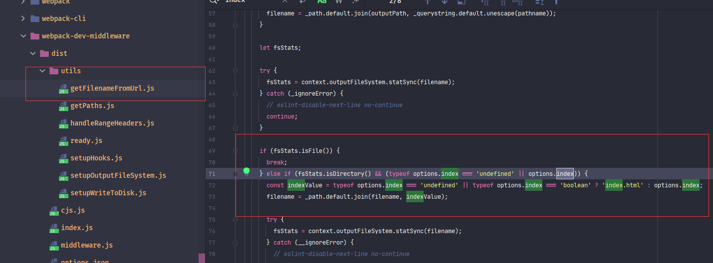

### webpack-dev-server使用

#### 什么是webpack-dev-server

在使用<font style="color:cornflowerblue">vue-cli</font> 、<font style="color:cornflowerblue">react-cli</font>脚手架时，执行`yarn start`命令会启动一个本地服务器，浏览器访问服务器就可以看到代码，并且代码文件更新后页面会自动刷新，非常方便，这样的功能就叫做<font style="color:cornflowerblue">dev-server</font>。

在<font style="color:cornflowerblue">webpack</font>中，由[webpack-dev-server](https://www.npmjs.com/package/webpack-dev-server)提供。

<font style="color:cornflowerblue">webpack-dev-server</font> 就是运行了一个服务器。浏览器访问服务器时，与浏览器使用<font style="color:cornflowerblue">WebSocket</font>进行长链接。

并且<font style="color:cornflowerblue">webpack-dev-server</font> 会开启<font style="color:cornflowerblue">webpack</font>监听本地代码文件功能。当本地代码文件更新后，进行重新打包编译，<font style="color:cornflowerblue">webpack-dev-server</font> 通过<font style="color:cornflowerblue">WebSocket</font>将更新模块信息推送给浏览器。浏览器根据此次编译信息，去获取最新代码，一个大致这样的操作。

> :whale2: <font style="color:#f03d3d">webpack</font>本身就支持监听文件变化，<font style="color:#f03d3d">webpack-dev-server</font>只是默认开启<font style="color:#f03d3d">webpack</font>的监听属性。

<font style="color:cornflowerblue">webpack-dev-server</font>库并不复杂，不过里面涉及到的东西比较多。

所以关于<font style="color:cornflowerblue">webpack-dev-server</font>库，想深入的介绍下。

在此分为两篇来介绍：

1. 介绍<font style="color:cornflowerblue">webpack-dev-server</font>属性配置，并且介绍部分属性源码设置
2. 稍微介绍<font style="color:cornflowerblue">webpack-dev-server</font>流程和原理。


#### webpack-dev-server 安装

##### webpack-cli/bin/config-yargs 的问题

截至到写此篇时，<font style="color:cornflowerblue">webpack-dev-server</font>的**最新版本**是**3.11.2**


有使用过此版本的朋友会知道，<font style="color:cornflowerblue">webpack-dev-server@3.11.2</font>与<font style="color:cornflowerblue">webpack@5.X</font>共同使用时会具有一个错误：<font style="color:red">**Cannot find module 'webpack-cli/bin/config-yargs**</font>

这个个人感觉是官方有些坑了。


先安装<font style="color:cornflowerblue">webpack-dev-server@3.11.2</font>，复现这个错误。

> yarn add -D webpack-dev-server@3.11.2


使用过<font style="color:cornflowerblue">webpack-dev-server</font>的朋友都会知道，执行<font style="color:cornflowerblue">webpack-dev-server</font>的命令为：`webpack-dev-server`

[官方NPM](https://www.npmjs.com/package/webpack-dev-server/v/3.11.2)文档中也是`webpack-dev-server`命令


一般都会将`yarn start`命令设置为：`webpack-dev-server`，

> :whale:在这里将`yarn start:dev` 命令设置为：`webpack-dev-server`。主要是为了这个错误


此时，如果不出意外的话， 执行`yarn start:dev`  就可以执行<font style="color:cornflowerblue">webpack-dev-server</font>。

但是，执行就会碰到那个错误：


错误提示是找不到<font style="color:#f03d3d">webpack-cli</font>库中的**config.yargs**模块。感觉会有不少刚学习<font style="color:cornflowerblue">webpack</font>并且搜索能力稍微弱一些的同学会卡在这很长时间。

> :whale2:  配置使用的<font style="color:cornflowerblue">webpack-cli@4.5.0</font>和<font style="color:cornflowerblue">webpack@5.24.0</font>


这个错误很简单，直接在[issues](https://github.com/webpack/webpack-dev-server/issues?q=yargs+)就可以找到答案。


原来是使用了执行命令了：`webpack serve`。现在将新命令进行配置


此时使用`yarn start`执行就可以成功执行。默认启动的是**8080端口**


那么这到底怎么回事呢？通过查看源码和测试<font style="color:cornflowerblue">webpack-dev-server@4.0.0beta.0</font>个人略有些猜测。

先看一下<font style="color:cornflowerblue">webpack-dev-server@3.11.2</font>中**/bin/webpack-dev-server.js**文件模块中一段代码。

**/bin/webpack-dev-server.js**会是使用`webpack-dev-server`命令执行的文件模块


在**/bin/webpack-dev-server.js**文件模块中加载了<font style="color:#f03d3d">webpack-cli</font>库中的**/bin/*[config/]*config-yargs**和**/bin/*[utils/]*convert-argv**。

但是在版本 代码结构进行了巨大的改变，已经去掉了这两个文件模块，所以也就导致了报错。


这个问题就是目前处于迭代期的原因。


在之前使用<font style="color:cornflowerblue">webpack@4.X</font>版本时，使用的<font style="color:cornflowerblue">webpack-cli@3.X</font>和<font style="color:cornflowerblue">webpack-dev-server@3.X</font>

现在更新到了<font style="color:cornflowerblue">webpack@5.X</font>，<font style="color:cornflowerblue">webpack-cli</font>也进行了大版本的更新：<font style="color:cornflowerblue">webpack-cli@4.X</font>。并且内部结构发生了巨大的变化。

但是<font style="color:cornflowerblue">webpack-dev-server</font>的***最新版本***并没有更新，并且对于<font style="color:cornflowerblue">webpack-dev-server@3.X</font>代码没有修复这个问题。

<font style="color:cornflowerblue">webpack-cli@4.X</font>中加入了`webpack serve`这个新命令。`webpack serve`也是以后<font style="color:cornflowerblue">webpack</font>推荐的命令。

`webpack-dev-server`这个指令问题在<font style="color:cornflowerblue">webpack-dev-server@4.X</font>中修复了。不过目前<font style="color:cornflowerblue">webpack-dev-server@4.X</font>只有一个<font style="color:cornflowerblue">webpack-dev-server@4.0.0beta.0</font>。还没有稳定版本


在<font style="color:cornflowerblue">webpack-dev-server@4.0.0beta.0</font>的[代码](https://github.com/webpack/webpack-dev-server/blob/v4.0.0-beta.0/bin/webpack-dev-server.js)可以看到**/bin/webpack-dev-server.js**文件模块中没有了上面两段代码。


在<font style="color:cornflowerblue">webpack-dev-server@4.0.0beta.0</font>文档中的命令改为了`webpack serve`。不过`webpack-dev-server`依然可以使用。


> :whale2::whale2::whale2:  <font style="color:cornflowerblue">webpack-cli@4.X</font>版本开始，<font style="color:cornflowerblue">webpack</font>团队将**dev-server**的命令改为了`webpack serve` 。<font style="color:#f03d3d">webpack</font>与<font style="color:#f03d3d">webpack-cli</font>都进行了大版本的更新。<font style="color:#f03d3d">webpack-dev-server</font>目前新版本还没有开发完成。所以暂时就出了这么一个问题


`webpack serve`命令在 <font style="color:#f03d3d">webpack-cli@4.0.0</font>版本文档中可以找到。


##### webpack serve

关于`webpack serve`命令的执行，执行入口文件与`webpack`命令一样，都是<font style="color:#f03d3d">webpack</font>库的***/bin/index.js***。在此文件模块中调用了<font style="color:#f03d3d">webpack-cli</font>库模块。

然后在<font style="color:#f03d3d">webpack-cli</font>库根据其命令参数调用<font style="color:#f03d3d">@webpack-cli</font>库中的**/serve/lib/index.js**，在此模块文件中启动webpack-dev-server</font>服务器。这些代码都是<font style="color:cornflowerblue">webpack-cli@4.X</font>版本新增加的。详细内容在下一篇介绍。


> :whale2::whale2: <font style="color:#f03d3d">webpack</font>、<font style="color:#f03d3d">webpack-cli</font>、<font style="color:#f03d3d">webpack-dev-server</font>跨库调用都是根据模块路径调用。所以只要某个库文件结构稍微改动，就会像`webpack-dev-server`命令这样直接报错。 不过在新版本代码进行了优化，通过约定名称进行跨库调用。尽可能降低了耦合度。

> :whale2: <font style="color:#f03d3d">@webpack-cli</font>是<font style="color:cornflowerblue">webpack-cli@4.X</font>依赖的一个库。


#####  webpack-dev-server@3.X 和webpack@5.X  WebSocket问题

执行`yarn start`后，会开启了一个**8080端口**的服务器。

但是<font style="color:cornflowerblue">webpack@5.X</font>和<font style="color:cornflowerblue">webpack-dev-server@3.X</font>一起使用时<font style="color:cornflowerblue">WebSocket</font>还具有问题

上面简单说过<font style="color:cornflowerblue">WebSocket</font>是与浏览器建立长链接，编译成功后，通过<font style="color:cornflowerblue">WebSocket</font>向浏览器推送信息进行改变浏览器状态。


下面来做一个测试，运行`yarn start`后，使用浏览器访问。


此时如果将代码更新，会发现浏览器并没有同步更新，并且浏览器***WS***窗口没有推送数据

> :whale2: **WS**“：<font style="color:cornflowerblue">WebSocket</font>数据显示窗口


后来我对源码进行了调试，发现根本就没有连接<font style="color:cornflowerblue">WebSocket Server</font>。

最后在[github](https://github.com/webpack/webpack-dev-server/issues/2980)中找到了答案。

原因是**package.json**文件中的**browserslist**属性，将此属性去掉进行推送。


这是<font style="color:cornflowerblue">webpack-dev-server@3.X</font>的一个问题。但是按照官方给出的解释好像只会在<font style="color:cornflowerblue">webpack-dev-server@4.X</font>中修复这个问题。


我也使用<font style="color:cornflowerblue">webpack-dev-server@4.0.0beta.0</font>版本进行了测试，这个bug被修复了。


##### 版本选择

目前<font style="color:cornflowerblue">webpack@5.X</font>稳定版才4个月，并且<font style="color:cornflowerblue">webpack-dev-server</font>还没有对应新版本的稳定版。所以<font style="color:cornflowerblue">webpack@5.X</font>还只能供学习使用。


在此直接使用<font style="color:#f03d3d">webpack@5.24.0</font>+<font style="color:#f03d3d">webpack-cli@4.5.0</font>+<font style="color:#f03d3d">webpack-dev-server@4.0.0beta.0</font>版进行学习。


<font style="color:#f03d3d">webpack-dev-server@4.0.0beta.0</font> 属性配置相对<font style="color:cornflowerblue">webpack-dev-server@3.X</font>稍微有些变动，在此也会稍微提一提<font style="color:#f03d3d">webpack-dev-server@4.0.0beta.0</font>与<font style="color:cornflowerblue">webpack-dev-server@3.X</font>属性对应关系和差异性。

> yarn add -D webpack-dev-server@4.0.0beta.0

> :whale2::whale2: <font style="color:#f03d3d">webpack-dev-server@4.0.0beta.0</font> 提供了比较完善的错误提示，当设置了错误属性时，<font style="color:#f03d3d">webpack-dev-server@4.0.0beta.0</font>能够给出详细提示信息。


#### webpack-dev-server配置

<font style="color:cornflowerblue">webpack-dev-server</font>配置属性是设置在<font style="color:cornflowerblue">webpack</font>配置文件中的**devServer**属性。<font style="color:cornflowerblue">webpack-dev-server</font>执行时会读取这个属性来做配置。

由于<font style="color:cornflowerblue">webpack-dev-server</font>是只在开发时使用的一个服务，所以配置属性写在**webpack.dev.js**文件中

```js
const path = require('path');
const { merge } = require('webpack-merge');
const { config } = require('./config');
const common = require('./webpack.common');
//  使用node.js的导出，将配置进行导出
module.exports = merge([
  common(true),
  {
    mode: 'development',
      
    devServer:{

      //  服务器host，默认为localhost，
      host: '127.0.0.1',

      //  服务器端口号，
      //  默认为8080
      port: 7777,

      //  string | boolean
      //  启动后是否打开浏览器
      //  默认为false，如果设置为true， 启动时会自动打开浏览器
      //  当为字符串时，打开指定浏览器
      open: true, // 'chrome'

      // 打开浏览器后默认打开的页面
      //  string | Array<string>
      //  当设置为Array时，会打开多个页面
      openPage: '', // ['', 'index.html'], //'index.html',

      //  是否启用gzip压缩,
      //  默认为false
      compress: true,

      //  是否启动热更新（HMR）
      //  默认为false，
      //  热更新使用的是webpack中HotModuleReplacementPlugin
      hot: true,

      //  设置允许访问的IP地址，设置为true，则不允许任何IP访问，
      //  也可以设置为数组，与webpack-devser@3.X 的allowedHosts一样
      //  此属性相当于webpack-devser@3.X 的allowedHosts属性
      firewall: true,

      //  是否设置HTTP/2服务器。
      //  对于nodeV10以上的版本  由于spdy有问题
      //  所以如果将此属性设置为true，则默认使用https作为服务
      http2: false,

      // // 是否使用https安全连接
      // //  boolean 或者 object
      // // 当为object时，可以设置安全证书
      // //  默认为false，但是当开启http2属性时，会默认使用https    默认情况下， dev-server使用HTTPS为HTTP/2提供服务
      // https: {
      //   //  证书，证书属性也可以设置在devServer下，当https设置为boolean时， 与https同级设置
      //   key: '',//fs.readFileSync('/path/to/server.key'),
      //   cert: '',//fs.readFileSync('/path/to/server.crt'),
      //   ca: '',//fs.readFileSync('/path/to/ca.pem'),
      // },


      //  服务器代理配置，当前后端分离开发时，前端请求API需要指定地址
      //  此属性可以设置代理的IP地址
      //  例如如下，当api请求  /api/user真实地址为http://localhost:3000/user
      //  详情使用请参考官网https://webpack.js.org/configuration/dev-server/#devserverproxy
      proxy: {
        '/api':{
          target: 'http://localhost:3000',
          //  pathRewrite属性可以设置前缀，如果不设置pathRewrite： /api/user真实地址为http://localhost:3000/api/user
          pathRewrite: {'^/api' : ''},
          //  HTTPS设置为无效证书
          // secure: false
        }
      },

     //  服务器返回时加入的response的自定义header
      headers: {
        'X-Custom-Foo': 'bar'
      },

      //  静态文件属性
      //  此属性是对webpack-devser@3.X某些属性的汇总
      static: {
        //  要挂载在服务器上静态文件的本地目录
        //  默认为为当前工作目录
        //  建议使用绝对地址
        //  例如设置为 /assets后， 会加载使用本地/assets目录下的静态文件到服务器
        //   相当于webpack-dev-server@3.X的 contentBase属性
        directory: path.join(config.root),

        //    挂载到服务器中间件的可访问虚拟地址
        //    例如设置为/static，在访问服务器静态文件时，就需要使用/static前缀
        //   相当于webpack-dev-server@3.X的 contentBasePublicPath属性
        publicPath: '/',

        //   设置挂在静态文件时使用的参数
        //   相当于webpack-dev-server@3.X的 staticOptions属性
        staticOptions: undefined,

        //  是否加入serve-index中间件，默认为true
        //   相当于webpack-dev-server@3.X的  //  是否可以在浏览器访问静态文件列表。
        //  默认为true，webpack-dev-server使用的是serve-index中间件实现这一功能
        //   相当于webpack-dev-server@3.X的 serveIndex属性
        serveIndex: true,

        //  是否使用chokidar库进行监听文帝静态文件变化。
        //  webpack使用的是文件系统的的变化通知，但是有时候可能会不管用，例如使用网络文件系统
        //  所以可以设置属性使用chokidar库进行轮询检测文件变化。
        //  此属性可以设置为boolean类型也可以设置为对象类型指定轮询时间(毫秒数）
        //   相当于webpack-dev-server@3.X的 watchOptions属性
        watch: {
          poll: 3000
        },
      },

     //  设置WebSocket客户端的一些属性
      client: {
          
        //  推送客户端日志级别，
        //  属性具有 "none" | "error" | "warn" | "info" | "log" | "verbose"
        //  例如设置error ，WS并不是推送打包警告和消息， WS客户端会将日志打印在控制台上
        //  如果设置为none， 就算打包失败也不会有消息
        //   相当于webpack-dev-server@3.X的 clientLogLevel属性
        logging: 'verbose',
          
        //   是否在浏览器控制台打印打包进度，
        //   相当于webpack-dev-server@3.X的 progress属性
        progress: true,

        //  相当于webpack-dev-server@3.X的 sockPath属性
        // path: '',
        //  相当于webpack-dev-server@3.X的 sockHost属性
        // host: '',
        //  相当于webpack-dev-server@3.X的 sockPort属性
        // port: '',
      },


       public: undefined,


      // webpack-dev-middleware中间件使用的属性
      dev:{

        //  设置服务器response加入的自定义header信息
        //  此属性在webpack-dev-middleware中间件使用
        headers:{
          //  响应头添加数据
          'X-Dev-Header': 'X-Dev-Header',
          serverSideRender: false,
        },

        //   设置webpack-dev-middleware中间件的mimeTypes
        //   相当于webpack-dev-server@3.X的 mimeTypes属性
        //   相当于webpack-dev-server@3.X的 mimeTypes属性
        mimeTypes:{

        },

        //  是否将打包结果写入到磁盘之中
        //  默认为false
        //   相当于webpack-dev-server@3.X的 writeToDisk属性
        writeToDisk: true,

        // 设置打包文件存储的目录地址。此属性由webpack-dev-middleware设置
        //  例如当设置为/public,那么访问服务器所有信息都需要加入/public前缀
        //   相当于webpack-dev-server@3.X的 publicPath属性
        publicPath: '/',

        //  设置根目录所指向的页面。
        //  例如localhost:8080可以直接访问到index.html是因为默认值为index.html
        //  默认值也是index.html
        //  相当于webpack-dev-server@3.X的 index属性
        index: 'index.html',

        //  none" | "summary" | "errors-only" | "errors-warnings" | "minimal" | "normal" | "detailed" | "verbose" | boolean | object { … }
        //   设置打包文件日志输出级别，会输出在服务器终端
        //   相当于webpack-dev-server@3.X的 stats属性
        stats: 'minimal',

        //  自定义打包文件的输出流
        //  默认情况下，输入流为memory
        outputFileSystem: undefined,


        methods: undefined,

        serverSideRender: undefined

      },


      //  设置编译出错或警告后，页面是否会直接显示信息， boolean | {}
      //  默认为false，当失败后会显示空白页
      //  设置为true后，编译失败会显示错误/警告的覆盖层,也可以设置为object，显示多种类型信息
      overlay: {
        warning:true,
        errors: true
      },

      // 是否要注入WebSocket客户端。也就是是否要进行长链接通讯
      // boolean | function (compilerConfig) => boolean
      //  将此属性设置为false，那么hot、overlay等功能都会失效
      //  默认为true，  有兴趣的诸君可以设置为false测试一下
      injectClient: true,

      //  是否注入HMR， 这个属性是injectClient的子集。只影响热更新
      injectHot: true,

      liveReload: false,

      //  是否开启ZeroConf网络
      bonjour: false,
      
      //  是否将所有404页面都跳转到index.html
      //  boolean | object
      //  当此属性设置为true或为object时并且使用HTML5 API时 所有404页面会跳转到index.html
      //  使用的connect-history-api-fallback库 设置为对象，则会将此对象传参给connect-history-api-fallback库
      historyApiFallback: false,
        
      //  是否使用局域网IP打开页面
      useLocalIp: false,
     
      //  是否监听node中stdin.end事件， 关闭服务器
      stdin: false,

      //  终止信号，设置为true时 监听['SIGINT', 'SIGTERM'];事件，事件触发后结束进程
      //  目前dev-server强制将此属性设置为true了，所以改为false不管用。
      setupExitSignals: true,

      //  设置WebSocket
      //  可以设置使用的WebSocket库。内置的库为sockjs和ws
      //  还可以自定义设置WebSocket Server和WebSocket Client
      transportMode:{
        //  设置使用的WebSocket， 值为 sockjs或者ws
        //  sockjs 使用的sockjs库
        //  ws 使用的ws库
        //  webpack-dev-server@4.X使用的是WS  webpack-dev-server@3.X 使用的是sockjs
        //  目前在webpack-dev-server@4.X使用sockjs会出错， webpack-dev-server@3.X使用WS也会报错
         server: 'ws'
      },

      //  自定义中间件钩子属性
      //  优先于server内部中间件执行
      //  相当于webpack-devser@3.X 的before函数
      onBeforeSetupMiddleware: (app, server, compiler) =>{
        //console.log('我是before', compiler.options)
      },

      //  server内部执行完所有中间件后执行当前中间件
      //  相当于webpack-devser@3.X 的after函数
      onAfterSetupMiddleware: (app, server, compiler) =>{
      },

      //  dev-server提供的当服务器启动后执行的钩子函数
      onListening: (server) => {
        // const port = server.listeningApp.address().port;
        // console.log('Listening on port:', port);
      },
    },

  }
])
```

> * **host**：服务器启动使用的host地址
>
>   属性可设置为：*String*
>
>   默认值：***localhost***
>
>
> * **host**：服务器启动使用的host地址
>
>   属性可设置为：*String*
>
>   默认值：***localhost***
>
> 
>
> * **port**：服务器启动使用的端口号
>
>   属性可设置为：*Number*
>
>   默认值：***8080***
>
> 
>
> * **open**：启动服务器后是否自动打开浏览器，
>
>   属性可设置为：*String*、*Boolean*
>
>   属性值为***Boolean***：是否打开默认浏览器
>
>   属性值为***String***：设置打开指定的浏览器，例如：***chrome***
>
>   默认值：***false***
>
> * **openPage**：自动打开浏览器时的路由地址。
>
>   属性可设置为：*String*、*Array*
>
>   属性值为***String***：打开指定的地址
>
>   属性值为***Array***：打开数组中的所有地址。
>
>   默认值：***index.html***
>
> 
>
> * **compress**：是否启动gzip压缩数据。
>
>   使用的<font style="color:cornflowerblue">compression</font>中间件进行压缩。
>
>   默认值：***false***
>
> 
>
> * **hot**：是否启动<font style="color:cornflowerblue">热更新（HMR）</font>。
>
>   <font style="color:cornflowerblue">热更新（HMR）</font>技术是代码更新后，浏览器只加载需要更新的数据。<font style="color:cornflowerblue">热更新（HMR）</font>属性是必备属性之一。
>
>   <font style="color:cornflowerblue">热更新（HMR）</font>真正执行的是<font style="color:cornflowerblue">webpack</font>中<font style="color:#f03d3d">HotModuleReplacementPlugin</font>
>
>   默认值：***false***
>
> 
>
> * **firewall**：是否启用防火墙
>
>   属性可设置为：*Boolean*、*Array*
>
>   属性值为***Boolean***：是否启用防火墙，为***true***，则不允许其它任意主机访问；为***false***，则允许其它主机访问
>
>   属性值为***Array***：设置可以访问的IP地址。 相当于 **webpack-dev-server@3.X**中**allowedHosts**
>
>   默认值：***true***
>
>   > :whale2: 此属性就是<font style="color:cornflowerblue">webpack-dev-server@3.X</font>的**allowedHosts**属性
>
> 
>
> * **https**：是否使用HTTPS安全连接方式。
>
>   属性可设置为：*Boolean*、*Object*
>
>   属性值为***Boolean***：是否使用HTTPS连接方式
>
>   属性值为***Object***：设置HTTPS安全证书信息
>
>   默认值：***false***
>
> 
>
> * **http2**：是否使用HTTP/2
>
>   当此属性设置为***true***时，默认会使用HTTPS安全连接方式。也就是**https**会设置为***true***
>
>   默认值：***false***。
>
> 
>
> * **proxy**：服务器代理配置。
>
>   前后端分离时，前端请求API需要指定地址，此属性可以配置IP地址，当访问指定请求时就请求配置的IP地址。
>
>   例如在请求**/api**的接口时会访问http://localhost:3000。具体可参考官网：[devserverproxy](https://webpack.js.org/configuration/dev-server/#devserverproxy)。
>
>   当然也可以不使用此属性，直接使用一个静态字符串或者配置文件。看个人编码习惯
>
> 
>
> * **headers**：设置服务器Response消息内自定义header信息。
>
>   属性可设置为：*Object*
>
>   默认值：***null***
>
> 
>
> * **static**：对静态文件属性的一些配置
>
>   属性可设置为：*Object*、*Array*
>
>   属性值为***Object***：配置静态文件属性
>
>   属性值为***Array***：配置多个静态文件属性
>
>   <font style="color:cornflowerblue">webpack-dev-server@3.X</font>不具有此属性。此属性只是将<font style="color:cornflowerblue">webpack-dev-server@3.X</font>中关于静态文件配置的属性进行汇总封装
>
>   - **directory**：设置服务器挂在静态文件的***本地目录***。
>
>     例如设置为***/assets***后， 会加载使用本地**/assets**目录下的静态文件到服务器
>
>     属性可设置为：*String*
>
>     默认值：***/***      **package.json**文件所在地址。
>
>     > :whale2: 此属性就是<font style="color:cornflowerblue">webpack-dev-server@3.X</font>的**contentBase**属性
>     
>   - **publicPath**：静态文件挂载到服务器中的***虚拟地址***，
>   
>     例如设置为***/static***后， 那么使用静态文件时必须加入**/static**前缀
>   
>     属性可设置为：*String*
>   
>     默认值：***/***      
>   
>     > :whale2: 此属性就是<font style="color:cornflowerblue">webpack-dev-server@3.X</font>的**contentBasePublicPath**属性
>   
>   - **staticOptions**：服务器挂载静态文件时使用到的参数
>   
>     <font style="color:cornflowerblue">webpack-dev-server</font>挂在静态文件使用的是***express.static(directory,staticOptions)***中间件，此属性进行**express.static(directory,staticOptions)**使用的参数，具体请参考[express框架](http://expressjs.com/en/4x/api.html#express.static)
>   
>     属性可设置为：*Object*
>   
>   - **serveIndex**： 是否可以在浏览器访问静态文件列表。
>   
>     <font style="color:cornflowerblue">webpack-dev-server</font>使用的是[serve-index](https://www.npmjs.com/package/serve-index)库作为浏览器访问静态文件功能。
>   
>     属性可设置为：*Boolean*
>   
>     默认值：***true***
>   
>     > :whale2: 此属性就是<font style="color:cornflowerblue">webpack-dev-server@3.X</font>的**serveIndex**属性
>   
>   - **watch**：是否使用轮询方式检查文件变化。
>   
>     <font style="color:cornflowerblue">webpack</font>默认使用的是文件系统的变化通知。但是在特殊情况下（例如网络文件系统）时消息通知会失效
>   
>     所以可以使用轮询方式进行检查文件变化。使用的[chokidar](https://www.npmjs.com/package/chokidar)来做轮询检测
>   
>     属性可设置为：*Boolean*、*Object*
>   
>     属性值为***Boolean***：是否开启轮询检测
>   
>     属性值为***Object***：配置轮询参数，例如配置轮询时间等
>   
>     默认值：***false***
>   
>     > :whale2: 此属性就是<font style="color:cornflowerblue">webpack-dev-server@3.X</font>的**watchOptions**属性   
>   
>     
>
>   * **client**：<font style="color:cornflowerblue">WebSocket</font>客户端属性设置。
>
>     属性可设置为：*Object*
>
>     <font style="color:cornflowerblue">webpack-dev-server@3.X</font>不具有此属性。此属性只是将<font style="color:cornflowerblue">webpack-dev-server@3.X</font>中关于<font style="color:cornflowerblue">WebSocket</font>客户端配置属性的汇总封装
>
>     - **logging**：<font style="color:cornflowerblue">WebSocket</font>客户端在浏览器控制台中输出日志级别。
>
>       属性可设置为：*"none" | "error" | "warn" | "info" | "log" | "verbose"*
>
>       默认值：***info***
>
>       例如设置为***verbose*** 便会将所有日志输出在浏览器控制台；***none***则不会输出任何日志
>
>       > :whale2:此属性就是<font style="color:cornflowerblue">webpack-dev-server@3.X</font>的**clientLogLevel**属性 
>     
>     - **progress**：是否将打包进度输出在浏览器控制台中（浏览器控制台是否显示打包进度）
>     
>       属性可设置为：*Boolean*
>     
>       默认值：***false***
>     
>       > :whale2:此属性就是<font style="color:cornflowerblue">webpack-dev-server@3.X</font>的**progress**属性 
>
> 
>
>   * **dev**：设置<font style="color:cornflowerblue">webpack-dev-middleware</font>中间件使用的一些配置属性。
>
>       属性可设置为：*Object*
>
>       <font style="color:cornflowerblue">webpack-dev-server@3.X</font>不具有此属性。此属性只是将<font style="color:cornflowerblue">webpack-dev-server@3.X</font>中关于<font style="color:cornflowerblue">webpack-dev-middleware</font>使用属性的汇总封装
>
>     - **headers**：设置服务器Response消息内自定义header信息。
>
>       <font style="color:cornflowerblue">webpack-dev-server@3.X</font> 中**devServer.headers**在两个地方使用到了。而<font style="color:cornflowerblue">webpack-dev-server@4.X</font>进行了拆分，此属性只负责<font style="color:cornflowerblue">webpack-dev-middleware</font>中间件。只不过最后结果都一致。
>
>       属性可设置为：*Object*
>
>     - **mimeTypes**：设置<font style="color:cornflowerblue">webpack-dev-middleware</font> mimeTypes属性，具体请参考[webpack-dev-middleware文档](https://github.com/webpack/webpack-dev-middleware#mimetypes) 。
>
>       > :whale2:此属性就是<font style="color:cornflowerblue">webpack-dev-server@3.X</font>的 **mimeTypes**属性 
>
>     - **writeToDisk**：是否将打包编译文件写入磁盘
>
>        <font style="color:cornflowerblue">webpack-dev-middleware</font>默认会将打包编译文件写入到内存流，以达到更快的访问速度。 
>     
>       属性可设置为：*Boolean*
>     
>       默认值：***false***
>     
>       > :whale2:此属性就是<font style="color:cornflowerblue">webpack-dev-server@3.X</font>的**writeToDisk**属性 
>     
>     - **publicPath**：设置打包编译文件存放的目录地址
>     
>       例如设置为***/public***，那么在访问打包编译生成的文件资源时都需要添加**/public**前缀
>     
>       属性可设置为：*String*
>       
>       默认值：***/***
>       
>       > :whale2::whale2: **static.publicPath**和**dev.publicPath**属性设置不一样， **static.publicPath** 
>       >
>       > **static.publicPath** 代表静态文件在服务器中存储的地址，代码使用静态文件时需要添加目录前缀
>       >
>       > **dev.publicPath**  代表将代码编译打包的目录地址，浏览器访问时需要添加目录前缀
>       
>       > :whale2: 此属性就是的**publicPath**属性 
>       
>     - **index**：根目录所指向的文件。
>     
>       此属性就是能够在浏览器访问根目录指向**index.html**的原因。 
>     
>       属性可设置为：*String*
>     
>       默认值：***index.html***
>     
>       > :whale2: 此属性就是<font style="color:cornflowerblue">webpack-dev-server@3.X</font>的**index**属性
>     
>     - **stats**：设置打包文件时日志输出级别。
>     
>       启动<font style="color:cornflowerblue">dev-server</font>时会在控制台中看到好多打包信息：文件大小、文件名称等信息，就是使用此属性进行控制。
>     
>       属性可设置为：*“none" | "summary" | "errors-only" | "errors-warnings" | "minimal" | "normal" | "detailed" | "verbose" | boolean | object { … }*
>     
>       默认值：***normal***
>     
>       > :whale2: 此属性就是<font style="color:cornflowerblue">webpack-dev-server@3.X</font>的**stats**属性 
>     
>     - **outputFileSystem**：控制打包文件的输出流。
>     
>       默认输出流是内存流，之将文件编译打包至内存中，此属性可以更改输出流。 
>
> 
>
>  * **overlay**：打包编译时出现错误/警告时，是否直接显示在页面。
>
>    此属性在<font style="color:cornflowerblue">webpack-dev-server@4.0.0beta.0</font>具有bug。
>
>    属性可设置为：*Boolean*、*Object*
>
>    属性值为***Boolean***：为***false***时不显示；为***true***时，当编译出现错误时，显示在页面中
>
>    属性值为***Object***：自定义配置警告和错误状态。
>
> 
>
>  * **injectClient**：是否注入<font style="color:cornflowerblue">WebSocket</font>
>
>    属性可设置为：*Boolean*、*function (compilerConfig) => boolean*
>
>    默认值：***true***
>
>    
>
>  * **injectHot**：是否注入<font style="color:cornflowerblue">热更新（HMR）</font>。
>
>    此属性是相当于**injectClient**属性的一个子集，只控制<font style="color:cornflowerblue">热更新（HMR）</font>
>    
>    属性可设置为：*Boolean*、*function (compilerConfig) => boolean*
>    
>    默认值：***true***
>    
>    > :whale2::whale2: 此属性在<font style="color:cornflowerblue">webpack-dev-server@4.0.0beta.0</font>源码中还可以设置***only***字符串，也就是<font style="color:cornflowerblue">webpack-dev-server@3.X</font> 中的**hotOnly**属性。但是属性校验中只允许设置**Boolean**。
>
> 
>
> * **liveReload**：
>
> 
>
> * **bonjour**：是否开启<font style="color:cornflowerblue">Zeroconf</font>网络
>
>   关于<font style="color:cornflowerblue">Zeroconf</font>，有兴趣的朋友可以查看相关文档
>
>   属性可设置为：*boolean* 
>
>   默认值：***false***
>
> 
>
> * **historyApiFallback**：是否将所有404页面指向**index.html**
>
>   此属性使用了[connect-history-api-fallback](https://www.npmjs.com/package/connect-history-api-fallback)来处理404页面
>
>   属性可设置为：*Boolean*、*Object*
>
>   属性值为***Boolean***：是否启用此功能
>
>   属性值为***Object***：设置<font style="color:#f03d3d">connect-history-api-fallback</font>库的参数
>
>   默认值：***false***
>
> * **useLocalIp**：是否使用本地局域网启用服务器
>
>   属性可设置为：*Boolean*
>
>   默认值：***false***
>
>   
>
> * **stdin**：是否监听<font style="color:cornflowerblue">Node.js</font>中**stdin.end**事件关闭服务器
>
>   属性可设置为：*Boolean*
>
>   默认值：***false***
>
> 
>
> * **setupExitSignals**：是否监听<font style="color:cornflowerblue">Node.js</font>中的**['SIGINT', 'SIGTERM']**事件关闭服务器。
>
>   此属性为<font style="color:cornflowerblue">webpack-dev-server@4.0.0beta.0</font>新增加，在<font style="color:cornflowerblue">webpack-dev-server@4.0.0beta.0</font>版本测试，此属性内置了***true***属性，无法更改
>
> 
>
> * **transportMode**：设置<font style="color:cornflowerblue">WebSocket</font>库信息。
>
>      <font style="color:cornflowerblue">webpack-dev-server</font>内置了两个<font style="color:cornflowerblue">WebSocket</font>库：[ws](https://www.npmjs.com/package/ws)、[sockjs](https://www.npmjs.com/package/sockjs)。可以进行使用，并且可以自定义<font style="color:cornflowerblue">WebSocket Server</font>和<font style="color:cornflowerblue">WebSocket Client</font>。具体请参考[官网](https://webpack.js.org/configuration/dev-server/#devservertransportmode)
>
>     > :whale2: 
>     >
>     > <font style="color:cornflowerblue">webpack-dev-server@4.0.0beta.0</font>默认使用：<font style="color:#f03d3d">ws</font>
>     >
>     > <font style="color:cornflowerblue">webpack-dev-server@3.X</font>默认使用：<font style="color:#f03d3d">sockjs</font>
>
> 
>
>   * **onBeforeSetupMiddleware**：自定义钩子中间件函数，此中间件会优先其它中间件执行。
>
>     > :whale2:此属性就是<font style="color:cornflowerblue">webpack-dev-server@3.X</font>的**before**属性 
>
> 
>
>   * **onAfterSetupMiddleware**：自定义钩子中间件函数，此中间件会在所有中间件之后执行。
>
>     > :whale2:此属性就是<font style="color:cornflowerblue">webpack-dev-server@3.X</font>的**after**属性 
>
> 
>
>   * **onListening**：设置<font style="color:cornflowerblue">webpack-dev-server</font>服务器启动后执行的钩子函数。


以上便是<font style="color:#f03d3d">webpack-dev-server@4.0.0beta.0</font>中部分配置属性。

相对于<font style="color:cornflowerblue">webpack-dev-server@3.X</font>，<font style="color:#f03d3d">webpack-dev-server@4.0.0beta.0</font>版本对配置属性做了更好的整合。

一般情况下只需要配置主要属性即可。


##### host / port

这两个属性很好理解，就是设置服务器IP地址和端口号。<font style="color:#f03d3d">webpack-dev-server</font>是使用的[express](https://www.npmjs.com/package/express)库。在<font style="color:#f03d3d">webpack-dev-server</font>库中**lib**目录具有一个**Server.js**，这个文件就是启动服务器的文件。

**Server.js**具有一个函数，这个函数就是监听启动服务器的


而调用这个函数则是在<font style="color:#f03d3d">@webpack-cli</font>库的**serve/lib/startDevServer.js**。


可以看到使用了**options.port**和**options.host**两个属性值。这两个属性值就是`webpack.devServer`中是属性。


至于默认8080端口号就是在**findPort**函数设置的


> :whale2::whale2:源码是基于<font style="color:#f03d3d">webpack-dev-server@4.0.0beta.0</font>。**webpack-dev-server@3.X**中没有<font style="color:#f03d3d">@webpack-cli</font>库。


##### open、 openPath

这两个属性是在服务器启动时判断是否启动浏览器，代码执行在**Server.listen**中调用的**showStatus**函数中。最后**/lib/util/runOpen.js**中启动浏览器


可以看到，这两个参数做了类型判断。`open`支持配置字符串打开指定浏览器。`openPath`可以配置为数组打开多个页签。最后使用了[open](https://www.npmjs.com/package/open)库来打开浏览器


##### hot

在**Server.js**中启动服务以后，如果具有设置`hot`则会去创建**WebSocket**链接，具体hot流程在下一篇介绍


##### static

**static**属性在上面说了，是设置静态文件的一系列属性的封装，有静态文件的访问路径、文件监听等。


###### directory、publicPath、staticOptions

这三个属性是**express服务器**设置静态文件使用的属性。在**Server.js**中**setupStaticFeature**函数中


可以看到，**express服务器**挂载了**静态文件中间件（express.static）**其访问目录为***publicPath***。而要挂载本地静态文件目录为***directory***。

***staticOptions***则是其挂载时的参数


例如，如果将`directory`设置为 ***path.join(config.root, 'assets')***，`publicPath`设置为***'/static'***，那么在访问**assets/images/yj.png**时就应该是**static/images/yj.png**


> :whale2::whale2: 在设置`publicPath`和`directory`时，要注意设置好目录地址，在build时依然能找到静态文件。
>
> 
>
> :whale2: 源码中`static`和`publicPath`都是数组形式。所以可以配置多个
>
> 
>
> :whale2: 在此只是以图片做一个例子，还并不涉及到文件的打包。


###### serveIndex

这个属性是设置能否在浏览器中查看静态文件，使用的是[serve-index](https://www.npmjs.com/package/serve-index)库


来做一个测试,将此属性设置为***false***，然后在浏览器查看静态文件路径，会发现直接报404。


但是如果将`serveIndex`设置为***true***，就可以访问到静态文件


##### dev

这个属性是对打包解决存储操作的一系列属性的封装。dev-server内部使用了<font style="color:#f03d3d">webpack-dev-middleware</font>处理这个操作。所以`dev`中大部分属性都是<font style="color:#f03d3d">webpack-dev-middleware</font>使用的。

###### index

这个属性是是控制默认指向的文件名称。代码在<font style="color:#f03d3d">webpack-dev-middleware</font>库中**/dist/utils/getFilenameFromUrl.js**



可以看到，`index`属性类型判断为 **string | boolean**。并且默认值为**index.html**，此属性可以进行更改，例如改为**i.index**


但是如果还想默认打开那么就必须更改<font style="color:#f03d3d">html-webpack-plugin</font>中的`filename`。所以它们这些库都是约定为**index.html**，以能够以极少配置便可以运行。


> :whale2::whale2::whale2: 约定大于配置，写代码时尽可能使用统一的约定规范，这样可以能达到最简易化。


###### stats

这个属性是控制文件打包统计的，在允许`start`之后，总是在控制台能看到好多信息，这个属性就控制此信息输出的。


打印源码是在<font style="color:#f03d3d">webpack-dev-middleware</font>库中**/dist/utils/setupHook.js**中。 代码中***stats***是内部的状态对象，而***statsOptions***才是配置信息。


如果将`stats`改为***errors-only***，那么控制台就会干净很多，只有在代码打包错误时才打印，如果改为***none***，那么错误也不会打印。有兴趣的诸君可以自行测试.


##### overlay

此属性是代码编译错误时是否在页面上显示错误信息，由**WebSocket**推送消息，属性在<font style="color:#f03d3d">webpack-dev-server@4.0.0beta.0</font>版本有bug，在**Server.js**源码中使用的是`clientOverlay`，但是配置参数没有这个参数，应该是测试版遗漏了。所以在测试时只能改动一下源码，将`clientOverlay`改为`overlay`


然后将`overlay`设置为true后，如果编译错误，那么页面会直接显示错误信息，这个功能我个人感觉还挺好用。可能有些人更喜欢使用控制台看错误信息，`dev.stats`属性值。


##### historyApiFallback	

这个属性有点意思，在使用HTML5 API时将所有无效路由（404）都跳转到指定页面。跟写项目中将所有无效路由（404）到转到404页面一样。内部使用的是[connect-history-api-fallback](https://www.npmjs.com/package/connect-history-api-fallback)中间件，默认约定的是**index.html**。


### 总结

> :whale2::whale2::whale2:
>
> 1. **dev-server**是为了方便开发而设计出了一种模式， 主要是利用浏览器和长链接推送来交互
> 2. **webpack-cli@4.X**更改目录结构和**webpack-dev-server**命令。导致与**webpack-dev-server@3.X**使用老命令会错误。
> 3. **webpack-dev-server@4.0.0-bata.0**具有还不少的bug。
> 4. **webpack-dev-server@4.0.0-bata.0**对`devServer`属性做了更好的汇总。
> 5. 约定大于配置。


### 本文参考

* [webpack官网](https://webpack.js.org/configuration/dev-server/)
* [webpack-dev-server](https://www.npmjs.com/package/webpack-dev-server)
* [webpack-cli](https://www.npmjs.com/package/webpack-cli)


### 本文依赖

* [webpack-dev-server@4.0.0-beta.0](https://www.npmjs.com/package/webpack-dev-server/v/4.0.0-beta.0)
* [webpack-dev-server@3.11.2](https://www.npmjs.com/package/webpack-dev-server/v/3.11.2)


### package.json

```js
{
  "name": "my-cli",
  "version": "1.0.0",
  "main": "index.js",
  "author": "mowenjinzhao<yanzhangshuai@126.com>",
  "license": "MIT",
  "devDependencies": {
    "@babel/core": "7.12.10",
    "@babel/plugin-transform-runtime": "7.12.10",
    "@babel/preset-env": "7.12.11",
    "@babel/preset-react": "7.12.10",
    "@babel/runtime-corejs3": "7.12.5",
    "babel-loader": "8.2.2",
    "clean-webpack-plugin": "3.0.0",
    "css-loader": "5.0.1",
    "html-webpack-plugin": "4.5.0",
    "style-loader": "2.0.0",
    "terser-webpack-plugin": "5.1.1",
    "webpack": "5.14.0",
    "webpack-cli": "4.4.0",
    "webpack-dev-server": "4.0.0-beta.0",
    "webpack-merge": "5.7.3"
  },
  "dependencies": {
    "core-js": "3.8.1",
    "react": "17.0.1",
    "react-dom": "^17.0.1",
    "regenerator-runtime": "0.13.7"
  },
  "scripts": {
    "start:dev": "webpack-dev-server  --config build/webpack.dev.js",
    "start": "webpack serve  --config build/webpack.dev.js",
    "build": "webpack  --config build/webpack.pro.js",
  }
}

```

