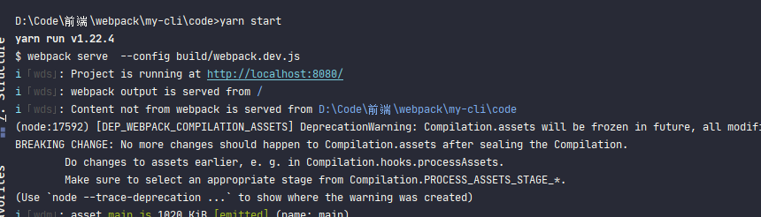

### webpack-dev-server使用

#### 什么是webpack-dev-server

在使用**vue-cli**或者**react-cli**这类脚手架时，使用**yarn start**命令会开启一个小型服务器，浏览器访问这个端口就可以浏览编写的代码，在更新代码后页面更是会自动刷新页面。整个一套操作下来特别方便。

这些功能是为了方便开发，毕竟开发时如果像之前那样：更新一点代码->重新打包->主动刷新浏览器。整个流程会特别的繁琐

所以为了方便开发，便会提供一个这样的开发环境专用库。让开发时更新简单。

在webpack中，这样的库就是由**webpack官方**提供的webpack-dev-server。这个库也就是实现 启动服务器、更新主动刷新浏览器等功能

webpack-dev-server这个库在下想深入讲解，所以分成两篇来进行：第一篇讲解webpack-dev-server使用配置，第二篇稍微讲解一些流程与其原理。

诸君请接着往下看

#### webpack-dev-server 安装

截止到目前 - **2021-01-29**。 webpack-dev-server的**最新版本**提供还是让人很迷。

在**NPM**上，最新的包为***wepack-dev-server@3.11.2***

> :whale2::whale2: **最新版本** 为不指定版本时下载的库

但是，如果如果直接以目前的配置使用这个包会有问题。先来看一下这个问题。

> yarn add -D webpack-dev-server@3.11.2

然后将`yarn start` 命令改为 `webpack-dev-server`

> :whale2: `webpack-dev-server` 是执行webpack-dev-server库的命令，就像`webpack` 命令是执行webpack库一样。

按照正常情况下，此时执行`yarn start` 就会跟使用**vue-cli**那样。

但是实际上并不是

可以看到在执行时直接报错了。提示找不到webpack-cli库中的**config.yargs**模块

这是由于 webpack-cli和webpack-dev-server版本不兼容问题。

webpack-cli库在这里使用的是**@4.4.0**，也是目前**最新版本**

在webpack-cli@4.X中，代码结构进行大变更了。在**bin**目录下只有一个**cli**模块，所以就会直接报错。

在webpack-cli@3.X是有**config.yargs**模块的。所以webpack-dev-server@3.X对应使用webpack-cli@3.X

所以在这里有两种解决方案**。**

##### 降低webpack-cli版本

将webpack-cli版本降到**@3.X**，最新的webpack-cli@3.X为**@3.3.12**

> yarn add -D webpack-cli@3.3.12
>
> yarn add -D webpack-dev-server@3.11.2

可以看到在webpack-cli库中具有了**config.yargs**模块，此时执行命令就可以成功运行

##### 升级webpack-dev-server版本

webpack-dev-server这个库提供了一个**@4.X-beta**版，使用这个版本的webpack-dev-server也可以进行。

> yarn add -D webpack-cli@4.4.0
>
> yarn add -D webpack-dev-server@4.0.0-beta.0

所以在下对webpack-dev-server和webpack-cli**最新版本**  感觉很恶心。很多人下载库时都会使用默认最版本库。尤其是对于学习的新人来说。

而这一手会让很多学习**webpack**的人直接卡在这一步无法进行。

#### webpack-dev-server@4.X命令

在webpack-dev-server@4.0.0-beta.0文档中提到了一个全新的执行命令:`webpack serve`，目前预览版还支持`webpack-dev-server`命令

##### 选择webpack-dev-server版本

目前webpack-dev-server@4.X还只是一个***beta***版本，所以对于真实项目需要慎重考虑，但是对于个人学习，使用***beta***版本也无伤大雅。

在此就直接使用webpack-dev-server@4.0.0-beta.0了

####  webpack-dev-server配置

