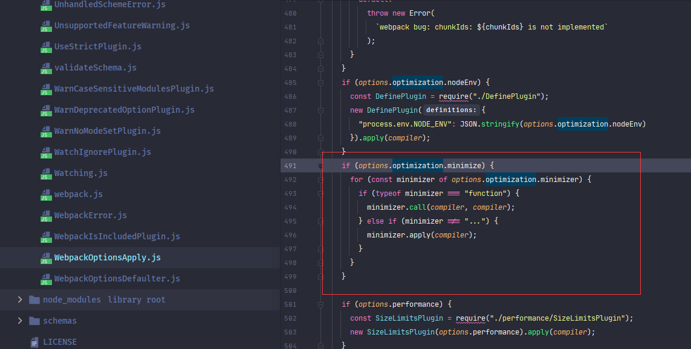
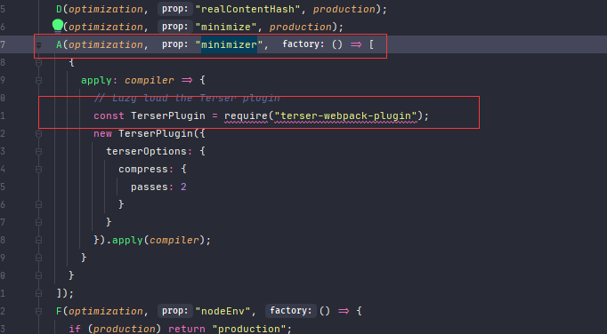
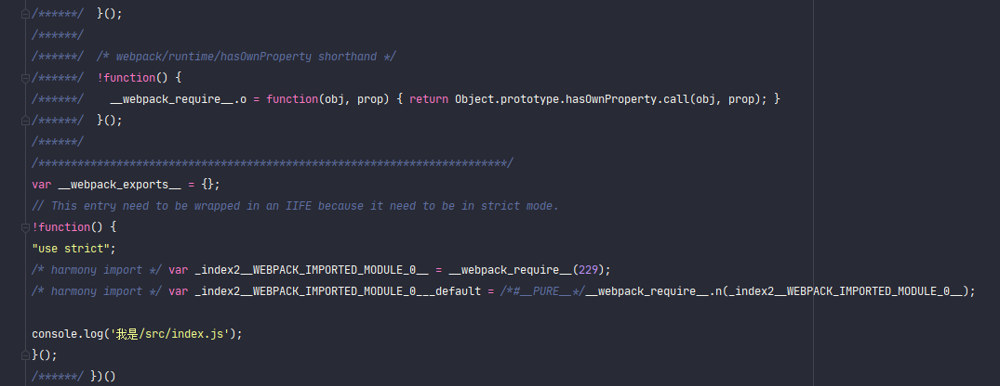
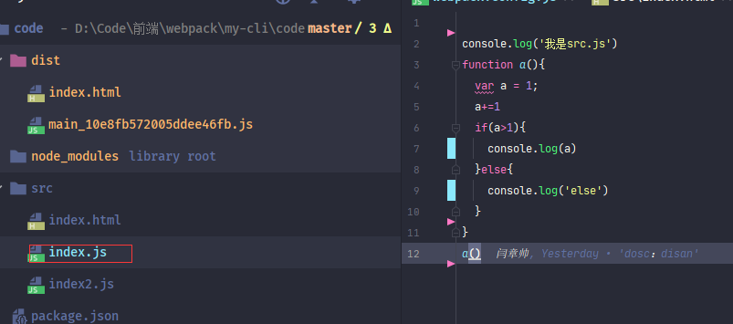
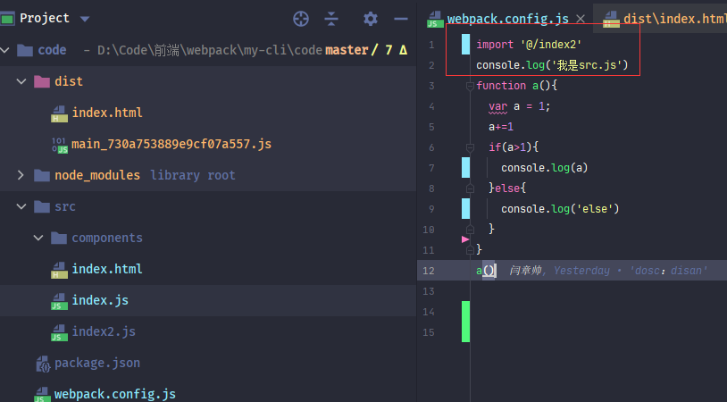

在上一篇中，学习了<font style="color:cornflowerblue">webpack</font>的**entry**、**output**、**plugins**属性。

但，<font style="color:cornflowerblue">webpack</font>当然不仅仅只有这三个属性， 在这一篇，学习下<font style="color:cornflowerblue">webpack</font>中的其它配置属性。


### mode

首先从**mode**属性说下吧

在上一篇说到过一次这个属性，设置使用的。到底是什么东西呢？


<font style="color:cornflowerblue">打包器</font>是将<font style="color:#007FFF">开发环境代码</font>***编译***为<font style="color:#007FFF">可部署环境代码</font>

那么本地开发预览需要什么环境代码呢？搭建的<font style="color:cornflowerblue">工程化</font>代码基本都无法直接运行在浏览器，所以需要使用打包后的代码预览。

但是本地开发预览还要具有代码可读性、可调试性等条件。

最好的解决方案是可以设置为两个<font style="color:cornflowerblue">打包模式</font>

<font style="color:cornflowerblue">webpack</font>就提供了两种<font style="color:cornflowerblue">打包模式</font>：<font style="color:cornflowerblue">开发模式（development）</font>和<font style="color:cornflowerblue">发布模式（production）</font> 由**mode**属性设置

```javascript
 {
   mode:'development'
 }
```

也可以使用**CLI参数**进行设置


> :whale2::whale2:
>
> * <font style="color:cornflowerblue">webpack</font>默认使用的是<font style="color:cornflowerblue">发布模式（production）</font>，缺少**mode**属性执行时，<font style="color:cornflowerblue">webpack</font>会进行提示
>* **CLI参数**设置 优先级要高于 **webpack.config.js** 文件设置。
> * 更好的方案是使用两个***webpack.config.js***文件，脚手架一般都是这样区分，在之后介绍<font style="color:cornflowerblue">webpack merge</font>时处理


在测试两种模式的区别时，最直观的感觉就是查看生成的**JS代码**是否进行了压缩。在**production**时，<font style="color:cornflowerblue">webpack</font>会预设压缩**plugin**


<font style="color:cornflowerblue">webpack</font>中的**mode**属性值其实具有三个：***development***、***production***、***none***

***development***属性值和***production***都预设了各自环境基本的一些功能。

***none***没有预设功能，**none**基本也很少使用。

> :whale2: ***development***和***production*** 只是默认预设了一些基本功能，也可以使用 ***none*** 然后手动设置，只不过稍微麻烦一些


#### development

##### process.env.NODE_ENV属性

***development***模式时，<font style="color:cornflowerblue">webpack</font>使用内置<font style="color:cornflowerblue">**DefinePlugin**</font>，将**process.env.NODE_ENV**属性设置为***development***

开发人员可以编写业务代码时根据**process.env.NODE_ENV**去判断当前打包环境，执行不同环境中的代码。**process.env.NODE_ENV**稍后再介绍


##### 设置模块和模块名称设置有效性

***development***模式时，<font style="color:cornflowerblue">webpack</font>会将**JS模块**、**模块名称**等设置为有效名称，以方便调试

```javascript
optimization: {
    moduleIds: 'named',
    chunkIds: 'named',
}
```

> :whale2:**optimization**是<font style="color:cornflowerblue">webpack</font>配置优化策略属性，具体稍后介绍

> :whale2: <font style="color:cornflowerblue">webpack@5.X</font>设置代码可读性使用  **optimization**属性中 **moduleIds** 和**chunkIds**  而在<font style="color:cornflowerblue">webpack@4.X</font>则使用的是<font style="color:cornflowerblue">webpack</font>内置的<font style="color:cornflowerblue">plugin</font>：<font style="color:cornflowerblue">**NamedChunksPlugin**</font>和<font style="color:cornflowerblue">**NamedModulesPlugin**</font>>


##### 设置devtool属性

***development***模式时，<font style="color:cornflowerblue">webpack</font>会将**devtool**属性设置为***eval***

**devtool**时控制<font style="color:cornflowerblue">SourceMap</font>文件如何生成的。<font style="color:cornflowerblue">SourceMap</font>是用于将原始模块文件与打包后的代码映射文件。用于调试使用。具体稍候介绍


#### production

##### process.env.NODE_ENV属性

***production***模式时，<font style="color:cornflowerblue">webpack</font>使用内置<font style="color:cornflowerblue">**DefinePlugin**</font>，将**process.env.NODE_ENV**属性设置为***production***

开发人员可以编写业务代码时根据**process.env.NODE_ENV**去判断当前打包环境，执行不同环境中的代码。**process.env.NODE_ENV**稍后再介绍


##### 设置模块和模块名称混淆

***production***模式时，<font style="color:cornflowerblue">webpack</font>将 **JS模块**、**模块名称**进行混淆，以保证代码安全性

```javascript
optimization: {
    moduleIds: 'deterministic',
    chunkIds: 'deterministic',
}
```

> :whale2:**optimization**是<font style="color:cornflowerblue">webpack</font>配置优化策略属性，具体稍后介绍

> :whale2: <font style="color:cornflowerblue">webpack@5.X</font>设置代码可读性使用  **optimization**属性中 **moduleIds** 和**chunkIds**  而在<font style="color:cornflowerblue">webpack@4.X</font>则使用的是<font style="color:cornflowerblue">webpack</font>内置的<font style="color:cornflowerblue">plugin</font>：<font style="color:cornflowerblue">**NamedChunksPlugin**</font>和<font style="color:cornflowerblue">**NamedModulesPlugin**</font>


##### 代码压缩

***production***模式时，<font style="color:cornflowerblue">webpack</font> 开启了代码压缩优化 ，使用[terser-webpack-plugin](https://www.npmjs.com/package/terser-webpack-plugin)库对打包生成代码进行压缩

> :whale2::whale2:  <font style="color:cornflowerblue">webpack@5.X</font>默认使用[terser-webpack-plugin](https://www.npmjs.com/package/terser-webpack-plugin)进行压缩代码，在<font style="color:cornflowerblue">webpack@4.X</font>版本及之前版本，默认使用的压缩库为[uglifyjs-webpack-plugin](https://www.npmjs.com/package/uglifyjs-webpack-plugin)。但[uglifyjs-webpack-plugin](https://www.npmjs.com/package/uglifyjs-webpack-plugin)已停止维护


##### 作用域提升

***production***模式时，<font style="color:cornflowerblue">webpack</font> 会使用内置的<font style="color:cornflowerblue">**ModuleConcatenationPlugin**</font> 对代码的作用域进行提示。用于减少打包生成的代码量和执行速度。


##### 错误处理

***production***模式时，<font style="color:cornflowerblue">webpack</font> 会添加内置<font style="color:cornflowerblue">**NoEmitOnErrorsPlugin**</font> 。打包编译时，如果出现代码错误，则不在生成代码。用于避免代码错误代码依然打包成功


> :whale2::whale2::whale2: 提供两种<font style="color:cornflowerblue">打包模式</font>只是为了方便管理，其根本还是由<font style="color:cornflowerblue">插件</font>扩展功能

> :whale2::whale2:<font style="color:cornflowerblue">webpack@5.X</font>和<font style="color:cornflowerblue">webpack@4.X</font>对于***development***和***production*** 预设功能具有一定的差异，具体请参考 [webpack5-mode](https://webpack.js.org/configuration/mode/)、[webpack4-mode](https://v4.webpack.js.org/configuration/mode/)、[显微镜下的webpack4的新特性：mode详解](https://juejin.cn/post/6844903695033843726#heading-11)t> 中https://juejin.cn/post/6844903695033843726#heading-11)


#### process.env.NODE_ENV

无论***development***还是***production***都设置了一个**process.env.NODE_ENV**属性的环境变量。

环境变量用于开发时针对不同环境下的差异化代码。例如调用第三方SDK时，区分<font style="color:cornflowerblue">开发环境</font> 和<font style="color:cornflowerblue">正式环境</font>。

当然可以选择每次发版时手动修改配置，只要自己不会觉得麻烦。


可以进行测试

在**index.js**中添加一个输出**process.env.NODE_ENV**属性


在执行`yarn start`后查看打包生成代码会看到**process.env.NODE_ENV** 替换为了***development***字符串


同样如果执行`yarn build`  **process.env.NODE_ENV** 属性 会替换成***production***字符串


<font style="color:cornflowerblue">webpack</font> 使用了内置的<font style="color:cornflowerblue">**DefinePlugin**</font>设置环境设置。还可以使用<font style="color:cornflowerblue">**DefinePlugin**</font>设置自定义环境变量。具体详情参考[官网](https://www.webpackjs.com/plugins/define-plugin/)

```javascript
const webpack = require("webpack");

{
    plugins:[
         new webpack.DefinePlugin({ "global_a": JSON.stringify("我是一个打包配置的全局变量") }),
    ]
}
```

> :whale2: **process.env.NODE_ENV**属性其实算是一个约定属性。


### devtool

在**development**模式预设属性时，介绍到设置了**devtool**属性。

**devtool**属性也是<font style="color:cornflowerblue">webpack</font>提供的一个属性项。用于设置<font style="color:cornflowerblue">source-map</font>


都看过打包后生成的代码。对于打包后的代码，哪怕是**development**模式下生成的，如果想要调试，那也简直是个噩梦。


所以<font style="color:cornflowerblue">Google</font>提供了一种工具叫做<font style="color:cornflowerblue">source-map</font>

<font style="color:cornflowerblue">source-map</font>提供一个映射信息，将打包后代码与正常开发代码进行映射，从而可以让开发人员更加简单的调试代码。

> :whale2: <font style="color:cornflowerblue">source-map</font>详细介绍请参考阮一峰老师的[文章](http://www.ruanyifeng.com/blog/2013/01/javascript_source_map.html)


<font style="color:cornflowerblue">webpack</font>提供了**devtool**属性来设置<font style="color:cornflowerblue">source-map</font>

**development**模式  **devtool** 默认值为 ***eval***；**production**模式 **devtool** 默认值为 ***false(none)***


***eval***属性值生成的代码都是由**eval**语法编译，并提供了一个**sourceURL**属性用于指向文件源路径


**devtool**属性具有非常多的属性值设置，不同的属性值 操作具有差异 和 打包消耗时间不同。

有的属性值会生成一个**.map**文件，这个文件中存放映射信息，有的直接在**.js**文件中显示映射信息。

```javascript
{
	//	属性可以设置为false和字符串
	devtool:false; // 'eval'
}
```


### optimization

<font style="color:cornflowerblue">压缩（优化）</font>作为<font style="color:cornflowerblue">打包器</font>必须功能之一。

<font style="color:cornflowerblue">webpack</font>中使用**optimization**属性控制<font style="color:cornflowerblue">压缩（优化）</font>


**optimization**是一个对象，在对象中，具有一个**minimize**属性。这个属性表示是否启用<font style="color:cornflowerblue">压缩（优化）</font>


先进行一个有趣的小测试，将**optimization.minimize**手动改为***false***

```javascript
  optimization:{
    minimize:false
  }
```

此时使用`yarn build`执行打包可以看到代码并没有进行压缩


也就是**production**模式下只不过将**optimization.minimize**属性默认设置为了***true***，控制压缩还是**optimization.minimize**属性

```javascript
  optimization:{
    // 开启默认优化
    minimize:true
  }
```


<font style="color:cornflowerblue">webpack@5.X</font>默认使用的压缩库为<font style="color:#f03d3d">terser-webpack-plugin</font>。这是一个**plugin**，当**optimization.minimize**为***true***时，默认添加这个**plugin**。

也就是进行压缩的也并不是**optimization.minimize**属性，而是<font style="color:#f03d3d">terser-webpack-plugin</font>库。所以哪怕**optimization.minimize**设置为***false***，但是在**plugins**属性中手动添加了<font style="color:#f03d3d">terser-webpack-plugin</font>，也会进行压缩。





> :whale2: <font style="color:#f03d3d">terser-webpack-plugin</font>库 在<font style="color:#f03d3d">webpack</font>引用到了，所以不需要引用便可以设置使用

> :whale2: <font style="color:cornflowerblue">webpack@4.X</font>以下默认使用的压缩裤为[uglifyjs-webpack-plugin](https://www.npmjs.com/package/uglifyjs-webpack-plugin)，好多文章都是以[uglifyjs-webpack-plugin](https://www.npmjs.com/package/uglifyjs-webpack-plugin)为基础讲解的，不过[uglifyjs-webpack-plugin](https://www.npmjs.com/package/uglifyjs-webpack-plugin)目前不再维护，<font style="color:cornflowerblue">webpack@5.X</font>开始改为了[terser-webpack-plugin](https://www.npmjs.com/package/terser-webpack-plugin)


**optimization**对象中具有一个**minimizer**属性，这个属性值类型也是*Array*。

**optimization.minimizer**属性也是用于设置**plugin**实例的。


<font style="color:#f03d3d">terser-webpack-plugin</font>库就可以设置在**optimization.minimizer**之中


**optimization.minimizer**与**plugins**的差别就在于：**optimization.minimizer**受到**optimization.minimize**的管理。

当**optimization.minimize**为***false***时，**optimization.minimizer**设置的**plugin**就不会执行。




> :whale2::whale2::whale2:
>
> 诸位可以简单的思考一下：
>
> 其实**optimization**并不是必备的属性，它的功能完全可以使用**plugins**来完成
>
> **optimization**存在的意义在于汇总。将<font style="color:cornflowerblue">压缩（优化）</font>使用到的工具汇总在一起，然后设置一个**开关（optimization.minimize）**，以便可以更加方便的管理此类工具。


#### terser-webpack-plugin

<font style="color:#f03d3d">terser-webpack-plugin</font> 作为<font style="color:cornflowerblue">webpack@5.X</font>默认的压缩工具。在此就直接介绍此库的属性

> :whale2::whale2: <font style="color:#f03d3d">terser-webpack-plugin</font>压缩对**devtool**属性具有一定的要求，只支持***none***、***source-map***、***inline-source-map***、***hidden-source-map***、***nosources-source-map***。  像***eval***生成的是字符串。<font style="color:#f03d3d">terser-webpack-plugin</font>就没办法进行处理


<font style="color:#f03d3d">terser-webpack-plugin</font>的配置项还是比较恶心的，慢慢来学习


<font style="color:#f03d3d">terser-webpack-plugin</font>第一层参数主要对于文件多线程的设置。

```javascript
const TerserPlugin = require('terser-webpack-plugin');

{
    optimization: {
    // 配置可优化
    minimize: true,
    minimizer: [
      new TerserPlugin({
         //  包含哪些文件
        include: /\.js(\?.*)?$/i,
        // //  排除哪些文件
        // exclude:/\.js(\?.*)?$/i,
        //  多进程并行运行，默认为true，开启，默认并发数量为os.cpus()-1
        //  可以设置为false(不使用多线程)或者数值（并发数量）
        parallel: true,

        //  可以设置一个function，使用其它压缩plugin覆盖当前的压缩plugin，默认为undefined，
        minify: undefined,

        //  是否将注释提出到单独的文件中
        //  值Boolean|String|RegExp|Function<(node, comment) -> Boolean|Object>|Object
        //  默认为true， 只提取/^\**!|@preserve|@license|@cc_on/i注释
        //  感觉没什么特殊情况直接设置为false即可
        extractComments: false,

        //  压缩时的选项设置
        terserOptions: {}
      })
    ]
  }
}
```

> * **include**：指定压缩的文件
>
>   属性可设置为：*String*、*String[]*、*Regex*
>
>   默认值为：***undefined***
>
> 
>
> * **exclude**：排除压缩的文件
>
>   属性可设置为：*String*、*String[]*、*Regex*
>
>   默认值为：***undefined***
>
> 
>
> * **parallel**：是否启用多线程运行
>
>   属性可设置为：*Boolean*、*Number*
>
>   属性值为***false***：不启动多线程
>
>   属性值为***true***：启动多线程，多线程数量为：**os.cpus()-1**
>
>   属性值为***Number***：表示使用的多线程数量
>
>   默认值为：***true***
>
>   
>
> * **minify**：设置其它压缩工具覆盖<font style="color:#f03d3d">terser-webpack-plugin</font>
>
>   此属性可以设置一个函数，函数内允许使用其它压缩工具替代<font style="color:#f03d3d">terser-webpack-plugin</font>， 其实相当于做了一个拦截，基本上不会使用此属性。 详细介绍可以参考 [官方](https://github.com/webpack-contrib/terser-webpack-plugin#minify)
>
>   属性可设置为：*Function*
>
>   默认值为***undefined***
>
>   
>
> * **extractComments**：是否将代码注释提取到一个单独的文件。
>
>   经过压缩的代码都会去除注释，此属性就是设置是否提取注释，个人感觉这个属性也没什么用。详细介绍可以参考 [官方](https://github.com/webpack-contrib/terser-webpack-plugin#extractcomments)
>
>   属性可设置为：*Boolean*、*String*、*RegExp*、*Function<(node, comment) -> Boolean | Object>*、 *Object*
>
>   属性值为***false***或者函数返回***false***：表示不提取
>
>   属性值为***String***时： ***all***表示全部提取。***some***表示使用默认正则匹配：/^\**!|@preserve|@license|@cc_on/i
>
>   属性值为***true***或者函数返回***true***时：表示提取，使用默认正则匹配：/^\*\*!|@preserve|@license|@cc_on/i
>
>   属性值为***Regex***时：自定义提取规则。
>
>   属性值为***Object***时：允许自定义提取条件。
>
>   默认值为***true***
>
>   
>
> * **terserOptions**：设置压缩选项
>
>   此属性才是详细设置压缩选项的参数。
>
>   属性可设置为：*Object*


###### terserOptions


先来一个简单的测试，在**index.js**中创建这么一个函数



使用默认压缩配置进行打包，结果可以看到生成的代码只有真实执行的那两句。

所以其实默认配置中，<font style="color:#f03d3d">terser-webpack-plugin</font>基本上做到了最优解。


> :whale2: 如果将*var a = 1*改为*let a = 1*，则结果有些不一致，这是由于ES6问题，有兴趣的诸君可以测试一下


接下来来一个测试，在**terserOptions**对象中***compress***属性，这个才是真正的压缩配置。

**terserOptions.compress** 设置类型为 **Boolean**、**Object**。下面来将此属性设置为***false***。再查看打包结果

```javascript
{
   optimization: {
    // 配置可优化
    minimize: true,
    minimizer: [
      new TerserPlugin({
        //  压缩时的选项设置
        terserOptions: {
             compress:false
        }
      })
    ]
  }
}
```

可以发现，生成代码只改变了属性名称和函数函数


**terserOptions**这一层中的设置主要是对代码中**属性名称**、**函数名称**。等一系列的设置

```javascript
{
   optimization: {
    // 配置可优化
    minimize: true,
    minimizer: [
      new TerserPlugin({
          //  压缩时的选项设置
          terserOptions: {
              //  是否防止篡改函数名称，true代表防止篡改，即保留函数名称，false即可以篡改，
              //  此属性对使用Function.prototype.name
              //  默认为false
              keep_fnames:false,
              //  是否防止篡改类名称
              keep_classnames:false,
              //  ·压缩配置
              compress: {  },
              //  format和output是同一个属性值，，名称不一致，output不建议使用了，被放弃
              format:{comments:true},
              output:null,
              //  是否支持IE8，默认不支持
              ie8:true,
        }
      })
    ]
  }
}
```

> * **keep_fnames**：是否保留原始函数名称
>
>   刚才测试看到了，默认情况下会更改函数名称，此属性就是设置是否保留函数名称。
>
>   属性可设置为：*Boolean*
>
>   属性值为***false***：表示不保留原始名称
>
>   属性值为***true***：表示保留原始名称
>
>   默认值为***false***
>
>   
>
> * **keep_classnames**： 是否保留原始类名称  
>
>   与**keep_fnames**属性类似，只不过设置的是类名称
>
>   属性可设置为：*Boolean*
>
>   属性值为***false***：表示不保留原始名称
>
>   属性值为***true***：表示保留原始名称
>
>   默认值为***false***
>
>   
>
> * **compress**：设置压缩选项
>
>   属性可设置为：*Boolean*、*Object*
>
>   属性值为***false***：表示不压缩。
>
>   属性值为***object***：自定义压缩设置。
>
>   
>
> * **format/output**：指定压缩格式。例如是否保留*注释*，是否始终为*if*、*for*等设置大括号。
>
>   **format**和**output**的配置相同。**output**官方不再推荐使用。这个属性就不介绍，具体请参考[官方](https://github.com/terser/terser#format-options)  
>
>   属性可设置为：*Object*
>
>   默认值为***null***
>
>   
>
> * **ie8**：是否支持IE8
>
>   属性可设置为：*Boolean*
>
>   默认值为***false***


下面介绍下**terserOptions.compress**的配置。**terserOptions.compress**只介绍部分属性  。其它设置，有兴趣的朋友可以查看[官方](https://github.com/terser/terser#compress-options)

```javascript
{
   optimization: {
    // 配置可优化
    minimize: true,
    minimizer: [
      new TerserPlugin({
          //  压缩时的选项设置
          terserOptions: {
                compress: {
                // 是否使用默认设置，这个属性当只启用指定某些选项时可以设置为false
                //	默认为true
                defaults:true,
                //  是否移除无法访问的代码,默认为true
                dead_code:true,

                // 折叠仅仅使用一次的变量,默认为true
                collapse_vars:true,
                //  是否删除所有 console.*语句，默认为false，这个可以在线上设置为true
                drop_console:true,
                //  是否删除所有debugger语句，默认为true
                drop_debugger:true,
                //  移除指定func，这个属性假定函数没有任何副作用，可以使用此属性移除所有指定func
                pure_funcs: ['console.log'], //移除console
          }
        }
      })
    ]
  }
}
```

> * **defaluts**：是否使用默认配置项
>
>   此属性表示是否使用官方设置默认配置项
>
>   属性可设置为：*Boolean*
>
>   默认值为***true***
>
>   
>
> * **dead_code**：是否移除无法访问的代码
>
>   属性可设置为：*Boolean*
>
>   默认值为***true***
>
>   
>
> * **collapse_vars**：是否优化只使用一次的变量
>
>   此属性表示是否将只使用一次的变量直接进行替换优化
>
>   属性可设置为：*Boolean*
>
>   默认值为***true***
>
>   
>
> * **drop_console**：是否删除所有**console**语句
>
>   此属性可以在发布时设置为***true***
>
>   属性可设置为：*Boolean*
>
>   默认值为***false***
>
>   
>
> * **drop_debugger**：是否删除所有**debugger**语句
>
>   属性可设置为：*Boolean*
>
>   默认值为***true***
>
>   
>
> * **pure_funcs**：移除指定的函数。
>
>   此属性可以设置移除指定的函数，但是需要缺点要移除的函数没有任何<font style="color:cornflowerblue">副作用（没有使用）</font>，有兴趣的朋友可以测试删除自定义函数


<font style="color:#f03d3d">terser-webpack-plugin</font>配置项还有好多，但是一般使用默认属性即可，几乎不需要任何配置。

> :whale2::whale2: 暂时先将**optimization.minimize**属性设置**false**,以便可以更好的观察代码2: 


### loader

在上一篇文章说过：<font style="color:cornflowerblue">webpack</font>是一个<font style="color:#06f">***JavaScript应用程序***</font>的静态模块打包器，其本身并不支持非**JS模块**。但<font style="color:cornflowerblue">webpack</font>提供了将 **非JS模块** 转换为**JS模块**的功能---<font style="color:cornflowerblue">loader </font>

<font style="color:cornflowerblue">loader</font>相当于一个<font style="color:cornflowerblue">拦截器</font>，将<font style="color:#06f">***指定文件***</font>进行编译，再传递给<font style="color:cornflowerblue">webpack</font>。

在这里先不学习具体的<font style="color:cornflowerblue">loader </font>，只介绍下<font style="color:cornflowerblue">loader </font>的配置语法。

<font style="color:cornflowerblue">loader</font>的配置是在**module.rules**属性，**module.rules**是一个**Array**类型属性。   数组每一项都是一个<font style="color:cornflowerblue">rule</font>。

设置指定的<font style="color:cornflowerblue">loader </font>处理每一项<font style="color:cornflowerblue">rule</font>

```javascript
{
  module:{
    rules:[
      {
        // test:/\.css$/,
        // include:path.join(__dirname,'src'),
        // exclude:path.join(__dirname,'node_modules'),
        // //  字符串形式
        // use:'css-loader',
        //  数组形式，可以设置多个loader
        // use:[
        //   {
        //     loader:'css-loader',
        //     options:{
        //
        //     }
        //   }
        // ]
      }
    ]
  }
}
```

> * **test**：设置匹配文件
>
>   使用此属性进行匹配要处理的文件。例如：***/\.css$*** 表示匹配所有的[.css]()文件，
>
>   属性可设置为：*Regex*
>
> * **include**：设置包含文件目录。
>
>   此属性可以设置只处理指定目录中的文件，可以使用此属性来指定只匹配**/src**目录中文件
>
>   属性可设置为：*String*
>
> * **exclude**：设置排除的文件目录。
>
>   此属性与**include**类似，只不过功能相反，指定要排除的目录。一般使用此属性排除**node_modules**目录。
>
>   属性可设置为：*String*
>
> * **use**：匹配到的文件所使用处理<font style="color:cornflowerblue">loader </font>。
>
>   属性可设置为：*String*、*Array*
>
>   属性值为***String***：设置<font style="color:cornflowerblue">loader </font>名称
>
>   属性值为***Array***：可以指定多个<font style="color:cornflowerblue">loader </font>处理，并且可以对<font style="color:cornflowerblue">loader </font>进行配置


> :whale2::whale2::whale2:  当指定多个<font style="color:cornflowerblue">loader </font>时，<font style="color:cornflowerblue">loader </font>加载顺序为从右往左。具体请参考[Webpack的Loader为什么是从右往左写？](https://segmentfault.com/q/1010000008622548#)


### resolve

**resolve**是<font style="color:cornflowerblue">webpack</font>提供的一个属性，主要配置打包编译时的模块解析规则。

**resolve**是一个*Object*类型，可以设置许多解析规则。在此只介绍三个常用的属性。其它属性，有兴趣的朋友可以去参考[中文官网](https://www.webpackjs.com/configuration/resolve/#resolve-modules)

下面来看一个对于打包不太重要但是能在写代码时更加方便和管理的功能，毕竟代码很多时候是写给人看的。用过脚手架的诸君应该都用过以下的功能之一

1. 使用**@**代表**src**根目录
2. import组件时可以忽略组件名称
3. 如果import指向的是一个目录，那么默认会导入其中的*index*文件

那么这些是怎么实现的呢。其实这些是在webpack中的<font style="color:#f03d3d">resolve </font>属性配置的。

<font style="color:#f03d3d">resolve </font>属性设置模块如何被解析。这个属性具有很多的参数设置，当然，webpack提供了合理的默认值，一般情况是不需要设置的


#### alias

在使用<font style="color:cornflowerblue">vue-cli</font>这类脚手架，开发引入本地文件模块时，可以使用一个<font style="color:cornflowerblue">符号（@）</font>来代替**/src**工作目录。

这个功能就是**resolve.alias**提供的。属性类型为**Array**。

**resolve.alias**属性可以对一个指定路径设置别名。打包编译时会将设置别名替换为配置的真实路径

**resolve.alias**属性类型为**Array**

```javascript
{
   resolve: {
    alias:{
      //  设置路径别名
      '@':path.join(__dirname,'src'),
      '~': path.resolve(__dirname, '../src/assets')
    },
  }
}
```

此时在引用文件模块时，就可以使用***@***来代替**/src**工作目录（工作根目录）




> :whale2: <font style="color:cornflowerblue">webpack</font>允许设置除关键字外的任意符号作为别名。<font style="color:cornflowerblue">vue-cli</font>这类脚手架一般都预设<font style="color:cornflowerblue">符号（@）</font>代替**/src**工作目录。 


#### extensions

在使用脚手架，导入文件模块时，很常见的一种行为就是不添加后缀名称。

这个功能就是**resolve.extensions**提供的。

**resolve.extensions**功能允许设置多个后缀名称。开发导入文件模块时可以忽略文件后缀名称，打包编译时按照配置缀顺序依次匹配，直到寻到第一个匹配文件或报错（找不到匹配文件）。

**resolve.extensions**属性类型为**Array**，默认值为：***['.js', '.json']***，也就是可以忽略**JS**文件和**JSON**文件后缀


下面将**resolve.extensions**设置为***['.json']***做一个测试

```javascript
{
   resolve: {
    extensions:['.json']
  }
}
```


此时由于引用**index2.js**时还是没有添加后缀，打包编译时就直接报错了。


此时在引用**index2.js**添加**.js**后缀名称才可以打包成功。在此就不贴图。


像<font style="color:cornflowerblue">vue-cli</font>、<font style="color:cornflowerblue">react-cli</font>脚手架都会在**resolve.extensions**属性配置自己文件类型的后缀名称。


在此以<font style="color:cornflowerblue">react-cli</font>为例

> :whale2::whale2::whale2: 打包编译时匹配**resolve.extensions**，使用的是队列形式。**Array**从先到后


#### mainFiles

在使用脚手架，导入文件模块时，有一种常见方式只指定其文件所在目录，并没有指定文件名称。

这种方式常见于以 目录为组件单元的代码风格。例如<font style="color:cornflowerblue">antd</font>，就是以目录为组件单元。


这个功能是由**resolve.mainFiles**属性提供的。

**resolve.mainFiles**允许设置多个文件名称，开发导入文件模块时可以忽略此文件名称，打包编译时按照配置缀顺序依次匹配，直到寻到第一个匹配文件或报错（找不到匹配文件）。

**resolve.extensions**属性类型为**Array**，默认值为：***['index']***，也就是可以忽略**index**名称的文件。

> :whale2::whale2:  使用**resolve.mainFiles**时需要设置**resolve.extensions**，目录是没有后缀的，需要设置忽略后缀，否则会报错:	 


下面将**resolve.mainFiles**设置为***['index','main']***做测试

```javascript
{
   resolve: {
   	extensions:['.js','.json'],
    mainFiles:['index','main'],
  }
}
```


可以看到， 可以看到导入**/demo/main.js**时，忽略了文件名称，但是依然打包编译、导入成功

> :whale2::whale2::whale2:  打包编译时匹配**resolve.mainFiles**，使用的也是队列形式。**Array**从先到后

> :whale2::whale2::whale2:  个人强烈建议使用目录结构方式组织组件，这样比较清晰。


### context

配置<font style="color:cornflowerblue">webpack</font>时，使用文件地址属性都使用了绝对地址：**path.join(__dirname, ...)**

<font style="color:cornflowerblue">webpack</font>其实提供了一个属性，设置一个上下文目录地址，在配置项中可以以此地址为相对地址。

这个属性就是**context**

不过**context**个人感觉并不太好用。


**context**属性**String**类型，设置一个绝对路径的目录地址

**context**默认值为当前项目根目录，也就是**package.json**文件所在目录


先做一个测试，**context**默认值为当前项目根目录，所以可以直接使用相对路径

```js
{
    entry: './src/index.js' ,
}
```

此时执行`yarn build`打包也可以进行打包成功。


也可以使用**context**指定其它目录为基准目录

```js
{
  context: path.join(__dirname, './src'),
  //  入口文件
  //  字符串形式
  entry: './index.js' ,
}
```


使用**context**设置上下文基准路径感觉上还挺好用，

但其实**context**具有一定的缺陷，所以个人不建议使用


#### 部分属性不允许相对路径

并不是所有的属性都可以设置为相对路径,例如**output**属性就只允许使用绝对路径，这样配置文件中既有相对路径又有绝对路径，

看起来感觉怪怪的。


> :whale2: **output**属性只允许使用绝对路径应该是为了保证输出地址的准确安全性。


我比较喜欢的方案就是自定义一个**root**属性，配置文件中**root**去设置路径

```js
const config = {
  root: path.join(__dirname, './'),
};

const {
  entry: path.join(config.root, 'src/index.js'),
  output: {
    path: path.join(config.root, 'dist'),
    filename: '[name]_[contenthash].js'
  },
}
```

 

至于自定义**root**属性而不直接使用**__dirname**原因：个人感觉自定义属性方便控制。 例如日过配置文件更换目录，直接使用**__dirname**，那么所有目录地址都需要更改。

当然开发不会出现此类情况。

使用**context**属性还是绝对路径都无伤大雅，个人习惯罢了，只要文件路径正确即可 


###  总结

> :whale2::whale2::whale2:
>
> * <font style="color:cornflowerblue">webpack</font>提供了两种<font style="color:cornflowerblue">打包模式</font>：**开发测试打包编译*(devalopment)***和**线上发布打包编译*(production)*** 。两种打包模式能够更加方便管理<font style="color:cornflowerblue">插件</font>
> * <font style="color:cornflowerblue">webpack</font>对两种模式都预设了部分功能，大大减少了开发人员配置需求
> * <font style="color:cornflowerblue">source-map</font>是<font style="color:cornflowerblue">Google</font>提供的打包编译后代码与开发代码的一种映射文件，用途主要是方便开发人员调试使用
> * **optimization**属性是控制压缩优化，    **optimization**只是一系列功能的集合，为了方便管理压缩优化，本质还是由<font style="color:cornflowerblue">插件</font>完成功能
> * **resolve**属性提供了打包编译时的解析规则，


### 本文参考

* [webpack官网](https://webpack.js.org/)
* [webpack5-mode](https://webpack.js.org/configuration/mode/)
* [webpack4-mode](https://v4.webpack.js.org/configuration/mode/)
* [webpack4的新特性：mode详解](https://juejin.cn/post/6844903695033843726#heading-11)
* [uglifyjs-webpack-plugin](https://www.npmjs.com/package/uglifyjs-webpack-plugin)
* [terser-webpack-plugin](https://www.npmjs.com/package/terser-webpack-plugin)
* [terser Github](https://github.com/terser/terser)
* [terser-webpack-plugin Github](https://github.com/webpack-contrib/terser-webpack-plugin)
* [Webpack的Loader为什么是从右往左写？](https://segmentfault.com/q/1010000008622548#)


### webpack.config.js

```javascript
const path = require('path')
const webpack = require("webpack");
const HtmlWebpackPlugin = require('html-webpack-plugin')
const { CleanWebpackPlugin } = require('clean-webpack-plugin')
const TerserPlugin = require('terser-webpack-plugin')


const config = {
  root: path.join(__dirname, './'),
}

const modules = {

  //  入口文件
  //  字符串形式
  entry: path.join(config.root, 'src/index.js'),
  //  对象形式
  // entry:{
  //   'index':  path.join(config.root, 'src/index.js'),
  // },

  //  出口文件
  //  字符串形式
  // output:path.join(config.root, './dist/[name].js')
  //对象形式
  output: {
    //  出口文件的目录地址
    path: path.join(config.root, 'dist'),
    //  出口文件名称，contenthash代表一种缓存，只有文件更改才会更新hash值，重新打包
    filename: '[name]_[contenthash].js'
  },

  //devtool:false, //'eval'

  // module:{
  //   rules:[
  //     {
  //       test:/\.css$/,
  //       include: ath.join(config.root,'src'),
  //       exclude: path.join(config.root,'node_modules'),
  //       ////  字符串形式
  //       // use:'css-loader',
  //       //  数组形式，可以设置多个loader
  //       // use:[
  //       //   {
  //       //     loader:'css-loader',
  //       //     options:{
  //       //
  //       //     }
  //       //   }
  //       // ]
  //     }
  //   ]
  // }


  optimization: {
    //	暂时关闭压缩优化，方便观察打包生成代码
    minimize: false,
    minimizer: [
      new TerserPlugin({
        //  包含哪些文件
        include:  /\.js(\?.*)?$/i,
        // //  排除哪些文件
        // exclude:/\.js(\?.*)?$/i,
        //  多进程并行运行，默认为true，开启，默认并发数量为os.cpus()-1
        //  可以设置为false(不使用多线程)或者数值（并发数量）
        parallel:true,

        //  可以设置一个function，使用其它压缩插件覆盖默认的压缩插件，默认为undefined，
        minify:undefined,

        terserOptions: {
          // //  是否防止篡改函数名称，true代表防止篡改，即保留函数名称，false即可以篡改，
          // //  此属性对使用Function.prototype.name
          // //  默认为false
          keep_fnames:false,
          // //  是否防止篡改类名称
          keep_classnames:false,
          // //  设置一些其它的解析
          parse: {},
          //  最小化es6模块。默认为false
          module:true,
          //  ·压缩配置

          //  format和output是同一个属性值，，名称不一致，output不建议使用了，被放弃
          format: {
            comments:false,
          },
          //  是否支持IE8，默认不支持
          ie8:false,
          compress: {
            // 是否使用默认设置，这个属性当只启用指定某些选项时可以设置为false
            defaults:false,
            //  是否移除无法访问的代码
            dead_code:false,

            // 折叠仅仅使用一次的变量
            collapse_vars:true,
            warnings:true,
            //  是否删除所有 console.*语句，默认为false，这个可以在线上设置为true
            //  是否删除所有debugger语句，默认为true
            drop_debugger:true,
            //  移除指定func，这个属性假定函数没有任何副作用，可以使用此属性移除所有指定func
            // pure_funcs: ['console.log'], //移除console
          },
        },
        //  是否将注释提出到单独的文件中
        //  值Boolean|String|RegExp|Function<(node, comment) -> Boolean|Object>|Object
        //  默认为true， 只提取/^\**!|@preserve|@license|@cc_on/i注释
        //  感觉没什么特殊情况直接设置为false即可
        extractComments:false,
      })
    ]
  },

  plugins: [
    new HtmlWebpackPlugin({
      //  template的title优先级大于当前数据
      title: 'my-cli',
      //  文件名称
      filename: 'index.html',

      //  模板路径
      template: path.join(config.root, 'src/index.html') ,
      // 用于打包后引用脚本时的路径
      publicPath: './',

      //  是否将打包的资源引用到当前HTML， false代表不引用
      //  true或者body将打包后的js脚本放入body元素下，head则将脚本放到中
      //  默认为true
      inject: 'body',
      //  加载js方式，值为defer/blocking
      //  默认为blocking, 如果设置了defer，则在js引用标签上加上此属性，进行异步加载
      scriptLoading: 'blocking',

      //  是否进行缓存，默认为true，在开发环境可以设置成false
      cache: false,
      //  添加mate属性
      meta: {}
    }),

    new CleanWebpackPlugin({

      //  假装文件删除
      //  如果为false则代表真实删除，如果为true，则代表不删除
      dry: false,
      //  是否打印日志到控制台 默认为false
      verbose: true,
      cleanStaleWebpackAssets: false,
      //  允许保留本次打包的文件
      //  true为允许，false为不允许，保留本次打包结果，也就是会删除本次打包的文件
      //  默认为true
      protectWebpackAssets: true,
      //  每次打包之前删除匹配的文件
      cleanOnceBeforeBuildPatterns: ['**/*'],

      //  每次打包之后删除匹配的文件
    }),


    new webpack.DefinePlugin({ "global_a": JSON.stringify("我是一个打包配置的全局变量") }),
  ],

  resolve: {
    alias:{
      //  设置路径别名
      '@': path.join(config.root, 'src') ,

      '~':  path.join(config.root, 'src/assets') ,
    },
    //  可互忽略的后缀
    extensions:['.js', '.json'],
    //  默认读取的文件名
    mainFiles:['index', 'main'],
  }
}

//  使用node。js的导出，将配置进行导出
module.exports = modules

```

