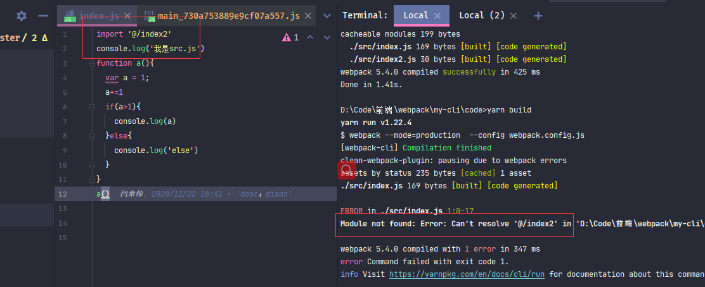

在之前简单的学习了webpack打包，本章学习下webpack的一些问题

### mode

在之前说过一个问题：webpack具有开发模式（<font style="color:#f03d3d">development</font>）和发布模式（<font style="color:#f03d3d">production</font>），这个问题跟<font style="color:#007FFF">“开发代码”</font>和<font style="color:#007FFF">“部署代码”</font>有些类似。 

站在webpack设计思路来看：在开发时发现本地开发运行的要与真实部署的代码有一些区别，例如：本地开发不需要压缩和缓存代码，这样能更容易的排查问题，但是真实部署代码需要压缩和缓存

对于这个问题，最好的解决方案当然是设置不同的模式，<font style="color:#f03d3d">开发模式（development）</font>与<font style="color:#f03d3d">部署模式（production）</font>分开，然后根据不同模式去执行不同*扩展*进行打包。


webpack就提供了三种模式<font style="color:#f03d3d">development</font>、<font style="color:#f03d3d">production</font>、<font style="color:#f03d3d">none</font>，使用***mode***属性去设置

```javascript
 {
   mode:'development'
 }
```

也可以使用***CLI参数***传递设置相应模式


> :whale2::whale2:
>
> * webpack默认mode为<font style="color:#f03d3d">production</font>
>* ***CLI参数***的优先级要大于***webpack.config***文件。
> * 有种更好的方案就是使用两个***webpack.config***文件，一般脚手架都是这样区分的，这个在后期做***webpack merge***时处理，暂时使用***CLI参数***设置


设置完毕可以使用两个命令测试下，最直接的感觉就是看生成的JS是否被压缩。这是因为在<font style="color:#f03d3d">production</font>预设了压缩**plugin**。

> :whale2:	 <font style="color:#f03d3d">none</font>属性的差异诸君可以自己测试下


***mode***属性具有三种<font style="color:#f03d3d">development</font>、<font style="color:#f03d3d">production</font>、<font style="color:#f03d3d">none</font>，其中<font style="color:#f03d3d">development</font>、<font style="color:#f03d3d">production</font>都预设各自环境的功能，以便我们使用更少的配置完成更多的功能。但 <font style="color:#f03d3d">none</font>属性则没有预设功能。不过，<font style="color:#f03d3d">none</font>几乎也很少使用，通常只使用<font style="color:#f03d3d">development</font>和<font style="color:#f03d3d">production</font>


#### development

* **设置process.env.NODE_ENV属性**：预设了webpack内置的<font style="color:#f03d3d">DefinePlugin</font>**plugin**，这个**plugin**就是将***process.env.NODE_ENV***属性设置为<font style="color:#f03d3d">development</font>属性

* **模块和模块名称设置有效性**：预设了开发模式下将模块和模块名称设置为有效名称，增加代码的可读性

  *webpack5*设置代码可读性使用的  ***optimization***属性中的 <font style="color:#f03d3d">moduleIds</font> 、<font style="color:#f03d3d">chunkIds</font>  。在*webpack4*则使用的是webpack内置的**plugin：**<font style="color:#f03d3d">NamedChunksPlugin</font>和<font style="color:#f03d3d">NamedModulesPlugin</font>

  ```javascript
optimization: {
      moduleIds: 'named',
      chunkIds: 'named',
  }
  ```
  
  > ***optimization***属性是webpack配置优化策略的，这个属性稍后介绍

* **开启devtool属性**：设置***devtool***属性为<font style="color:#f03d3d">eval</font>，***devtool***是控制<font style="color:#f03d3d">SourceMap</font>是否生成和如何生成，会影响打包结果，具体在下面介绍


#### production

* **设置process.env.NODE_ENV属性**：预设了webpack内置的<font style="color:#f03d3d">DefinePlugin</font>**plugin**，这个**plugin**就是将***process.env.NODE_ENV***属性设置为<font style="color:#f03d3d">production</font>属性。

* **模块和模块名称进行混淆**：预设了发布模式将模块和模块名称进行混淆，避免代码轻易泄露

  webpack5设置代码可读性使用的  ***optimization***属性中的 <font style="color:#f03d3d">moduleIds</font> 、<font style="color:#f03d3d">chunkIds</font>  。

  ```javascript
optimization: {
      moduleIds: 'deterministic',
      chunkIds: 'deterministic',
  }
  ```
  
* **代码压缩**：预设了<font style="color:#f03d3d">terser-webpack-plugin</font>，对打包生成的代码进行压缩

  *webpack5*默认使用的此**plugin**进行压缩的代码，在之前版本的webpack，默认使用的是<font style="color:#f03d3d">uglifyjs-webpack-plugin</font>，但是<font style="color:#f03d3d">uglifyjs-webpack-plugin</font>**plugin**后来不再维护，于是便换成了<font style="color:#f03d3d">terser-webpack-plugin</font>

  > :whale2: 打包压缩其实是由webpack对象配置中***optimization***属性进行设置的

* **作用域提升**：预设了webpack内置的<font style="color:#f03d3d">ModuleConcatenationPlugin</font>，这个**plugin**允许在打包时添加作用域提升的处理，用于减少打包生成的代码量和执行速度。

* **打包出错处理**：预设了webpack内置的<font style="color:#f03d3d">NoEmitOnErrorsPlugin</font>**plugin**，这个**plugin**用于编译时发现出错代码则不再生成，避免打包出来的代码异常


可以看到在<font style="color:#f03d3d">development</font>、<font style="color:#f03d3d">production</font>两个模式其实预设了很少的功能，大部分还是需要手动去配置。毕竟预设太多反而会不太灵活。

> :whale2: *webpack5*和*webpack4*下的<font style="color:#f03d3d">development</font>、<font style="color:#f03d3d">production</font>预设功能具有一些差异，具体请参考 [webpack5-mode](https://webpack.js.org/configuration/mode/)、[webpack4-mode](https://v4.webpack.js.org/configuration/mode/)、[显微镜下的webpack4的新特性：mode详解](https://juejin.cn/post/6844903695033843726#heading-11)


#### process.env.NODE_ENV

在预设功能时看到无论在***development***还是***production***都设置了**<font style="color:#f03d3d">process.env.NODE_ENV</font>**属性。那么这个属性是做什么用的。

先来看一个需要：在调用第三方SDK时，在开发环境与正式环境使用不同的SDK，会有人想这个做个配置就行了，在上线之前改下配置路径。

但是这样会在开发和生产打包时需要分别更改代码，更改代码也会是一件很繁琐的事情，所以需要一个能在业务代码中判断环境变量的需求。

在webpack中<font style="color:#f03d3d">DefinePlugin</font>就做了这件事，***development***和***production*** 都预设使用<font style="color:#f03d3d">DefinePlugin</font>设置了各自环境变量。


现在便来做一个小测试

先在index.js中添加一个console


然后使用***development***打包

> yarn start

在打包生成的代码会找到这句代码


可以看到打包出来的代码替换成了**development**字符串。同理***production***会替换成**production**值，我们使用此环境变量便可以进行使用不同SDK


> :whale2: 其实环境变量的重点是：<font style="color:#f03d3d">DefinePlugin</font>，这个**plugin**官方的解释：创建一个在编译时可以配置的全局变量，所以其实可以自定义配置任意属性值，在打包操作时，<font style="color:#f03d3d">DefinePlugin</font>会将属性值进行替换。而***process.env.NODE_ENV***属性只是一个*约定属性*，在自己项目中可以设置更多的全局变量，具体请参考[官网](https://www.webpackjs.com/plugins/define-plugin/)

```javascript
const webpack = require("webpack");

{
    plugins:[
         new webpack.DefinePlugin({ "global_a": JSON.stringify("我是一个打包配置的全局变量") }),
    ]
}
```


### source-map

在前面提到过在*development*预设了***devtool***属性，那么这个属性是什么呢。webpack是一个打包器，将我们开发的代码进行打包部署运行，但是打包的代码有这么一个问题：无法进行调试。

应该都看到过打包生成的代码，那代码简直了。也就表示在调试排查时是一场噩梦。

所以Google提供了一种工具叫做<font style="color:#f03d3d">source-map</font>，<font style="color:#f03d3d">source-map</font>提供一个映射信息，将转换后的代码与转换前所写的开发代码进行对应，以方便开发时调试代码

> :whale2: 具体<font style="color:#f03d3d">source-map</font>介绍请参考阮一峰老师的[文章](http://www.ruanyifeng.com/blog/2013/01/javascript_source_map.html)

在webpack中使用了***devtool***属性来设置<font style="color:#f03d3d">source-map</font>

***development***模式下默认值<font style="color:#f03d3d">eval</font>；***production***模式下默认值为<font style="color:#f03d3d">false(none)</font>


在<font style="color:#f03d3d">eval</font>属性下打包的代码可以看到代码是由**eval**编译，并且在最后具有一个**sourceURL**属性。这个**sourceURL**是值是当前代码的真实文件路径。

当然也可以设置其它的值，在[webpack官网](https://webpack.js.org/configuration/devtool/)中可以看到***devtool***具有非常多的属性。不同的属性打包消耗的时间也不同。

有的属性会生成一个**.map**文件，这个文件中存放映射信息，有的直接在**.js**文件中显示映射信息。

```javascript
{
	//	属性可以设置为false和字符串
	devtool:false; // 'eval'
}
```


### optimization

在说打包器时，说过压缩（优化）代码也是打包器必须实现的需求之一。webpack作为主流的打包器必定要实现这个需求，webpack负责压缩优化配置的就是***optimization***属性。

在前面讲到，在***production***模式打包时，就会对代码进行压缩，那么又为什么说是***optimization***属性控制的压缩呢？

先进行一个有趣的小测试，在webpack对象中设置一下***optimization.minimize***属性

```javascript
  optimization:{
    minimize:false
  }
```

然后再使用***production***模式打包，会发现一个有趣的现象：代码并没有被压缩。

可以看出其实***production***模式中只不过将***optimization.minimize***属性设置为了<font style="color:#f03d3d">true</font>，而控制压缩的开关还是***optimization.minimize***属性

```javascript
  optimization:{
    // 开启默认优化
    minimize:true
  }
```

将***optimization.minimize***设置为true之后就使用默认的压缩**plugin**进行压缩，前面说过，默认的压缩**plugin**是<font style="color:#f03d3d">terser-webpack-plugin</font>。这个逻辑也很容易思考：打开优化开关，执行打包操作时执行这个**plugin**。

> :whale2: 在之前版本默认的打包**plugin**是[uglifyjs-webpack-plugin](https://www.npmjs.com/package/uglifyjs-webpack-plugin)，网上好多文章都是以这个**plugin**为基础，不过后来这个**plugin**不维护了，所以现在默认为[terser-webpack-plugin](https://www.npmjs.com/package/terser-webpack-plugin)


当然，也可以在***plugins***中手动覆盖或者自定义配置**plugin**，不过除了设置在***plugins***中，还有一个更好的选择，那就是使用***optimization.minimizer***属性，这个属性与***plugins***使用一致。但是稍微有一些区别，那就是设置在***optimization.minimizer***的**plugin**可以使用***optimization.minimize***开关管控

```javascript
const TerserPlugin = require('terser-webpack-plugin');

{
    plugins:[
        new TerserPlugin()
    ]
}
```

```javascript
const TerserPlugin = require('terser-webpack-plugin');

{
    optimization: {
        // 配置可优化
        minimize: true,
        minimizer: [
          new TerserPlugin()
        ]
  }
}
```


> :whale2::whale2::whale2:
>
>  诸君请在这里停一下，整理一下思路：不要认为***optimization***属性是一个必须属性，它只是方便统一统一管理。 可以这样去思考一下，
>
> 在设计webpack压缩优化这个需求，压缩是可以进行扩展的，那么就设计成使用**plugin**扩展进行。但是发现：压缩优化可能需要好多**plugin**，但是需要一个开关能管控这些压缩优化的**plugin**，毕竟如果在不进行优化时，这些负责优化的**plugin**都不执行，那么在设计时便可以提供一个属性（***optimization***），属性提供一个开关（***optimization.minimize***）,还提供一个设置**plugin**属性（***optimization.minimizer***）。只要设置在***optimization.minimizer***的**plugin**都可以交给***optimization.minimize***统一管控，webpack就是这样设计的。 
>
> 如果将<font style="color:#f03d3d">terser-webpack-plugin</font>设置到***plugins***中，那么就算将***optimization.minimize***为*false*，依然会执行优化。有兴趣的诸君可以自行测试下。
>
> 当然webpack在***optimization***设置了许多其它属性，但是设计思想就是这样，其它只不过是内置而已。


#### terser-webpack-plugin

前面说过，目前流行的**plugin**基本都是经过考证的最优解，所以也就直接使用<font style="color:#f03d3d">terser-webpack-plugin</font>，不过可以自定义配置<font style="color:#f03d3d">terser-webpack-plugin</font>压缩，以达到项目需求

>  :whale2::whale2:	<font style="color:#f03d3d">terser-webpack-plugin</font>压缩对**devtool**具有一定的要求，只支持<font style="color:#f03d3d">none</font>、<font style="color:#f03d3d">source-map</font>、<font style="color:#f03d3d">inline-source-map</font>、<font style="color:#f03d3d">hidden-source-map</font>、<font style="color:#f03d3d">nosources-source-map</font>这些属性。  <font style="color:#f03d3d">eval</font>属性生成的是字符串。**plugin**并不处理字符串。


> yarn add -D terser-webpack-plugin


<font style="color:#f03d3d">terser-webpack-plugin</font>的配置项比较麻烦，先来看看最外层的几个属性

```javascript
const TerserPlugin = require('terser-webpack-plugin');

{
    optimization: {
    // 配置可优化
    minimize: true,
    minimizer: [
      new TerserPlugin({
         //  包含哪些文件
        include: /\.js(\?.*)?$/i,
        // //  排除哪些文件
        // exclude:/\.js(\?.*)?$/i,
        //  多进程并行运行，默认为true，开启，默认并发数量为os.cpus()-1
        //  可以设置为false(不使用多线程)或者数值（并发数量）
        parallel: true,

        //  可以设置一个function，使用其它压缩plugin覆盖当前的压缩plugin，默认为undefined，
        minify: undefined,

        //  是否将注释提出到单独的文件中
        //  值Boolean|String|RegExp|Function<(node, comment) -> Boolean|Object>|Object
        //  默认为true， 只提取/^\**!|@preserve|@license|@cc_on/i注释
        //  感觉没什么特殊情况直接设置为false即可
        extractComments: false,

        //  压缩时的选项设置
        terserOptions: {}
      })
    ]
  }
}
```

> * **include**：代表包含哪些文件，这个属性可以是字符串，字符串数组或者正则，注意：这个不是文件路径匹配，而是文件名称匹配
> * **exclude**：排除哪些文件，同**include**规则一致
> * **parallel**：是否启用多线提高打包速度，这个属性可以是<font style="color:#f03d3d">boolean</font>和<font style="color:#f03d3d">number</font>，布尔属性时代表是否启用多线程，如果为<font style="color:#f03d3d">true</font>，默认多线程数量是***os.cpus()-1***， 如果是<font style="color:#f03d3d">number</font>，则表示使用的线程数量
> * **minify**：这个属性可以设置一个函数，函数内可以使用别的压缩**plugin**覆盖当前压缩**plugin**，其实就是做一个拦截处理
> * **extractComments**：表示是否将注释提取道单独的文件中，值可以为多种类型，简单的设置为<font style="color:#f03d3d">boolean</font>和<font style="color:#f03d3d">all</font>，当为<font style="color:#f03d3d">true</font>时，默认只提取/^\*\*!|@preserve|@license|@cc_on/i匹配道的注释，为<font style="color:#f03d3d">all</font>时表示提取全部，我感觉这个属性基本没什么用也。
> * **terserOptions**：这个属性代表压缩时的构建设置，压缩设置便是这个属性。

<font style="color:#f03d3d">terser-webpack-plugin</font>可以看出这些构造参数主要针对文件的设置，并没有详细的参数设置，详细的参数设置在<font style="color:#f03d3d">terserOptions</font>属性中


###### terserOptions属性设置

先来做一个测试，在index.js中创建一个函数


然后使用默认配置进行打包，结果会发现打包生成的代码只有两句代码，也就是真实执行的两句。可以得出，在默认配置中，<font style="color:#f03d3d">terser-webpack-plugin</font>基本上是做到了最优解，所以其实真实应用中普遍不需要配置。


> :whale2: 如果将*var a = 1*改为*let a = 1*，则结果有些不一致，这是由于ES6问题，有兴趣的诸君可以测试一下


接下来再做一个小测试，在<font style="color:#f03d3d">terserOptions</font>属性中具有一个<font style="color:#f03d3d">compress</font>属性，这个是代码的压缩配置，可以设置为***boolean***和***object***，把它设置为**false**来看下

```javascript
{
   optimization: {
    // 配置可优化
    minimize: true,
    minimizer: [
      new TerserPlugin({
        //  压缩时的选项设置
        terserOptions: {
             compress:false
        }
      })
    ]
  }
}
```

再看下结果会发现，代码除了名称的改变，其它并没有什么变化


可以看出，主要的配置是<font style="color:#f03d3d">terserOptions.compress</font>属性，当然<font style="color:#f03d3d">terserOptions</font>属性还有其它属性配置，先来看下<font style="color:#f03d3d">terserOptions</font>某些参数

```javascript
{
   optimization: {
    // 配置可优化
    minimize: true,
    minimizer: [
      new TerserPlugin({
          //  压缩时的选项设置
          terserOptions: {
              //  是否防止篡改函数名称，true代表防止篡改，即保留函数名称，false即可以篡改，
              //  此属性对使用Function.prototype.name
              //  默认为false
              keep_fnames:false,
              //  是否防止篡改类名称
              keep_classnames:false,
              //  设置一些其它的解析
              parse: {},
              //  最小化es6模块。默认为false
              module:true,
              //  ·压缩配置
              compress: {  },

              //  format和output是同一个属性值，，名称不一致，output不建议使用了，被放弃
              format:{comments:true},
              output:null,
              //  是否支持IE8，默认不支持
              ie8:true,
        }
      })
    ]
  }
}
```

* **keep_fnames**：这个属性是是否允许防止篡改函数名称，刚才打包时看到了，压缩时将函数名称进行了更改，这个属性设置就是为了不更改函数名称。不过需要注意的是，如果设置了这个属性，那么压缩时所有**有效**函数都会保留正确的函数名称。
* **keep_classnames**： 这个属性与**keep_fnames**类似，不过是为了防止修改类名称，有兴趣的诸君可以测试一下
* **parse**：设置一下其他解析，具体请参见[官方](https://github.com/terser/terser#parse-options)
* **module** ：是否最小化压缩ES6模块
* **compress**：压缩配置，设置为*{}*或者*true*代表使用默认
* **format/output**：这是一个属性，**output**官方建议不再使用，这个属性指定压缩格式，例如是否保留*注释*，是否始终为*if*、*for*等设置大括号，默认值是最佳压缩优化，这个属性就不介绍，具体请参考[官方](https://github.com/terser/terser#format-options)
* **ie8**：是否支持IE8


<font style="color:#f03d3d">terserOptions.compress </font>属性只列举几个看起来比较常用的属性，毕竟<font style="color:#f03d3d">terserOptions.compress </font>设置不少，学的时候感觉恶心到了，有兴趣的可以[官方看下](https://github.com/terser/terser#compress-options)

```javascript
{
   optimization: {
    // 配置可优化
    minimize: true,
    minimizer: [
      new TerserPlugin({
          //  压缩时的选项设置
          terserOptions: {
                compress: {
                // 是否使用默认设置，这个属性当只启用指定某些选项时可以设置为false
                //	默认为true
                defaults:true,
                //  是否移除无法访问的代码,默认为true
                dead_code:true,

                // 折叠仅仅使用一次的变量,默认为true
                collapse_vars:true,
                //  是否删除所有 console.*语句，默认为false，这个可以在线上设置为true
                drop_console:true,
                //  是否删除所有debugger语句，默认为true
                drop_debugger:true,
                //  移除指定func，这个属性假定函数没有任何副作用，可以使用此属性移除所有指定func
                pure_funcs: ['console.log'], //移除console
          }
        }
      })
    ]
  }
}
```

* **defaluts**：这个属性表示是否使用默认配置，默认值为true，只有在只启用某些选项时可以设置false，不过，感觉基本不需要配置
* **dead_code**：是否移除无法访问的代码，默认为true
* **collapse_vars**：是否折叠仅使用一次的变量，默认为true
* **drop_console**：是否删除所有*console*语句，这个默认为false，这个在线上可以设置true，这样就不需要删除所有console了
* **drop_debugger**：是否删除所有的*debugger*语句，默认为true
* **pure_funcs**：指定移除的函数名称，这个假定所有函数都没有副作用（没有使用），就算有副作用也会直接移除，所以使用时要注意。


<font style="color:#f03d3d">terser-webpack-plugin</font>的配置具有好多，但是一般使用默认即可，除非有特定需求指定某些选项。上面说到的配置能帮到诸君的在下会感到荣幸，帮不到的可以去[github](https://github.com/webpack-contrib/terser-webpack-plugin)瞧瞧，配置项我在学习时感觉有些恶心，可能是在下基础不牢固。


#### optimization其它设置

##################################################略####################################


> :whale2: 在不学习压缩优化时，先把***optimization***开关关掉，这样能更好的查看打包后代码

### loader

在前面提到过<font style="color:#f03d3d">loader </font>。webpack作为一个**JavaScript应用程序**的打包器，本身不支持非JS，但webpack提供了一种技术允许将非JS模块***转换***为JS模块处理。

在这里不学习具体的loader，而是学习一下loader的语法，在后面CSS、图片等处理时才学习具体的loader

 loader是配置在***module.rules***中的，***module.rules***是一个数组，数组中的每一项都是一个**rule**，每个loader常用属性就是如下属性

```javascript
{
  module:{
    rules:[
      {
        // test:/\.css$/,
        // include:path.join(__dirname,'src'),
        // exclude:path.join(__dirname,'node_modules'),
        // //  字符串形式
        // use:'css-loader',
        //  数组形式，可以设置多个loader
        // use:[
        //   {
        //     loader:'css-loader',
        //     options:{
        //
        //     }
        //   }
        // ]
      }
    ]
  }
}
```

* **test**：这个是匹配的模块文件名称，例如上面*/\.css$*代表所有的css文件，
* **include**：这个是查找包含的目录。注意这个是目录，不是像<font style="color:#f03d3d">terser-webpack-plugin</font>是文件名称
* **exclude**：这个是查找排除的目录。这个一般设置是排除*node_modules*，一般与**include**二取一。
* **use**：这个当前模块需要用到的*loader*，这个属性可以设置为字符串形式的**loader**名称，也可以设置为一个数组，数组可以允许当前模块使用多个**loader**，并且对loader进行参数化管理。


### resolve

下面来看一个对于打包不太重要但是能在写代码时更加方便和管理的功能，毕竟代码很多时候是写给人看的。用过脚手架的诸君应该都用过以下的功能之一

1. 使用**@**代表**src**根目录
2. import组件时可以忽略组件名称
3. 如果import指向的是一个目录，那么默认会导入其中的*index*文件

那么这些是怎么实现的呢。其实这些是在webpack中的<font style="color:#f03d3d">resolve </font>属性配置的。

<font style="color:#f03d3d">resolve </font>属性设置模块如何被解析。这个属性具有很多的参数设置，当然，webpack提供了合理的默认值，一般情况是不需要设置的

下面只来看一下这三个需要的配置。至于其它属性，诸君有兴趣的可以看下[官方](https://www.webpackjs.com/configuration/resolve/#resolve-modules)


#### alias

诸君在使用其它脚手架时应该都接触过在*import*时会以***@***代表***根目录（src）***，这个设置就是使用的font style="color:#f03d3d">resolve.alias</font>属性，<font style="color:#f03d3d">resolve.alias</font>属性可以对指定目录起一个别名，也就是允许我们使用**@**符号代表**src**根目录

```javascript
{
   resolve: {
    alias:{
      //  设置路径别名
      '@':path.join(__dirname,'src'),
      '~': path.resolve(__dirname, '../src/assets')
    },
  }
}
```

使用上面代码就使用**@**符号代表了**src**，在项目*import*时就可以使用**@**了


在打包时也会将*index2*进行打包


通过上面代码其实可以总结出：webpack其实允许给任意目录起使用任意标识（除关键字符）的别名，而使用**@**符号代表**src**目录只不过是统一约定，在自己项目可以设置更多的别名。


#### extensions

使用脚手架时，会发现在*import*模块时，都不需要添加文件后缀名称，这个需求其实是由<font style="color:#f03d3d">resolve.extensions</font>实现的，属性值是一个数组，数组内存放可以忽略的后缀，默认是***[".js", ".json"]***。

可以思考一下这个流程：webpack发现**import**导入标志时，获取其文件地址，然后将<font style="color:#f03d3d">resolve.extensions</font>数组中后缀顺序添加进行测试，找到第一个以后就停止。当然，webpack肯定会做很多优化操作，但是其本质不过如此。

下面将这个属性去掉**.js**测试一下，

```javascript
{
   resolve: {
    extensions:['.json']
  }
}
```


然后打包测试会直接报错，找不到*index2*



如果**import**将后缀加上，就可以打包成功，这个就不贴图了。

所以想要忽略后缀就需要设置<font style="color:#f03d3d">resolve.extensions</font>。像vue中的**.vue**、react中的**.jsx**和使用ts时都需要设置后缀。

在上面讲到逻辑就是在**import**时一个个拼接测试，所以在两个名称相同但后缀不一致的文件时，会使用配置在前面的，这个就像队列，*先配置的先进行匹配。匹配到第一个就停止不再匹配。*


#### mainFiles

在真实项目时，构建组件往往是以目录为单元的，例如下面antd组件结构，就是以目录结构


使用目录组织结构能更好的管理组件，但是这样如果目录管理，那么就会有一个问题，*import*时必须加上文件名称，这也是一个代码看起来有些默认其妙的问题。

那么有没有办法省去文件名称，指向某个目录时便直接代指目录中的某个文件呢？有需求就有解决方案，webpack便提供了一个这样的配置项：<font style="color:#f03d3d">resolve.mainFiles</font>，<font style="color:#f03d3d">resolve.mainFiles</font>属性也是一个数组，可以设置多个字符串，当*import*指向目录时，会使用数组中字符串名称依次匹配

> <font style="color:#f03d3d">resolve.mainFiles</font>默认值为**["index"]**

> :whale2::whale2:	 在使用<font style="color:#f03d3d">resolve.mainFiles</font>时需要设置<font style="color:#f03d3d">resolve.extensions</font>，目录是没有后缀的，所以也要添加忽略后缀，否则会报错


下面来添加测试一下

```javascript
{
   resolve: {
   	extensions:['.js','.json'],
    mainFiles:['index','main'],
  }
}
```


可以看到，添加导入时直接导入*demo*目录，webpack会自动去寻找到了*main.js*文件导入

当有多个匹配文件项时<font style="color:#f03d3d">resolve.mainFiles</font>与<font style="color:#f03d3d">resolve.extensions</font>一致，会匹配先设置的字符串。有兴趣的诸君可以测试下


###  总结

> :whale2::whale2::whale2:
>
> * webpack分为三种打包模式，其中**development**和**production**都具有各自不同的预设值
> * **source-map**是Google浏览器提供打包后代码与真实代码文件的一种映射文件，方便调试使用的
> * **optimization**是控制压缩优化的，**optimization**具有一个**开关属性（optimization.minimize）**,便于控制设置在**optimization**中所有扩展*plugin*
> * **resolve**提供了在打包时的一些配置


### 本文参考

* [webpack官网](https://webpack.js.org/)
* [webpack5-mode](https://webpack.js.org/configuration/mode/)
* [webpack4-mode](https://v4.webpack.js.org/configuration/mode/)
* [webpack4的新特性：mode详解](https://juejin.cn/post/6844903695033843726#heading-11)
* [uglifyjs-webpack-plugin](https://www.npmjs.com/package/uglifyjs-webpack-plugin)
* [terser-webpack-plugin](https://www.npmjs.com/package/terser-webpack-plugin)
* [terser Github](https://github.com/terser/terser)
* [terser-webpack-plugin Github](https://github.com/webpack-contrib/terser-webpack-plugin)


### 本文依赖

* [terser-webpack-plugin@5.0.3](https://www.npmjs.com/package/terser-webpack-plugin/v/5.0.3)

### package.json

```json
{
  "name": "my-cli",
  "version": "1.0.0",
  "main": "index.js",
  "author": "mowenjinzhao<yanzhangshuai@126.com>",
  "license": "MIT",
  "devDependencies": {
    "clean-webpack-plugin": "^3.0.0",
    "html-webpack-plugin": "^4.5.0",
    "terser-webpack-plugin": "^5.0.3",
    "webpack": "5.4",
    "webpack-cli": "^4.2.0"
  },
  "dependencies": {
    "jquery": "^3.5.1"
  },
  "scripts": {
    "start": "webpack --mode=development  --config webpack.config.js",
    "build": "webpack --mode=production  --config webpack.config.js"
  }
}

```


### webpack.config.js

```javascript
const path = require('path')
const webpack = require("webpack");
const HtmlWebpackPlugin = require('html-webpack-plugin')
const { CleanWebpackPlugin } = require('clean-webpack-plugin')
const TerserPlugin = require('terser-webpack-plugin')

const modules = {

  //  入口文件
  //  字符串形式
  entry: path.join(__dirname,'src/index.js') ,
  //  对象形式
  // entry:{
  //   'index':path.join(__dirname, 'src/index.js')
  // },

  //  出口文件
  //  字符串形式
  // output:path.join(__dirname, 'dist/[name].js')
  //对象形式
  output: {
    //  出口文件的目录地址
    path: path.join(__dirname,'dist'),
    //  出口文件名称，contenthash代表一种缓存，只有文件更改才会更新hash值，重新打包
    filename: '[name]_[contenthash].js'
  },

  //devtool:false, //'eval'

  plugins: [
    new HtmlWebpackPlugin({
      //  template的title优先级大于当前数据
      title: 'my-cli',
      //  文件名称
      filename: 'index.html',

      //  模板路径
      template: './src/index.html',
      // 用于打包后引用脚本时的路径
      publicPath: './',

      //  是否将打包的资源引用到当前HTML， false代表不引用
      //  true或者body将打包后的js脚本放入body元素下，head则将脚本放到中
      //  默认为true
      inject: 'body',
      //  加载js方式，值为defer/blocking
      //  默认为blocking, 如果设置了defer，则在js引用标签上加上此属性，进行异步加载
      scriptLoading: 'blocking',

      //  是否进行缓存，默认为true，在开发环境可以设置成false
      cache: false,
      //  添加mate属性
      meta: {}
    }),
    new CleanWebpackPlugin({

      //  假装文件删除
      //  如果为false则代表真实删除，如果为true，则代表不删除
      dry: false,
      //  是否打印日志到控制台 默认为false
      verbose: true,
      cleanStaleWebpackAssets: false,
      //  允许保留本次打包的文件
      //  true为允许，false为不允许，保留本次打包结果，也就是会删除本次打包的文件
      //  默认为true
      protectWebpackAssets: true,
      //  每次打包之前删除匹配的文件
      cleanOnceBeforeBuildPatterns: ['**/*'],

      //  每次打包之后删除匹配的文件
    }),
    new webpack.DefinePlugin({ "global_a": JSON.stringify("我是一个打包配置的全局变量") }),


  ],

  optimization: {
    minimize: false,
    minimizer: [
      new TerserPlugin({
        //  包含哪些文件
        include:  /\.js(\?.*)?$/i,
        // //  排除哪些文件
        // exclude:/\.js(\?.*)?$/i,
        //  多进程并行运行，默认为true，开启，默认并发数量为os.cpus()-1
        //  可以设置为false(不使用多线程)或者数值（并发数量）
        parallel:true,

        //  可以设置一个function，使用其它压缩插件覆盖默认的压缩插件，默认为undefined，
        minify:undefined,

        terserOptions: {
          // //  是否防止篡改函数名称，true代表防止篡改，即保留函数名称，false即可以篡改，
          // //  此属性对使用Function.prototype.name
          // //  默认为false
          keep_fnames:false,
          // //  是否防止篡改类名称
          keep_classnames:false,
          // //  设置一些其它的解析
          parse: {},
          //  最小化es6模块。默认为false
          module:true,
          //  ·压缩配置

          //  format和output是同一个属性值，，名称不一致，output不建议使用了，被放弃
          format: {
            comments:false,
          },
          //  是否支持IE8，默认不支持
          ie8:false,
          compress: {
            // 是否使用默认设置，这个属性当只启用指定某些选项时可以设置为false
            defaults:false,
            //  是否移除无法访问的代码
            dead_code:false,

            // 折叠仅仅使用一次的变量
            collapse_vars:true,
            warnings:true,
            //  是否删除所有 console.*语句，默认为false，这个可以在线上设置为true
            //  是否删除所有debugger语句，默认为true
            drop_debugger:true,
            //  移除指定func，这个属性假定函数没有任何副作用，可以使用此属性移除所有指定func
            // pure_funcs: ['console.log'], //移除console
          },
        },
        //  是否将注释提出到单独的文件中
        //  值Boolean|String|RegExp|Function<(node, comment) -> Boolean|Object>|Object
        //  默认为true， 只提取/^\**!|@preserve|@license|@cc_on/i注释
        //  感觉没什么特殊情况直接设置为false即可
        extractComments:false,
      })
    ]
  },

  // module:{
  //   rules:[
  //     {
  //       test:/\.css$/,
  //       include:path.join(__dirname,'src'),
  //       exclude:path.join(__dirname,'node_modules'),
  //       ////  字符串形式
  //       // use:'css-loader',
  //       //  数组形式，可以设置多个loader
  //       // use:[
  //       //   {
  //       //     loader:'css-loader',
  //       //     options:{
  //       //
  //       //     }
  //       //   }
  //       // ]
  //     }
  //   ]
  // }

  resolve: {
    alias:{
      //  设置路径别名
      '@':path.join(__dirname,'src'),

      '~': path.resolve(__dirname, '../src/assets')
    },
    extensions:['.js','.json'],
    mainFiles:['index','main'],
  }
}

//  使用node。js的导出，将配置进行导出
module.exports = modules
```

