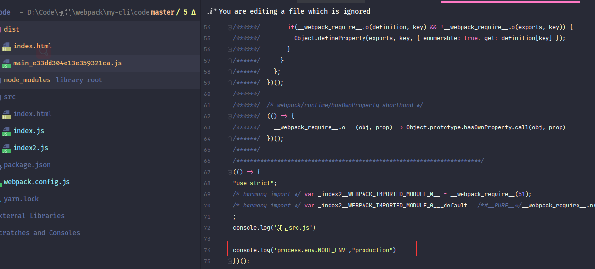

在之前简单的学习了webpack打包，本章学习下webpack的一些问题

### mode

在之前说过一个问题：webpack具有开发模式（<font style="color:#f03d3d">development</font>）和发布模式（<font style="color:#f03d3d">production</font>），这个问题跟<font style="color:#007FFF">“开发代码”</font>和<font style="color:#007FFF">“部署代码”</font>有些类似。 在开发时本地执行代码与真实部署代码肯定还是有些差距。例如：本地执行不需要压缩代码、不需要缓存。

对于这个问题 最好的做法就是我们能够配置不同的打包模块，然后使用不同命令去执行，一般脚手架就是<font style="color:#f03d3d">start</font>和<font style="color:#f03d3d">build</font>两个命令去打包成不同模式下的代码。

webpack提供了三种模式<font style="color:#f03d3d">development</font>、<font style="color:#f03d3d">production</font>、<font style="color:#f03d3d">none</font>，webpack配置对象中使用***mode***属性去设置

```javascript
 {
   mode:'development'
 }
```

也可以使用***CLI参数***传递设置相应模式


> 注意：
>
> * webpack默认mode为<font style="color:#f03d3d">production</font>
>* ***CLI参数***的优先级要大于***webpack.config***文件。
> * 有种更好的方案就是使用两个***webpack.config***文件，一般脚手架都是这样区分的，这个在后期做***webpack merge***时处理，暂时使用***CLI参数***设置


设置完毕可以使用两个命令测试下，最直接的感觉就是看生成的JS是否被压缩。这是因为在<font style="color:#f03d3d">production</font>预设了压缩**plugin**。

> <font style="color:#f03d3d">none</font>属性的差异诸君可以自己测试下


***mode***属性具有三种<font style="color:#f03d3d">development</font>、<font style="color:#f03d3d">production</font>、<font style="color:#f03d3d">none</font>，其中<font style="color:#f03d3d">development</font>、<font style="color:#f03d3d">production</font>都预设各自环境的功能，以便我们使用更少的配置完成更多的功能。但 <font style="color:#f03d3d">none</font>属性则没有预设功能。不过，<font style="color:#f03d3d">none</font>几乎也很少使用，通常只使用<font style="color:#f03d3d">development</font>和<font style="color:#f03d3d">production</font>


#### development

* **设置process.env.NODE_ENV属性**：预设了webpack内置的<font style="color:#f03d3d">DefinePlugin</font>**plugin**，这个**plugin**就是将***process.env.NODE_ENV***属性设置为<font style="color:#f03d3d">development</font>属性

* **模块和模块名称设置有效性**：预设了开发模式下将模块和模块名称设置为有效名称，增加代码的可读性

  *webpack5*设置代码可读性使用的  ***optimization***属性中的 <font style="color:#f03d3d">moduleIds</font> 、<font style="color:#f03d3d">chunkIds</font>  。在*webpack4*则使用的是webpack内置**plugin**<font style="color:#f03d3d">NamedChunksPlugin</font>和<font style="color:#f03d3d">NamedModulesPlugin</font>

  ```javascript
optimization: {
      moduleIds: 'named',
      chunkIds: 'named',
  }
  ```
  
  > ***optimization***属性是webpack配置优化策略的，这个属性稍后介绍

* **开启devtool属性**：设置***devtool***属性为<font style="color:#f03d3d">eval</font>，***devtool***是控制<font style="color:#f03d3d">SourceMap</font>是否生成和如何生成，会影响打包结果，具体在下面介绍


#### production

* **设置process.env.NODE_ENV属性**：预设了webpack内置的<font style="color:#f03d3d">DefinePlugin</font>**plugin**，这个**plugin**就是将***process.env.NODE_ENV***属性设置为<font style="color:#f03d3d">production</font>属性。

* **模块和模块名称进行混淆**：预设了发布模式将模块和模块名称进行混淆，避免代码轻易泄露

  webpack5设置代码可读性使用的  ***optimization***属性中的 <font style="color:#f03d3d">moduleIds</font> 、<font style="color:#f03d3d">chunkIds</font>  。

  ```javascript
optimization: {
      moduleIds: 'deterministic',
      chunkIds: 'deterministic',
  }
  ```
  
* **代码压缩**：预设了<font style="color:#f03d3d">terser-webpack-plugin</font>**plugin**，对打包生成的代码进行压缩

  *webpack5*默认使用的此**plugin**进行压缩的代码，在之前版本的webpack，默认使用的是<font style="color:#f03d3d">uglifyjs-webpack-plugin</font>，但是<font style="color:#f03d3d">uglifyjs-webpack-plugin</font>**plugin**后来不再维护，于是便换成了

  > 打包压缩其实是由webpack对象配置中***optimization***属性进行设置的

* **作用域提升**：预设了webpack内置的<font style="color:#f03d3d">ModuleConcatenationPlugin</font>，这个**plugin**允许在打包时添加作用域提升的处理，用于减少打包生成的代码量和执行速度。

* **打包出错处理**：预设了webpack内置的<font style="color:#f03d3d">NoEmitOnErrorsPlugin</font>**plugin**，这个**plugin**用于编译时发现出错代码则不再生成，避免打包出来的代码异常


可以看到在<font style="color:#f03d3d">development</font>、<font style="color:#f03d3d">production</font>两个模式其实预设了很少的功能，大部分还是需要手动去配置。毕竟预设太多反而会不太灵活。

> *webpack5*和*webpack4*下的<font style="color:#f03d3d">development</font>、<font style="color:#f03d3d">production</font>预设功能具有一些差异，具体请参考 [webpack5-mode](https://webpack.js.org/configuration/mode/)、[webpack4-mode](https://v4.webpack.js.org/configuration/mode/)、[显微镜下的webpack4的新特性：mode详解](https://juejin.cn/post/6844903695033843726#heading-11)


#### process.env.NODE_ENV

在预设功能时看到在无论在***development***还是在***production***都设置了这个属性。那么这个属性是做什么用的。

先来看一个需要：在调用第三方SDK时，在开发环境与正式环境使用不同的SDK，会有人想这个做个配置就行了，在上线之前改下配置路径。

但是这样其实在开发和生产打包时需要分别更改代码，来回更改也是一件很繁琐的事情，所以需要一个能在业务代码中判断环境变量的需求。

在webpack中<font style="color:#f03d3d">DefinePlugin</font>**plugin**就做了这件事，***development***和***production*** 都预设使用<font style="color:#f03d3d">DefinePlugin</font>**plugin**设置了各自环境变量。


现在便来做一个小测试

先在index.js中添加一个console


然后使用***development***打包

> yarn start

在打包生成的代码会找到这句代码


可以看到打包出来的代码替换成了**development**字符串。同理***production***会替换成**production**值，我们使用此环境变量便可以进行使用不同SDK


> 其实环境变量的重点是：<font style="color:#f03d3d">DefinePlugin</font>，这个**plugin**官方的解释是创建一个在编译时可以配置的全局变量，所以其实可以自定义配置任意属性值，在打包操作时，<font style="color:#f03d3d">DefinePlugin</font>**plugin**会将配置的属性值进行替换。而***process.env.NODE_ENV***属性只是一个*约定属性*，有兴趣的诸君可以自行测试，具体请参考[官网](https://www.webpackjs.com/plugins/define-plugin/)

```javascript
const webpack = require("webpack");

{
    plugins:[
         new webpack.DefinePlugin({ "global_a": JSON.stringify("我是一个打包配置的全局变量") }),
    ]
}
```


### source-map

在前面提到过在*development*预设了***devtool***属性，那么这个属性是什么意思呢，webpack是一个打包器，将我们开发的代码进行打包部署运行，但是这其实有一个这样的问题：无法进行调试。

应该都看到过打包生成的代码，那代码简直了。也就表示调试排查时是一场噩梦。

所以Google提供了一种工具叫做<font style="color:#f03d3d">source-map</font>，<font style="color:#f03d3d">source-map</font>提供一个映射信息，将转换后的代码与转换前所写的开发代码进行对应。

> 具体<font style="color:#f03d3d">source-map</font>介绍请参考阮一峰老师的[文章](http://www.ruanyifeng.com/blog/2013/01/javascript_source_map.html)

在webpack中使用了***devtool***属性来设置<font style="color:#f03d3d">source-map</font>

***development***模式下默认值<font style="color:#f03d3d">eval</font>；***production***模式下默认值为<font style="color:#f03d3d">false(none)</font>


在<font style="color:#f03d3d">eval</font>属性下打包的代码可以看到代码是有**eval**包含，并且在最后具有一个**sourceURL**属性。这个**sourceURL**是值是当前代码的真实文件路径。

当然也可以设置其它的值，在[webpack官网](https://webpack.js.org/configuration/devtool/)中可以看到***devtool***具有非常多的属性。不同的属性打包消耗的时间也不同。

有的属性会生成一个**.map**文件，这个文件中存放映射信息，有的直接在**.js**文件中显示映射信息。

> {
>
> ​	//	属性可以设置为false和字符串
>
> ​	devtool:false; // 'eval'
>
> }

***devtool***属性一般直接使用默认的就可以。


### optimization

在说打包器时，说过压缩（优化）代码也是打包器需要实现的需求之一。webpack作为主流的打包器必定要实现这个需求，webpack负责压缩优化配置的就是***optimization***属性。

在前面讲到，在***production***模式打包时，就会对代码进行压缩，那么又为什么说是***optimization***属性控制的压缩呢？

先进行一个有趣的小测试，在webpack对象中设置一下***optimization.minimize***属性

```javascript
  optimization:{
    minimize:false
  }
```

然后再使用***production***模式打包，会发现一个有趣的现象：代码并没有被压缩。

可以看出其实***production***模式中只不过将***optimization.minimize***属性设置为了<font style="color:#f03d3d">true</font>，而控制压缩的开关还是***optimization.minimize***属性



```javascript
  optimization:{
    // 开启默认优化
    minimize:true
  }
```

将***optimization.minimize***设置为true之后就使用默认的压缩**plugin**进行压缩，前面说过，默认的压缩**plugin**是<font style="color:#f03d3d">terser-webpack-plugin</font>。这个逻辑也很容易思考，打开优化开关，执行时就执行这个**plugin**。

> 在之前版本默认的打包**plugin**是[uglifyjs-webpack-plugin](https://www.npmjs.com/package/uglifyjs-webpack-plugin)，网上好多文章都是以这个**plugin**为基础，不过后来这个**plugin**不维护了，所以现在默认为[terser-webpack-plugin](https://www.npmjs.com/package/terser-webpack-plugin)

当然，也可以在***plugins***中手动覆盖或者自定义配置**plugin**，不过除了在***plugins***，还有一个的选择，那就是***optimization.minimizer***属性，这个属性与***plugins***一致，只不过在执行打包时做了一下缓存之类的优化

```javascript
const TerserPlugin = require('terser-webpack-plugin');

{
    plugins:[
        new TerserPlugin()
    ]
}
```

```javascript
const TerserPlugin = require('terser-webpack-plugin');

{
    optimization: {
    // 配置可优化
    minimize: true,
    minimizer: [
      new TerserPlugin()
    ]
  }
}
```


前面说过，目前流行的**plugin**基本都是经过考证的最优解，所以也就直接使用<font style="color:#f03d3d">terser-webpack-plugin</font>，不过可以自定义配置<font style="color:#f03d3d">terser-webpack-plugin</font>压缩，以达到项目需求

>  注意：<font style="color:#f03d3d">terser-webpack-plugin</font>压缩对**devtool**具有一定的要求，只支持<font style="color:#f03d3d">none</font>、<font style="color:#f03d3d">source-map</font>、<font style="color:#f03d3d">inline-source-map</font>、<font style="color:#f03d3d">hidden-source-map</font>、<font style="color:#f03d3d">nosources-source-map</font>这些属性。  <font style="color:#f03d3d">eval</font>属性生成的是字符串。**plugin**并不处理字符串。


> yarn add -D terser-webpack-plugin

<font style="color:#f03d3d">terser-webpack-plugin</font>的配置项比较麻烦，先来看看最外层的几个属性

```javascript
const TerserPlugin = require('terser-webpack-plugin');

{
    optimization: {
    // 配置可优化
    minimize: true,
    minimizer: [
      new TerserPlugin({
         //  包含哪些文件
        include: /\.js(\?.*)?$/i,
        // //  排除哪些文件
        // exclude:/\.js(\?.*)?$/i,
        //  多进程并行运行，默认为true，开启，默认并发数量为os.cpus()-1
        //  可以设置为false(不使用多线程)或者数值（并发数量）
        parallel: true,

        //  可以设置一个function，使用其它压缩plugin覆盖当前的压缩plugin，默认为undefined，
        minify: undefined,

        //  是否将注释提出到单独的文件中
        //  值Boolean|String|RegExp|Function<(node, comment) -> Boolean|Object>|Object
        //  默认为true， 只提取/^\**!|@preserve|@license|@cc_on/i注释
        //  感觉没什么特殊情况直接设置为false即可
        extractComments: false,

        //  压缩时的选项设置
        terserOptions: {}
      })
    ]
  }
}
```

> * **include**：代表包含哪些文件，这个属性可以是字符串，字符串数组或者正则，注意：这个不是文件路径匹配，而是文件名称匹配
> * **exclude**：排除哪些文件，同**include**规则一致
> * **parallel**：是否启用多线提高打包速度，这个属性可以是<font style="color:#f03d3d">boolean</font>和<font style="color:#f03d3d">number</font>，布尔属性时代表是否启用多线程，如果为<font style="color:#f03d3d">true</font>，默认多线程数量是***os.cpus()-1***， 如果是<font style="color:#f03d3d">number</font>，则表示使用的线程数量
> * **minify**：这个属性可以设置一个函数，函数内可以使用别的压缩**plugin**覆盖当前压缩**plugin**，其实就是做一个拦截处理
> * **extractComments**：表示是否将注释提取道单独的文件中，值可以为多种类型，简单的设置为<font style="color:#f03d3d">boolean</font>和<font style="color:#f03d3d">all</font>，当为<font style="color:#f03d3d">true</font>时，默认只提取/^\*\*!|@preserve|@license|@cc_on/i匹配道的注释，为<font style="color:#f03d3d">all</font>时表示提取全部，我感觉这个属性基本没什么用也。
> * **terserOptions**：这个属性代表压缩时的构建设置，压缩设置便是这个属性。

<font style="color:#f03d3d">terser-webpack-plugin</font>可以看出构造参数第一层主要是对文件的设置，并没有详细的参数设置，详细的参数设置在<font style="color:#f03d3d">terserOptions</font>属性中

###### terserOptions属性设置

至于    <font style="color:#f03d3d">common.js 模块 </font>、<font style="color:#f03d3d">ES6 模块 </font>、<font style="color:#f03d3d">AMD 模块 </font>有兴趣的诸君也可以去[深入了解](https://www.cnblogs.com/chinabin1993/p/10565816.html)下。 

