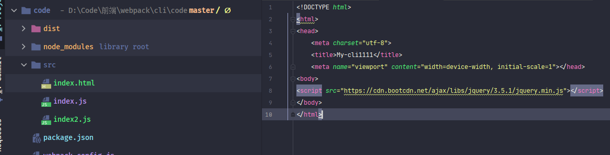
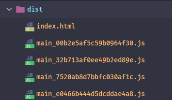

### webpack是什么

在开始代码前，首先我觉得需要明白webpack到底是个什么东西，在几乎所有文章（包括官网）中都说webpack是一个<font style="color:#f03d3d">打包器</font>，用于打包所有资源。<font style="color:#f03d3d">打包器</font>的确是webpack的作用，但是对于不知道<font style="color:#f03d3d">打包器</font>的人来说这又是一个新概念，又会迷惑于什么是<font style="color:#f03d3d">打包器</font>，我以前也迷惑了好久

抛开webpack去看本质问题，在当前时代，前端起到的作用越来越大，对于写过mvc或者更早的jsp或asp的朋友可能更有体会，那时的前端只是作为展示作用。

随着移动端和Node的崛起，前端与后端开始了分离，前端开始独立起来，逐渐走入了前端工程化的步伐，其实所谓的工程化只不过是开发者的<font style="color:#f03d3d">约定规范</font>，因为这样可以大大提高开发和学习成本，但其实对于程序运行环境（浏览器/Node）来说代码只要能识别出，就完美可以执行，

在开发者与执行环境之间就出现了差异，开发者想要更规范、更效率的编写代码，而执行环境需要能更快、兼容性越好的代码。这时候就需要一个桥梁，来架起开发者与执行环境之间的差异，然后就有了<font style="color:#f03d3d">打包器</font>

<font style="color:#f03d3d">**打包器就是一个将<font style="color:#007FFF">开发代码</font>编译成<font style="color:#007FFF">可部署代码</font>的编译器**	</font>。


将<font style="color:#007FFF">“开发代码”</font>编译为<font style="color:#007FFF">“可部署代码”</font>之间就有很多需求需要实现，CSS兼容、压缩、浏览器语法问题等等，而这些功能都是由打包器来完成。


市面上也有好几个主流的打包工具：<font style="color:#f03d3d">grunt</font>，<font style="color:#f03d3d">gulp</font>，<font style="color:#f03d3d">webpack</font>，<font style="color:#f03d3d">rollup</font>，每一个都有各自的优缺点。目前主流的脚手架都是使用的<font style="color:#f03d3d">webpack</font> 所以我也是学习webpack，以webpack来学习脚手架


webpack是一个优秀的***JavaScript应用程序***的静态模块打包器。具有高度可配置的优势，前面说过：打包就是将开发代码编译成可发布代码，而不同的项目他们的对浏览器等要求不一样，例如有的要求兼容ie，有的直接只兼容google即可，所以不同的项目中打包需求不一样。所以webpack并没有提供一个全而大的打包器，而只是提供了一个<font style="color:#f03d3d">**核心引擎**</font>， 只负责JS的打包，而其它功能则交给<font style="color:#f03d3d">**插件**</font>进行完成。 

> :whale2::whale2:	 这里说的<font style="color:#f03d3d">**插件**</font>并不是指的webpack中的***plugins***，而是<font style="color:#f03d3d">**插件化**</font>的意思，为了避免与webpack中的<font style="color:#f03d3d">**plugins**</font>名称冲突，在文章中webpack中***plugins***统一叫做<font style="color:#f03d3d">**plugins**</font>，这里所说的插件统一叫做<font style="color:#f03d3d">**扩展**</font>


 开发人员只需要安装符合自己需求的*扩展*就可以达到自己的目的，而*扩展*则可以交给社区去完成。社区中具有大量的插件，相同功能的插件有的都有好多。所以，在学习webpack时，我个人建议转换一下思想： <font style="color:#f03d3d">**不要想这个东西是什么，而要想我们需要什么**	</font> 需要压缩，那么寻找压缩的插件，需要css打包，寻找关于css的插件。  只不过经过了这么多年的发展，已经挑选出了最优解，所以使用的都是指定的插件。就像现在所有虚拟机的JC算法设计都相同一样。


在上一篇文章中讲到package文件中的<font style="color:#f03d3d">devDependencies</font>留了一个问题：什么是开发环境依赖，这里其实就可以总结出：<font style="color:#f03d3d">**部署之前的依赖环境，也就是构建工程化使用到的依赖环境**	</font> 。在判断其环境依赖时，可以思考一下，这个包是否是在浏览器中执行时所用的包，如果是，就添加到<font style="color:#f03d3d">dependencies</font>依赖，如果不是，就添加到<font style="color:#f03d3d">devDependencies</font>依赖


> :whale2:	<font style="color:#f03d3d">构建工程化依赖环境</font>包括打包使用依赖、开发时的eslint、还有脚手架中使用的测试依赖


### webpack 基本使用

#### webpack安装

在上篇文章已经安装了<font style="color:#f03d3d">webpack@5.4</font>包，所以只需要再安装<font style="color:#f03d3d">webpack-cli</font>即可,webpack-cli用于在命令行中运行webpack，如果不安装<font style="color:#f03d3d">webpack-cli</font>运行webpack命令时会报错


> yarn add -D  webpack-cli     // 安装到<font style="color:#f03d3d">devDependencies</font>依赖。


然后在package文件中的***scripts***属性中加入一个<font style="color:#f03d3d">build：webpack</font>指令


此时使用*yarn build*会执行webpack命令，虽然会因为我们没有配置而失败，但是webpack还是能运行的。诸君有兴趣的可以将<font style="color:#f03d3d">webpack-cli</font>包移除再build，会发现webpack无法运行，并且提示安装<font style="color:#f03d3d">webpack-cli</font>


接下来在根目录创建以下文件/目录


* ***webpack.config.js***此文件是编写webpack配置的文件，webpack在执行时会去执行此文件，以此文件去进行打包

  > :whale2:	根目录webpack.config.js 文件为一个默认约定文件，在你不指定配置文件时，便会执行根目录的这个文件，当然也可以使用参数去控制配置文件，也推荐使用参数配置，参数配置可以改变其目录和名称。

  

* ***src***此目录作为工作目录，约定其目录为开发文件目录，当然目录名称可以随意，但是目前约定都是使用src这个名称。在src目录下拥有一个js文件，这个文件作为配置入口文件，在前面说过，webpack(打包器)是一个将开发代码编译为可发布代码类似的编译工具，所以必须具有入口（读取）和输出（写入），否则就不能称之为“桥梁”。在webpack配置中<font style="color:#f03d3d">entry</font>（入口）、<font style="color:#f03d3d">output</font>（输出）是必备的两个属性。在index.js就作为其入口文件，在主流的脚手架中都具有一个index.js文件

接下来就可以在***webpack.config.js***编写配置项了

> :whale2::whale2:
>
> * webpack是基于node.js运行的，  你写webpack不是在写<font style="color:#007FFF">**JS**</font>，而是在写<font style="color:#007FFF">**Node.JS**</font> 。所以webpack中的语法都是<font style="color:#007FFF">**Node.JS**</font> 语法。
>
> * 在webpack中也会经常使用到node.js的基本包，例如使用<font style="color:#f03d3d">require('path')</font>来获取当前目录
> * 打包器其实不一定非要使用node.js，也可以使用java、c#等任何一门语言
> * 打包器其实就是IO操作，将<font style="color:#f03d3d">entry</font>（入口）文件数据读取并经过扩展的包装写入到<font style="color:#f03d3d">output</font>（输出）文件


#### webpack.config.js文件详解

##### webpack.config.js文件总览

在*webpack.config.js*中我们需要抛出一个**模块**，这个模块可以是一个对象，也可以是一个函数（函数返回值必须为对象），而webpack的所有配置项都写在这个对象中。

webpack约定配置项的属性名称，开发者根据其配置名称去设置自己想要的属性值。然后webpack在执行时，会导入这个文件中的模块，加载webpack配置去执行对应的操作。诸君可以脑补一下这个流程，

```javascript
const modules = {}
module.exports = modules
```

```javascript
const modules = ()=>{}

module.exports = modules
```


##### entry、output

打包器最重要的是<font style="color:#f03d3d">entry</font>（入口），<font style="color:#f03d3d">output</font>（输出）文件，所以先来去看看这两个属性

```javascript
const path = require('path')

const modules = {
  //  入口文件
  //  字符串形式
   entry:path.join(__dirname, 'src/index.js'),
  //  对象形式
  // entry:{
  //   'index':path.join(__dirname, 'src/index.js')
  // },

  //  输出文件
  //  字符串形式
  // output:path.join(__dirname, 'dist/[name].js')
  //对象形式
  output:{
    //  输出文件的目录地址
    path:path.join(__dirname, 'dist'),
    //  输出文件名称，contenthash代表一种缓存，只有文件更改才会更新hash值，重新打包
    filename: '[name]_[contenthash].js'
  }
}

//  使用node。js的导出，将配置进行导出
module.exports = modules
```

代码代表了一个最基本的一个打包器，将*src/index.js*文件打包到*dist*目录下，用到的webpack属性是<font style="color:#f03d3d">entry</font>、<font style="color:#f03d3d">output</font>

* entry：入口文件地址，这个属性可以是一个字符串（js入口文件的地址），也可以是一个对象，对象中可以设置多个入口文件，一般拥有多页面开发，至于多页面开发的配置，就不在此赘述，诸君可以去看其它[参考资料](https://www.sohu.com/a/323226642_495695)，单页面程序一般字符串即可
* output：输出文件地址，这个属性也是可以是一个字符串或者对象，字符串直接设置地址+文件名，对象形式则可以比较清晰和详细的设置，一般使用对象形式。 文件名称使用了一个<font style="color:#f03d3d">[contenthash]</font>名称，这是一个webpack打包缓存的一种机制，当打包文件修改了hash值才会改变，然后重新打包。文件不更改则会拦截打包操作。缓存一般会在<font style="color:#f03d3d">production</font>模式下设置, 还有两个<font style="color:#f03d3d">[hash]</font>、<font style="color:#f03d3d">[chunkhash]</font>也可以设置缓存，具体请参考[webpack中hash、chunkhash、contenthash区别](https://www.cnblogs.com/giggle/p/9583940.html)

> :whale2:	 在webpack.json文件中使用了***require('path')***库来获取当前绝对地址，然后再加上相对路径确保路径的完整性


配置完之后使用*yarn build*执行打包操作，执行完毕后，会在当前目录创建一个dist目录并且具有一个.js文件，里面就是src/index.js内容


整套操作下来感觉就像一个cv过程，将一个js文件从src复制到了dist目录，虽然的确是复制，但是也不仅仅只是复制，当前只是一个单文件的demo，

下面在src目录下创建一个index2.js,并且，在index.js中进行import导入


然后再次build，会在dist目录下多出一个文件，查看会发现，两个文件的内容都打包在了那个文件中，


> :whale2::whale2: 打包后的文件会是压缩后的代码，并且代码中多出许多webpack构建的代码，压缩的代码是因为打包使用的<font style="color:#f03d3d">mode=production</font>，也就是发布模式，而如果想要不压缩代码可以在webpack.json配置文件中添加一个<font style="color:#f03d3d">mode:'development'</font>属性，意思是使用开发模式打包，至于两种模式，稍微再讲解


这就是webpack强大的地方，webpack在打包时，会递归的构建一个依赖图（*dependency graph*），然后根据这个依赖图将所有模块进行打包。如果在index.js将引入index2.js的代码注释或者删除，那么index2.js文件便不会被打包。有兴趣的诸君可以测试一下。


##### plugins

webpack只提供了一个<font style="color:#f03d3d">**核心引擎**</font>。而大部分功能则需要使用***插件化***形式扩展。

在webpack配置对象中具有一个<font style="color:#f03d3d">plugins</font>的属性名称，这个属性就是设置***plugin***的，该属性需要提供一个数组，数组内存放***plugin***对象。webpack在执行时会顺序执行<font style="color:#f03d3d">plugins</font>数组中的***plugin*** 。  下面先来看看常用的两个***plugin***（后续使用***plugin***时会直接加入）

> :whale2: ***plugin*** 编写具有一定的规则，有兴趣的诸君可以去看下[官网](https://www.webpackjs.com/concepts/plugins/)


> :whale2::whale2: webpack默认只是一个***JavaScript应用程序***的打包器，不会处理像CSS、image、typescript等非js模块，webpack中使用了一个叫做<font style="color:#f03d3d">loader</font>的属性***加载***非JS模块并将其**转换**为JS模块处理，，诸君可以思考一下这样的流程。 在webpack中<font style="color:#f03d3d">plugins</font>和<font style="color:#f03d3d">loader</font>是两个核心概念，一个扩展了打包的额外功能（<font style="color:#f03d3d">plugins</font>），一个将**非JS模块**转换为webpack识别的**JS模块**（<font style="color:#f03d3d">loader</font>）。两者分工不同，两者结合了促成了webpack***插件化***的系统。完成了高度扩展。两者的分工和不同在之后会慢慢了解。

###### html-webpack-plugin

诸君请思考一个问题，刚才打包的是JS文件，那么实际上浏览器运行的是***HTML***文件。就算我们将所有业务逻辑都以JS（Document类型）去完成，但是依然需要一个容器承载JS。所以需要打包一个HTML或者在打包的过程中，创建一个HTML文件。并且将此HTML必须引用打包后的JS文件。

webpack中构建这个HTML页面则交给了一个***plugin***来完成，这个***plugin***叫做<font style="color:#f03d3d">html-webpack-plugin</font>

刚才说过，webpack默认只负责JS，而非JS则交给***loader***进行转换，那html为什么不需要***loader***呢？我的理解是html不需要做转换为JS处理，它是一个承载JS的容器。


>  yarn add -D html-webpack-plugin      打包时使用的依赖包


安装完包之后，需要在webpack文件中进行引用

```javascript
const HtmlWebpackPlugin = require('html-webpack-plugin')

const modules = {
  plugins: [
    new HtmlWebpackPlugin()
  ]
}

//  使用node。js的导出，将配置进行导出
module.exports = modules
```

再次build就可以看到dist目录中多了一个html文件，html中还引用了一个js文件，代表打包成功了，可以使用浏览器打开这个html，会在控制台中输出js文件中的console语句。


简单的使用了<font style="color:#f03d3d">html-webpack-plugin</font>创建了执行容器HTML，但是HTML的创建一般都是需要定制一些东西，例如：title、mata等信息，并且我们看到的脚手架都是使用自己创建的*index.html*文件，打包后的html文件是以此文件进行模板。那些操作都是使用了

<font style="color:#f03d3d">html-webpack-plugin</font>的参数配置，传入是以构造函数方式传入的。

```javascript
plugins: [
    new HtmlWebpackPlugin({
      //  template的title优先级大于当前数据
      title:'my-cli',
      //  文件名称
      filename:'index.html',
      //  模板路径
      template:path.join(__dirname, 'src/index.html'),
      // 用于打包后引用脚本时的路径
      publicPath:'./',

      //  是否将打包的资源引用到当前HTML， false代表不引用
      //  true或者body将打包后的js脚本放入body元素下，head则将脚本放到中
      //  默认为true
      inject:'body',
      //  加载js方式，值为defer/blocking
      //  默认为blocking, 如果设置了defer，则在js引用标签上加上此属性，进行异步加载
      scriptLoading:'blocking',

      //  是否进行缓存，默认为true，在开发环境可以设置成false
      cache:false,
      //  添加mate属性
      meta:{}
    })
  ]
```

> * **title**	这个属性是设置html的title属性，这个属性只有在没有***template***时有效，具有***template***数据时，会使用***template***的title属性
> * **filename**  打包输出的文件名称
> * **template** 本地html模板地址，此模板中的其它引用都会原封不动的进行引用。例如下面html引用了jquery，在打包完成后还是具有jquery的引用，并且在js中可以使用jquery，诸君可以使用[CDN](https://cdn.bootcdn.net/ajax/libs/jquery/3.5.1/jquery.min.js)连接测试一下  
> * **publicPath**  打包后引用脚本时的路径，配置中的路径为<font style="color:#f03d3d">./</font>，在html中引用js的路径就以<font style="color:#f03d3d">./</font>目录为准，其它包好多都有这个属性。
> * **inject**  这个属性代表将打包后的js脚本放的位置，值可以为true、false、head、body 如果为false，则不加入打包的js，true和body代表添加到body元素之后。head则将js脚本放入head元素之中
> * **scriptLoading**  加载js的方法，值为blocking、defer。默认为blocking 。  具体介绍请看[本文章](https://segmentfault.com/q/1010000000640869)
> * **cache**  代表是否要缓存html，默认为true，在开发环境可以设置成false
> * **meta** 就是设置meta属性值的配置

上面列举了部分<font style="color:#f03d3d">html-webpack-plugin</font>属性，其中***template***属性需要是一个本地的html路径，所以需要创建一个html文件。 更多属性可以去[npm](https://www.npmjs.com/package/html-webpack-plugin)中查看




###### clean-webpack-plugin

在打包之后其实会发现一个恶心的问题：每次打包都是往dist目录去**添加**文件，而不是清空dist目录再添加，在刚才完成的几次build之后，dist目录已经具有好多文件了



这个问题在demo中还能忍受，但是在真正项目中那么多文件，多打几次包绝对是一场可怕的噩梦，所以肯定要在每次打包时都清空输出目录，在webpack中由一个**plugin**就是提供这个需求，这就是<font style="color:#f03d3d">clean-webpack-plugin</font>

> yarn add -D clean-webpack-plugin


在webpack中直接配置使用即可

```JavaScript
const { CleanWebpackPlugin } = require('clean-webpack-plugin')
 plugins: [
    new CleanWebpackPlugin()
  ]
```

> :whale2::whale2:	 <font style="color:#f03d3d">clean-webpack-plugin</font>导入包使用的***{ CleanWebpackPlugin }***接收，而不是<font style="color:#f03d3d">html-webpack-plugin</font>那种别名机制，原因是<font style="color:#f03d3d">html-webpack-plugin</font>导出的是默认：export default 。导入时只是以一个变量接收，而<font style="color:#f03d3d">clean-webpack-plugin</font>导出的是一个对象，对象中具有***CleanWebpackPlugin ***类型，所以使用时名称不能更改


**CleanWebpackPlugin **类型构造函数中也可以传入配置参数进行控制

```javascript
 new CleanWebpackPlugin({
      //  是否允许假装文件删除
      //  如果为false则代表真实删除，如果为true，则代表不删除
      dry:false,
      //  是否打印日志到控制台 默认为false
      verbose: true,
      //  允许保留本次打包的文件
      //  true为允许，false为不允许，保留本次打包结果，也就是会删除本次打包的文件
      //  默认为true
      protectWebpackAssets:true,
      //  每次打包之前删除匹配的文件
      cleanOnceBeforeBuildPatterns:["*.html"],

      //  每次打包之后删除匹配的文件
      cleanAfterEveryBuildPatterns:["*.js"],
    })
```

> **dry**  这个参数是控制是否允许假装文件删除，官方文档的描述是：*Simulate the removal of files*，我的理解是当设置为true时，文件就不允许被删除，如果设置为false，则允许删除规则去删除
>
> **verbose** 是否将日志打印到控制台。默认为false
>
> **protectWebpackAssets** 是否保留本次打包的文件，true为保留，false为清除，默认为true，将这个配置设置为false后会将当前打包的数据清除掉。
>
> **cleanOnceBeforeBuildPatterns** 打包之前删除匹配到文件  默认值为['**/\*']
>
> **cleanAfterEveryBuildPatterns** 打包之后删除匹配到的文件 默认值为[]


其实在真实开发中这个**plugin**完全没必要配置，毕竟每次打包都是想要新结果。而这个**plugin**只是清理目录

> :whale2::whale2:	 在测试**plugin**配置时，每次修改一下index.js文件数据，因为output设置了*[contenthash]*,所以如果不修改，不会重新打包


随着本章的学习已经已经构建出一个简单的webpack配置，虽然距离真正的脚手架还有天大的差距，但是一步一个脚印，慢慢来。


### 总结

> :whale2::whale2::whale2:
>
> * 打包器是将**开发代码**编译为**可部署**代码的*"编译器"*，webpack则是目前流行的打包器一种
> * webpack是使用Node.js作为打包语言运行的
> * webpack需要抛出一个模块，虽然可以是对象或者是函数，但是其结果必须是配置对象
> * webpack只提供一个**核心引擎**，其余交给扩展进行完成
> * webpack是一个**JavaScript应用程序**，默认只支持JS模块，对于非JS模块需要使用**loader**转换为JS模块

### 本文参考

* [webpack官网](https://webpack.js.org/)
* [webpack中hash、chunkhash、contenthash区别](https://www.cnblogs.com/giggle/p/9583940.html)

### 本文依赖

* [webpack@5.4](https://www.npmjs.com/package/webpack/v/5.4.0)
* [webpack-cli@4.2.0](https://www.npmjs.com/package/webpack-cli/v/4.2.0)
* [html-webpack-plugin@4.5.0](https://www.npmjs.com/package/html-webpack-plugin/v/4.5.0)
* [clean-webpack-plugin@3.0.0](https://www.npmjs.com/package/clean-webpack-plugin/v/3.0.0)


### package.json 

```json
{
  "name": "my-cli",
  "version": "1.0.0",
  "main": "index.js",
  "author": "mowenjinzhao<yanzhangshuai@126.com>",
  "license": "MIT",
  "devDependencies": {
    "clean-webpack-plugin": "^3.0.0",
    "html-webpack-plugin": "^4.5.0",
    "webpack": "5.4",
    "webpack-cli": "^4.2.0"
  },
  "dependencies": {
    "jquery": "^3.5.1"
  },
  "scripts": {
    "start": "node",
    "build": "webpack --config webpack.config.js"
  }
}

```

### webpack.config.js

```javascript
const path = require('path')

const modules = {
  //  入口文件
  //  字符串形式
  entry:path.join(__dirname, 'src/index.js'),
  //  对象形式
  // entry:{
  //   'index':path.join(__dirname, 'src/index.js')
  // },

  //  出口文件
  //  字符串形式
  // output:path.join(__dirname, 'dist/[name].js')
  //对象形式
  output:{
    //  出口文件的目录地址
    path:path.join(__dirname, 'dist'),
    //  出口文件名称，contenthash代表一种缓存，只有文件更改才会更新hash值，重新打包
    filename: '[name]_[contenthash].js'
  },
    
  plugins: [
    new HtmlWebpackPlugin({
      //  template的title优先级大于当前数据
      title: 'my-cli',
      //  文件名称
      filename: 'index.html',

      //  模板路径
      template: path.join(__dirname, 'src/index.html'),
      // 用于打包后引用脚本时的路径
      publicPath: './',

      //  是否将打包的资源引用到当前HTML， false代表不引用
      //  true或者body将打包后的js脚本放入body元素下，head则将脚本放到中
      //  默认为true
      inject: 'body',
      //  加载js方式，值为defer/blocking
      //  默认为blocking, 如果设置了defer，则在js引用标签上加上此属性，进行异步加载
      scriptLoading: 'blocking',

      //  是否进行缓存，默认为true，在开发环境可以设置成false
      cache: false,
      //  添加mate属性
      meta: {}
    }),
    new CleanWebpackPlugin({

      //  假装文件删除
      //  如果为false则代表真实删除，如果为true，则代表不删除
      dry: false,
      //  是否打印日志到控制台 默认为false
      verbose: true,
      cleanStaleWebpackAssets: false,
      //  允许保留本次打包的文件
      //  true为允许，false为不允许，保留本次打包结果，也就是会删除本次打包的文件
      //  默认为true
      protectWebpackAssets: true,
      //  每次打包之前删除匹配的文件
      cleanOnceBeforeBuildPatterns: ['**/*'],

      //  每次打包之后删除匹配的文件
    })
  ]
}

//  使用node。js的导出，将配置进行导出
module.exports = modules
```
