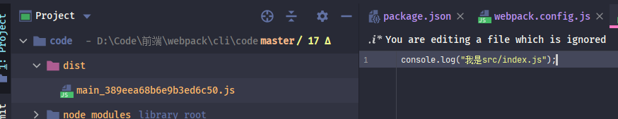
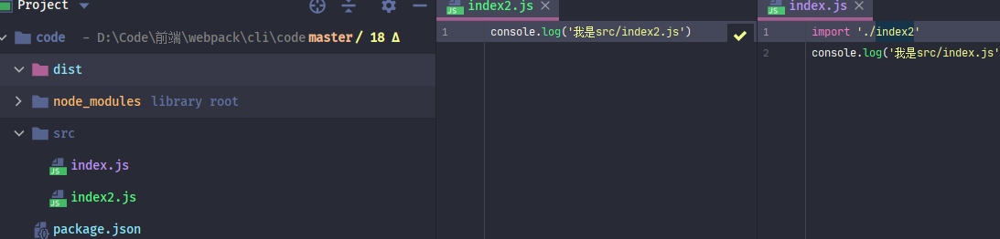
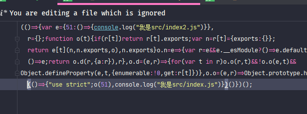
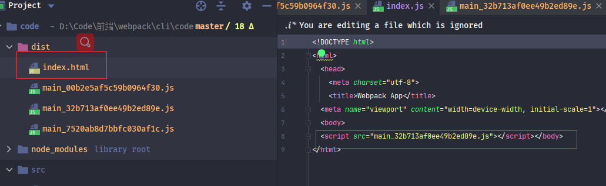
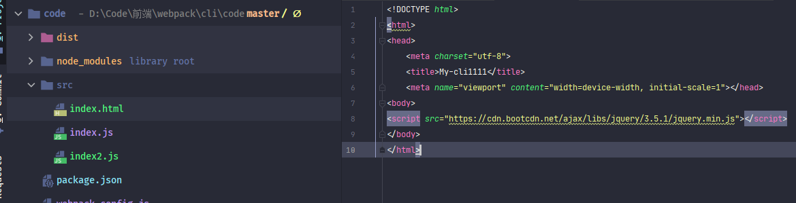
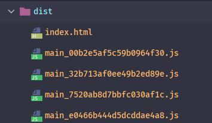
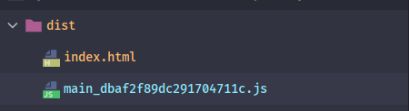

### webpack是什么

#### 打包器

在使用<font style="color:cornflowerblue">webpack</font>之前，首先需要明白<font style="color:cornflowerblue">webpack</font>到底是个什么东西。

几乎所有文章（包括官网）中都说<font style="color:cornflowerblue">webpack</font>是一个<font style="color:cornflowerblue">**打包器**</font>，用于打包所有资源。

<font style="color:cornflowerblue">webpack</font>确实是一个<font style="color:cornflowerblue">打包器</font>，但是对于不知道<font style="color:cornflowerblue">打包器</font>的朋友来说还是会有些迷惑。

抛开<font style="color:cornflowerblue">webpack</font>去看问题本质。


当前时代，前端的作用越来越大，对于写过<font style="color:cornflowerblue">MVC</font>或者更早的<font style="color:cornflowerblue">JSP</font>或<font style="color:cornflowerblue">ASP.NET</font>的朋友可能更有体会，那时代的前端只是作为展示作用。

随着<font style="color:cornflowerblue">移动端</font>和<font style="color:cornflowerblue">Node.JS</font>的崛起，前端进入了新的时代。

前端与后端进行了分离，前端开始独立部署，逐渐走入了工程化的步伐。


首先对于独立部署，就会有很多的工作需要完成，最容易想到的就是压缩。

<font style="color:cornflowerblue">MVC</font>时代，压缩工作都是由后端进行完成。但是对于已经独立部署的前端，这项工作只能由前端自行完成。

当然还有逐渐更新的<font style="color:cornflowerblue">JS</font>、<font style="color:cornflowerblue">CSS</font>和浏览器兼容性等一系列问题。


这些问题其实可以总结为<font style="color:#007FFF">可部署环境代码</font>和<font style="color:#007FFF">开发环境代码</font>之间的冲突。


那么能不能提供一个桥梁来连接两种环境代码呢？最好能够提供一个***黑匣子***，能够让我们使用一个命令将<font style="color:#007FFF">开发环境代码</font>编译为<font style="color:#007FFF">可部署环境代码</font>

<font style="color:cornflowerblue">打包器</font>就是这么一个***黑匣子***


<font style="color:cornflowerblue">打包器</font>是个***黑匣子***这是对于大部分写业务的程序员来说的，他们只需要完成业务模块。

但是对于项目管理者，<font style="color:cornflowerblue">打包器</font>就必须掌握，毕竟由于前端的特殊性，导致需要自己配置属于自己项目的<font style="color:cornflowerblue">打包器</font> 。所以对于<font style="color:cornflowerblue">打包器</font>的了解也基本属于前端必修课。


#### webpack

<font style="color:cornflowerblue">webpack</font>就属于一个<font style="color:cornflowerblue">打包器</font>工具。目前市面上也有好多其它<font style="color:cornflowerblue">打包器</font>工具：[grunt](https://gruntjs.com/)，[gulp](https://gulpjs.com/)，[rollup](https://rollupjs.org/guide/en/)、还有尤大新开发[vite](https://vite-design.surge.sh/guide/chinese-doc.html)。每一个<font style="color:cornflowerblue">打包器</font>都有各自的优缺点。

不过截止到目前最流行的还是<font style="color:cornflowerblue">webpack</font> 。所以在此也是以<font style="color:cornflowerblue">webpack</font>作为学习、

<font style="color:cornflowerblue">webpack</font>是一个优秀的<font style="color:#06f">***JavaScript应用程序***</font>的静态模块打包器，具有高度可配置的优势，因此也被业界称为最麻烦之一。


前面说过：<font style="color:cornflowerblue">打包器</font>就是将<font style="color:#007FFF">开发环境代码</font>进行编译为<font style="color:#007FFF">可部署环境代码</font>。

而不同的项目对<font style="color:#007FFF">可部署环境代码</font>的要求又不一致。所以<font style="color:cornflowerblue">webpack</font>并没有提供一个全而大功能，而只是提供了一个<font style="color:#06f">**核心引擎**</font>， 只负责<font style="color:cornflowerblue">JS</font>文件的依赖打包，其它功能使用<font style="color:#06f">**插件化**</font>进行配置 。 

> :whale2::whale2::whale2: 这里说的<font style="color:#06f">**插件化**</font>并不是指的<font style="color:cornflowerblue">webpack</font>中的***plugin***，而是***扩展***的意思，为了 避免和<font style="color:cornflowerblue">webpack</font>中***plugin***翻译歧义。<font style="color:cornflowerblue">webpack</font>中***plugin***就不做翻译。


一般开发人员使用<font style="color:cornflowerblue">webpack</font>实现某个功能时，只需要寻找符合自己需求的<font style="color:cornflowerblue">插件</font>就可以。<font style="color:cornflowerblue">插件</font>则由强大的社区维护。

社区中具有海量的<font style="color:cornflowerblue">插件</font>，相同功能的都有好多。所以，在学习<font style="color:cornflowerblue">webpack</font>时，

我个人建议转换一下思想： <font style="color:#06f">**不要想这个东西是什么，而要想我们需要什么**	</font>。根据自己需求去寻找合适的<font style="color:cornflowerblue">插件</font>。

经过了这么多年的发展，大部分功能的<font style="color:cornflowerblue">插件</font>已经具有了最优解，形成了<font style="color:cornflowerblue">插件</font>固定化。就像现在大部分语言运行环境的**GC算法**都是**引用跟踪算法**一样。


在上一篇文章中讲到**package.json**文件中的**devDependencies**留了一个问题：*什么是开发环境依赖*。

其实就可以总结出：<font style="color:#06f">构建工程化依赖环境</font>时使用的依赖库。

> :whale2:	<font style="color:#06f">构建工程化依赖环境</font>包括<font style="color:cornflowerblue">打包器</font>、还有<font style="color:cornflowerblue">eslint</font>和<font style="color:cornflowerblue">单元测试库</font>


### webpack 基本使用

#### webpack安装

在之前已经安装了[webpack@5.24.0](https://www.npmjs.com/package/webpack/v/5.24.0)依赖库，

在这里只需要安装<font style="color:#f03d3d">webpack-cli</font>即可，<font style="color:#f03d3d">webpack-cli</font>类似一个简易的客户端，用来以<font style="color:cornflowerblue">webpack</font>连接对应服务。

如果不安装<font style="color:#f03d3d">webpack-cli</font>执行`webpack`命令时会提示安装<font style="color:#f03d3d">webpack-cli</font>

> yarn add -D  webpack-cli@4.5.0     // 安装到**devDependencies**依赖。


在**package.json**文件***scripts***属性中加入`build：webpack`命令


此时执行`yarn build`就会执行`webpack`命令

虽然会因为没有配置项而失败，但<font style="color:cornflowerblue">webpack</font>成功运行了。


> :whale2: <font style="color:cornflowerblue">webpack</font>可以直接使用命令行参数打包文件，不过在此就不赘述，有兴趣的朋友可以参考官网


#####  webpack.config.js

在根目录中创建一个**webpack.config.js**，此文件是<font style="color:cornflowerblue">webpack</font>配置项文件

**webpack.config.js**文件必须抛出一个**模块**，这个**模块**可以是一个**Object**，也可以是一个返回值为**Object**的函数，<font style="color:cornflowerblue">webpack</font>属性就配置在这个**Object**中

<font style="color:cornflowerblue">webpack</font>执行时会读取**webpack.config.js**文件模块，根据此**Object**中的配置信息进行打包编译


​	

根目录**webpack.config.js** 文件名称是一个**约定文件名称**。

在不指定配置文件情况下，<font style="color:cornflowerblue">webpack</font>会读取根目录**webpack.config.js**文件。

当然也可以使用参数指定配置文件，也推荐这样做，参数指令可以更改配置文件的目录和名称


##### 工作目录

接下来创建**/src**目录、**/src/index.js**文件


在使用<font style="color:cornflowerblue">vue-cli</font>、<font style="color:cornflowerblue">react-cli</font>时都会具有一个**/src**目录，这是一个**约定的工作目录**。

项目中的代码文件都存放此目录下。

当然此目录名称可以随意设置，只不过约定为**/src**。


**/src/index.js**文件，是一个<font style="color:cornflowerblue">entry（入口）</font>文件。

<font style="color:cornflowerblue">打包器</font>作为一个将<font style="color:#007FFF">开发环境代码</font>***编译***为<font style="color:#007FFF">可部署环境代码</font>的桥梁，那么就必须 至少拥有一个<font style="color:cornflowerblue">entry（开发环境代码）</font>和一个<font style="color:#007FFF">output（可部署环境代码）</font>

**/src/index.js** 就作为这么一个<font style="color:cornflowerblue">entry（入口）</font>文件

> :whale2: **index.js** 文件名称也是约定名称。


#### wbepack简单配置


##### entry、output

既然<font style="color:cornflowerblue">打包器</font>必须有<font style="color:cornflowerblue">entry（入口）</font>和<font style="color:cornflowerblue">output（输出）</font>，那么就由这两个属性开始。

<font style="color:cornflowerblue">webpack</font>中就是使用**entry**和**output** 作为两者的属性名称，这两个属性都可以灵活配置。

```javascript
const path = require('path')

const modules = {
  //  入口文件
  //  字符串形式
   entry:path.join(__dirname, 'src/index.js'),
  //  对象形式
  // entry:{
  //   'index':path.join(__dirname, 'src/index.js')
  // },

  //  输出文件
  //  字符串形式
  // output:path.join(__dirname, 'dist/[name].js')
  //对象形式
  output:{
    //  输出文件的目录地址
    path:path.join(__dirname, 'dist'),
    //  输出文件名称，contenthash代表一种缓存，只有文件更改才会更新hash值，重新打包
    filename: '[name]_[contenthash].js'
  }
}

//  使用node.js的导出，将配置进行导出
module.exports = modules
```
> * **entry**：入口文件。
>
>   属性可设置为：*String*、*Object*、*Array*
>
>   属性值为***String***：直接设置一个入口文件地址
>
>   属性值为***Object***：对入口文件进行详细设置和 可以设置多个入口文件
>
>   属性值为***Array***：设置多个入口文件
>
>   
>
>   > :whale2: <font style="color:cornflowerblue">webpack</font>允许设置多个<font style="color:cornflowerblue">entry（入口）</font>文件，打包编译出多个文件。一般用于<font style="color:cornflowerblue">多页面配置</font>
>   >
>   > 至于多页面开发配置，就不在此赘述，有兴趣的朋友可以去查阅下[参考资料](https://www.sohu.com/a/323226642_495695)，单页面程序直接设置*String*即可
>
>   
>
> * **output**：输出文件。
>
>   属性可设置为：*String*、*Object*
>
>   属性值为***String***：直接设置一个输出文件地址
>
>   属性值为***Object***：输出文件地址和文件名称详细设置
>
>   > :whale2:  <font style="color:cornflowerblue">webpack</font>在设置**output.filename**时，允许使用**[name]** 保留 **entry**属性设置的文件名称。
>   >
>   > **entry**为**String**时，**[name]**为文件名称
>   >
>   > **entry**为*Object*时，**[name]**为 对象的***key***
>
>   > :whale2: **output**s属性中的**[contenthash]**，是一个<font style="color:cornflowerblue">webpack</font>提供的一种打包缓存的机制。 <font style="color:cornflowerblue">webpack</font>会为打包编译生成一个**hash**值。只有更改源文件后才会重新打包编译，生成新的**hash**。 缓存机制一般只会在<font style="color:cornflowerblue">生产模式（production）</font>使用。
>   >
>   > <font style="color:cornflowerblue">webpack</font>还提供了两个属性 **[hash]**、**[chunkhash]** 设置缓存，具体区别请参考：[webpack中hash、chunkhash、contenthash区别](https://www.cnblogs.com/giggle/p/9583940.html)


> :whale2: ：**__dirname** 属性是<font style="color:cornflowerblue">Node.JS</font>基础库中属性，表示当前文件的绝对路径。等同于**path.dirname()**。

> :whale2:	 **webpack.json**文件中使用了<font style="color:cornflowerblue">Node.JS</font>**基础库（require('path')）**获取文件绝对地址，更准确的保证文件目录的完整性。当然也可以只使用相对地址，不过不推荐


此时使用`yarn build`命令就可以执行<font style="color:cornflowerblue">webpack</font>。 最终会在根目录创建**/dist**，并在**/dist**目录下生成一个 **.js** 文件。

文件中就是**/src/index.js**中的内容



以上就是一个最简单的<font style="color:cornflowerblue">webpack</font>配置，只是将<font style="color:cornflowerblue">entry（入口）</font>文件打包编译到<font style="color:cornflowerblue">output（输出）</font>。


不过<font style="color:cornflowerblue">webpack</font>本身是一个强大的<font style="color:#06f">***JavaScript应用程序***</font>

接下来做小测试，在**/src**目录中创建**index2.js**，并在**index.js**中导入




此时再进行`yarn build`，**/dist**目录下会自动再创建一个**.js**文件，这个**.js**文件就是这次打包的输出问题。

从文件中具有**index.js**和**index2.js**内容



> :whale2::whale2: 打包后文件会进行压缩，并且代码会多出许多<font style="color:cornflowerblue">webpack</font>构建的代码。
>
> ​			代码压缩是因为<font style="color:cornflowerblue">webpack</font>默认使用的是<font style="color:cornflowerblue">生产模式（production）</font>。如果想要不压缩代码可以在**webpack.json**文件中添加一个				**mode:'development'**属性，至于这两个属性意思下一篇再详细讲解。 


这就是<font style="color:cornflowerblue">webpack</font>的强大功能之一。 <font style="color:cornflowerblue">webpack</font>在打包处理文件时，会递归的构建一个***依赖图（dependency graph）***，根据这个***依赖图***将所有使用到的**JS模块**进行打包。

> :whale2:如果在**index.js**将引入**index2.js**的代码注释或者删除，那么**index2.js**文件内容便不会被打包。有兴趣的朋友可以自行测试。


##### plugins

在前面说过，<font style="color:cornflowerblue">webpack</font>只提供了一个<font style="color:#06f">**核心引擎**</font>。大部分功能使用<font style="color:#06f">**插件化**</font>进行管理


<font style="color:cornflowerblue">webpack</font>配置项提供了一个**plugins**属性，该属性是一个*Array*类型，用于设置<font style="color:cornflowerblue">plugin</font>。

<font style="color:cornflowerblue">webpack</font>在执行时会顺序执行**plugins**中的<font style="color:cornflowerblue">plugin</font> 。 

```js
const modules = {
    plugins:[

    ],
}

//  使用node.js的导出，将配置进行导出
module.exports = modules
```

> :whale2::whale2: <font style="color:cornflowerblue">webpack</font>默认只是一个<font style="color:#06f">**JavaScript应用程序**</font><font style="color:cornflowerblue">打包器</font>，所以不会处理*CSS*、*Image*、*TypeScript*等**非js模块**，
>
>    <font style="color:cornflowerblue">webpack</font>提供了一个**loader**属性处理**非JS模块**（将**非JS模块**转换为**JS模块**），  而**plugins**则为<font style="color:cornflowerblue">webpack</font>打包时提供其他扩展。两者结合了促成了  <font style="color:cornflowerblue">webpack</font>的<font style="color:#06f">**插件化**</font>，使<font style="color:cornflowerblue">webpack</font>可以高度扩展。至于两者的分工和不同，之后会慢慢了解。

> :whale2:<font style="color:cornflowerblue">webpack</font>提供了自定义<font style="color:cornflowerblue">plugin</font>的方法，具体编写规则，有兴趣的朋友可以去参考[官网](https://www.webpackjs.com/concepts/plugins/)


###### html-webpack-plugin

众所周知，运行在浏览器根源是***HTML***文件，***HTML***作为**JS**文件的承载容器，哪怕将所有业务逻辑都交给**JS（Document类型）**完成，依然需要一个**HTML**容器承载，那么就需要提供一个提供的**HTML**文件的功能

 <font style="color:cornflowerblue">webpack</font>中就是[html-webpack-plugin](https://www.npmjs.com/package/html-webpack-plugin)完成这个功能的

> :whale2::whale2:    **HTML**容器也是一个**非JS模块**，那么为什么使用<font style="color:cornflowerblue">plugin</font>处理 而不使用<font style="color:cornflowerblue">loader</font>呢？  我个人的理解为**HTML**的提供是作为一个**JS**容器存在，而并非要转换为**JS模块**处理

> :whale2: <font style="color:cornflowerblue">webpack</font>社区中 以**-plugin**为单词为后缀的库，都为<font style="color:cornflowerblue">plugin</font>。而以**-loader**单词为后缀的库，都为<font style="color:cornflowerblue">loader</font>。 这也是一种约定规则。


>  yarn add -D  html-webpack-plugin@5.2.0      

安装之后，需要在webpack文件中进行引用

```javascript
const HtmlWebpackPlugin = require('html-webpack-plugin')

const modules = {
  plugins: [
    new HtmlWebpackPlugin()
  ]
}

//  使用node.js的导出，将配置进行导出
module.exports = modules
```


此时执行`yarn build`，**/dist**目录便会多出一个**HTML**文件，此**HTML**还引用此次打包的**JS**文件。

在浏览器中也可以运行此**HTML**，开发者控制台中会打印 **JS**文件中的**Console**语句。




真实项目中，**HTML**容器也要设置很多东西。例如：**Title**、**Meta**或者**icon**等。

并且在<font style="color:cornflowerblue">vue-cli</font>中，会有一个**HTML**模板文件。在此**HTML**文件添加信息，并且以此文件进行作为容器。

这些信息都是由<font style="color:#f03d3d">html-webpack-plugin</font>构造参数提供的。

```javascript
plugins: [
    new HtmlWebpackPlugin({
      //  HTML的标题，
      //  template的title优先级大于当前数据
      title:'my-cli',
        
      //  输出的html文件名称
      filename:'index.html',
        
      //  本地HTML模板文件地址
      template:path.join(__dirname, 'src/index.html'),
        
      // 引用JS文件的目录路径
      publicPath:'./',
        
      //  引用JS文件的位置
      //  true或者body将打包后的js脚本放入body元素下，head则将脚本放到中
      //  默认为true
      inject:'body',
        
      //  加载js方式，值为defer/blocking
      //  默认为blocking, 如果设置了defer，则在js引用标签上加上此属性，进行异步加载
      scriptLoading:'blocking',
        
      //  是否进行缓存，默认为true，在开发环境可以设置成false
      cache:false,
        
      //  添加mate属性
      meta:{}
    })
  ]
```

> * **title**：**HTML**的标题，   
>
>   属性可设置为：*String*
>
>   此属性在设置**template**属性后会失效
>
>   
>
> * **filename**：输出的**HTML**文件名称， 
>
>   属性可设置为：*String*
>
>   默认值为：**index.html**
>
>   
>
> * **template**：本地**HTML**模板文件地址。   
>
>   属性可设置为：*String*
>
>   使用**HTML**模板文件时，会将**HTML**模板文件内容原封不动的**copy**。
>
>   例如下面**HTML**模板引用了<font style="color:#f03d3d">jquery</font>，打包后的**HTML**依然存在<font style="color:#f03d3d">jquery</font>。  
>
>   
>
> * **publicPath**：  引用**JS**文件的目录路径。
>
>   属性可设置为：*String*
>
>   例如设置路径为***./***，那么在**HTML**文件引用**JS**时就会为**<script src="./main_XXXXXX.js"></script>**。
>
>   此属性提供了更灵活的项目管理，可以将**HTML**文件和**JS**文件打包到不同目录。
>
>   
>
> * **inject**：  引用编译后**JS**文件的位置。
>
>   属性可设置为：*Boolean*、*head*、*body*
>
>   属性值为***false***：代表不引用编译后**JS**文件
>
>   属性值为***true***和***body***：在**body**元素最后引用编译后**JS**文件 。推荐
>
>   属性值为***head***：在**head**元素中引用编译后**JS**文件，不推荐
>
>   默认值为***true***
>
>   
>
> * **scriptLoading**：设置加载**JS**的方法
>
>   属性可设置为：*blocking*、*defer*
>
>   默认值为***blocking***
>
>   具体**blocking**、**defer**差别可参考[defer和async的区别](https://segmentfault.com/q/1010000000640869#)
>
>   
>
> * **cache**：是否缓存**HTML**文件。
>
>   属性可设置为：*Boolean*
>
>   默认值为***true***
>
>   <font style="color:cornflowerblue">开发环境（development）</font>时可以设置为***false***
>
>   
>
> * **meta**：设置**meta**属性


在此列举了<font style="color:#f03d3d">html-webpack-plugin</font>主要部分属性， 更多属性可以在[npm](https://www.npmjs.com/package/html-webpack-plugin)中查看


***template***属性需要是一个本地的html路径。




###### clean-webpack-plugin

之前每次打包编译都会在**/dist**目录创建**.js**文件，久而久之，**/dist**就会具有好多无用的文件




**/dist**目录往往希望它是一个干净的目录，目录内只具有最新一次的打包生成的文件。这样就可以直接以此目录进行发布。

针对这个需求，社区有大佬开发了[clean-webpack-plugin](https://github.com/johnagan/clean-webpack-plugin)。

<font style="color:#f03d3d">clean-webpack-plugin</font>会在每次打包编译时，清空输出目录。

这个求 --- [clean-webpack-plugin](https://github.com/johnagan/clean-webpack-plugin)

> yarn  add -D clean-webpack-plugin@3.0.0


将此库直接添加到**plugins**属性即可

```JavaScript
const { CleanWebpackPlugin } = require('clean-webpack-plugin')
 plugins: [
    new CleanWebpackPlugin()
  ]
```

此时执行`yarn build` **/dist**目录就只剩下本地打包结果。




> :whale2::whale2:	 
>
> <font style="color:#f03d3d">clean-webpack-plugin</font>库使用时为：const { CleanWebpackPlugin } = 
>
> 与<font style="color:#f03d3d">html-webpack-plugin</font>库： *const HtmlWebpackPlugin*  = 不同。
>
> 这是因为<font style="color:#f03d3d">html-webpack-plugin</font>使用了默认导出：**export default** ，
>
> 而<font style="color:#f03d3d">clean-webpack-plugin</font>导出的是指定类型：**CleanWebpackPlugin** 
>
> 默认导出方式    可以使用任意变量名称进行导入：*const H = require('html-webpack-plugin')*。


<font style="color:#f03d3d">clean-webpack-plugin</font>也可以从构造函数中传参进行自定义设置

```javascript
 new CleanWebpackPlugin({
      // 是否假装删除文件
      //  如果为false则代表真实删除，如果为true，则代表不删除
      dry:false,
     
      //  是否将删除日志打印到控制台 默认为false
      verbose: true,
     
      //  允许保留本次打包的文件
      //  true为允许，false为不允许，保留本次打包结果，也就是会删除本次打包的文件
      //  默认为true
      protectWebpackAssets:true,
     
      //  每次打包之前删除匹配的文件
      cleanOnceBeforeBuildPatterns:["*.html"],

      //  每次打包之后删除匹配的文件
      cleanAfterEveryBuildPatterns:["*.js"],
    })
```

> * **dry**：是否假装删除文件，官方文档的描述是：*Simulate the removal of files*。
>
>   属性可设置为：*Boolean*
>
>   此属性当为***true***时，则不清空**/dist**目录；当为false时，会清空**/dist**目录
>
>   默认为***false***
>
>   
>
> * **verbose**：是否将删除日志打印到控制台
>
>   属性可设置为：*Boolean*
>
>   默认为***false***
>
>   
>
> * **protectWebpackAssets**：是否保留本次打包的文件
>
>   属性可设置为：*Boolean*
>
>   属性值为***false***时，本次打包文件也会被清除掉
>
>   默认为***true***
>
>   
>
> * **cleanOnceBeforeBuildPatterns**：设置打包之前删除的文件
>
>   属性可设置为：*Array*
>
>   此属性类似一个钩子，在打包执行之前，删除此属性匹配到的文件
>
>   默认值为***['\*\*/\*']***
>
>   
>
> * **cleanAfterEveryBuildPatterns**：设置打包之后删除的文件
>
>   属性可设置为：*Array*
>
>   此属性与**cleanOnceBeforeBuildPatterns**类似，触发时机是打包执行完毕后
>
>   默认值为***[]***


使用<font style="color:#f03d3d">clean-webpack-plugin</font>时其实不需要配置属性，默认就已经足够使用。

> :whale2::whale2:	 测试<font style="color:#f03d3d">clean-webpack-plugin</font>时，需要每次都修改**index.js**文件数据，因为**output**设置缓存，如果不修改源文件，不会重新打包


### 总结

> :whale2::whale2::whale2:
>
> * <font style="color:cornflowerblue">打包器</font>将<font style="color:#007FFF">开发环境代码</font>***编译***为<font style="color:#007FFF">可部署环境代码</font>的**“编译器”**
> * <font style="color:cornflowerblue">webpack</font>运行在<font style="color:cornflowerblue">Node.JS</font>环境中， 所以写的**webpack配置项** 其实是<font style="color:#007FFF">**Node.JS**</font> 。
> * <font style="color:cornflowerblue">webpack</font>配置文件需要抛出一个*模块*，模块可以为*Object*或*Function*，为*Function*时，返回值必须为一个*Object*
> * <font style="color:cornflowerblue">webpack</font>只提供一个<font style="color:#06f">**核心引擎**</font>，而其它功能使用<font style="color:#06f">**插件化**</font>方式管理
> * <font style="color:cornflowerblue">webpack</font>是一个<font style="color:#06f">**JavaScript应用程序**</font>，默认只支持***JS模块***的打包，对于***非JS模块***需要使用**loader**转换为***JS模块***
> * <font style="color:cornflowerblue">打包器</font>不一定非要使用<font style="color:cornflowerblue">Node.JS</font>，也可以使用<font style="color:cornflowerblue">JAVA</font>、<font style="color:cornflowerblue">.NET</font>等任何一门语言
> * <font style="color:cornflowerblue">打包器</font>其实就是***IO***操作，将<font style="color:cornflowerblue">entry（入口）</font>文件数据读取并经过一系列操作最终写入到<font style="color:cornflowerblue">output（输出）</font>文件


### 本文参考

* [webpack官网](https://webpack.js.org/)
* [webpack中hash、chunkhash、contenthash区别](https://www.cnblogs.com/giggle/p/9583940.html)


### 本文依赖

* [webpack@5.24.0](https://www.npmjs.com/package/webpack/v/5.24.0)
* [webpack-cli@4.5.0](https://www.npmjs.com/package/webpack-cli/v/4.5.0)
* [html-webpack-plugin@5.2.0](https://www.npmjs.com/package/html-webpack-plugin/v/5.2.0)
* [clean-webpack-plugin@3.0.0](https://www.npmjs.com/package/clean-webpack-plugin/v/3.0.0)


### package.json 

```json
{
  "name": "my-cli",
  "version": "1.0.0",
  "main": "index.js",
  "author": "mowenjinzhao<yanzhangshuai@126.com>",
  "license": "MIT",
  "devDependencies": {
    "clean-webpack-plugin": "3.0.0",
    "html-webpack-plugin": "5.2.0",
    "webpack": "5.24.0",
    "webpack-cli": "4.5.0"
  },
  "dependencies": {
    "jquery": "3.5.1"
  },
  "scripts": {
    "start": "node",
    "build": "webpack --config webpack.config.js"
  }
}

```

### webpack.config.js

```javascript
const path = require('path')

const modules = {
  //  入口文件
  //  字符串形式
  entry:path.join(__dirname, 'src/index.js'),
  //  对象形式
  // entry:{
  //   'index':path.join(__dirname, 'src/index.js')
  // },

  //  输出文件
  //  字符串形式
  // output:path.join(__dirname, 'dist/[name].js')
  //对象形式
  output:{
    //  输出文件的目录地址
    path:path.join(__dirname, 'dist'),
    //  输出文件名称，contenthash代表一种缓存，只有文件更改才会更新hash值，重新打包
    filename: '[name]_[contenthash].js'
  },
    
  plugins: [
    new HtmlWebpackPlugin({
       //  HTML的标题，
        //  template的title优先级大于当前数据
        title: 'my-cli',

        //  输出的html文件名称
        filename: 'index.html',

        //  本地HTML模板文件地址
        template: path.join(config.root, 'src/index.html'),

        // 引用JS文件的目录路径
        publicPath: './',

        //  引用JS文件的位置
        //  true或者body将打包后的js脚本放入body元素下，head则将脚本放到中
        //  默认为true
        inject: 'body',

        //  加载js方式，值为defer/blocking
        //  默认为blocking, 如果设置了defer，则在js引用标签上加上此属性，进行异步加载
        scriptLoading: 'blocking',

        //  是否进行缓存，默认为true，在开发环境可以设置成false
        cache: false,

        //  添加mate属性
        meta: {}
    }),
    new CleanWebpackPlugin({

        // 是否假装删除文件
        //  如果为false则代表真实删除，如果为true，则代表不删除
        dry: false,

        //  是否将删除日志打印到控制台 默认为false
        verbose: true,

        //  允许保留本次打包的文件
        //  true为允许，false为不允许，保留本次打包结果，也就是会删除本次打包的文件
        //  默认为true
        protectWebpackAssets: true,

        //  每次打包之前删除匹配的文件
        cleanOnceBeforeBuildPatterns: ['**/*'],

        //  每次打包之后删除匹配的文件
        cleanAfterEveryBuildPatterns:["*.js"],
    })
  ]
}

//  使用node.js的导出，将配置进行导出
module.exports = modules
```
