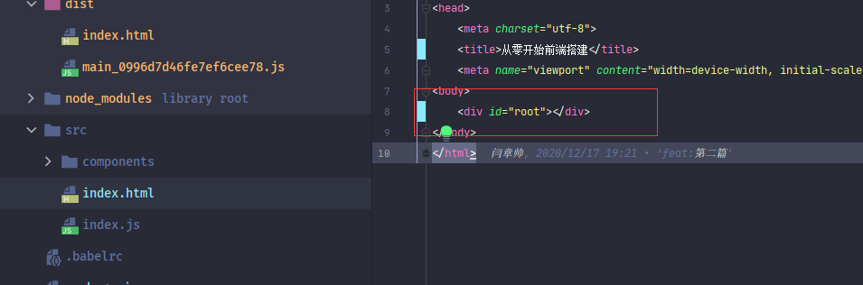

### react

#### react介绍

在当前时代前端，主流的开发框架具有两个，[vue.js](https://cn.vuejs.org/)和[react.js](https://reactjs.org/)，<font style="color:#f03d3d">React</font>是Facebook公司开发并开源的一个项目，而<font style="color:#f03d3d">Vue</font>是尤雨溪老师开发出的一个项目，属于中国国内项目

> :whale2: 以前都说是“三大框架”，还有一个Google开发的[angular](https://angular.cn/)，但是后来angular份额越来越少。
>
> 个人感觉是angular的上手成本问题，angular比较偏向后端。angular很多概念对于前端初学者来说那就是噩梦。对于前端工程系的发展，在下认为angular是集大成之作，但也因此造成了angular的学习成本。所以在下个人建议，有经验的诸君，可以稍微去看看angular，学一下angular中的思想。 

对于vue和react哪一个比较“好”，网上众说纷纭。在下就不在此引战。直接介绍react

> :whale2::whale2::whale2:
>
> 在下认为vue和react这种都是快速应用开发工具，可能也会像曾经如日中天的jquery逐渐消失，所以在下个人认为不要盲目只追求这种快速工具，而是花时间去学习***原点***。例如**设计思想**和**数据结构**。这种就是***原点***，所有的*术*都是起源于此。而快速应用框架（或语言）只不过是应用工具罢了。


<font style="color:#f03d3d">React</font>是一个用于构建用户界面的 JavaScript 库，<font style="color:#f03d3d">React</font>其本身其实一个特别简单的库，将页面抽象为虚拟DOM，在更新DOM时先进行对比哪些要更新的，然后只更新那些真正需要更新的，以此节省性能。其实这个操作很容易去想通。先来整理一下react思路背景。

现在来简单思考一下利用DOM编写**动态网站**的过程

首先使用原生DOM去更新页面，但随着项目的扩大，网站运行会越来越慢，这时候就需要进行优化。 

在优化排查代码时发现DOM更新时会更新许多没有修改的DOM，而不是局部更新。我们都知道DOM是消耗性能的，重新编排DOM，浏览器等操作。所以要想一个办法去优化DOM更新。对于这种优化，一般来说，想到的解决方案就是在JS中缓存DOM结构，然后在更新时对比新旧DOM，过滤掉不需要更新的DOM。这种算法就叫做***diff***算法，React的虚拟DOM核心也就是***diff***算法


DOM优化思路有了，接下来再去思考另一个东西。

在开发时，会大量操作DOM以此展示不同操作。对于有经验的诸君就会封装好多函数去简化代码。例如以下的工具条封装，这样在外部直接调用就可以。

```javascript
function createToolbar(){
  const  ls = ['首页','新闻','个人信息']
  const ul =  document.createElement('ul')

 ls.map(item=> {
   const li = document.createElement('li',);
   li.innerText = item
   ul.appendChild(li)
 })
  return ul
}

```

> :whale2: 动态生成DOM，先不考虑事件和CSS

一般开发应用程序到这一步就可以了， 但是如果想做一个通用库，那么还需要进行抽象。


试想一下，能否使用一种模板去组织虚拟DOM，然后提供一个引擎做底层转换为真实DOM。

<font style="color:#f03d3d">React</font>就创建了这么一种模板--<font style="color:#f03d3d">JSX</font>。

<font style="color:#f03d3d">JSX</font>是一种JS的扩展扩展语言，允许在JS中以**标签**形式构建元素。

```jsx
const element = (
  <h1 className="greeting">
    Hello, world!
  </h1>
);
```

运行时将<font style="color:#f03d3d">JSX</font>转换成<font style="color:#f03d3d">React</font>*自定义元素*。也就是虚拟DOM

```jsx
const element = React.createElement(
  'h1',
  {className: 'greeting'},
  'Hello, world!'
);
```


> :whale2::whale2: :whale2: 诸君注意到转换自定义元素实际上是创建的虚拟DOM。 那么为什么不直接创建DOM呢？这么做有什么好处呢？
>
> 因为跨平台。使用React做一层虚拟DOM抽象，这样与真实DOM进行隔离，这样对真实DOM进行数据化，可以对库进行分离，然后根据不同平台使用不同平台的DOM库。从而达到跨平台效果。


> :whale2::whale2: 转换过程使用的是**Babel**配置**React**时介绍


> :whale2: <font style="color:#f03d3d">JSX</font>目前被业界通用化。<font style="color:#f03d3d">Vue@3.X</font>也支持<font style="color:#f03d3d">JSX</font>
>
>  :whale2:<font style="color:#f03d3d">Vue</font>底层也使用了虚拟DOM，:whale2:<font style="color:#f03d3d">Vue</font>模板语言则是**template**


这就是<font style="color:#f03d3d">React</font>的整体思路。而<font style="color:#f03d3d">React</font>本质也就这么简单，而其中只不过需要处理许多东西，例如css，事件等。

> :whale2::whale2::whale2: <font style="color:#f03d3d">JSX</font>是一种扩展语言。 <font style="color:#f03d3d">JSX</font>中定义的事件、style、class其实是<font style="color:#f03d3d">JSX</font>语法。并不是DOM原生语法。所以类似*class*在DOM语法为*class*，而在<font style="color:#f03d3d">JSX</font>中为*className*


#### 安装react

<font style="color:#f03d3d">React</font>目前最新版本为***17.0.1***，对<font style="color:#f03d3d">React</font>有兴趣的诸君可以从老版本循循渐进的学习一下<font style="color:#f03d3d">React</font>。

> yarn add react@17.0.1


<font style="color:#f03d3d">react</font>这个库是一个核心运行库，里面具有虚拟DOM、JSX语法等一系列通用核心内容。但是写的代码最后都要转换成真实DOM，而完成这一步操作的是<font style="color:#f03d3d">react-dom</font>库。所以还需要引入这个库。

> yarn add react-dom@17.0.1


> :whale2: 将react核心运行库与跟真实DOM转换的库分离开，这样可以做到平台的隔离性。例如在其它平台可以使用另外的库转换为平台识别的元素。


接下来仿照**react-cli**组织代码。


第一步：在html页面中创建一个元素，以此元素作为*react顶级节*点。



在**vue.cli**中也具有这个节点，只不过ID名称不一样，有兴趣的诸君可以去看看。

接下来处理JS，在之前各种打包中都是使用***index.js***文件作为打包文件。而**react**只不过是承载在webpack上的应用框架罢了。

所以在***index.js***文件中使用react。

```js
import React from 'react';
import ReactDOM from 'react-dom';

ReactDOM.render((
  <h1 className="greeting">
    Hello, world!
  </h1>
), document.getElementById('root'));

```


可以看到，<font style="color:#f03d3d">React</font>执行了**ReactDOM.render**方法，这个方法就是将JSX模板转换为原生DOM元素，然后添加到指定DOM节点之中。

> :whale2::whale2: vue中也是这样设置，有兴趣的诸君可以看一下vue.cli。本质它们都是搭载在webpack上的应用框架。


不过如果现在打包查看结果的话，打包时会报错


这句话的意思是说在**babel**中缺少支持**react**的**plugin**。

其实***webpack***本身是不认识**React**模板语法的，所以需要将**React语法**转换为函数方式，而这个操作则交给了**Babel**完成

而**babel**本身是不支持react，必须设置对应的扩展**plugin**才可以。

不过**babel**官网提供了一个react的**preset**--[@babel/preset-react](https://www.babeljs.cn/docs/babel-preset-react)。只需要安装这个库就可以支持解析**React语法**。

> yarn add -D @babel/preset-react@7.12.10


> :whale2: 在[Babel官网](https://www.babeljs.cn/repl)可以进行测试React组件转换情况，有兴趣的诸君可以去试一试

这时候再进行build就会打包成功。


打包生成的代码最后就是那段代码


并且在浏览器可以直接显示代码。


> :whale2:代码由于加入了babel，并且设置了ie9可支持，所以同样可以运行再IE上，有兴趣的诸君可以测试一下

运行完美成功。


react运行成功，接下来就该组织react代码了，刚刚只是测试，在**index.js**文件中写了一个固定的react组件。

要做的是利用**index.js**文件设置根节点，然后让**React**接管代码


其实在刚才就已经做了根节点了，只不过这个根节点是直接写在了***index.js***文件之中。

只要将根节点提出去，然后看起来就会舒服了


在这里在**app.jsx**文件中创建了一个默认React组件作为react的根节点。在**index.js**使用此节点添加到DOM元素中。

此时就可以在**app.jsx**组件之中随意添加子组件，整个代码就像**托管**在了**app.jsx**之中


> :whale2: 
>
> * React 组件分为函数组件和class组件，函数组件简单，编写颗粒度比较小的组件时是一个很好的选择。class组件封装性强，易作为组件主干。具体使用还是要看编写代码之人。不在引战具体优劣。
>
> * **app.jsx**中返回**<></>**代表*空标签*，React组件只允许返回一个元素，但是有时候组件为元素数组，所有可以在外部包一层空标签。React在渲染时会忽略*空标签*
> * React组件名称约定为大写形式，以区分真实DOM标签。 仅仅是约定规范，但是强烈建议遵从。


在使用**.jsx**文件时，还需要简单的设置一下webpack。

1. 忽略后缀引用。需要在***resolve.extensions***属性中设置忽略后缀
2. **React语法**需要**Babel**做转换，所以所有的**.jsx**文件都需要走**babel-loader**

```js
const modules = {

  module:{
    rules:[
      {
        //  所有的.js或者.jsx文件都走babel-loader
        test:/\.js(x?)$/,
        include:path.join(__dirname,'src'),
        loader: "babel-loader"
      }
    ]
  },
  resolve:{
    //  可互忽略的后缀
    extensions:['.jsx', '.js', '.json'],
  }
}
```


此刻就做到了在**webpack**中基本添加的框架，使用**React**托管代码。而像**React Router** 或**Redux**,只不过是*运行在React之上快速开发的扩展库*罢了。在此就不添加。

> :whale2: Vue原理与React一致。只是各自框架的API不同


### browserslist


#### browserslist是什么

在配置**babel**时使用到了一个**browserslist**属性来判断生成代码的环境，这个属性到底是什么东西，接下来看这玩意


在**babel**打包时，使用到了浏览器版本依赖，根据浏览器版本转换代码。

不同公司项目对于浏览器版本有着不同要求，例如：

有些支持大部分用户使用的版本即可，

有的像政府项目则需要支持IE，

有的公司则可以直接替客户选择浏览器，而这种直接仅仅支持最新版本浏览器就可以。


所以就需要在打包设置浏览器版本，这个需求像**babel**这类的库都是支持设置(`target`)

但是，在打包时不仅仅**babel**才依赖浏览器版本，像CSS往往也需要去设置指定的版本环境。

而这时候对于开发来说的解决方案就是，将浏览器版本依赖编写在一个配置文件的属性中，然后设置时读取这个配置文件属性。

这样能做到方便维护。


有一种想法，能否让**babel**库默认支持写在一个地方的配置，也就是写一个配置文件或者库，自定义配置地址等信息，让**babel**去支持，

这种做法就是<font style="color:#f03d3d">browserslist</font>。

当然，想要做到这点，必须让业界普遍认可，这样可以让更多项目去依赖支持，

<font style="color:#f03d3d">browserslist</font>做到了这一点，它收到了业界的认可，很多库都依赖支持。


所在在设置浏览器依赖时支持设置<font style="color:#f03d3d">browserslist</font>，打包时依赖基本上都依赖此库

> :whale2: 虽然不依赖此库则需要根据使用的库去设置，不过前端打包所使用到的库都支持<font style="color:#f03d3d">browserslist</font>


#### browserslist设置

<font style="color:#f03d3d">browserslist</font>库提供了两种配置方式，

1. 配置**package.json**的***browserslist***中
2. 配置在根目录下约定文件：***.browserslistrc.json***中，文件名称一般为***.browserslistrc***

个人感觉直接使用第一种方式就行，没必要单独再建立一个文件。


<font style="color:#f03d3d">browserslist</font>还可以设置为对象形式，进而区分环境依赖。

```js
  "browserslist": {
    "production": [
      "ie 10",
       "Chrome > 75"
    ],
   "development": [
      "Chrome > 75"
    ],
  }
```

但是需要设置环境变量，环境变量名称为`process.env.BROWSERSLIST_ENV`，环境变量在**webpack**中配置


#### browserslist支持的浏览器

<font style="color:#f03d3d">browserslist</font>支持设置当前基本上所有的浏览器，在Github上作者说明了可以设置的浏览器

可以看到，<font style="color:#f03d3d">browserslist</font>几乎支持所有浏览器：PC、安卓、IOS 甚至还有国内Baidu。

设置浏览器时名称不区分大小写


#### browserslist属性

<font style="color:#f03d3d">browserslist</font>能得到业界的认可，也就代表<font style="color:#f03d3d">browserslist</font>的功能强大，

也的确是这样，<font style="color:#f03d3d">browserslist</font>设置各种的属性去配置自定义浏览器依赖。

从最简单如 直接设置各种浏览器版本和大于某个浏览器版本，还可以设置使用浏览器的比例情况。下面简单介绍下


* 指定版本号： 最简单的就是指定浏览器版本号，例如： `IE 11`

* 范围版本号：<font style="color:#f03d3d">browserslist</font>支持设置指定范围的版本号，例如：`Chrome > 75`, <font style="color:#f03d3d">browserslist</font>还支持 *>=*、*<*、*<=*语法设置

* 浏览器使用率：<font style="color:#f03d3d">browserslist</font>支持设置指定区域内浏览器份额的浏览器版本。例如：`cover 99.5%`代表设置全球内浏览器使用率达到99.5%比例的浏览器。 

  并且还支持指定地区内的使用率： `cover 99.5% in US` 美国区域内的浏览器使用统计数据   `cover 99.5% in alt-AS` 亚洲区域浏览器使用统计数据

  也自定义设置地区，具体参考[Github文档](https://github.com/browserslist/browserslist#custom-usage-data)

* 最新版本的浏览器：<font style="color:#f03d3d">browserslist</font>支持设置最新的几个版本浏览器， 例如：`last 2 versions` 设置每个浏览器最新的两个版本，

  还可以设置指定浏览器的最新版本：`last 2 Chrome versions` Chrome浏览器最新的两个版本

* 支持not：<font style="color:#f03d3d">browserslist</font>支持***not***，也就是排除指定的浏览器，例如：`not ie <= 8` 排除IE8及以下的

* 支持组合设置：<font style="color:#f03d3d">browserslist</font>支持组合设置，这也是<font style="color:#f03d3d">browserslist</font>灵活所在，例如上之前使用

  ```json
   "browserslist": [
        "ie 9",
         "Chrome > 75"
      ],
  ```

  这就是一个**并且（and）组合**设置，<font style="color:#f03d3d">browserslist</font>还支持**或者（or）组合**：`> .5% or last 2 versions`。

  

组合设置配合配置其它各种设置，能灵活的控制各种需求。

而这也代表了<font style="color:#f03d3d">browserslist</font>的强大之处，不过一般不会设置多么复杂.

