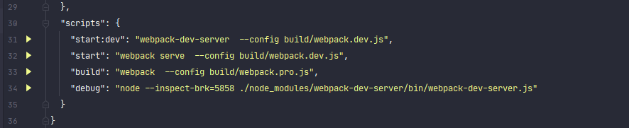
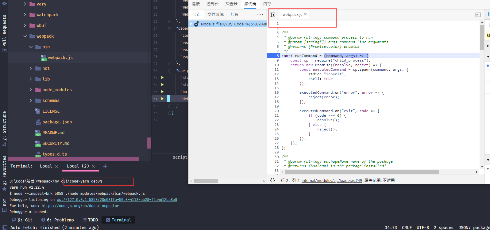
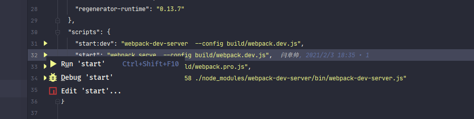
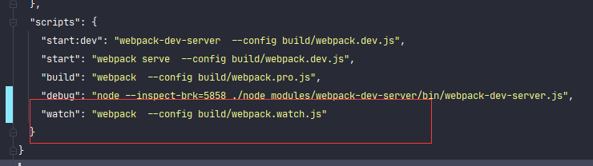
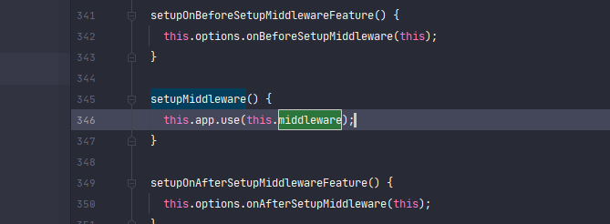
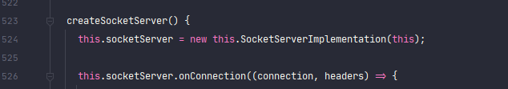
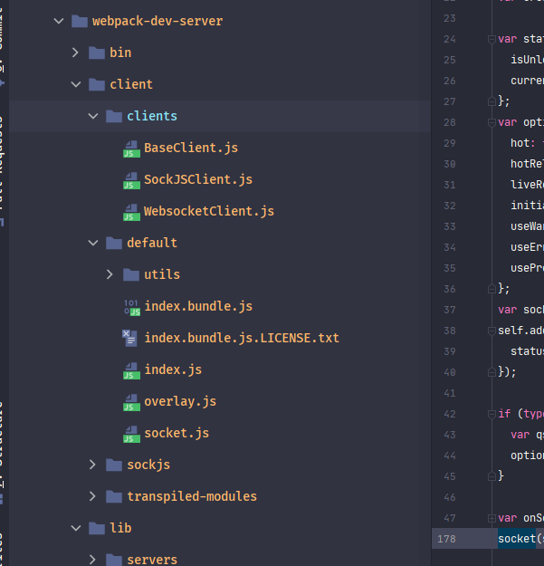

在此篇想简单的做一个<font style="color:#f03d3d">webpack-dev-server</font>源码解析，源码解析可能涉及到一些比较难啃的东西，我会尽量做到简单化。如果读者对<font style="color:#f03d3d">webpack-dev-server</font>源码没有兴趣，那么就完全可以跳过此篇


### 调试webpack-dev-server


#### 调试方式

在开发中，如果对程序代码流程不太清楚，最简单的解决方案就是调试代码，一步步去观察流程。学习<font style="color:#f03d3d">webpack-dev-server</font>源码，当然也可以这么做，不过需要做一些设置，才可以进行调试，下面介绍两种<font style="color:#f03d3d">webpack-dev-server</font>源码方式


##### 浏览器调试

我们现在都知道了<font style="color:#f03d3d">webpack</font>其实是执行于**Node**环境下，**Chrome**浏览器提供了调试`Node`程序。

`package.json`文件`scripts`属性中添加了一个`debug`指令，这个命令就是启动浏览器调试`Node`程序




`inspect-brk` 属性设置调试的参数  ***5858***代表端口号，***./node_modules/webpack-dev-server/bin/webpack-dev-server.js***代表调试指定文件，


接下来就需要设置浏览器了，

在**Chrome浏览器**地址栏输入`chrome://inspect`便可以进入设置页面


> :whale2:我使用的是 **新版Edge**，所以显示的为`edge//inspect`。


然后点击*Open dedicated DevTools for Node*便可以进入调试`devTool`


并且添加一个`localhost:5858`的连接


此时启动`yarn debug`就可以进行调试代码了。




##### IDE调试代码

常用的IDE都可以进行调试**Node**程序，所以都可以进行配置调试**webpack-dev-server**。我使用的是**WebStorm**。可以零配置调试




直接点击`Debug start`就可以进入当前命令的调试模式。


至于**VS Code**，我不太了解怎么配置，有兴趣的朋友可以去自行研究研究。


#### webpack-dev-server启动流程

下面来简单看一下<font style="color:#f03d3d">webpack-dev-server</font>启动流程。在此只介绍关键流程代码。具体请自行调试


调试执行的第一个文件是***./node_modules/webpack/bin/webpack.js***文件，这个文件是入口文件。

原因在上一篇已经说过：<font style="color:#f03d3d">webpack-cli@4.0.0</font>开始，**webpack-dev-server**命令改为了 `webpack serve`，所以其启动文件改为了***./node_modules/webpack/bin/webpack.js***文件

在***./node_modules/webpack/bin/webpack.js***文件中会加载<font style="color:#f03d3d">webpack-cli</font>库中的***/bin/cli.js***文件。


> :whale2:检测<font style="color:#f03d3d">webpack-cli</font>是否安装也是在***./node_modules/webpack/bin/webpack.js***文件执行的，有兴趣的朋友请看代码，就不在此贴图


***./node_modules/webpack-cli/bin/cli.js***文件中调用***./node_modules/webpack-cli/lib/bootstrap.js***，然后在***./node_modules/webpack-cli/lib/bootstrap.js***中创建了***./node_modules/webpack-cli/lib/webpack-cli.js***模块的实例并且调用了***run()***


在***WebpackCLI***实例的***run()***中根据命令调用了对应的加载文件。


可以看到根据其命令为`serve` 加载了<font style="color:#f03d3d">@webpack-cli/serve</font>。

> :whale2::whale2:<font style="color:#f03d3d">@webpack-cli/serve</font>是<font style="color:#f03d3d">@webpack-cli@4.0.0</font>加入的


在***./node_modules/@webpack-cli/serve/index.js***文件中调用了***./node_modules/@webpack-cli/serve/startDevServer.js***文件，在***startDevServer.js***文件中启动了<font style="color:#f03d3d">webpack-dev-server</font>服务器。


至此，<font style="color:#f03d3d">webpack-dev-server</font>服务器算是启动了。


<font style="color:#f03d3d">webpack-dev-server</font>服务器启动时跨了好几个库进行调用代码，<font style="color:#f03d3d">webpack</font> ---> <font style="color:#f03d3d">webpack-cli</font> ---> <font style="color:#f03d3d">@webpack-cli</font> ---> <font style="color:#f03d3d">webpack-dev-server</font>。看起来略有些复杂，不过只要弄清了其逻辑，便不再困难。有兴趣的朋友可以自行去调试代码。


### 源码模块解析


#### express服务器

在前面说过<font style="color:#f03d3d">webpack-dev-server</font>内部使用了<font style="color:#f03d3d">express</font>服务器。在上一篇也说了好多<font style="color:#f03d3d">express</font>中间件。所以先来看一下启动<font style="color:#f03d3d">express</font>服务器。

在前面说了，<font style="color:#f03d3d">@webpack-cli</font>创建了<font style="color:#f03d3d">webpack-dev-server</font>库的服务器实例。

这个实例对象就是 ***./node_modules/webpack-dev-server/lib/Server.js***模块。在这个模块构造函数中启动了<font style="color:#f03d3d">express</font>服务器


可以看到在**setupApp()**中创建了<font style="color:#f03d3d">express</font>服务器实例，然后在**createServer()**中进行启动。

> :whale2:在**setupApp()**和**createServer()**之间添加了配置的中间件。


#### 监听代码文件更新

使用<font style="color:#f03d3d">webpack-dev-server</font>时我们都知道文件代码会实时编译，只要更新代码就会进行重新编译。而代码实时编译的功能其实是<font style="color:#f03d3d">webpack</font>自身提供的，在<font style="color:#f03d3d">webpack</font>配置中具有一个***watch***属性，这个属性代表是否监听文件变化


下面先来做一个测试**watch**属性的测试。

新建一个**webpack.watch.js**的配置文件，此配置文件设置**watch**属性

```js
const { merge } = require('webpack-merge');
const common = require('./webpack.common');
//  使用node。js的导出，将配置进行导出
module.exports = merge([
  common(true),
  {
    mode:'development',
    //  监听文件变化
    watch: true,
    //  监听选项
    watchOptions: {
      //  忽略某些目录  可以为正则或者数组
      ignored: /node_modules/,
      //  启动轮询， 默认为false  设置true或毫秒数来启动轮询
      poll: false
    }
  }
])
```

然后在**package.json**中添加`watch`指令，命令执行`webapck`命令。


此时执行`yarn watch`命令便会跟`webapck-dev-server`指令一样停留在***watching***状态



而此时更新代码，会触发重新打包，


但是**watch**属性也仅仅只提供了**watching**状态，而**WS**推送还是<font style="color:#f03d3d">webpack-dev-server</font>提供

> :whale2: ***watch***只会监听已引用的代码模块文件，对于没有引用的代码模块文件是不会监听，有兴趣的朋友可以自行测试。

> :whale2: <font style="color:#f03d3d">webpack</font>源码还没看，所以对于**watch**实现还不甚清楚。


#### 打包文件内存化

在上一篇简单的介绍过<font style="color:#f03d3d">webpack-dev-server</font>改变了<font style="color:#f03d3d">webpack</font>的输出流，将打包文件存储到了内存流中。并且在配置中还可以自定义输出流。


<font style="color:#f03d3d">webpack-dev-server</font>默认使用了<font style="color:#f03d3d">webpack-dev-middleware</font>中间件，将打包文件内存化，以提高响应速度。


<font style="color:#f03d3d">webpack-dev-middleware</font>中间件在**Server.js**构造函数中加入的


在<font style="color:#f03d3d">webpack-dev-middleware</font>库**/dist/index.js**中调用了***/dist/utils/setupOutputFileSystem.js***文件，

此文件便是设置输出流的函数。




可以看到，如果在不设置**outputFileSystem**属性的情况下，默认使用了<font style="color:#f03d3d">memfs</font>作为输出流。 

> :whale2:<font style="color:#f03d3d">memfs</font>是一个**Node.js** 内存流的库，具体参考[官方](https://www.npmjs.com/package/memfs)

> :whale2: <font style="color:#f03d3d">webpack-dev-middleware</font> 项目主文件是**/dist/cjs.js**，在**/dist/cjs.js**调用了**/dist/index.js**，有兴趣的朋友可以看一下


#### WebSocket


##### WebSocket Server

######  Server 创建和选择

​	**WebSocket Server**的创建是在**Server.js**文件中的**listen()**启动服务器后。


**createSocketServer()**执行时，首先会根据参数使用指定的**WebSocket Server**。





在上一篇中说过，<font style="color:#f03d3d">webpack-dev-server@4.0.0.0-beta.0</font>之后默认使用**WebsocketServer.js**。也就是[ws库](https://www.npmjs.com/package/ws)。

而webpack-dev-server@3.X则一直默认使用的是**SockJSServer.js**，也就是[sockjs库](https://www.npmjs.com/package/sockjs)


然后创建指定的WebSocket Server 实例对象。


###### 消息推送

在**Server.js**文件中具有一个**sockWrite()**，这个函数就是调用**WebSocket Server**推送消息的函数。


但是有推送函数，还必须有触发时机。触发时机具有以下三点

1. 客户端连接成功

   在客户端连接成功后，推送初始化信息，是否使用**hot**，是否开启**liveReload** 和  **overlay**配置信息等。

   

2. 代码编译完毕

   我们都知道，每次代码更新都需要通知浏览器做对应处理，所以需要监听<font style="color:#f03d3d">webpack</font>编译完成。

   <font style="color:#f03d3d">webpack</font>提供了编译完成的钩子事件。

   

   

   <font style="color:#f03d3d">webpack-dev-server</font>在**Server.js**构造函数中注入了此钩子函数，


3. 静态文件发生变化时

   在上一篇中介绍了，<font style="color:#f03d3d">webpack-dev-server</font>设置了静态文件监听。<font style="color:#f03d3d">webpack-dev-server</font>其实在静态文件变化时也推送消息，通知客户端刷新页面。

   


##### WebSocket Client


###### 消息处理

**webSocket Client**代码在<font style="color:#f03d3d">webpack-dev-server</font>库***/client/***目录下， **client**也是具有**SockJSClient**和**WebsocketClient**两种，与**Server**一致。


**client**逻辑处理在**/client/default/index.js**文件。在此文件具有一个**onSocketMessage**属性，这个属性就是逻辑处理对象。*key为推送类型*，*value为执行的函数*。在此我就将**onSocketMessage**复制到此。有兴趣的朋友可以去看看源码。

```js
var onSocketMessage = {
  hot: function hot() {
    //	如果推送hot，就代表使用HMR。在客户端连接后推送
    options.hot = true;
    log.info('Hot Module Replacement enabled.');
  },
    
  liveReload: function liveReload() {
     //	如果推送liveReload，就代表使用liveReload。在客户端连接后推送
    options.liveReload = true;
    log.info('Live Reloading enabled.');
  },
    
  invalid: function invalid() {
     //	监听webpack编译无效时推送。invalid与done一样，是webpack钩子函数
    log.info('App updated. Recompiling...'); // fixes #1042. overlay doesn't clear if errors are fixed but warnings remain.

    //	如果设置了错误页面，就将页面进行清除
    if (options.useWarningOverlay || options.useErrorOverlay) {
      overlay.clear();
    }

    sendMessage('Invalid');
  },
    
  hash: function hash(_hash) {
    //	当前代码模块的hash值。
    status.currentHash = _hash;
  },
    
  'still-ok': function stillOk() {
    log.info('Nothing changed.');

    if (options.useWarningOverlay || options.useErrorOverlay) {
      overlay.clear();
    }

    sendMessage('StillOk');
  },
    
  logging: function logging(level) {
    //	客户端显示日志级别，客户端连接后推送
    // this is needed because the HMR logger operate separately from
    // dev server logger
    var hotCtx = require.context('webpack/hot', false, /^\.\/log$/);

    if (hotCtx.keys().indexOf('./log') !== -1) {
      hotCtx('./log').setLogLevel(level);
    }

    setLogLevel(level);
  },
  overlay: function overlay(value) {
    //	设置编译错误时，是否显示错误页面。客户端连接后推送
    if (typeof document !== 'undefined') {
      if (typeof value === 'boolean') {
        options.useWarningOverlay = false;
        options.useErrorOverlay = value;
      } else if (value) {
        options.useWarningOverlay = value.warnings;
        options.useErrorOverlay = value.errors;
      }
    }
  },
    
  progress: function progress(_progress) {
    //	是否显示当前打包进度，客户端连接后推送
    if (typeof document !== 'undefined') {
      options.useProgress = _progress;
    }
  },
    
  'progress-update': function progressUpdate(data) {
    //	当前打包进度
    if (options.useProgress) {
      log.info("".concat(data.percent, "% - ").concat(data.msg, "."));
    }

    sendMessage('Progress', data);
  },
    
  ok: function ok() {
    //	编译成功推送当前类型，
    sendMessage('Ok');

     //	如果设置了错误页面，就将页面进行清除
    if (options.useWarningOverlay || options.useErrorOverlay) {
      overlay.clear();
    }

    if (options.initial) {
      return options.initial = false;
    }

    //使用此方法重新加载数据，此方法会处理HMR
    reloadApp(options, status);
  },
    
  'content-changed': function contentChanged() {
    //	静态文件改变时推送，重新刷新页面
    log.info('Content base changed. Reloading...');
    self.location.reload();
  },
    
  warnings: function warnings(_warnings) {
    //	编译出现警告后推送 
    log.warn('Warnings while compiling.');

    var strippedWarnings = _warnings.map(function (warning) {
      return stripAnsi(warning);
    });

    sendMessage('Warnings', strippedWarnings);

    for (var i = 0; i < strippedWarnings.length; i++) {
      log.warn(strippedWarnings[i]);
    }

    //	如果显示错误页面设置警告提示，那么就显示
    if (options.useWarningOverlay) {
      overlay.showMessage(_warnings);
    }

    if (options.initial) {
      return options.initial = false;
    }
      
	//使用此方法重新加载数据，此方法会处理HMR
    reloadApp(options, status);
  },
    
  errors: function errors(_errors) {
    //	编译错误后推送
    log.error('Errors while compiling. Reload prevented.');

    var strippedErrors = _errors.map(function (error) {
      return stripAnsi(error);
    });

    sendMessage('Errors', strippedErrors);

    for (var i = 0; i < strippedErrors.length; i++) {
      log.error(strippedErrors[i]);
    }

    //	如果显示错误页面设置了错误提示，那么就显示
    if (options.useErrorOverlay) {
      overlay.showMessage(_errors);
    }

    options.initial = false;
  },
    
  error: function error(_error) {
    log.error(_error);
  },
    
  close: function close() {
    // WebSocket Server关闭前的推送
    log.error('Disconnected!');
    sendMessage('Close');
  }
};
```


###### reloadApp

**/client/default/utils/reloadApp.js**文件中代码个人感觉比较重要，这个代码就是代码文件编译成功后的重新加载数据的代码，代码中根据**hot**和**liveReload**做出了不同的数据处理方案




可以看到，在***hot***时加载了***webpack/hot/emitter***模块。然后触发了热更新的事件，

而***liveReload***时则刷新顶级页面。否则就不处理。


#### HMR

***热更新（Hot Module Replacement）***说到<font style="color:#f03d3d">webpack-dev-server</font>，总是会提到此功能，这也是一个特别重要的功能。

在开发时，往往只更新了部分代码，如果让浏览器重新加载所有文件，会极大的浪费时间。所以如果实现只加载更新的文件，那样就可以做到更好的响应。

而这个技术就是***热更新（Hot Module Replacement）***


**HMR**功能其实并不是<font style="color:#f03d3d">webpack-dev-server</font>提供的，而是使用了<font style="color:#f03d3d">webpack</font>内置的一个*plugin*：<font style="color:#f03d3d">HotModuleReplacementPlugin</font>。


使用<font style="color:#f03d3d">webpack-dev-server</font>时，如果设置了**hot**属性，<font style="color:#f03d3d">webpack-dev-server</font>会自动添加这个**plugin**


> :whale2:此代码在<font style="color:#f03d3d">webpack-dev-server</font>库**/lib/utils/DevServerPlugin.js**


<font style="color:#f03d3d">HotModuleReplacementPlugin</font>每次编译后会生成一个`hash`，对应其编译文件。在**Web Socket Server**推送类型中具有一个**hash**类型，这个就是此`hash`值。

然后在**reloadApp.js**函数处理**hot**数据时将`currentHash`传入触发事件


```js
hash: function hash(_hash) {
    status.currentHash = _hash;
},
```

```js
 if (hot) {
    log.info('App hot update...');

    var hotEmitter = require('webpack/hot/emitter');

    hotEmitter.emit('webpackHotUpdate', currentHash);

    if (typeof self !== 'undefined' && self.window) {
      // broadcast update to window
      self.postMessage("webpackHotUpdate".concat(currentHash), '*');
    }
  } // allow refreshing the page only if liveReload isn't disabled
  else if (liveReload) {
```


***webpackHotUpdate***事件是<font style="color:#f03d3d">webpack</font>库中定义的一个事件，代码在***/hot/dev-server.js***。功能是获取更新的modules。

```js
if (module.hot) {
	var lastHash;
	var upToDate = function upToDate() {
		return lastHash.indexOf(__webpack_hash__) >= 0;
	};
	var log = require("./log");
	var check = function check() {
		module.hot
			.check(true)
			.then(function (updatedModules) {
				//	HMR检查成功
				if (!updatedModules) {
                    //	如果没有更新的modules，则刷新页面，
					window.location.reload();
					return;
				}

				if (!upToDate()) {
					check();
				}

           		//	调用HMR处理方法
				require("./log-apply-result")(updatedModules, updatedModules);
				if (upToDate()) {
					log("info", "[HMR] App is up to date.");
				}
			})
			.catch(function (err) {
           		//	HMR检查失败，重新刷新页面
				var status = module.hot.status();
				if (["abort", "fail"].indexOf(status) >= 0) {
					window.location.reload();
				} else {
					log("warning", "[HMR] Update failed: " + log.formatError(err));
				}
			});
	};
	var hotEmitter = require("./emitter");
    //	事件定义
	hotEmitter.on("webpackHotUpdate", function (currentHash) {
		lastHash = currentHash;
		if (!upToDate() && module.hot.status() === "idle") {
			log("info", "[HMR] Checking for updates on the server...");
			check();
		}
	});
	log("info", "[HMR] Waiting for update signal from WDS...");
} else {
	throw new Error("[HMR] Hot Module Replacement is disabled.");
}
```

https://www.cnblogs.com/wangpenghui522/p/6826182.html


https://blog.csdn.net/weixin_43684713/article/details/92839419

https://github.com/webpack/webpack-dev-middleware

https://zhuanlan.zhihu.com/p/159318414

https://zhuanlan.zhihu.com/p/30669007

