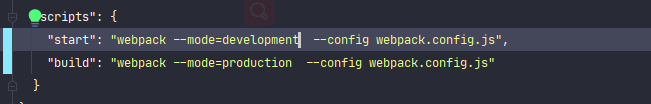

### development、production拆分

#### 根据文件拆分

<font style="color:cornflowerblue">webpack</font>打包时分为<font style="color:cornflowerblue">开发模式（development）</font>和<font style="color:cornflowerblue">发布模式（production）</font>，在前面使用命令参数做了简单区分。



但这种方式区分在做定制化模式时有些不太方便，所以需要对两种模式做彻底拆分。

之前介绍过，<font style="color:cornflowerblue">webpack</font>可以使用**--config**参数指定配置文件，所以可以不同模式使用不同配置文件。


> :whale2: 将<font style="color:cornflowerblue">webpack</font>配置文件放入一个指定的目录，方便管理，
>


**/buiild/config.js** 是控制路径的对象，在此进行管理, **config.js**文件位于**/build**下，所以所以**root**属性则改为指向上级目录

```js
const path = require('path')

module.exports.config = {
  root: path.join(__dirname, '../'),
}

```


此时可以在两个配置文件中设置做定制化配置项

***webpack.dev.js***

```js
const path = require('path')
const webpack = require("webpack");
const HtmlWebpackPlugin = require('html-webpack-plugin');
const { CleanWebpackPlugin } = require('clean-webpack-plugin');
//	引用config对象，因导出时为 module.exports.config 所以在此使用 { config }导入
const { config }  = require('./config');

//	browserslist环境变量
process.env.BROWSERSLIST_ENV = 'development'

const modules = {
    mode:'development',

    entry: path.join(config.root, 'src/index.js') ,

    output: {
        path: path.join(config.root, 'dist') ,
        //	dev模式下不需要缓存
        filename: '[name].js'
    },

    module:{
        rules:[
            {
                //  所有的.js(x?)文件都走babel-loader
                test:/\.js(x?)$/,
                include: path.join(config.root, 'src'),
                loader: "babel-loader"
            }
        ]
    },

    //  dev不需要压缩
    optimization: {
        minimize: false,
    },

    plugins: [
        new HtmlWebpackPlugin({
            //  HTML的标题，
            //  template的title优先级大于当前数据
            title: 'my-cli',

            //  输出的html文件名称
            filename: 'index.html',

            //  本地HTML模板文件地址
            template: path.join(config.root, 'src/index.html'),

            // 引用JS文件的目录路径
            publicPath: './',

            //  引用JS文件的位置
            //  true或者body将打包后的js脚本放入body元素下，head则将脚本放到中
            //  默认为true
            inject: 'body',

            //  加载js方式，值为defer/blocking
            //  默认为blocking, 如果设置了defer，则在js引用标签上加上此属性，进行异步加载
            scriptLoading: 'blocking',

            //  是否进行缓存，默认为true，在开发环境可以设置成false
            cache: false,

            //  添加mate属性
            meta: {}
        }),

        new CleanWebpackPlugin({
            // 是否假装删除文件
            //  如果为false则代表真实删除，如果为true，则代表不删除
            dry: false,

            //  是否将删除日志打印到控制台 默认为false
            verbose: true,

            //  允许保留本次打包的文件
            //  true为允许，false为不允许，保留本次打包结果，也就是会删除本次打包的文件
            //  默认为true
            protectWebpackAssets: true,

            //  每次打包之前删除匹配的文件
            cleanOnceBeforeBuildPatterns: ['**/*'],

            //  每次打包之后删除匹配的文件
            cleanAfterEveryBuildPatterns:["*.js"],
        }),

        new webpack.DefinePlugin({ "global_a": JSON.stringify("我是一个打包配置的全局变量") }),
    ],

    resolve: {
        alias:{
            //  设置路径别名
            '@': path.join(config.root, 'src'),

            '~': path.join(config.root, 'src/assets'),
        },

        //  可互忽略的后缀
        extensions:['.jsx', '.js', '.json'],

        //  默认读取的文件名
        mainFiles:['index', 'main'],
    }
}

//  使用node.js的导出，将配置进行导出
module.exports = modules
```


***webpack.pro.js***

```js
const path = require('path')
const webpack = require("webpack");
const HtmlWebpackPlugin = require('html-webpack-plugin')
const { CleanWebpackPlugin } = require('clean-webpack-plugin')
const TerserPlugin = require('terser-webpack-plugin')
//	引用config对象，因导出时为 module.exports.config 所以在此使用 { config }导入
const { config }  = require('./config');

//	browserslist环境变量
process.env.BROWSERSLIST_ENV = 'production'

const modules = {

  mode: 'production',

  entry: path.join(config.root, 'src/index.js'),

  // prod需要缓存js
  output: {
    path: path.join(config.root, 'dist') ,
    filename: '[name]_[contenthash].js'
  },

  module:{
    rules:[
      {
        //  所有的.js(x?)文件都走babel-loader
        test:/\.js(x?)$/,
        include: path.join(config.root, 'src') ,
        loader: "babel-loader"
      }
    ]
  },


  optimization: {
    minimize: true,
      minimizer: [
       new TerserPlugin({
          //  指定压缩的文件
          include: /\.js(\?.*)?$/i,

          // 排除压缩的文件
          // exclude:/\.js(\?.*)?$/i,

          //  是否启用多线程运行，默认为true，开启，默认并发数量为os.cpus()-1
          //  可以设置为false(不使用多线程)或者数值（并发数量）
          parallel: true,

          //  可以设置一个function，使用其它压缩插件覆盖默认的压缩插件，默认为undefined，
          minify: undefined,

          //  是否将代码注释提取到一个单独的文件。
          //  属性值：Boolean | String | RegExp | Function<(node, comment) -> Boolean|Object> | Object
          //  默认为true， 只提取/^\**!|@preserve|@license|@cc_on/i注释
          //  感觉没什么特殊情况直接设置为false即可
          extractComments: false,

          // 压缩时的选项设置
          terserOptions: {
            //  是否保留原始函数名称，true代表保留，false即保留
            //  此属性对使用Function.prototype.name
            //  默认为false
            keep_fnames: false,

            // 是否保留原始类名称
            keep_classnames: false,

            //  format和output是同一个属性值，，名称不一致，output不建议使用了，被放弃
            // 指定压缩格式。例如是否保留*注释*，是否始终为*if*、*for*等设置大括号。
            format: {
              comments: false,
            },
            output: undefined,

            //  是否支持IE8，默认不支持
            ie8: false,

            compress: {
              // 是否使用默认配置项，这个属性当只启用指定某些选项时可以设置为false
              defaults: false,

              // 是否移除无法访问的代码
              dead_code: false,

              // 是否优化只使用一次的变量
              collapse_vars: true,

              warnings: true,

              //  是否删除所有 console.*语句，默认为false，这个可以在线上设置为true
              drop_console: false,

              //  是否删除所有debugger语句，默认为true
              drop_debugger: true,

              //  移除指定func，这个属性假定函数没有任何副作用，可以使用此属性移除所有指定func
              // pure_funcs: ['console.log'], //移除console
            },
          },
        })
    ]
  },

  plugins: [
   new HtmlWebpackPlugin({
      //  template的title优先级大于当前数据
      title:'my-cli',
      //  文件名称
      //  模板路径
      template:path.join(__dirname, 'src/index.html'),
      // 用于打包后引用脚本时的路径
      publicPath:'./',

      //  是否将打包的资源引用到当前HTML， false代表不引用
      //  true或者body将打包后的js脚本放入body元素下，head则将脚本放到中
      //  默认为true
      inject:'body',
      //  加载js方式，值为defer/blocking
      //  默认为blocking, 如果设置了defer，则在js引用标签上加上此属性，进行异步加载
      scriptLoading:'blocking',

      //  是否进行缓存，默认为true，在开发环境可以设置成false
      cache:false,
      //  添加mate属性
      meta:{}
    }),

    new CleanWebpackPlugin({
      dry:false,
      //  是否打印日志到控制台 默认为false
      verbose: true,
      //  允许保留本次打包的文件
      //  true为允许，false为不允许，保留本次打包结果，也就是会删除本次打包的文件
      //  默认为true
      protectWebpackAssets:true,
      //  每次打包之前删除匹配的文件
      cleanOnceBeforeBuildPatterns:[],

      //  每次打包之后删除匹配的文件
      cleanAfterEveryBuildPatterns:["*.js"],
    }),

    new webpack.DefinePlugin({ "global_a": JSON.stringify("我是一个打包配置的全局变量") }),
  ],

  resolve: {
    alias:{
      //  设置路径别名
      '@': path.join(config.root, 'src'),

      '~': path.join(config.root, 'src/assets')
    },
    //  可互忽略的后缀
    extensions:['.jsx', '.js', '.json'],
    //  默认读取的文件名
    mainFiles:['index', 'main'],
  }
}

//  使用node.js的导出，将配置进行导出
module.exports = modules
```


#### webpack-merge

根据文件拆分之后，发现两个模式中具有好多共同的配置信息。写两份反而不好管理了。

也就是需要一种能提供出一个***公共配置文件模块（common）***和两个定制化配置文件。在定制化配置文件中导入***公共配置文件模块（common）***并进行合并配置

webpack社区中提供了一个[webpack-merge](https://www.npmjs.com/package/webpack-merge)库，就是允许我们对<font style="color:cornflowerblue">webpack</font>配置属性合并。

> yarn add -D webpack-merge@5.7.3


抽出一个**webpack.common.js**文件，将公共配置配置在此


```js
const path = require('path')
const webpack = require("webpack");
const HtmlWebpackPlugin = require('html-webpack-plugin')
const { CleanWebpackPlugin } = require('clean-webpack-plugin')
const TerserPlugin = require('terser-webpack-plugin')
//	引用config对象，因导出时为 module.exports.config 所以在此使用 { config }导入
const { config }  = require('./config');

//  isDev  boolean

//  使用node。js的导出，将配置进行导出
module.exports =  (isDev = true) => {

  //  根据参数设置browserslist环境变量
  process.env.BROWSERSLIST_ENV = isDev ? 'development' : 'production'

  return {
    //  入口文件
    //  字符串形式
    entry: path.join(config.root, 'src/index.js'),
      
    // 根据isDev参数判断是否缓存JS
    // 输出文件
    output: {
      //   输出文件的目录地址
      path: path.join(config.root, 'dist'),
      //  输出文件名称，contenthash代表一种缓存，只有文件更改才会更新hash值，重新打包
      filename: `[name]${isDev ? '' : '_[contenthash]'}.js`,
    },

    //devtool:false, //'eval'

    module: {
      rules: [
        {
          //  所有的.js(x?)文件都走babel-loader
          test: /\.js(x?)$/,
          include: path.join(config.root, 'src'),
          loader: "babel-loader"
        },
      ]
    },

    optimization: {
      // 根据当前模式进行判断是否需要压缩
      minimize: !isDev,
        
      minimizer: [
         new TerserPlugin({
          //  指定压缩的文件
          include: /\.js(\?.*)?$/i,

          // 排除压缩的文件
          // exclude:/\.js(\?.*)?$/i,

          //  是否启用多线程运行，默认为true，开启，默认并发数量为os.cpus()-1
          //  可以设置为false(不使用多线程)或者数值（并发数量）
          parallel: true,

          //  可以设置一个function，使用其它压缩插件覆盖默认的压缩插件，默认为undefined，
          minify: undefined,

          //  是否将代码注释提取到一个单独的文件。
          //  属性值：Boolean | String | RegExp | Function<(node, comment) -> Boolean|Object> | Object
          //  默认为true， 只提取/^\**!|@preserve|@license|@cc_on/i注释
          //  感觉没什么特殊情况直接设置为false即可
          extractComments: false,

          // 压缩时的选项设置
          terserOptions: {
            //  是否保留原始函数名称，true代表保留，false即保留
            //  此属性对使用Function.prototype.name
            //  默认为false
            keep_fnames: false,

            // 是否保留原始类名称
            keep_classnames: false,

            //  format和output是同一个属性值，，名称不一致，output不建议使用了，被放弃
            // 指定压缩格式。例如是否保留*注释*，是否始终为*if*、*for*等设置大括号。
            format: {
              comments: false,
            },
            output: undefined,

            //  是否支持IE8，默认不支持
            ie8: false,

            compress: {
              // 是否使用默认配置项，这个属性当只启用指定某些选项时可以设置为false
              defaults: false,

              // 是否移除无法访问的代码
              dead_code: false,

              // 是否优化只使用一次的变量
              collapse_vars: true,

              warnings: true,

              //  是否删除所有 console.*语句，默认为false，这个可以在线上设置为true
              drop_console: false,

              //  是否删除所有debugger语句，默认为true
              drop_debugger: true,

              //  移除指定func，这个属性假定函数没有任何副作用，可以使用此属性移除所有指定func
              // pure_funcs: ['console.log'], //移除console
            },
          },
        })
      ]
    },

    plugins: [
      new HtmlWebpackPlugin({
        //  HTML的标题，
        //  template的title优先级大于当前数据
        title: 'my-cli',

        //  输出的html文件名称
        filename: 'index.html',

        //  本地HTML模板文件地址
        template: path.join(config.root, 'src/index.html'),

        // 引用JS文件的目录路径
        publicPath: './',

        //  引用JS文件的位置
        //  true或者body将打包后的js脚本放入body元素下，head则将脚本放到中
        //  默认为true
        inject: 'body',

        //  加载js方式，值为defer/blocking
        //  默认为blocking, 如果设置了defer，则在js引用标签上加上此属性，进行异步加载
        scriptLoading: 'blocking',

        //  是否进行缓存，默认为true，在开发环境可以设置成false
        cache: false,

        //  添加mate属性
        meta: {}
      }),

      new CleanWebpackPlugin({
        // 是否假装删除文件
        //  如果为false则代表真实删除，如果为true，则代表不删除
        dry: false,

        //  是否将删除日志打印到控制台 默认为false
        verbose: true,

        //  允许保留本次打包的文件
        //  true为允许，false为不允许，保留本次打包结果，也就是会删除本次打包的文件
        //  默认为true
        protectWebpackAssets: true,

        //  每次打包之前删除匹配的文件
        cleanOnceBeforeBuildPatterns: ['**/*'],

        //  每次打包之后删除匹配的文件
        cleanAfterEveryBuildPatterns:["*.js"],
      }),

      new webpack.DefinePlugin({ "global_a": JSON.stringify("我是一个打包配置的全局变量") }),
    ],

    resolve: {
      alias: {
        //  设置路径别名
        '@': path.join(config.root, 'src'),

        '~': path.join(config.root, 'src/assets'),
      },
      //  可互忽略的后缀
      extensions: ['.jsx', '.js', '.json'],
      //  默认读取的文件名
      mainFiles: ['index', 'main'],
    }
  }
}
```


**webpack.common.js**文件导出的是一个函数 ，函数参数是一个是一个boolean类型的isDev，判断当前模式。将细小化的差异直接**webpack.common.js**文件中。

例如：**output.filename**中是否缓存和**optimization.minimize**属性

> :whale2::whale2::whale2: 在**webpack.common.js**内部根据**isDev**设置了<font style="color:cornflowerblue">browserslist</font>使用的环境变量


然后，就可以在 **webpack.dev.js** 和 **webpack.pro.js** 文件中使用<font style="color:#f03d3d">webpack-merge</font> 进行合并 **webpack.common.js** 文件中模块

**webpack.dev.js**

```js
const { merge } = require('webpack-merge');
const common = require('./webpack.common');
//  使用node.js的导出，将配置进行导出
module.exports = merge([
  common(true),
  {
    mode:'development',
  }
])

```


**webpack.pro.js**

```js
const { merge } = require('webpack-merge');
const common = require('./webpack.common');
//  使用node.js的导出，将配置进行导出
module.exports = merge([
  common(false),
  {
    mode:'production',
  }
])

```


可以看到 代码中直接调用了<font style="color:#f03d3d">webpack-merge</font>提供的一个**merge**函数合并然后导出。**merge**函数会将传入的多个对象属性进行合并，然后返回合并后对象。

**merge**函数其实与**Object.assign()**功能一样，对多个JS对象属性进行合并。只不过**merge**功能较为强大一些。

> :whale2::whale2::whale2: <font style="color:cornflowerblue">webpack</font>配置导出的是一个JS对象，在代码中可以以任意形式组织此对象，只要最后进行导出就行。

> :whale2: **merge**函数参数可以使用数组形式传递，并且支持可变参数。


### 总结

> :whale2::whale2::whale2:
>
> * 对<font style="color:cornflowerblue">开发模式（development）</font>和<font style="color:cornflowerblue">发布模式（production）</font>进行拆分主要是为了更方便管理代码，其具体结构依照每个人编码习惯具有差异性
> * <font style="color:#f03d3d">webpack-merge</font> 是一个将多个JS对象属性合并的库，功能与**Object.assign()**一致，只是功能更为强大一些。


### 本文参考

*  [webpack-merge](https://www.npmjs.com/package/webpack-merge)


### 本文依赖

* [webpack-merge@5.7.3](https://www.npmjs.com/package/webpack-merge/v/5.7.3)


### package.json

```js
{
  "name": "my-cli",
  "version": "1.0.0",
  "main": "index.js",
  "author": "mowenjinzhao<yanzhangshuai@126.com>",
  "license": "MIT",
  "devDependencies": {
    "@babel/core": "7.13.1",
    "@babel/plugin-transform-runtime": "7.13.7",
    "@babel/preset-env": "7.13.5",
    "@babel/preset-react": "7.12.13",
    "@babel/runtime-corejs3": "7.13.7",
    "babel-loader": "8.2.2",
    "clean-webpack-plugin": "3.0.0",
    "html-webpack-plugin": "5.2.0",
    "webpack": "5.24.0",
    "webpack-cli": "4.5.0",
    "webpack-merge": "5.7.3"
  },
  "dependencies": {
    "react": "17.0.1",
    "react-dom": "17.0.1",
  },
      
  "scripts": {
    "start": "webpack-dev-server  --config build/webpack.dev.js",
    "build": "webpack  --config build/webpack.pro.js",
  },
      
 "browserslist": {
    "development": [
      "chrome > 75"
    ],
    "production": [
      "ie 9"
    ]
  }
}

```


