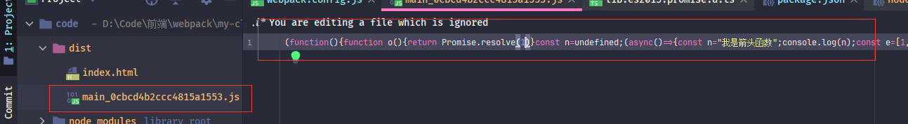

接下来学习一个能在项目中愉快的写代码的东西--<font style="color:#f03d3d">babel</font>，这是个什么东西，诸君请整理好思路看下去。

### ES6的枷锁

在之前各种打包测试时，都是使用**ES5**的简单语法，并没有使用过**ES6（ES2015+）**的语法（*import除外*）。但是自从**ES6**时代来临后，让开发者写起来越来越爽：箭头函数可以避免this问题、const和let块级作用域避免了闭包问题等等。所以开发者用了**ES6**之后基本都不会再想去写**ES5**。但是在前面提过，前端代码的执行环境（浏览器）版本的多少是取决于用户，有的用户会一直不更新浏览器版本。然后你写的新语法在旧版浏览器不支持，这就导致了冲突。

在介绍打包器时说过，打包器就是为了解决这样冲突而诞生的。但是，在打包器打包环节，**ES6**等语法转**ES5**语法这个操作其实是**babel**扩展完成的。


下面先来测试下再之前的webpack配置中所生成出来**ES6**语法





可以看到打包生成的代码并没有处理*箭头函数*、*const*和*for-of*。所以急需一个扩展，处理**ES6**语法，然后<font style="color:#f03d3d">babel</font>就诞生了。


> :whale2: 测试生成的语句都是 ***yarn build***, 也就是 **devtool:none**, 使用***yarn start*** 代码不太好观察


### babel介绍

<font style="color:#f03d3d">babel</font>其实是一个不弱于<font style="color:#f03d3d">webpack</font>的东西，看起来<font style="color:#f03d3d">babel</font>没多少东西，只是将**ES6**转为**ES5**语法罢了，但是这里面的门门道道就多了。

**ES6**的新语法，新特性，新API

还有使用过或者了解typescript诸君都知道TS虽然是JS的超基，但是还是有些区别的，那么是否需要支持TS的转换呢

还有react使用JSX语法也有一些自己的特殊性，那么是否需要支持JSX呢？

等等。。。。

可以说**ES6**转**ES5**也是一个大坑，里面需要处理很多东西

那么该怎么设计才是最好的选择呢，诸君可以在此思考一下

>:whale2::whale2::whale2::whale2::whale2::whale2::whale2::whale2::whale2::whale2::whale2::whale2::whale2::whale2::whale2::whale2::whale2::whale2::whale2::whale2::whale2::whale2::whale2::whale2::whale2::whale2::whale2::whale2::whale2::whale2::whale2::whale2::whale2::whale2::whale2::whale2::whale2::whale2::whale2::whale2::whale2::whale2::whale2::whale2::whale2::whale2::whale2:

>:whale2::whale2::whale2::whale2::whale2::whale2::whale2::whale2::whale2::whale2::whale2::whale2::whale2::whale2::whale2::whale2::whale2::whale2::whale2::whale2::whale2::whale2::whale2::whale2::whale2::whale2::whale2::whale2::whale2::whale2::whale2::whale2::whale2::whale2::whale2::whale2::whale2::whale2::whale2::whale2::whale2::whale2::whale2::whale2::whale2::whale2::whale2:

>:whale2::whale2::whale2::whale2::whale2::whale2::whale2::whale2::whale2::whale2::whale2::whale2::whale2::whale2::whale2::whale2::whale2::whale2::whale2::whale2::whale2::whale2::whale2::whale2::whale2::whale2::whale2::whale2::whale2::whale2::whale2::whale2::whale2::whale2::whale2::whale2::whale2::whale2::whale2::whale2::whale2::whale2::whale2::whale2::whale2::whale2::whale2:


答案就是与<font style="color:#f03d3d">webpack</font>设计思想一样，提供一个核心，然后以插件化扩展形式向外暴露

<font style="color:#f03d3d">babel</font>就是这样设计的，与<font style="color:#f03d3d">webpack</font>一样，<font style="color:#f03d3d">babel</font>提供了一个<font style="color:#007FFF">**核心引擎**</font>，然后提供插件化进行扩展。

这个<font style="color:#007FFF">**核心引擎**</font>库就是<font style="color:#f03d3d">@babel/core</font>


> :whale2: <font style="color:#f03d3d">babel</font>提供了一个<font style="color:#f03d3d">@babel/cli</font>库，这个库与<font style="color:#f03d3d">webpack-cli</font>功能一样，允许直接运行<font style="color:#f03d3d">babel</font>
>
> ```javascript
> {
>     "scripts": {
>      "build": "babel src -d lib"
>    }
> }
> ```
>
> 但是在此就不去学习这一块的知识了，有兴趣的诸君可以去看一下[官网](https://www.babeljs.cn/docs/usage)


