接下来学习一个能愉快写代码的东西--<font style="color:#f03d3d">babel</font>，这是个什么东西，诸君请整理好思路看下去。

### ES6的枷锁

在之前各种打包测试时，都是使用**ES5**的简单特性，并没有使用过**ES6（ES2015+）**的特性（*import除外*）。

自从**ES6**时代来临后，开发者编写代码越来越方便：箭头函数避免this、const和let块级作用域避免闭包问题等等。开发者使用**ES6**后基本都不会再想写**ES5**。

但是在前面提过，前端代码的执行环境（浏览器）版本是取决于用户，有的用户可能会一直不更新浏览器版本，	而新特性无法在那些浏览器运行。

介绍打包器时说过，打包器会完成这一系列操作。其实，在打包器打包环节，**ES6**特性转**ES5**特性操作其实是<font style="color:#f03d3d">babel</font>扩展完成的。


先来测试之前webpack配置中所生成出来**ES6**特性

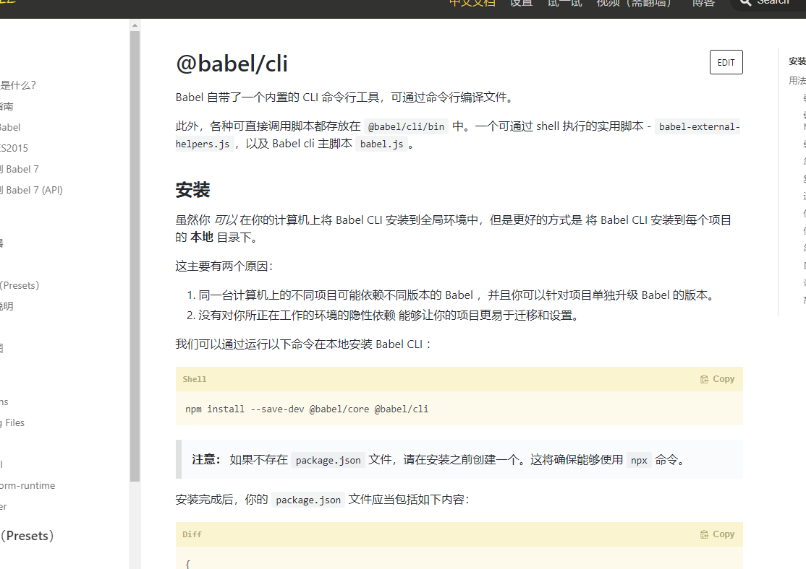


打包生成代码如下，可以看到并没有处理**ES6**特性，但是必须要处理这么特性，于是<font style="color:#f03d3d">babel</font>就诞生了

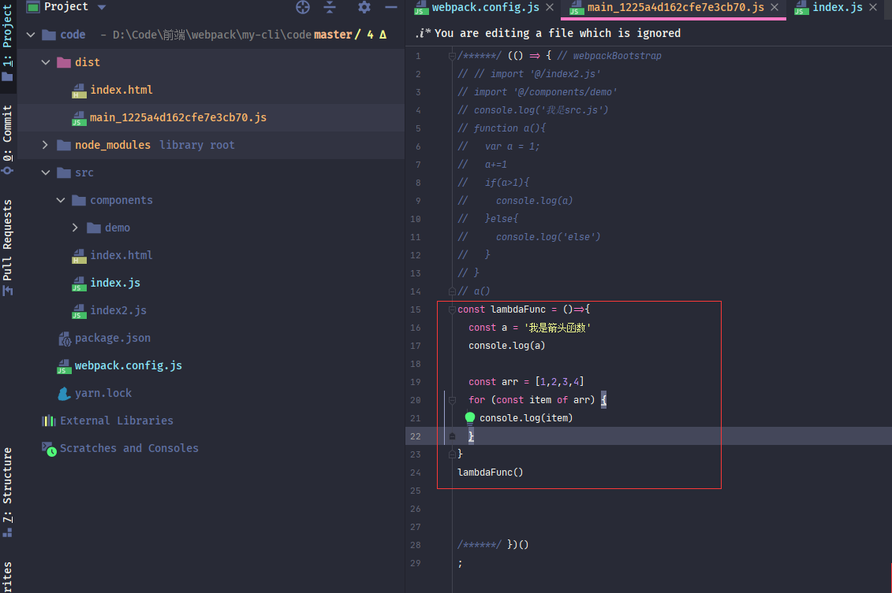

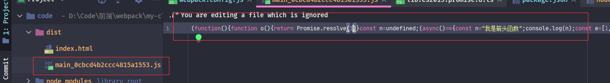


> :whale2::whale2::whale2: 测试生成的语句都是 ***yarn build***, 也就是 **devtool:none**, 使用***yarn start*** 代码不太好查看
>
> 
>
> :whale2::whale2:  ES6是ES2015之后的所有版本   有的文章会写成ES7、ES8这些，但是其实都是ES6。
>
> 
>
> :whale2: 上面代码使用到了ES2015的 **Promise**类型、**块级声明（const）**、**箭头函数**、**for-of语法**、**数组API**和ES2017的**await**,不了解这些的诸君可以看看阮一峰老师的[ES6入门教程](https://es6.ruanyifeng.com/)

:whale2::whale2::whale2::whale2::whale2::whale2::whale2::whale2::whale2::whale2::whale2::whale2::whale2::whale2::whale2::whale2::whale2::whale2::whale2::whale2::whale2::whale2::whale2::whale2::whale2::whale2::whale2::whale2::whale2::whale2::whale2::whale2::whale2::whale2::whale2::whale2::whale2::whale2::whale2::whale2::whale2::whale2:


### babel介绍

<font style="color:#f03d3d">babel</font>并不是仅仅是<font style="color:#f03d3d">webpack</font>的一个扩展。看起来<font style="color:#f03d3d">babel</font>没多少东西，只是将**ES6**转为**ES5**特性罢了，但是这里面的门门道道就多了。

**ES6**的新语法，新API，还有扩展Typescript、JSX语法等等。。。。

可以说**ES6**转**ES5**也是一个大坑，里面需要处理很多东西

那么该怎么设计才是最好的选择呢，诸君可以在此思考一下

>:whale2::whale2::whale2::whale2::whale2::whale2::whale2::whale2::whale2::whale2::whale2::whale2::whale2::whale2::whale2::whale2::whale2::whale2::whale2::whale2::whale2::whale2::whale2::whale2::whale2::whale2::whale2::whale2::whale2::whale2::whale2::whale2::whale2::whale2::whale2::whale2::whale2::whale2::whale2::whale2::whale2::whale2::whale2::whale2::whale2::whale2::whale2:

>:whale2::whale2::whale2::whale2::whale2::whale2::whale2::whale2::whale2::whale2::whale2::whale2::whale2::whale2::whale2::whale2::whale2::whale2::whale2::whale2::whale2::whale2::whale2::whale2::whale2::whale2::whale2::whale2::whale2::whale2::whale2::whale2::whale2::whale2::whale2::whale2::whale2::whale2::whale2::whale2::whale2::whale2::whale2::whale2::whale2::whale2::whale2:

>:whale2::whale2::whale2::whale2::whale2::whale2::whale2::whale2::whale2::whale2::whale2::whale2::whale2::whale2::whale2::whale2::whale2::whale2::whale2::whale2::whale2::whale2::whale2::whale2::whale2::whale2::whale2::whale2::whale2::whale2::whale2::whale2::whale2::whale2::whale2::whale2::whale2::whale2::whale2::whale2::whale2::whale2::whale2::whale2::whale2::whale2::whale2:


答案就是与<font style="color:#f03d3d">webpack</font>设计思想一样，提供一个核心，然后以插件化扩展形式向外暴露

<font style="color:#f03d3d">babel</font>就是这样设计的，与<font style="color:#f03d3d">webpack</font>一样，<font style="color:#f03d3d">babel</font>提供了一个<font style="color:#007FFF">**核心引擎**</font>，然后提供插件化进行扩展。

这个<font style="color:#007FFF">**核心引擎**</font>库就是<font style="color:#f03d3d">@babel/core</font>


所以<font style="color:#f03d3d">babel</font>与<font style="color:#f03d3d">webpack</font>一样，是一个单独的存在，只不过所做的功能不一样。


> :whale2: <font style="color:#f03d3d">babel</font>提供了一个<font style="color:#f03d3d">@babel/cli</font>库，这个库与<font style="color:#f03d3d">webpack-cli</font>功能一样，允许直接运行<font style="color:#f03d3d">babel</font>
>
> ```javascript
> {
>  "scripts": {
>   "build": "babel src -d lib"
> }
> }
> ```
>
> 但是在此就不去学习这一块的知识了，有兴趣的诸君可以去看一下[官网](https://www.babeljs.cn/docs/usage)
>
> 
>
> :whale2: <font style="color:#f03d3d">babel</font>也可以使用在任意打包器中


在这里直接学习<font style="color:#f03d3d">webpack</font>中使用<font style="color:#f03d3d">babel</font>。

既然<font style="color:#f03d3d">babel</font>是一个独立的东西，那么又怎么在<font style="color:#f03d3d">webpack</font>中使用呢？


在软件设计中有一种说法：解决耦合的问题就是再拆一层。其实这里跟这种说法有些雷同。只是这是将两个非耦合的连接起来，而连接起来的办法就是**适配器**。

做一个<font style="color:#f03d3d">babel</font>适配器以便可以在<font style="color:#f03d3d">webpack</font>中使用。有后端经验的诸君会知道这是一种设计模式--**适配器模式**。没有后端经验的诸君可以参考电源适配器，就跟那个类似，或者去网上查看下相关资料。

<font style="color:#f03d3d">babel</font>就提供了这么一种**适配器**：<font style="color:#f03d3d">babel-loader</font>，这是一个***loader***，在前面说过***loader***是将**非JS模块**转换为**JS模块**的转换器。<font style="color:#f03d3d">babel</font>看起来是将**JS模块**转换为**JS模块**，其实也并非如此，<font style="color:#f03d3d">babel</font>还支持TS、JSX等模块，只要<font style="color:#f03d3d">babel</font>处理这些模块就行

所以<font style="color:#f03d3d">babel-loader</font>只是<font style="color:#f03d3d">@babel/core</font>的桥梁，调用它的API。真正执行的还是<font style="color:#f03d3d">@babel/core</font>引擎。


先来配置这两个库

> yarn add -D babel-loader@8.2.2 @babel/core@7.12.10


```javascript
{
   module:{
    rules:[
      {
        //  所有的.js文件都走babel-loader
        test:/\.js$/,
        include:path.join(__dirname,'src'),
        loader: "babel-loader",

      }
    ]
  },
}
```

代码中设置了所有的**.js**文件都走<font style="color:#f03d3d">babel-loader</font>这个***loader***，然后将**ES6**转换为**ES5**

:whale2::whale2::whale2::whale2::whale2::whale2::whale2::whale2::whale2::whale2::whale2::whale2::whale2::whale2::whale2::whale2::whale2::whale2::whale2::whale2::whale2::whale2::whale2::whale2::whale2::whale2::whale2::whale2::whale2::whale2::whale2::whale2::whale2::whale2::whale2::whale2::whale2::whale2::whale2::whale2::whale2::whale2:


### @babel/preset-env 介绍

<font style="color:#f03d3d">@babel/core</font>只是一个**执行引擎**，并不会去转换代码。要想转换代码，必须设置对应的**plugin**。


先看这个plugin：<font style="color:#f03d3d">@babel/preset-env</font>


> yarn add -D @babel/preset-env@7.12.11


这是一个什么**plugin**呢，请诸君跟着思路接着走下去


在***loader***设置项时，其实还有一个选项，那就是**options**，也就是设置当前**loader**的附加使用选项。每一个***loader***的**options**都不尽相同。不过多数都有一个共同的设置，那就是**plugins**，也就是当前***loader***使用到的**plugin**。

```javascript
{
   module:{
    rules:[
      {
        //  所有的.js文件都走babel-loader
        test:/\.js$/,
        include:path.join(__dirname,'src'),
        loader: "babel-loader",
        options: {
          presets:[
            "@babel/preset-env",
          ]
        }

      }
    ]
}
```

看到代码诸君可能会有些疑惑，不是**plugins**吗？怎么是**presets**。诸君请听我慢慢道来。

<font style="color:#007FFF">preset</font>的中文翻译是：预设、预置。

 也就是**presets**属性是<font style="color:#f03d3d">@babel/core</font>自己约定的一个属性，就是<font style="color:#f03d3d">babel</font>给开发人员预置了许多常用**plugin**，将这些**常用plugin**根据某些规则进行封装为一个库，以便可以方便配置。

所有的**preset**库都应该应该**preset**，（官方的都具有**preset**，自定义的如果有人不按照规则则没有**preset**）   配置在**presets**参数中

这些预设plugin的库名称都有**preset**词语。当然也可以使用真正的plugin，设置在**plugins**中

```javascript
 options: {
          presets:[
            "@babel/preset-env",
          ],
          plugins:[]
        }
```


> :whale2::whale2: preset的执行是按照*presets*设置的倒序执行，这个官方说主要是为了确保向后兼容


> :whale2: presets参数配置可以设置短名称，
>
> 		1.  如果preset以**babel-preset-**为前缀，则可以省去前缀。 例如*babel-preset-my-custom*，可以设置为*custom*
> 		2.  也适用于冠名的，例如*@babel/preset-env*，也可以设置为*@babel/env*


下面来看看代码结果

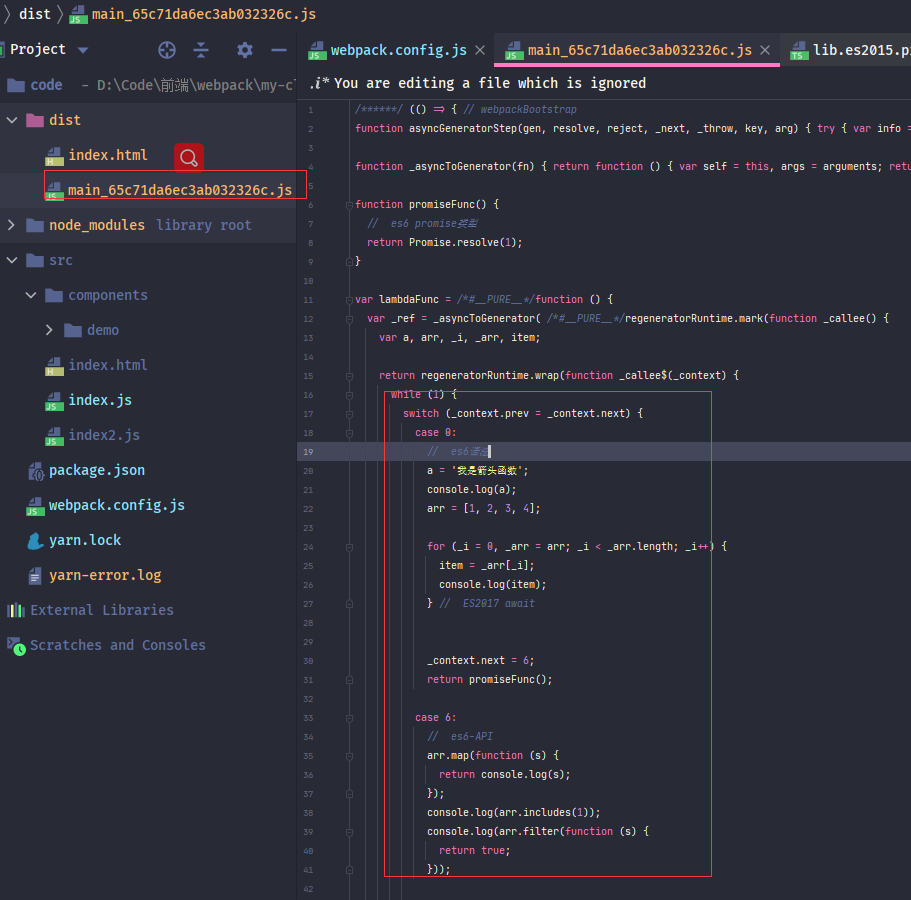


可以看到生成的代码中**await**、**for-of**、**const**都不见了，倒是出现了许多**case**，这个是**await**转换为的ES5语法，await本身就是异步同步化的状态机，如果不认识的诸君可以忽略，只需要知道是将**await**转换为**ES语法**就行了，

看起来挺完美，但是如果细心的诸君，可以看出有问题，还是大问题：

1. 顶部竟然还有箭头函数
2. 写的好几个ES6特性都没有被转换：**Promise**、**includes**、**filter**

第一个问题放在后面说，先来看看第二个问题，诸君请思考一下，被完成转换的是什么，被忽略转换的是什么


答案是被转换的是**ES6语法（syntax）**，未转换的是**类型和函数（API）**，也就是<font style="color:#f03d3d">babel</font>将两者分开处理了，为什么要分开呢？诸君可以再思考下。


其实就是两者的不同，**语法（syntax）**属于***语言本身客观存在的事实***。而**类型和函数（API）**则是封装了一系列**操作**。


运行环境如果不支持当前**语法（syntax）**，那么就必须换一种语法，没有第二种选择；而如果运行环境没有当前**类型和函数（API）**，那就有两种方案了。

一：同语法（syntax）转换一样，转换成运行环境支持的*API*。

二 创建一个与系统默认相同名称和功能的的**API**，运行时直接运行自定义的也可以


> :whale2:  JS中语法（syntax）错误提示是：<font style="color:#f03d3d">Uncaught SyntaxError</font>，API错误提示是：<font style="color:#f03d3d">Uncaught ReferenceError</font>。有兴趣的诸君可以在浏览器控制台中测试一下。


诸君思考一下，哪个方案比较好。答案明显第二种方案，只需要将**ES6-API**写一遍。然后在项目中导入。

看起来是不是一个很棒的设计。没错，<font style="color:#f03d3d">babel</font>就是这样设计的。<font style="color:#f03d3d">@babel/preset-env</font>库的作用就是转换**ES6**语法。而API操作，则是交给别的库完成。这种库被称为**垫片**

> :whale2:<font style="color:#f03d3d">@babel/preset-env</font>这个预设插件取代了<font style="color:#f03d3d">preset-es20**</font>系列的预设插件，减少了繁琐的配置项

> :whale2: 目前在浏览器中无法运行，如果诸君运行出现 *regeneratorRuntime未定义*，切莫慌忙。

:whale2::whale2::whale2::whale2::whale2::whale2::whale2::whale2::whale2::whale2::whale2::whale2::whale2::whale2::whale2::whale2::whale2::whale2::whale2::whale2::whale2::whale2::whale2::whale2::whale2::whale2::whale2::whale2::whale2::whale2::whale2::whale2::whale2::whale2::whale2::whale2::whale2::whale2::whale2::whale2::whale2::whale2:


### babel配置

刚才将<font style="color:#f03d3d">@babel/preset-env</font>设置在了**loader**的**options**中，<font style="color:#f03d3d">@babel/core</font>还支持另外两种配置方式，

1. 配置在***package.json***文件中，在**package.json**文件中**babel**属性设置，

   ```json
    "babel": {
      "presets": [
        "@babel/preset-env"
      ],
      "plugins": [
      ]
    }
   ```

2. 单独的配置文件。这种方式与**webpack.config.js**类似，使用**约定名称**的文件进行设置。约定名称可以为**babel.config.js**或**.babelrc.json**。一般使用的就是这种方式进行配置。名称一般都是使用**.babelrc.json**，不过一般都会省略.json的后缀，叫做：<font style="color:#007FFF">.babelrc</font>

   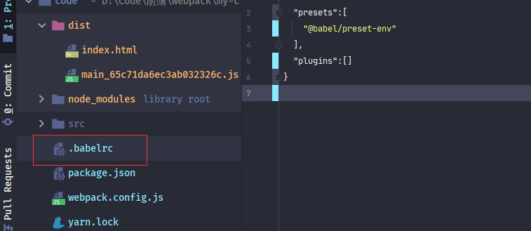

   

   > 配置package.json文件和配置文件两种方式只能选一种，如果两种都使用会直接报错，配置在**loader**中的可以与这两种同时存在，会优先使用**loader**中
   >
   > 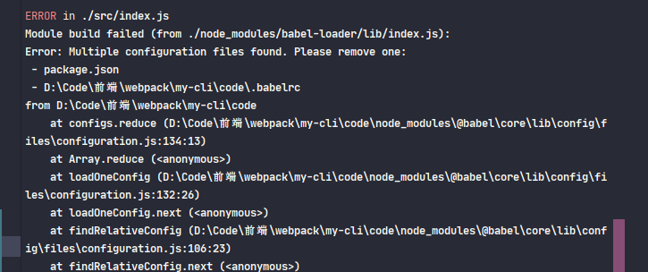

   

   

   使用**plugin**时，还可以给**plugin**设置参数，设置参数的写法有些奇怪

   **plugin**与参数写到一个数组中，*下标0的为plugin*，*下标1的为参数*，一种比较奇怪的写法。具体参数意义下面再说

   ```javascript
   {
     "presets": [
        ["@babel/preset-env", {
             "targets": "defaults"
        }]
     ],
     "plugins": [
     ]
   }
   ```

   

   > :whale2::whale2::whale2: 
>
   > 下面全部使用配置文件形式，一定要把**loader**中的**options**进行删除，切记，切记，切记，我就被这玩意坑了1天多。

   

   :whale2::whale2::whale2::whale2::whale2::whale2::whale2::whale2::whale2::whale2::whale2::whale2::whale2::whale2::whale2::whale2::whale2::whale2::whale2::whale2::whale2::whale2::whale2::whale2::whale2::whale2::whale2::whale2::whale2::whale2::whale2::whale2::whale2::whale2::whale2::whale2::whale2::whale2::whale2::whale2::whale2::whale2:

   

   ### 处理ES6-API

   

   #### 设置低版本浏览器

   测试**ES6-API**时导入，需要一个不支持ES6的低版本浏览器（如果自身浏览器版本过老可以忽略此操作），

   在此使用IE浏览器测试，现在很多ES6特性已经不再支持IE，正好可以用来测试

   例如**promise**，就不支持IE浏览器

   

   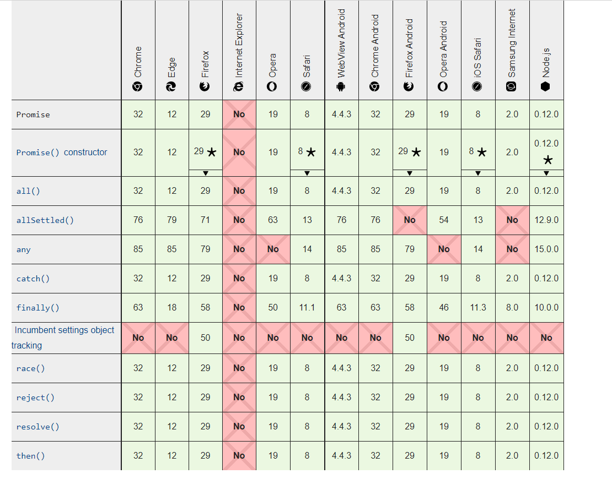

    并且一般win10默认自带的为*IE11*，IE浏览器还支持修改版本，

   在F12**开发者模式--仿真--文档模式** 中可以修改IE版本，在这里使用**IE9**

   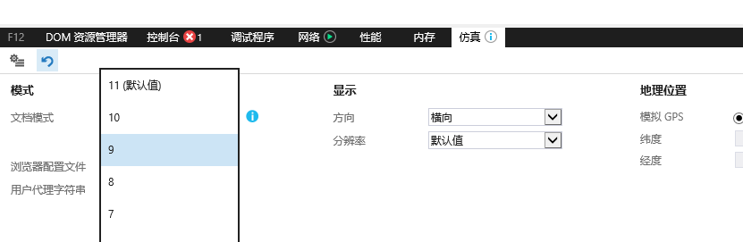

   

   

   

   在设置好测试环境后，还需要处理一个东西。

   

   诸君还记否刚才留了一个小问题：顶部具有一个箭头函数。这个箭头函数并不是代码编写的，而是生成出来的。处理一下这个箭头函数。

   在**package.json**文件中添加一个**browserslist**属性

   ```json
   "browserslist": [
       "ie 9"
     ]
   ```

   这个属性代表打包的代码必须支持IE9，这个属性还可以用于CSS，后面会详细介绍

   

   现在打包生成的就没有箭头函数了

   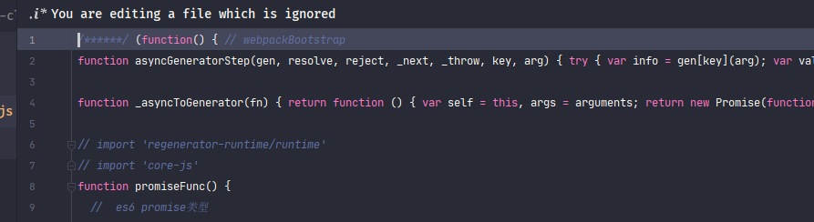

   

   

   #### regenerator-runtime和core-js

   在打完包后的代码为什么一直无法运行呢？ 这是因为缺少了<font style="color:#f03d3d">regenerator-runtime</font>库 ，这个库一般都是与<font style="color:#f03d3d">core-js</font>一块出现。  

   

   <font style="color:#f03d3d">core-js</font>又是什么呢，诸君请整理好思路接着看下去

   

   在前面说过，现在需要一个ES6-API库，在浏览器不支持ES6版本使用此库。而<font style="color:#f03d3d">core-js</font>就是一个这样库，这个库预设了所有的**ES6-API**，以满足运行时的需求。

   > :whale2:<font style="color:#f03d3d">core-js</font>是一个私人开发的项目，并非<font style="color:#f03d3d">babel</font>所有，<font style="color:#f03d3d">babel</font>只不过是使用它进行处理**ES6**的**API**罢了。

   [core-js](https://www.npmjs.com/package/core-js)项目现在最新版本为3.8.1，而<font style="color:#f03d3d">core-js</font>在*2.X版本*和*3.X版本*进行更新时发生了巨大的变化，以至于<font style="color:#f03d3d">babel</font>配置时也有所不同，不过现在基本都是使用**3.X版本**，在这里也以**3.X版本**为基础

   

   ##### regenerator-runtime、core-js和@babel/polyfill关系

   在使用之前，先说一下为什么在这里介绍<font style="color:#f03d3d">regenerator-runtime</font>库，有了解或者查过<font style="color:#f03d3d">babel</font>相关资料的诸君或许会知道这个库：<font style="color:#f03d3d">@babel/polyfill</font>，这个也是处理**ES6-API**的，那么这个库与<font style="color:#f03d3d">core-js</font>有什么区别呢？

   在<font style="color:#f03d3d">@babel/polyfill</font>官方介绍中对于这个包是这样说的

   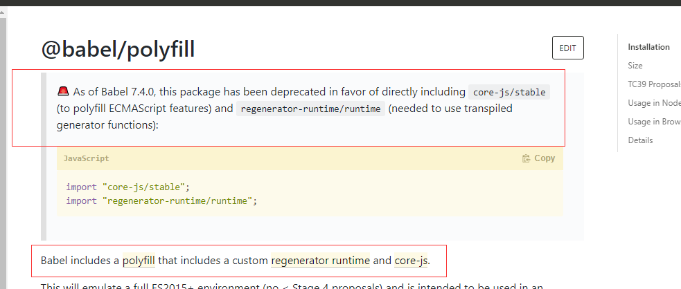

   1. 上面那段话的意思是：在***babel7.4.0版本***之后，就不建议使用<font style="color:#f03d3d">@babel/polyfill</font>，而是建议直接使用<font style="color:#f03d3d">core-js</font>和<font style="color:#f03d3d">regenerator-runtime</font>。

   2. 下面那段话的意思是：<font style="color:#f03d3d">@babel/polyfill</font>库包含了<font style="color:#f03d3d">core-js</font>和<font style="color:#f03d3d">regenerator-runtime</font>

   

   通过上面这两段可以理解：<font style="color:#f03d3d">@babel/polyfill</font>就是<font style="color:#f03d3d">core-js</font>和<font style="color:#f03d3d">regenerator-runtime</font>的再封装，并且在***babel7.4.0版本***之后就不要再使用<font style="color:#f03d3d">@babel/polyfill</font>了。

   这是因为**core2.X**与**core3.X**的差异性，而<font style="color:#f03d3d">@babel/polyfill</font>无法过渡适配，所以新版本最好都使用<font style="color:#f03d3d">core-js</font>和<font style="color:#f03d3d">regenerator-runtime</font>，当然也可以使用<font style="color:#f03d3d">@babel/polyfill</font>的，只是不太建议

   

   先来安装这两个库，这两个库在运行时用到了，所以需要安装到<font style="color:#f03d3d">dependencies</font>环境

   > yarn add core-js@3.8.1 regenerator-runtime@0.13.7

   

   在index.js中进行引用这两个库

   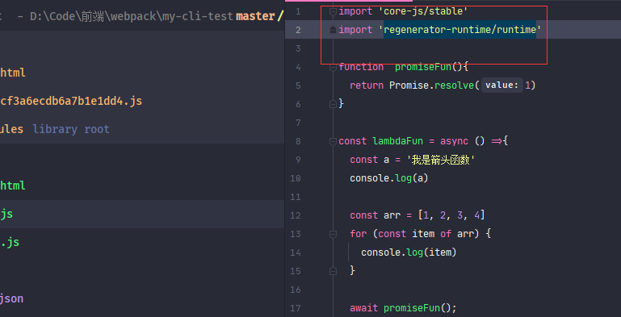

   

   > :whale2: 引用的：import "core-js/stable" 和import "regenerator-runtime/runtime";

   

   执行打包命令后会发现生成的代码生成了好多东西

   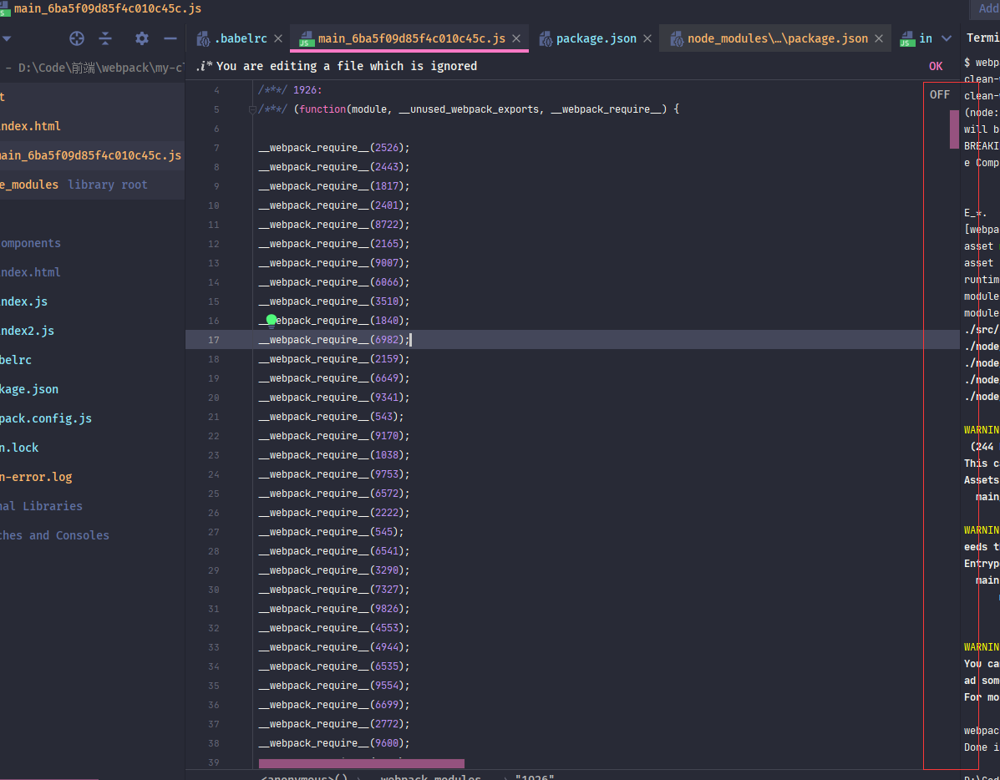

   

   

   这些就是<font style="color:#f03d3d">core-js</font>生成替换**ES6-API**的垫片，诸君可以使用**filter**或者**includes**查找一下，在此就不贴图了。

   

   这时再用IE打开HTML运行会发现已经可以运行了

   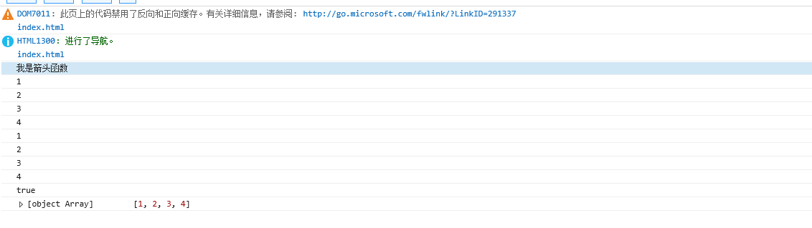

   

   

   看起来一切那么完美，但是真是如此吗？恐怕得说声：**No No No**。

   来看一下打包后的大小

   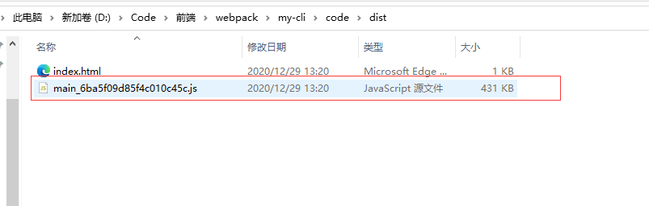

   > :whale2:诸君打包后大小可能与我稍微有些出入，但是基本一致

   

   看到这个文件大小时，我有一种“山雨欲来风满楼”的感觉。不知诸君是否有同感。这个大小着实有些恐怖。虽然代码是未压缩的，又这是什么原因呢？

   

   原来在默认引入<font style="color:#f03d3d">core-js</font>时，会将<font style="color:#f03d3d">core-js</font>所有函数进行导入。 哪怕只是使用一个新API  。这真是：*大炮打蚊子--小题大做*

   

   所以需要在处理时做到按需导入。有需求就有方案，***babel***配置提供了可以按需导入的方法。

   

   :whale2::whale2::whale2::whale2::whale2::whale2::whale2::whale2::whale2::whale2::whale2::whale2::whale2::whale2::whale2::whale2::whale2::whale2::whale2::whale2::whale2::whale2::whale2::whale2::whale2::whale2::whale2::whale2::whale2::whale2::whale2::whale2::whale2::whale2::whale2::whale2::whale2::whale2::whale2::whale2::whale2::whale2::whale2::whale2:

   

   

   #### @babel/preset-env 参数设置

   

   #### useBuiltIns 属性

   在介绍怎么按需导入之前，先说明一下所谓的**按需导入**

   > :whale2::whale2::whale2: 
   >
   > **按需加载**具有两种情况
   >
> 1. 按浏览器版本导入：根据浏览器版本打包，例如只想运行最新的Chrome浏览器，那么无须进行导入（语法也不需要转换）
   > 2. 按使用导入：根据代码中使用到的API进行导入，只需要导入使用到的API进行
>
   > 两者之和是最优选择。

   

   在<font style="color:#f03d3d">@babel/preset-env</font>中有个**useBuiltIns**参数是用来设置**按需导入**，这个属性具有三个值，***false*** 、***entry***、***usage***,默认值是**false**（全部导入）

   > :whale2: 这里其实还有一个区别，`entry`是将按需导入这件事做到了babel的入口，在入口会寻找所有用到的api并引用，而`usage`是在每个用到模块上单独引用，并保证不会一个api在各处只引用一次

   ##### entry

   ***entry***属性实现了**按需导入**的第一种情况：按照浏览器版本导入、转换。

   ```json
   {
     "presets": [
       ["@babel/preset-env",{
         "useBuiltIns": "entry",
         "corejs": {
           "version": 3,
           "proposals":true
         }
   
       }]
     ],
  "plugins": [
     ]
}
   ```

   在<font style="color:#f03d3d">@babel/preset-env</font>属性中设置了**useBuiltIns**，并且还设置了一个**corejs**属性，**corejs**又是什么呢

   

   **corejs**是<font style="color:#f03d3d">babel@7.4.0</font>版本时添加的，是<font style="color:#f03d3d">@babel/preset-env</font>导入<font style="color:#f03d3d">core-js</font>版本时用到的。默认值为***2***，也就是导入<font style="color:#f03d3d">core-js@2X</font>，所以需要设置为***3***，

   **proposals**属性代表 是否填充core-js支持的**提议**API，默认情况下<font style="color:#f03d3d">core-js</font>只会注入*稳定*的API   。

   

   > :whale2::whale2:**corejs**属性只有在**useBuiltIns**为***entry***和***usage***时设置才有效。

   > :whale2: 在这里可以看到其实还是<font style="color:#f03d3d">@babel/preset-env</font>作为转换主导。<font style="color:#f03d3d">core-js</font>像是<font style="color:#f03d3d">@babel/preset-env</font>提供的扩展（其实并不是，而是<font style="color:#f03d3d">@babel/preset-env</font>适配<font style="color:#f03d3d">core-js</font>）

   

   设置完毕之后进行打包：**yarn build**

   打包结果出人意料，还是将所有API都进行了打包，并且发现还大了多么一丢丢

   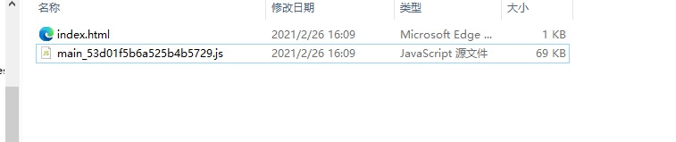

   > :whale2:诸君打包后大小可能与我稍微有些出入，但是基本一致

   

   为何呢？

   

   在前面刚说过一个问题：***entry***是按照浏览器版本进行导入，会将当前浏览器版本不支持的API全部导入，而<font style="color:#f03d3d">babel</font>是怎么判断浏览器版本呢?

   

   还记得在**package.json**文件中设置的**browserslist**属性吗？答案就是它，<font style="color:#f03d3d">babel</font>会读取这个属性配置的浏览器版本，然后根据这些浏览器版本进行导入、转换，而在这里配置的是***ie 9***，***ie 9***不支持任何**ES6**特性，所以<font style="color:#f03d3d">babel</font>会将所有**API**全部导入。

   

   所以只需要设置**browserslist**属性只支持新版本浏览器就可以看到差异。例如

   ```json
 "browserslist": [
       "Chrome > 75"
  ]
   ```

   

   现在打包生成的代码就会少了好多。

   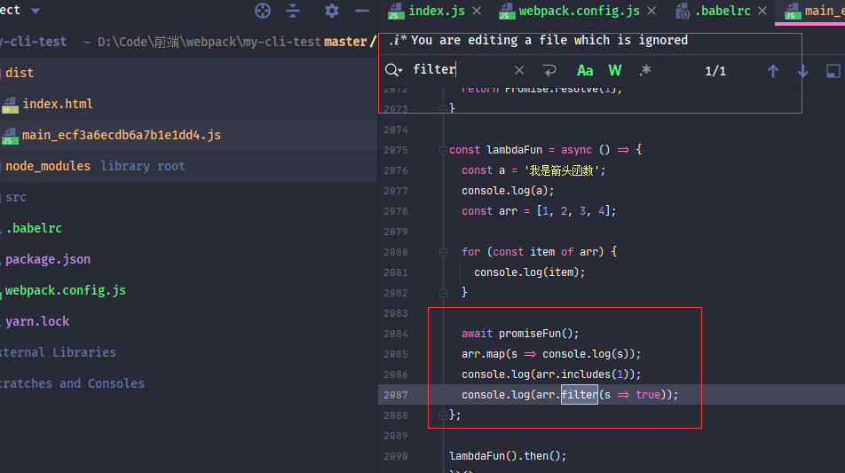

   

   *Chrome75*支持所有新特性，连箭头函数都不需要转换。更别说**ES2015**的API了。

   打包生成的代码不需要导入垫片，连语法都没有转换（在这里就不贴图了）。当然这样的代码在**IE**是无法运行的

   

   > :whale2::whale2: :whale2:：​**browserslist**同时控制了语法和API，<font style="color:#f03d3d">babel</font>根据**browserslist**属性进行转换和导入

   

   > :whale2:**browserslist**是一个独立于<font style="color:#f03d3d">babel</font>的规范库，只不过<font style="color:#f03d3d">babel</font>使用到了**browserslist**，不止<font style="color:#f03d3d">babel</font>，CSS打包也会使用到这个库，这个库后面再详细介绍

   

   诸君也可以试下其他版本浏览器，例如：***Chrome > 49***，在这里就不测试了。

   

   至于**useBuiltIns**为***false***时在新版浏览器打包时的结果，有兴趣的诸君也可以测试感受一下。

   > :whale2: 写代码重在好奇、兴趣、折腾

   

   ##### usage

   使用***entry***属性以浏览器版本的**按需导入**，但还不是真正需要的**按需导入**， 而***usage***值则提供了***理论上***真正按需导入：**浏览器版本+代码使用**

   ```json
   {
     "presets": [
       	["@babel/preset-env",{
         "useBuiltIns": "usage",
         "corejs": {
           "version": 3,
           "proposals":true
         }
    	}]
     ],
     "plugins": [
     ]
   }
   ```

   ```json
  "browserslist": [
       "ie 9"
  ]
   ```

   

   在**useBuiltIns**设置为***usage***，将**browserslist**设回***IE9***。

   还需要一点，***usage***不需要手动引用**core-js**，会自动加载**core-js**库。

   所以，在*index.js*中删除引用

   > :whale2:不删除import不会优化

   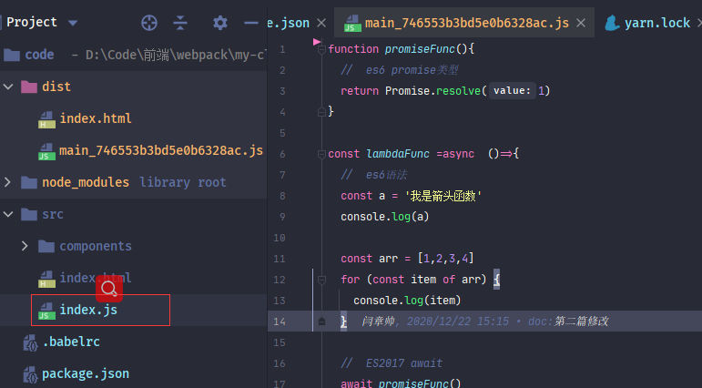

   

   

   打完包以后就会发现文件比**entry**属性时小了不少

   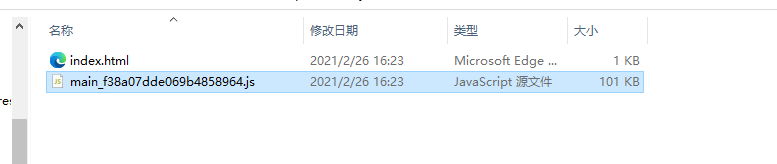

   

   并且也能IE9版本中正常运行。生成的代码中基本不存在未使用的**ES6**垫片。诸君可以试一下，在此就不在贴图。

   

   如果**browserslist**为**Chrome > 75**，则便不会导入和转换

   ```json
 "browserslist": [
       "Chrome > 75"
  ]
   ```

   

   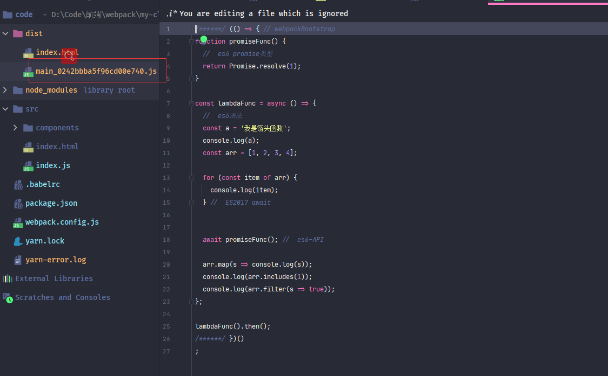

   


#### entry和usage有话说


#### targets属性

<font style="color:#f03d3d">@babel/preset-env</font>参数中具有一个**targets**属性，这个参数的意思与**browserslist**一样：设置目标浏览器版本，参数可以设置字符串和对象，支持**browserslist**格式。这个属性的优先级高于**browserslist**

> :whale2:targets属于<font style="color:#f03d3d">babel</font>自己的设置目标浏览器属性，**browserslist**属性一种通用约定属性

```json
{
  "presets": [
    ["@babel/preset-env",{
      "targets": "chrome > 75",
      "useBuiltIns": "usage",
      "corejs": {
        "version": 3,
        "proposals":true
      }

    }]
  ],
  "plugins": [
  ]
}
```

```json
{
  "presets": [
    ["@babel/preset-env",{
      "targets": {
        "chrome": "58",
        "ie": "11"
    }]
  ],
  "plugins": [
  ]
}
```

不过并不建议使用此属性，建议使用**browserslist**，原因有二

1. 无法处理自动生成的箭头函数

   

2. 配置统一管理为最佳，使用**browserslist**属性的话，属于全局性质的。

> :whale2:**browserslist**格式后续再说


<font style="color:#f03d3d">@babel/preset-env</font>插件还有其它一些属性，不过不常用。有兴趣的诸君可以看下[官网](https://www.babeljs.cn/docs/babel-preset-env#targets)，差评是没有中文版


#### @babel/plugin-transform-runtime

下面来介绍下这个库：<font style="color:#f03d3d">@babel/plugin-transform-runtime</font>


这是一个什么库？ 转换运行？

这个plugin也是用于设置**按需导入垫片**，与 **useBuiltIns=usage**功能一样，那么它有什么不同呢？

在前面说垫片是创建一个与运行环境支持的相同名称的API，只不过是将原API进行了覆盖

这样做其实具有一个问题：**污染全局**。

这种情况原则上是不允许的，尤其是在写第三方库时，所以需要一个方案可以不污染原API

<font style="color:#f03d3d">@babel/plugin-transform-runtime</font>库就是实现此方案的。


<font style="color:#f03d3d">@babel/plugin-transform-runtime</font>库依赖一个库<font style="color:#f03d3d">@babel/runtime-corejs3</font>（或<font style="color:#f03d3d">@babel/runtime-corejs2</font>  core-js2.X）

<font style="color:#f03d3d">@babel/runtime-corejs3</font>这个库其实也就是一个<font style="color:#f03d3d">core-js</font>封装库，只不过做了一些处理，具体可以参考[这篇文章](https://segmentfault.com/a/1190000020237790)，不过这篇文章是**core-js2.X**版本，与**core-js3.X**具有一定差异

> :whale2:  使用<font style="color:#f03d3d">@babel/plugin-transform-runtime</font>包，那么在**package.json**文件中删除<font style="color:#f03d3d">core-js</font>和<font style="color:#f03d3d">regenerator-runtime</font> ,因为<font style="color:#f03d3d">@babel/runtime-corejs3</font>包会直接依赖。所以只是**package.json**文件中干净一些。


> yarn add -D @babel/plugin-transform-runtime@7.12.10  @babel/runtime-corejs3@7.12.5    // 因为这个库是做转换的，所以只在打包时使用


在**.babelrc**文件配置中使用<font style="color:#f03d3d">@babel/plugin-transform-runtime</font>库代替<font style="color:#f03d3d">@babel/preset-env</font>配置。

```json
{
  "presets": [
    [
      "@babel/preset-env",
      {
        //  移除useBuiltIns设置
        //      "targets": "chrome > 75",
        //      "useBuiltIns": "usage",
        //      "corejs": {
        //        "version": 3,
        //        "proposals":true
        //      }
      }
    ]
  ],
  "plugins": [
    [
      "@babel/plugin-transform-runtime",
      {
        "corejs": {
          "version": 3,
          "proposals": true
        }
      }
    ]
  ]
}
```

> :whale2::whale2:使用<font style="color:#f03d3d">@babel/plugin-transform-runtime</font>也不需要进行手动导入，会在打包时自动编译

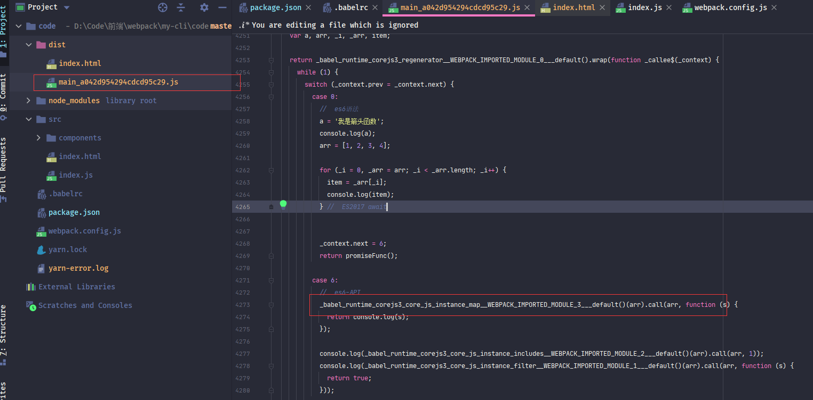


可以看到使用的**ES6-API**已经被转换为另外的API了，所以并不会再污染全局代码。至于打包的大小，诸君可以自己测试看看


### 总结 

> :whale2::whale2::whale2:
>
> * **babel**是用来将**ES6代码**转换为**ES5代码**的工作
>
> * **babel**提供了一个核心引擎，也是使用扩展形式进行执行
>
> * 在**webpack**中，使用一种*转换器模式（**babel-loader**）*将**babel**应用到**webpack**中
>
> * **babel**将 **语法（syntax）**和**API**分开进行处理，处理语法的是**@babel/preset-env**，处理API使用垫片**core-js**
>
> * **babel**提供一种预设plugin的功能，所有的预设放在***presets***属性中
> * **@babel/preset-env**设置**useBuiltIns**可以进行垫片优化：**entry**值是依据浏览器进行按需导入垫片，**usage**值是依据浏览器+项目使用进行按需导入垫片
> * **@babel/plugin-transform-runtime**库可以做到不污染全局API


### 本文参考

* [@babel/preset-env 与@babel/plugin-transform-runtime 使用及场景区别](https://segmentfault.com/a/1190000021188054)

* [babel corejs@3 是如何按需polyfill原型对象方法的](https://zhuanlan.zhihu.com/p/139359864)

* [@babel/plugin-transform-runtime 到底是什么？](https://zhuanlan.zhihu.com/p/147083132)

* [Babel7 转码（四）- polyfill 还是 transform-runtime](https://segmentfault.com/a/1190000020237790)

* [Polyfill 方案的过去、现在和未来 #80](https://github.com/sorrycc/blog/issues/80)

* [2020 如何优雅的兼容 IE](https://www.yuque.com/kuitos/gky7yw/qskte2)


### package.json

```json
{
  "name": "my-cli",
  "version": "1.0.0",
  "main": "index.js",
  "author": "mowenjinzhao<yanzhangshuai@126.com>",
  "license": "MIT",
  "devDependencies": {
    "@babel/core": "7.12.10",
    "@babel/plugin-transform-runtime": "7.12.10",
    "@babel/preset-env": "7.12.11",
    "@babel/runtime-corejs3": "7.12.5",
    "babel-loader": "8.2.2",
    "clean-webpack-plugin": "3.0.0",
    "html-webpack-plugin": "4.5.0",
    "terser-webpack-plugin": "^5.0.3",
    "webpack": "5.4.0",
    "webpack-cli": "4.2.0"
  },
  "dependencies": {
    "core-js": "3.8.1",
    "jquery": "3.5.1",
    "regenerator-runtime": "0.13.7"
  },
  "scripts": {
    "start": "webpack --mode=development  --config webpack.config.js",
    "build": "webpack --mode=production  --config webpack.config.js"
  },
  
  "browserslist": [
    "ie 9",
    "Chrome > 75"
    ]
}

```


### webpack.config.js

```javascript
const path = require('path')
const webpack = require("webpack");
const HtmlWebpackPlugin = require('html-webpack-plugin')
const { CleanWebpackPlugin } = require('clean-webpack-plugin')
const TerserPlugin = require('terser-webpack-plugin')

const modules = {

  //  入口文件
  //  字符串形式
  entry: path.join(__dirname,'src/index.js') ,
  //  对象形式
  // entry:{
  //   'index':path.join(__dirname, 'src/index.js')
  // },

  //  出口文件
  //  字符串形式
  // output:path.join(__dirname, 'dist/[name].js')
  //对象形式
  output: {
    //  出口文件的目录地址
    path: path.join(__dirname,'dist'),
    //  出口文件名称，contenthash代表一种缓存，只有文件更改才会更新hash值，重新打包
    filename: '[name]_[contenthash].js'
  },

  //devtool:false, //'eval'

  module:{
    rules:[
      {
        //  所有的.js文件都走babel-loader
        test:/\.js$/,
        include:path.join(__dirname,'src'),
        loader: "babel-loader"
      }
    ]
  },


  optimization: {
    minimize: false,
    minimizer: [
      new TerserPlugin({
        //  包含哪些文件
        include:  /\.js(\?.*)?$/i,
        // //  排除哪些文件
        // exclude:/\.js(\?.*)?$/i,
        //  多进程并行运行，默认为true，开启，默认并发数量为os.cpus()-1
        //  可以设置为false(不使用多线程)或者数值（并发数量）
        parallel:true,

        //  可以设置一个function，使用其它压缩插件覆盖默认的压缩插件，默认为undefined，
        minify:undefined,

        terserOptions: {
          // //  是否防止篡改函数名称，true代表防止篡改，即保留函数名称，false即可以篡改，
          // //  此属性对使用Function.prototype.name
          // //  默认为false
          keep_fnames:false,
          // //  是否防止篡改类名称
          keep_classnames:false,
          // //  设置一些其它的解析
          parse: {},
          //  最小化es6模块。默认为false
          module:true,
          //  ·压缩配置

          //  format和output是同一个属性值，，名称不一致，output不建议使用了，被放弃
          format: {
            comments:false,
          },
          //  是否支持IE8，默认不支持
          ie8:false,
          compress: {
            // 是否使用默认设置，这个属性当只启用指定某些选项时可以设置为false
            defaults:false,
            //  是否移除无法访问的代码
            dead_code:false,

            // 折叠仅仅使用一次的变量
            collapse_vars:true,
            warnings:true,
            //  是否删除所有 console.*语句，默认为false，这个可以在线上设置为true
            //  是否删除所有debugger语句，默认为true
            drop_debugger:true,
            //  移除指定func，这个属性假定函数没有任何副作用，可以使用此属性移除所有指定func
            // pure_funcs: ['console.log'], //移除console
          },
        },
        //  是否将注释提出到单独的文件中
        //  值Boolean|String|RegExp|Function<(node, comment) -> Boolean|Object>|Object
        //  默认为true， 只提取/^\**!|@preserve|@license|@cc_on/i注释
        //  感觉没什么特殊情况直接设置为false即可
        extractComments:false,
      })
    ]
  },


  plugins: [
    new HtmlWebpackPlugin({
      //  template的title优先级大于当前数据
      title: 'my-cli',
      //  文件名称
      filename: 'index.html',

      //  模板路径
      template: './src/index.html',
      // 用于打包后引用脚本时的路径
      publicPath: './',

      //  是否将打包的资源引用到当前HTML， false代表不引用
      //  true或者body将打包后的js脚本放入body元素下，head则将脚本放到中
      //  默认为true
      inject: 'body',
      //  加载js方式，值为defer/blocking
      //  默认为blocking, 如果设置了defer，则在js引用标签上加上此属性，进行异步加载
      scriptLoading: 'blocking',

      //  是否进行缓存，默认为true，在开发环境可以设置成false
      cache: false,
      //  添加mate属性
      meta: {}
    }),

    new CleanWebpackPlugin({

      //  假装文件删除
      //  如果为false则代表真实删除，如果为true，则代表不删除
      dry: false,
      //  是否打印日志到控制台 默认为false
      verbose: true,
      cleanStaleWebpackAssets: false,
      //  允许保留本次打包的文件
      //  true为允许，false为不允许，保留本次打包结果，也就是会删除本次打包的文件
      //  默认为true
      protectWebpackAssets: true,
      //  每次打包之前删除匹配的文件
      cleanOnceBeforeBuildPatterns: ['**/*'],

      //  每次打包之后删除匹配的文件
    }),

    //	定义一个全局变量
    new webpack.DefinePlugin({ "global_a": JSON.stringify("我是一个打包配置的全局变量") }),
  ],

  resolve: {
    alias:{
      //  设置路径别名
      '@':path.join(__dirname,'src'),

      '~': path.resolve(__dirname, '../src/assets')
    },
    //  可互忽略的后缀
    extensions:['.js','.json'],
    //  默认读取的文件名
    mainFiles:['index','main'],
  }
}

//  使用node。js的导出，将配置进行导出
module.exports = modules

```


