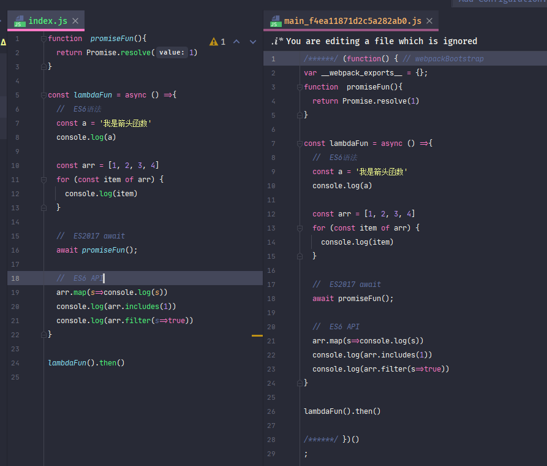
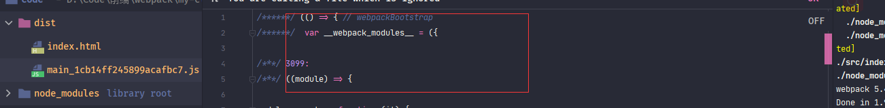
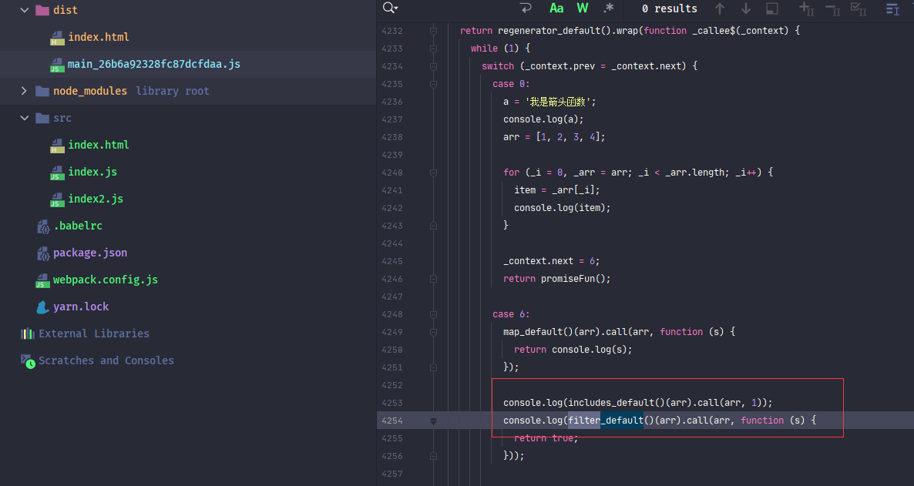

接下来介绍一个打包编译过程中一个极为重要的工具--<font style="color:cornflowerblue">babel</font>。

### ES6的枷锁

细心的朋友可以知道，在之前打包编译测试都是使用简单的<font style="color:cornflowerblue">ES5</font>特性，并没有使用过<font style="color:cornflowerblue">ES6（ES2015+）</font>特性（**import**除外）

<font style="color:cornflowerblue">webpack</font>本身不会处理代码中的<font style="color:cornflowerblue">ES6（ES2015+）</font>

先来做一个测试

在**/src/index.js**文件使用部分<font style="color:cornflowerblue">ES6（ES2015+）</font>，然后观察打包编译代码。



此时使用`yarn build`执行打包代码就会看到：<font style="color:cornflowerblue">webpack</font>并没有处理<font style="color:cornflowerblue">ES6（ES2015+）</font>特性。


自从<font style="color:cornflowerblue">ES6（ES2015+）</font>时代来临后，前端才算具有了飞速发展。<font style="color:cornflowerblue">ES6（ES2015+）</font>各种特性也给开发人员带来了编译，毫不客气的说，现在没有人再想写<font style="color:cornflowerblue">ES5</font>代码了。

但是，前端代码的<font style="color:cornflowerblue">执行环境（浏览器）</font>是由用户决定的，如果用户一直使用旧版本浏览器，那么新特性就无法运行。

那么就需要一种工具：将使用的<font style="color:cornflowerblue">ES6（ES2015+）</font>特性转换为<font style="color:cornflowerblue">ES5</font>特性

这个工具就叫做：<font style="color:cornflowerblue">babel</font>

> :whale2::whale2: :whale2:<font style="color:cornflowerblue">webpack</font>作为一个<font style="color:cornflowerblue">打包器</font>。为<font style="color:cornflowerblue">babel</font>提供了扩展支持。

> :whale2::whale2:  <font style="color:cornflowerblue">ES6</font>是<font style="color:cornflowerblue">ES2015+</font>所有版本统称   有的文章会写成<font style="color:cornflowerblue">ES7</font>、<font style="color:cornflowerblue">ES8</font>。但其实都是<font style="color:cornflowerblue">ES6</font>。

> :whale2: 上面代码使用到了<font style="color:cornflowerblue">ES6</font>的 **Promise类型**、**块级声明（const）**、**箭头函数**、**for-of语法**、**数组API**、**await**属性，不了解<font style="color:cornflowerblue">ES6</font>的朋友可以学习阮一峰老师的[ES6入门教程](https://es6.ruanyifeng.com/)


### babel

#### babel介绍

<font style="color:cornflowerblue">babel</font>并不只是<font style="color:cornflowerblue">webpack</font>一个<font style="color:cornflowerblue">扩展插件</font>。而是一个可以独立运行的工具。

<font style="color:cornflowerblue">ES6</font>来临后，前端开启了百花绽放的时代。从而也导致了<font style="color:cornflowerblue">ES6</font>转<font style="color:cornflowerblue">ES5</font>的工作并不仅仅局限于**JS**语言的原始特性。

例如：<font style="color:cornflowerblue">Typescript</font>、<font style="color:cornflowerblue">JSX</font>语法等等。


所以<font style="color:cornflowerblue">babel</font>工具的设计思想也与<font style="color:cornflowerblue">webpack</font>一致：提供<font style="color:#06f">**核心引擎**</font> + <font style="color:#06f">**插件化**</font>的管理方式

<font style="color:cornflowerblue">babel</font>提供了一个<font style="color:#06f">**核心引擎**</font>库：[@babel/core](https://www.npmjs.com/package/@babel/core) 和 允许扩展插件库的设置。


#### @babel/cli

<font style="color:cornflowerblue">babel</font>其实并不是<font style="color:cornflowerblue">webpack</font>一个<font style="color:cornflowerblue">扩展插件</font>，它是一个独立的工具。可以进行单独配置、运行。

<font style="color:cornflowerblue">babel</font>提供了一个[@babel/cli](https://www.npmjs.com/package/@babel/cli)库，与[webpack-cli](https://www.npmjs.com/package/webpack-cli)库一样，允许命令行直接运行<font style="color:cornflowerblue">babel</font>

``` js
{
  "scripts": {
	"build": "babel src -d lib"
  }
}
```

在此就不介绍<font style="color:cornflowerblue">@babel/cli</font>这一块的内容了，有兴趣的朋友可以去[官网](https://www.babeljs.cn/docs/usage)学习

> :whale2::whale2::whale2: <font style="color:cornflowerblue">babel</font>作为一个独立工具，理论上可以配置在所以<font style="color:cornflowerblue">打包器</font>中。


####  babel-loader

<font style="color:cornflowerblue">babel</font>作为一个独立的工具，那么就肯定不能直接使用在<font style="color:cornflowerblue">webpack</font>中，毕竟它们的接口都不一致

那么想要<font style="color:cornflowerblue">babel</font>执行在<font style="color:cornflowerblue">webpack</font>，就必须提供一个<font style="color:cornflowerblue">适配器</font>，来桥接两个库。

而这个<font style="color:cornflowerblue">适配器</font>就是[babel-loader](https://www.npmjs.com/package/babel-loader)。

<font style="color:#f03d3d">babel-loader</font>在<font style="color:cornflowerblue">webpack</font>执行时拦截需要转换文件，将文件代码先交给<font style="color:cornflowerblue">babel</font>进行转换，然后再传回<font style="color:cornflowerblue">webpack</font>执行接下来的操作。

而<font style="color:#f03d3d">babel-loader</font>只是调用了<font style="color:#f03d3d">@babel/core</font>库中的API。最后执行的还是<font style="color:#f03d3d">@babel/core</font>引擎


下面先安装<font style="color:#f03d3d">babel-loader</font>和<font style="color:#f03d3d">@babel/core</font>

> yarn add -D babel-loader@8.2.2 @babel/core@7.13.1

然后在**webpack.config.js**中配置所有的**.js**文件都使用<font style="color:#f03d3d">babel-loader</font>进行转换。

```javascript
{
   module:{
    rules:[
      {
        //  所有的.js文件都走babel-loader
        test:/\.js$/,
        include: path.join(config.root,'src'),
        loader: "babel-loader",
      }
    ]
  },
}
```

> :whale2: <font style="color:cornflowerblue">babel@6.X</font>版本时，<font style="color:#06f">**核心引擎**</font>库名为<font style="color:#f03d3d">babel-core</font>。从<font style="color:cornflowerblue">babel@7.X</font>版本之后，官方对库名称做了统一的修改，官方提供的包都以<font style="color:cornflowerblue">@babel/</font>为冠名，所以<font style="color:#f03d3d">babel-core</font>和<font style="color:#f03d3d">@babel/core</font>实际上是一个库 。有兴趣朋友可以在<font style="color:cornflowerblue">NPM</font>中对比下两个包的版本  ：[@babel/core](https://www.npmjs.com/package/@babel/core)、[babel-core](https://www.npmjs.com/package/babel-core)

> :whale2:后面会陆续加入其它文件执行<font style="color:#f03d3d">babel-loader</font>。例如：<font style="color:cornflowerblue">.ts</font>、<font style="color:cornflowerblue">.jsx</font>

但是目前依然无法转换<font style="color:cornflowerblue">ES6（ES2015+）</font>代码。因为只添加了<font style="color:cornflowerblue">引擎（@babel/core）</font>，并没有添加具体转换库。


#### @babel/preset-env

先来介绍一下[@babel/preset-env](https://www.npmjs.com/package/@babel/preset-env)库，来完成部分转换功能。

<font style="color:#f03d3d">@babel/preset-env</font>是<font style="color:cornflowerblue">babel </font>***预设***的一个<font style="color:cornflowerblue">plugin</font>

> yarn add -D @babel/preset-env@7.13.5


在配置<font style="color:cornflowerblue">loader</font>时，可以设置当前<font style="color:cornflowerblue">loader</font>使用的属性和依赖库。<font style="color:#f03d3d">babel-loader</font>中具有一个**presets**属性来依赖的<font style="color:cornflowerblue">预设插件（preset）</font>

```javascript
{
    module:{
        rules:[
            {
                //  所有的.js文件都走babel-loader
                test:/\.js$/,
                include: path.join(config.root,'src'),
                loader: "babel-loader",
                options: {
                    presets:[
                        "@babel/preset-env",
                    ]
                }
            }
        ]
    }  
}
```

> :whale2::whale2: **presets**的执行是从后往前执行的，官方说为了确保向后兼容

> :whale2: **presets**配置可以设置短名称，
>
> 1. <font style="color:cornflowerblue">preset</font>库名称以**babel-preset-**前缀，可以省去前缀。 例如：**babel-preset-my-custom**，可以直接设置为：**custom**
> 2. 短名称也适用于冠名，例如：**@org/preset-env**，可以设置为：**@org/env**
>


此时执行`yarn build`操作后生成的代码就会处理<font style="color:cornflowerblue">部分ES6（ES2015+）</font>


生成代码中可以看到：**await**、**for-of**、**const** 这些<font style="color:cornflowerblue">ES6</font>代码被转换了。

> :whale2: 代码中的那堆 **case** 语句，是**await**  <font style="color:cornflowerblue">ES5</font>的写法。**await** 本质只是一个 ***将异步同步化***的<font style="color:cornflowerblue">状态机</font>。不熟悉 **await** 机制的朋友可以忽略，只需知道代码为**await**语法<font style="color:cornflowerblue">ES5</font>写法即可。


但细心的朋友朋友可以发现，并不是所有的<font style="color:cornflowerblue">ES6</font>特性被转换了。

还有部分<font style="color:cornflowerblue">ES6</font>特性并没有被转换（**promise**、**includes**、**filter**），并且代码被一个**箭头函数**包裹着。

代码被箭头函数包裹这个问题稍后在解决。

先来了解下为什么有的<font style="color:cornflowerblue">ES6</font>没有被转换。

> :whale2: <font style="color:#f03d3d">@babel/preset-env</font>取代了<font style="color:cornflowerblue">preset-es20**</font>系列的<font style="color:cornflowerblue">预设插件（preset）</font>

> :whale2: 目前打包生成代码无法在浏览器运行，缺少**regeneratorRuntime**


#### Syntax和API

思考一个问题：刚才***被转换***的<font style="color:cornflowerblue">ES6</font>特性与***未被转换***的<font style="color:cornflowerblue">ES6</font>特性有何不同。

答案是***被转换***的<font style="color:cornflowerblue">ES6</font>特性是<font style="color:#06f">**Syntax（语法）**</font>，而为被转换的是<font style="color:#06f">**API（类型、函数）**</font>

<font style="color:cornflowerblue">babel</font>编写<font style="color:cornflowerblue">预设插件（preset）</font>库时将<font style="color:#06f">**Syntax（语法）**</font>和<font style="color:#06f">**API（类型、函数）**</font>进行了分别处理。


为什么要这样做呢？

原因是两者本质的不同：<font style="color:#06f">**Syntax（语法）**</font>是***一个语言本身客观存在的事实***，而<font style="color:#06f">**API（类型、函数）**</font>，则只是***对一系列操作的封装***

当<font style="color:cornflowerblue">执行环境</font>不支持某<font style="color:#06f">**Syntax（语法）**</font>时，那么就必须使用其它<font style="color:#06f">**Syntax（语法）**</font>进行替换。

而<font style="color:cornflowerblue">执行环境</font>中没有某<font style="color:#06f">**API（类型、函数）**</font>时，可以使用自己编写的<font style="color:#06f">**API（类型、函数）**</font>进行替代。

> :whale2:  **JS**中<font style="color:#06f">**Syntax（语法）**</font>错误提示是：<font style="color:#f03d3d">Uncaught SyntaxError</font>；<font style="color:#06f">**API（类型、函数）**</font>错误提示是：<font style="color:#f03d3d">Uncaught ReferenceError</font>。

<font style="color:#f03d3d">@babel/preset-env</font>只是<font style="color:cornflowerblue">babel</font>提供处理<font style="color:#06f">**Syntax（语法）**</font>的<font style="color:cornflowerblue">预设插件（preset）</font>

至于<font style="color:#06f">**API（类型、函数）**</font>的处理，则是由其它<font style="color:cornflowerblue">插件</font>处理的。


#### babel配置形式

在处理<font style="color:#06f">**API（类型、函数）**</font>之前，先介绍下<font style="color:cornflowerblue">babel</font>配置文件。

刚才在配置<font style="color:#f03d3d">@babel/preset-env</font>时，直接配置在了<font style="color:cornflowerblue">babel-loader</font>中**presets**属性。

除了<font style="color:cornflowerblue">babel-loader</font>，<font style="color:#f03d3d">@babel/core</font>还支持其它方式进行配置


#####  package.json

<font style="color:#f03d3d">@babel/core</font>支持在**package.json**文件设置

**package.json**文件**babel**属性设置<font style="color:cornflowerblue">babel 插件</font>

<font style="color:#f03d3d">@babel/core</font>执行时会尝试读取此属性。

```json
 "babel": {
   "presets": [
     "@babel/preset-env"
   ],
   "plugins": [
   ]
 }
```


#####  配置文件

<font style="color:cornflowerblue">babel</font>支持使用配置文件设置。

这种方式与**webpack.config.js**文件一样，使用<font style="color:#007FFF">.**约定文件名称**</font>设置。<font style="color:#f03d3d">@babel/core</font>执行时会尝试读取<font style="color:#007FFF">.**约定文件**</font>。

<font style="color:#007FFF">.**约定文件名称**</font>可以为**babel.config.js**或**.babelrc.json**。 较为常用的是**.babelrc.json**。不过一般都会省略后缀， 名称叫做***.babelrc***


**package.json**形式和**配置文件**形式 只能选择一种形式设置。如果同时存在会直接报错。


<font style="color:cornflowerblue">babel-loader</font>的优先级高于其他两种方式


##### 参数设置

在使用<font style="color:cornflowerblue">plugin/preset</font>时，可以进行设置自定义参数。

不过参数形式有些奇葩。

<font style="color:cornflowerblue">plugin/preset</font>与参数存在于一个数组内，第一个为<font style="color:cornflowerblue">plugin/preset</font>，第二个为自定义参数

```javascript
{
  "presets": [
     ["@babel/preset-env", {
          "targets": "defaults"
     }]
  ],
  "plugins": [
  ]
}
```

> :whale2::whale2::whale2:   以下会使用**配置文件**方式，所以一定要把<font style="color:cornflowerblue">babel-loader</font>中的设置删除掉。否则会因为优先级问题而失效。:我刚开始就因为没有删除被耽误了一天。

   

   #### 转换API（类型、函数）

   ##### 设置低版本浏览器

 在转换<font style="color:#06f">**API（类型、函数）**</font>时要进行测试。

而开发人员基本上使用的都是新版浏览器，所以需要具有一个不支持<font style="color:cornflowerblue">ES6</font><font style="color:#06f">**API（类型、函数）**</font>的浏览器。

一般<font style="color:cornflowerblue">ES6</font>的新特性，都已经不再支持<font style="color:cornflowerblue">IE浏览器</font>了。所以<font style="color:cornflowerblue">IE浏览器</font>是一个天然的测试对象。=

  例如<font style="color:cornflowerblue">ES6</font>**Promise**类型，就不再支持<font style="color:cornflowerblue">IE浏览器</font>


<font style="color:cornflowerblue">win 10</font>系统携带的<font style="color:cornflowerblue">IE浏览器</font>版本一般都为<font style="color:cornflowerblue">IE11</font>。<font style="color:cornflowerblue">IE浏览器</font>支持对版本进行修改<font style="color:cornflowerblue">IE浏览器</font>

**F12-开发者模式--仿真--文档模式** 可以修改<font style="color:cornflowerblue">IE浏览器</font>版本，在这里使用的版本为<font style="color:cornflowerblue">IE9</font>


   

##### 处理箭头函数包裹

在刚才打包编译时，发现生成的代码使用了一个**箭头函数**包裹。

这个**箭头函数**函数是打包生成出来的。具体原因没有排查，在这里只介绍处理方案。

在**package.json**文件中添加**browserslist**属性，设置打包代码支持<font style="color:cornflowerblue">IE9</font>浏览器。

   ```json
   "browserslist": [
       "ie 9"
     ]
   ```

> :whale2: **browserslist**属性是[browserslist](https://www.npmjs.com/package/browserslist)库提供的一个属性，<font style="color:#f03d3d">browserslist</font>是提供浏览器版本支持的库。多个库中都依赖了<font style="color:#f03d3d">browserslist</font>。  <font style="color:#f03d3d">browserslist</font>库详情在下一篇介绍。

此时使用`yarn build`执行打包编译，生成代码就不再由**箭头函数**包裹


   ##### regenerator-runtime和core-js

   在打完包后的代码为什么一直无法运行呢？ 这是因为缺少了<font style="color:#f03d3d">regenerator-runtime</font>库 ，

<font style="color:#f03d3d">regenerator-runtime</font>库是一个提供：生成器函数、async、await函数这些功能实现的库。<font style="color:#f03d3d">babel</font>就使用此库提供生成后的代码。

<font style="color:#f03d3d">regenerator-runtime</font>一般都是与<font style="color:#f03d3d">core-js</font>一块出现。  

 <font style="color:#f03d3d">core-js</font>又是什么呢，诸君请整理好思路接着看下去

   

   在前面说过，现在需要一个ES6-API库，在浏览器不支持ES6版本使用此库。而<font style="color:#f03d3d">core-js</font>就是一个这样库，这个库预设了所有的**ES6-API**，以满足运行时的需求。

   > :whale2:<font style="color:#f03d3d">core-js</font>是一个私人开发的项目，并非<font style="color:#f03d3d">babel</font>所有，<font style="color:#f03d3d">babel</font>只不过是使用它进行处理**ES6**的**API**罢了。

   [core-js](https://www.npmjs.com/package/core-js)项目现在最新版本为3.8.1，而<font style="color:#f03d3d">core-js</font>在*2.X版本*和*3.X版本*进行更新时发生了巨大的变化，以至于<font style="color:#f03d3d">babel</font>配置时也有所不同，不过现在基本都是使用**3.X版本**，在这里也以**3.X版本**为基础


   ##### regenerator-runtime、core-js和@babel/polyfill关系

   在使用之前，先说一下为什么在这里介绍<font style="color:#f03d3d">regenerator-runtime</font>库，有了解或者查过<font style="color:#f03d3d">babel</font>相关资料的诸君或许会知道这个库：<font style="color:#f03d3d">@babel/polyfill</font>，这个也是处理**ES6-API**的，那么这个库与<font style="color:#f03d3d">core-js</font>有什么区别呢？

   在<font style="color:#f03d3d">@babel/polyfill</font>官方介绍中对于这个包是这样说的

   

   1. 上面那段话的意思是：在***babel7.4.0版本***之后，就不建议使用<font style="color:#f03d3d">@babel/polyfill</font>，而是建议直接使用<font style="color:#f03d3d">core-js</font>和<font style="color:#f03d3d">regenerator-runtime</font>。

   2. 下面那段话的意思是：<font style="color:#f03d3d">@babel/polyfill</font>库包含了<font style="color:#f03d3d">core-js</font>和<font style="color:#f03d3d">regenerator-runtime</font>

   

   通过上面这两段可以理解：<font style="color:#f03d3d">@babel/polyfill</font>就是<font style="color:#f03d3d">core-js</font>和<font style="color:#f03d3d">regenerator-runtime</font>的再封装，并且在***babel7.4.0版本***之后就不要再使用<font style="color:#f03d3d">@babel/polyfill</font>了。

   这是因为**core2.X**与**core3.X**的差异性，而<font style="color:#f03d3d">@babel/polyfill</font>无法过渡适配，所以新版本最好都使用<font style="color:#f03d3d">core-js</font>和<font style="color:#f03d3d">regenerator-runtime</font>，当然也可以使用<font style="color:#f03d3d">@babel/polyfill</font>的，只是不太建议

   

   先来安装这两个库，这两个库在运行时用到了，所以需要安装到<font style="color:#f03d3d">dependencies</font>环境

   > yarn add core-js@3.8.1 regenerator-runtime@0.13.7

   

   在index.js中进行引用这两个库

   

   

   > :whale2: 引用的：import "core-js/stable" 和import "regenerator-runtime/runtime";

   

   执行打包命令后会发现生成的代码生成了好多东西

   

   

   

   这些就是<font style="color:#f03d3d">core-js</font>生成替换**ES6-API**的垫片，诸君可以使用**filter**或者**includes**查找一下，在此就不贴图了。

   

   这时再用IE打开HTML运行会发现已经可以运行了

   

   

   

   看起来一切那么完美，但是真是如此吗？恐怕得说声：**No No No**。

   来看一下打包后的大小

   

   > :whale2:诸君打包后大小可能与我稍微有些出入，但是基本一致

   

   看到这个文件大小时，我有一种“山雨欲来风满楼”的感觉。不知诸君是否有同感。这个大小着实有些恐怖。虽然代码是未压缩的，又这是什么原因呢？

   

   原来在默认引入<font style="color:#f03d3d">core-js</font>时，会将<font style="color:#f03d3d">core-js</font>所有函数进行导入。 哪怕只是使用一个新API  。这真是：*大炮打蚊子--小题大做*

   

   所以需要在处理时做到按需导入。有需求就有方案，***babel***配置提供了可以按需导入的方法。

   

   :whale2::whale2::whale2::whale2::whale2::whale2::whale2::whale2::whale2::whale2::whale2::whale2::whale2::whale2::whale2::whale2::whale2::whale2::whale2::whale2::whale2::whale2::whale2::whale2::whale2::whale2::whale2::whale2::whale2::whale2::whale2::whale2::whale2::whale2::whale2::whale2::whale2::whale2::whale2::whale2::whale2::whale2::whale2::whale2:

   

   

   #### @babel/preset-env 参数设置

   

   #### useBuiltIns 属性

   在介绍怎么按需导入之前，先说明一下所谓的**按需导入**

   > :whale2::whale2::whale2: 
   >
   > **按需加载**具有两种情况
   >
> 1. 按浏览器版本导入：根据浏览器版本打包，例如只想运行最新的Chrome浏览器，那么无须进行导入（语法也不需要转换）
   > 2. 按使用导入：根据代码中使用到的API进行导入，只需要导入使用到的API进行
>
   > 两者之和是最优选择。

   

   在<font style="color:#f03d3d">@babel/preset-env</font>中有个**useBuiltIns**参数是用来设置**按需导入**，这个属性具有三个值，***false*** 、***entry***、***usage***,默认值是**false**（全部导入）

   > :whale2: 这里其实还有一个区别，`entry`是将按需导入这件事做到了babel的入口，在入口会寻找所有用到的api并引用，而`usage`是在每个用到模块上单独引用，并保证不会一个api在各处只引用一次

   ##### entry

   ***entry***属性实现了**按需导入**的第一种情况：按照浏览器版本导入、转换。

   ```json
   {
     "presets": [
       ["@babel/preset-env",{
         "useBuiltIns": "entry",
         "corejs": {
           "version": 3,
           "proposals":true
         }
   
       }]
     ],
  "plugins": [
     ]
}
   ```

   在<font style="color:#f03d3d">@babel/preset-env</font>属性中设置了**useBuiltIns**，并且还设置了一个**corejs**属性，**corejs**又是什么呢

   

   **corejs**是<font style="color:#f03d3d">babel@7.4.0</font>版本时添加的，是<font style="color:#f03d3d">@babel/preset-env</font>导入<font style="color:#f03d3d">core-js</font>版本时用到的。默认值为***2***，也就是导入<font style="color:#f03d3d">core-js@2X</font>，所以需要设置为***3***，

   **proposals**属性代表 是否填充core-js支持的**提议**API，默认情况下<font style="color:#f03d3d">core-js</font>只会注入*稳定*的API   。

   

   > :whale2::whale2:**corejs**属性只有在**useBuiltIns**为***entry***和***usage***时设置才有效。

   > :whale2: 在这里可以看到其实还是<font style="color:#f03d3d">@babel/preset-env</font>作为转换主导。<font style="color:#f03d3d">core-js</font>像是<font style="color:#f03d3d">@babel/preset-env</font>提供的扩展（其实并不是，而是<font style="color:#f03d3d">@babel/preset-env</font>适配<font style="color:#f03d3d">core-js</font>）

   

   设置完毕之后进行打包：**yarn build**

   打包结果出人意料，还是将所有API都进行了打包，并且发现还大了多么一丢丢

   

   > :whale2:诸君打包后大小可能与我稍微有些出入，但是基本一致

   

   为何呢？

   

   在前面刚说过一个问题：***entry***是按照浏览器版本进行导入，会将当前浏览器版本不支持的API全部导入，而<font style="color:#f03d3d">babel</font>是怎么判断浏览器版本呢?

   

   还记得在**package.json**文件中设置的**browserslist**属性吗？答案就是它，<font style="color:#f03d3d">babel</font>会读取这个属性配置的浏览器版本，然后根据这些浏览器版本进行导入、转换，而在这里配置的是***ie 9***，***ie 9***不支持任何**ES6**特性，所以<font style="color:#f03d3d">babel</font>会将所有**API**全部导入。

   

   所以只需要设置**browserslist**属性只支持新版本浏览器就可以看到差异。例如

   ```json
 "browserslist": [
       "Chrome > 75"
  ]
   ```

   

   现在打包生成的代码就会少了好多。

   

   

   *Chrome75*支持所有新特性，连箭头函数都不需要转换。更别说**ES2015**的API了。

   打包生成的代码不需要导入垫片，连语法都没有转换（在这里就不贴图了）。当然这样的代码在**IE**是无法运行的

   

   > :whale2::whale2: :whale2:：​**browserslist**同时控制了语法和API，<font style="color:#f03d3d">babel</font>根据**browserslist**属性进行转换和导入

   

   > :whale2:**browserslist**是一个独立于<font style="color:#f03d3d">babel</font>的规范库，只不过<font style="color:#f03d3d">babel</font>使用到了**browserslist**，不止<font style="color:#f03d3d">babel</font>，CSS打包也会使用到这个库，这个库后面再详细介绍

   

   诸君也可以试下其他版本浏览器，例如：***Chrome > 49***，在这里就不测试了。

   

   至于**useBuiltIns**为***false***时在新版浏览器打包时的结果，有兴趣的诸君也可以测试感受一下。

   > :whale2: 写代码重在好奇、兴趣、折腾

   

   ##### usage

   使用***entry***属性以浏览器版本的**按需导入**，但还不是真正需要的**按需导入**， 而***usage***值则提供了***理论上***真正按需导入：**浏览器版本+代码使用**

   ```json
   {
     "presets": [
       	["@babel/preset-env",{
         "useBuiltIns": "usage",
         "corejs": {
           "version": 3,
           "proposals":true
         }
    	}]
     ],
     "plugins": [
     ]
   }
   ```

   ```json
  "browserslist": [
       "ie 9"
  ]
   ```

   

   在**useBuiltIns**设置为***usage***，将**browserslist**设回***IE9***。

   还需要一点，***usage***不需要手动引用**core-js**，会自动加载**core-js**库。

   所以，在*index.js*中删除引用

   > :whale2:不删除import不会优化

   

   

   

   打完包以后就会发现文件比**entry**属性时小了不少

   

   

   并且也能IE9版本中正常运行。生成的代码中基本不存在未使用的**ES6**垫片。诸君可以试一下，在此就不在贴图。

   

   如果**browserslist**为**Chrome > 75**，则便不会导入和转换

   ```json
 "browserslist": [
       "Chrome > 75"
  ]
   ```

   

   

   


#### entry和usage有话说


#### targets属性

<font style="color:#f03d3d">@babel/preset-env</font>参数中具有一个**targets**属性，这个参数的意思与**browserslist**一样：设置目标浏览器版本，参数可以设置字符串和对象，支持**browserslist**格式。这个属性的优先级高于**browserslist**

> :whale2:targets属于<font style="color:#f03d3d">babel</font>自己的设置目标浏览器属性，**browserslist**属性一种通用约定属性

```json
{
  "presets": [
    ["@babel/preset-env",{
      "targets": "chrome > 75",
      "useBuiltIns": "usage",
      "corejs": {
        "version": 3,
        "proposals":true
      }

    }]
  ],
  "plugins": [
  ]
}
```

```json
{
  "presets": [
    ["@babel/preset-env",{
      "targets": {
        "chrome": "58",
        "ie": "11"
    }]
  ],
  "plugins": [
  ]
}
```

不过并不建议使用此属性，建议使用**browserslist**，原因有二

1. 无法处理自动生成的箭头函数

   

2. 配置统一管理为最佳，使用**browserslist**属性的话，属于全局性质的。

> :whale2:**browserslist**格式后续再说


#### modules

<font style="color:#f03d3d">@babel/preset-env</font>插件中具有一个**modules**属性，这个属性表示将**ES模块**转换为**指定模块类型**去处理。

属性值具有：`"amd" | "umd" | "systemjs" | "commonjs" | "cjs" | "auto" | false`。默认值为`auto`

但是，在打包过程中，往往需要具有***tree-shaking***需求，而***tree-shaking***只处理**ES模块**，所以往往要关闭转换类型。

```json
{
  "presets": [
    [
      "@babel/preset-env",
      {
        "modules":false
      }
    ]
  ]
}
```

> :whale2: **tree-shaking**在后面讲解


<font style="color:#f03d3d">@babel/preset-env</font>插件还有其它一些属性，不过不常用。有兴趣的诸君可以看下[官网](https://www.babeljs.cn/docs/babel-preset-env#targets)。有些头疼的是官网只有英文版


#### @babel/plugin-transform-runtime

下面来介绍下这个库：<font style="color:#f03d3d">@babel/plugin-transform-runtime</font>


这是一个什么库？ 转换运行？

这个plugin也是用于设置**按需导入垫片**，与 **useBuiltIns=usage**功能一样，那么它有什么不同呢？

在前面说垫片是创建一个与运行环境支持的相同名称的API，只不过是将原API进行了覆盖

这样做其实具有一个问题：**污染全局**。

这种情况原则上是不允许的，尤其是在写第三方库时，所以需要一个方案可以不污染原API

<font style="color:#f03d3d">@babel/plugin-transform-runtime</font>库就是实现此方案的。


<font style="color:#f03d3d">@babel/plugin-transform-runtime</font>库依赖一个库<font style="color:#f03d3d">@babel/runtime-corejs3</font>（或<font style="color:#f03d3d">@babel/runtime-corejs2</font>  core-js2.X）

<font style="color:#f03d3d">@babel/runtime-corejs3</font>这个库其实也就是一个<font style="color:#f03d3d">core-js</font>封装库，只不过做了一些处理，具体可以参考[这篇文章](https://segmentfault.com/a/1190000020237790)，不过这篇文章是**core-js2.X**版本，与**core-js3.X**具有一定差异

> :whale2:  使用<font style="color:#f03d3d">@babel/plugin-transform-runtime</font>包，那么在**package.json**文件中删除<font style="color:#f03d3d">core-js</font>和<font style="color:#f03d3d">regenerator-runtime</font> ,因为<font style="color:#f03d3d">@babel/runtime-corejs3</font>包会直接依赖。所以只是**package.json**文件中干净一些。


> yarn add -D @babel/plugin-transform-runtime@7.12.10  @babel/runtime-corejs3@7.12.5    // 因为这个库是做转换的，所以只在打包时使用


在**.babelrc**文件配置中使用<font style="color:#f03d3d">@babel/plugin-transform-runtime</font>库代替<font style="color:#f03d3d">@babel/preset-env</font>配置。

```json
{
  "presets": [
    [
      "@babel/preset-env",
      {
        //  移除useBuiltIns设置
        //      "targets": "chrome > 75",
        //      "useBuiltIns": "usage",
        //      "corejs": {
        //        "version": 3,
        //        "proposals":true
        //      }
      }
    ]
  ],
  "plugins": [
    [
      "@babel/plugin-transform-runtime",
      {
        "corejs": {
          "version": 3,
          "proposals": true
        }
      }
    ]
  ]
}
```

> :whale2::whale2:使用<font style="color:#f03d3d">@babel/plugin-transform-runtime</font>也不需要进行手动导入，会在打包时自动编译




可以看到使用的**ES6-API**已经被转换为另外的API了，所以并不会再污染全局代码。至于打包的大小，诸君可以自己测试看看


### 总结 

> :whale2::whale2::whale2:
>
> * **babel**是用来将**ES6代码**转换为**ES5代码**的工作
>
> * **babel**提供了一个核心引擎，也是使用扩展形式进行执行
>
> * 在**webpack**中，使用一种*转换器模式（**babel-loader**）*将**babel**应用到**webpack**中
>
> * **babel**将 **语法（syntax）**和**API**分开进行处理，处理语法的是**@babel/preset-env**，处理API使用垫片**core-js**
>
> * **babel**提供一种预设plugin的功能，所有的预设放在***presets***属性中
> * **@babel/preset-env**设置**useBuiltIns**可以进行垫片优化：**entry**值是依据浏览器进行按需导入垫片，**usage**值是依据浏览器+项目使用进行按需导入垫片
> * **@babel/plugin-transform-runtime**库可以做到不污染全局API


### 本文参考

* [@babel/preset-env 与@babel/plugin-transform-runtime 使用及场景区别](https://segmentfault.com/a/1190000021188054)

* [babel corejs@3 是如何按需polyfill原型对象方法的](https://zhuanlan.zhihu.com/p/139359864)

* [@babel/plugin-transform-runtime 到底是什么？](https://zhuanlan.zhihu.com/p/147083132)

* [Babel7 转码（四）- polyfill 还是 transform-runtime](https://segmentfault.com/a/1190000020237790)

* [Polyfill 方案的过去、现在和未来 #80](https://github.com/sorrycc/blog/issues/80)

* [2020 如何优雅的兼容 IE](https://www.yuque.com/kuitos/gky7yw/qskte2)


### 文本依赖

* [babel-loader@8.2.2]( https://www.npmjs.com/package/babel-loader/v/8.2.2)
* [@babel/core@7.12.10]( https://www.npmjs.com/package/@babel/core/v/7.12.10)
* [@babel/preset-env@7.12.11]( https://www.npmjs.com/package/@babel/preset-env/v/7.12.11)
* [regenerator-runtime@0.13.7](https://www.npmjs.com/package/regenerator-runtime/v/0.13.7)
* [core-js@3.8.1](https://www.npmjs.com/package/core-js/v/3.8.1)
* [@babel/plugin-transform-runtime@7.12.10](https://www.npmjs.com/package/@babel/plugin-transform-runtime/v/7.12.10)
* [@babel/runtime-corejs3@7.12.5](https://www.npmjs.com/package/@babel/runtime-corejs3/v/7.12.5)


### package.json

```json
{
  "name": "my-cli",
  "version": "1.0.0",
  "main": "index.js",
  "author": "mowenjinzhao<yanzhangshuai@126.com>",
  "license": "MIT",
  "devDependencies": {
    "@babel/core": "7.12.10",
    "@babel/plugin-transform-runtime": "7.12.10",
    "@babel/preset-env": "7.12.11",
    "@babel/runtime-corejs3": "7.12.5",
    "babel-loader": "8.2.2",
    "clean-webpack-plugin": "3.0.0",
    "html-webpack-plugin": "4.5.0",
    "terser-webpack-plugin": "5.0.3",
    "webpack": "5.14.0",
    "webpack-cli": "4.2.0"
  },
  "dependencies": {
    "core-js": "3.8.1",
    "jquery": "3.5.1",
    "regenerator-runtime": "0.13.7"
  },
  "scripts": {
    "start": "webpack --mode=development  --config webpack.config.js",
    "build": "webpack --mode=production  --config webpack.config.js"
  },
  
  "browserslist": [
    "ie 9",
    "Chrome > 75"
    ]
}

```


### webpack.config.js

```javascript
const path = require('path')
const webpack = require("webpack");
const HtmlWebpackPlugin = require('html-webpack-plugin')
const { CleanWebpackPlugin } = require('clean-webpack-plugin')
const TerserPlugin = require('terser-webpack-plugin')


const config = {
  root: path.join(__dirname, './'),
}

const modules = {

  //  入口文件
  //  字符串形式
  entry: path.join(config.root, 'src/index.js'),
  //  对象形式
  // entry:{
  //   'index':  path.join(config.root, 'src/index.js'),
  // },

  //  出口文件
  //  字符串形式
  // output:path.join(config.root, './dist/[name].js')
  //对象形式
  output: {
    //  出口文件的目录地址
    path: path.join(config.root, 'dist'),
    //  出口文件名称，contenthash代表一种缓存，只有文件更改才会更新hash值，重新打包
    filename: '[name]_[contenthash].js'
  },

  //devtool:false, //'eval'

  module:{
    rules:[
      {
        //  所有的.js文件都走babel-loader
        test:/\.js$/,
        include: path.join(config.root,'src'),
        loader: "babel-loader"
      }
    ]
  },


  optimization: {
    minimize: false,
    minimizer: [
      new TerserPlugin({
        //  包含哪些文件
        include:  /\.js(\?.*)?$/i,
        // //  排除哪些文件
        // exclude:/\.js(\?.*)?$/i,
        //  多进程并行运行，默认为true，开启，默认并发数量为os.cpus()-1
        //  可以设置为false(不使用多线程)或者数值（并发数量）
        parallel:true,

        //  可以设置一个function，使用其它压缩插件覆盖默认的压缩插件，默认为undefined，
        minify:undefined,

        terserOptions: {
          // //  是否防止篡改函数名称，true代表防止篡改，即保留函数名称，false即可以篡改，
          // //  此属性对使用Function.prototype.name
          // //  默认为false
          keep_fnames:false,
          // //  是否防止篡改类名称
          keep_classnames:false,
          // //  设置一些其它的解析
          parse: {},
          //  最小化es6模块。默认为false
          module:true,
          //  ·压缩配置

          //  format和output是同一个属性值，，名称不一致，output不建议使用了，被放弃
          format: {
            comments:false,
          },
          //  是否支持IE8，默认不支持
          ie8:false,
          compress: {
            // 是否使用默认设置，这个属性当只启用指定某些选项时可以设置为false
            defaults:false,
            //  是否移除无法访问的代码
            dead_code:false,

            // 折叠仅仅使用一次的变量
            collapse_vars:true,
            warnings:true,
            //  是否删除所有 console.*语句，默认为false，这个可以在线上设置为true
            //  是否删除所有debugger语句，默认为true
            drop_debugger:true,
            //  移除指定func，这个属性假定函数没有任何副作用，可以使用此属性移除所有指定func
            // pure_funcs: ['console.log'], //移除console
          },
        },
        //  是否将注释提出到单独的文件中
        //  值Boolean|String|RegExp|Function<(node, comment) -> Boolean|Object>|Object
        //  默认为true， 只提取/^\**!|@preserve|@license|@cc_on/i注释
        //  感觉没什么特殊情况直接设置为false即可
        extractComments:false,
      })
    ]
  },

  plugins: [
    new HtmlWebpackPlugin({
      //  template的title优先级大于当前数据
      title: 'my-cli',
      //  文件名称
      filename: 'index.html',

      //  模板路径
      template: path.join(config.root, 'src/index.html') ,
      // 用于打包后引用脚本时的路径
      publicPath: './',

      //  是否将打包的资源引用到当前HTML， false代表不引用
      //  true或者body将打包后的js脚本放入body元素下，head则将脚本放到中
      //  默认为true
      inject: 'body',
      //  加载js方式，值为defer/blocking
      //  默认为blocking, 如果设置了defer，则在js引用标签上加上此属性，进行异步加载
      scriptLoading: 'blocking',

      //  是否进行缓存，默认为true，在开发环境可以设置成false
      cache: false,
      //  添加mate属性
      meta: {}
    }),

    new CleanWebpackPlugin({

      //  假装文件删除
      //  如果为false则代表真实删除，如果为true，则代表不删除
      dry: false,
      //  是否打印日志到控制台 默认为false
      verbose: true,
      cleanStaleWebpackAssets: false,
      //  允许保留本次打包的文件
      //  true为允许，false为不允许，保留本次打包结果，也就是会删除本次打包的文件
      //  默认为true
      protectWebpackAssets: true,
      //  每次打包之前删除匹配的文件
      cleanOnceBeforeBuildPatterns: ['**/*'],

      //  每次打包之后删除匹配的文件
    }),


    new webpack.DefinePlugin({ "global_a": JSON.stringify("我是一个打包配置的全局变量") }),
  ],

  resolve: {
    alias:{
      //  设置路径别名
      '@': path.join(config.root, 'src') ,

      '~':  path.join(config.root, './src/assets') ,
    },
    //  可互忽略的后缀
    extensions:['.js', '.json'],
    //  默认读取的文件名
    mainFiles:['index', 'main'],
  }
}

//  使用node。js的导出，将配置进行导出
module.exports = modules
```


### .babelrc

```json
{
  "presets": [
    [
      "@babel/preset-env",
      {
        "modules":false
        //  移除useBuiltIns设置
        //      "targets": "chrome > 75",
        //      "useBuiltIns": "usage",
        //      "corejs": {
        //        "version": 3,
        //        "proposals":true
        //      }
      }
    ]
  ],
  "plugins": [
    [
      "@babel/plugin-transform-runtime",
      {
        "corejs": {
          "version": 3,
          "proposals": true
        }
      }
    ]
  ]
}
```

