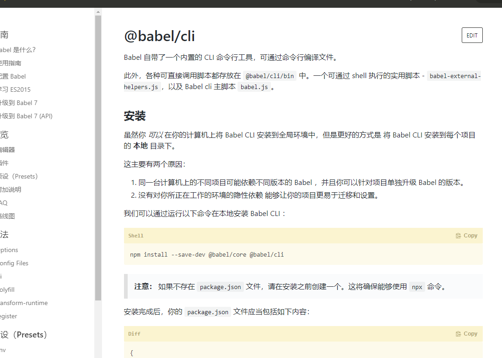

接下来学习一个能在项目中愉快的写代码的东西--<font style="color:#f03d3d">babel</font>，这是个什么东西，诸君请整理好思路看下去。

### ES6的枷锁

在之前各种打包测试时，都是使用**ES5**的简单特性，并没有使用过**ES6（ES2015+）**的特性（*import除外*）。但是自从**ES6**时代来临后，让开发者写起来越来越爽：箭头函数可以避免this问题、const和let块级作用域避免了闭包问题等等。所以开发者用了**ES6**之后基本都不会再想去写**ES5**。但是在前面提过，前端代码的执行环境（浏览器）版本的多少是取决于用户，有的用户会一直不更新浏览器版本。然后你写的新特性在旧版浏览器不支持，这就导致了冲突。

在介绍打包器时说过，打包器就是为了解决这样冲突而诞生的。但是，在打包器打包环节，**ES6**等特性转**ES5**特性这个操作其实是**babel**扩展完成的。


下面先来测试下再之前的webpack配置中所生成出来**ES6**特性





可以看到打包生成的代码并没有处理**ES6**特性，那么必须要处理这些**ES6**特性然后<font style="color:#f03d3d">babel</font>就诞生了


> :whale2: 测试生成的语句都是 ***yarn build***, 也就是 **devtool:none**, 使用***yarn start*** 代码不太好观察


> :whale2: 上面代码使用到了ES2015的 **Promise**类型、**块级声明（const）**、**箭头函数**、**for-of语法**、**数组API**和ES2017的**await**,不了解这些的诸君可以看看阮一峰老师的[ES6入门教程](https://es6.ruanyifeng.com/)
>
> :whale2::whale2:  ES6是ES2015之后的所有版本   有的文章会写成ES7、ES8这些，但是其实都是ES6。

:whale2::whale2::whale2::whale2::whale2::whale2::whale2::whale2::whale2::whale2::whale2::whale2::whale2::whale2::whale2::whale2::whale2::whale2::whale2::whale2::whale2::whale2::whale2::whale2::whale2::whale2::whale2::whale2::whale2::whale2::whale2::whale2::whale2::whale2::whale2::whale2::whale2::whale2::whale2::whale2::whale2::whale2:


### babel 介绍


### babel介绍

<font style="color:#f03d3d">babel</font>其实是一个不弱于<font style="color:#f03d3d">webpack</font>的东西，看起来<font style="color:#f03d3d">babel</font>没多少东西，只是将**ES6**转为**ES5**特性罢了，但是这里面的门门道道就多了。

**ES6**的新语法，新API

还有使用过或者了解typescript诸君都知道TS虽然是JS的超基，但是还是有些区别的，那么是否需要支持TS的转换呢

还有react使用JSX语法也有一些自己的特殊性，那么是否需要支持JSX呢？

等等。。。。

可以说**ES6**转**ES5**也是一个大坑，里面需要处理很多东西

那么该怎么设计才是最好的选择呢，诸君可以在此思考一下

>:whale2::whale2::whale2::whale2::whale2::whale2::whale2::whale2::whale2::whale2::whale2::whale2::whale2::whale2::whale2::whale2::whale2::whale2::whale2::whale2::whale2::whale2::whale2::whale2::whale2::whale2::whale2::whale2::whale2::whale2::whale2::whale2::whale2::whale2::whale2::whale2::whale2::whale2::whale2::whale2::whale2::whale2::whale2::whale2::whale2::whale2::whale2:

>:whale2::whale2::whale2::whale2::whale2::whale2::whale2::whale2::whale2::whale2::whale2::whale2::whale2::whale2::whale2::whale2::whale2::whale2::whale2::whale2::whale2::whale2::whale2::whale2::whale2::whale2::whale2::whale2::whale2::whale2::whale2::whale2::whale2::whale2::whale2::whale2::whale2::whale2::whale2::whale2::whale2::whale2::whale2::whale2::whale2::whale2::whale2:

>:whale2::whale2::whale2::whale2::whale2::whale2::whale2::whale2::whale2::whale2::whale2::whale2::whale2::whale2::whale2::whale2::whale2::whale2::whale2::whale2::whale2::whale2::whale2::whale2::whale2::whale2::whale2::whale2::whale2::whale2::whale2::whale2::whale2::whale2::whale2::whale2::whale2::whale2::whale2::whale2::whale2::whale2::whale2::whale2::whale2::whale2::whale2:


答案就是与<font style="color:#f03d3d">webpack</font>设计思想一样，提供一个核心，然后以插件化扩展形式向外暴露

<font style="color:#f03d3d">babel</font>就是这样设计的，与<font style="color:#f03d3d">webpack</font>一样，<font style="color:#f03d3d">babel</font>提供了一个<font style="color:#007FFF">**核心引擎**</font>，然后提供插件化进行扩展。

这个<font style="color:#007FFF">**核心引擎**</font>库就是<font style="color:#f03d3d">@babel/core</font>


> :whale2: <font style="color:#f03d3d">babel</font>提供了一个<font style="color:#f03d3d">@babel/cli</font>库，这个库与<font style="color:#f03d3d">webpack-cli</font>功能一样，允许直接运行<font style="color:#f03d3d">babel</font>
>
> ```javascript
> {
>     "scripts": {
>      "build": "babel src -d lib"
>    }
> }
> ```
>
> 但是在此就不去学习这一块的知识了，有兴趣的诸君可以去看一下[官网](https://www.babeljs.cn/docs/usage)


在这里直接学习<font style="color:#f03d3d">webpack</font>中使用<font style="color:#f03d3d">babel</font>，刚才介绍，<font style="color:#f03d3d">babel</font>是一个独立的东西，与与<font style="color:#f03d3d">webpack</font>一样，那么怎么将<font style="color:#f03d3d">babel</font>融入到<font style="color:#f03d3d">webpack</font>使用呢？在软件设计中有一种说法：解决耦合的问题就是再拆一层。其实这里跟这种说法有些雷同。只是这是将两个非耦合的连接起来，而连接起来的办法就是**适配器**，做一个<font style="color:#f03d3d">babel</font>适配器以便可以在<font style="color:#f03d3d">webpack</font>中使用。有后端经验的诸君会知道这是一种设计模式--**适配器模式**。没有后端经验的诸君可以参考电源适配器，就跟那个类似

<font style="color:#f03d3d">babel</font>就提供了这么一种**适配器**：<font style="color:#f03d3d">babel-loader</font>，这是一个***loader***，在前面说过***loader***是将**非JS模块**转换为**JS模块**的转换器。<font style="color:#f03d3d">babel</font>虽然不是将非**JS模块**转换为**JS模块**，但也是将JS从**ES6**转换为**ES5**，也勉强可以解释得通。

在<font style="color:#f03d3d">babel-loader</font>会调用<font style="color:#f03d3d">@babel/core</font>中的API，真正执行的是<font style="color:#f03d3d">@babel/core</font>引擎。

现在知道的在<font style="color:#f03d3d">webpack</font>中使用<font style="color:#f03d3d">babel</font>必须具有两个包，先将这两个包引用

> yarn add -D babel-loader@8.2.2 @babel/core@7.12.10


```javascript
{
   module:{
    rules:[
      {
        //  所有的.js文件都走babel-loader
        test:/\.js$/,
        include:path.join(__dirname,'src'),
        loader: "babel-loader",

      }
    ]
  },
}
```

代码中设置了所有的**.js**文件都走<font style="color:#f03d3d">babel-loader</font>这个***loader***，然后将**ES6**转换为**ES5**

:whale2::whale2::whale2::whale2::whale2::whale2::whale2::whale2::whale2::whale2::whale2::whale2::whale2::whale2::whale2::whale2::whale2::whale2::whale2::whale2::whale2::whale2::whale2::whale2::whale2::whale2::whale2::whale2::whale2::whale2::whale2::whale2::whale2::whale2::whale2::whale2::whale2::whale2::whale2::whale2::whale2::whale2:


### @babel/preset-env 介绍

刚才说过<font style="color:#f03d3d">@babel/core</font>只是一个**引擎**，所以其实到现在执行**ES6**代码还是不会转换，必须设置**插件**。

看这么一个插件<font style="color:#f03d3d">@babel/preset-env</font>

> yarn add -D @babel/preset-env@7.12.11

这是一个什么**插件**呢，请诸君跟着思路接着走下去


在***loader***设置项时，其实还有一个选项，那就是**options**，也就是设置其转换选项。每一个***loader***的**options**都不尽相同。不过多数都有一个共同的设置，那就是**plugins**，也就是当前当前***loader***使用到的**插件**。

```javascript
{
   module:{
    rules:[
      {
        //  所有的.js文件都走babel-loader
        test:/\.js$/,
        include:path.join(__dirname,'src'),
        loader: "babel-loader",
        options: {
          presets:[
            "@babel/preset-env",
          ]
        }

      }
    ]
}
```

看到代码诸君可能会有些疑惑，不是**plugins**吗？怎么是**presets**。诸君请听我慢慢道来。

<font style="color:#007FFF">preset</font>的中文翻译是：预设、预置。 也就是**presets**属性是<font style="color:#f03d3d">@babel/core</font>自己约定的一个属性，也就是<font style="color:#f03d3d">@babel/core</font>给开发者们预置了许多常用**插件**，将这些预置**插件**根据某些规则进行打包封装成一个包，然后提供了一个**presets**属性变可加载这些预置插件。这些预设插件的包名称都有**preset**词语。当然也可以使用真正的插件，那些插件就是设置在**plugins**中

```javascript
 options: {
          presets:[
            "@babel/preset-env",
          ],
          plugins:[]
        }
```


下面来看看代码结果


可以看到生成的代码中**await**、**for-of**、**const**都不见了，倒是出现了需要**case**，这个是**await**转换为的ES5语法，await本身就是异步同步化的状态机，如果不认识的诸君可以忽略，只需要知道是将**await**转换为**ES语法**就行了，

看起来挺完美，但是如果细心的诸君，可以看出有问题，还是大问题：

1. 顶部竟然还有箭头函数
2. 写的好几个ES6特性都没有被转换：**Promise**、**includes**、**filter**

其中第一个问题放在后面说，先来说第二个问题，诸君请思考一下，被完成转换的是什么，被忽略转换的是什么


答案是被转换的是**ES6语法（syntax）**，未转换的是**类型和函数（API）**，也就是<font style="color:#f03d3d">babel</font>将两者分开处理了，为什么要分开呢？诸君可以再思考下。


其实就是两者的不同，**语法（syntax）**属于***语言本身客观存在的事实***。而**类型和函数（API）**则是封装了一系列**操作**。


运行环境如果不支持当前**语法（syntax）**，那么就必须换一种语法，没有第二种选择；而如果运行环境没有当前**类型和函数（API）**，那就有两种方案了。

一：同语法（syntax）转换一样，转换成运行环境支持的*API*。

二：利用运行环境支持的语法好API 创建一个相同名称和功能的的**API**，如果运行环境不支持原生的API，那直接使用自己创建的就行

> :whale2:  JS中语法（syntax）错误提示是：<font style="color:#f03d3d">Uncaught SyntaxError</font>，API错误提示是：<font style="color:#f03d3d">Uncaught ReferenceError</font>。有兴趣的诸君可以在浏览器控制台中测试一下。


诸君思考一下，那种方案好一些。对于第二方案，还可以做一些操作：编写一个库，将ES6的所有**API**全部写一遍。然后在项目中导入，如果浏览器不支持ES6，那么就执行自己写的。

看起来是不是一个很棒的设计。没错，<font style="color:#f03d3d">babel</font>就是这样设计的。<font style="color:#f03d3d">@babel/preset-env</font>库的作用就是转换语法。而API操作，则是交给别的库完成。这种库一般被叫做**垫片**

在说**垫片**之前，先说一下<font style="color:#f03d3d">babel</font>的配置。


> :whale2:这有一篇比较好的[文章](https://zhuanlan.zhihu.com/p/84799735)介绍，有兴趣的诸君可以看下

:whale2::whale2::whale2::whale2::whale2::whale2::whale2::whale2::whale2::whale2::whale2::whale2::whale2::whale2::whale2::whale2::whale2::whale2::whale2::whale2::whale2::whale2::whale2::whale2::whale2::whale2::whale2::whale2::whale2::whale2::whale2::whale2::whale2::whale2::whale2::whale2::whale2::whale2::whale2::whale2::whale2::whale2:


### babel配置

刚才将<font style="color:#f03d3d">@babel/preset-env</font>设置在了**loader**的**options**中，<font style="color:#f03d3d">@babel/core</font>还支持另外两种配置方式，

1. 配置在***package.json***文件中，在**package.json**文件中**babel**属性设置，

   ```json
    "babel": {
      "presets": [
        "@babel/preset-env"
      ],
      "plugins": [
      ]
    }
   ```

2. 写在单独的配置文件之中。这种方式与**webpack.config.js**类似，使用**约定名称**的文件进行设置。约定名称可以为**babel.config.json**或**.babelrc.json**。一般使用的就是这种。名称使用的是第二种，不过一般都会省略.json的后缀，叫做：<font style="color:#007FFF">.babelrc</font>

   

   

   > 配置package.json文件和配置文件两种方式只能选一种，如果两种都使用会直接报错，配置在**loader**中的可以与这两种同时存在，配置哪个就使用那个。
   >
   > 

   

   :whale2::whale2::whale2::whale2::whale2::whale2::whale2::whale2::whale2::whale2::whale2::whale2::whale2::whale2::whale2::whale2::whale2::whale2::whale2::whale2::whale2::whale2::whale2::whale2::whale2::whale2::whale2::whale2::whale2::whale2::whale2::whale2::whale2::whale2::whale2::whale2::whale2::whale2::whale2::whale2::whale2::whale2:

   

   

   

   

   https://zhuanlan.zhihu.com/p/147083132

   

   https://segmentfault.com/a/1190000020237817

   


